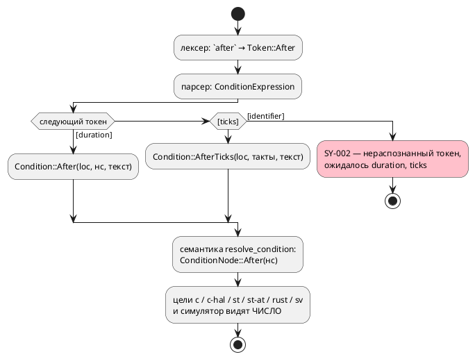
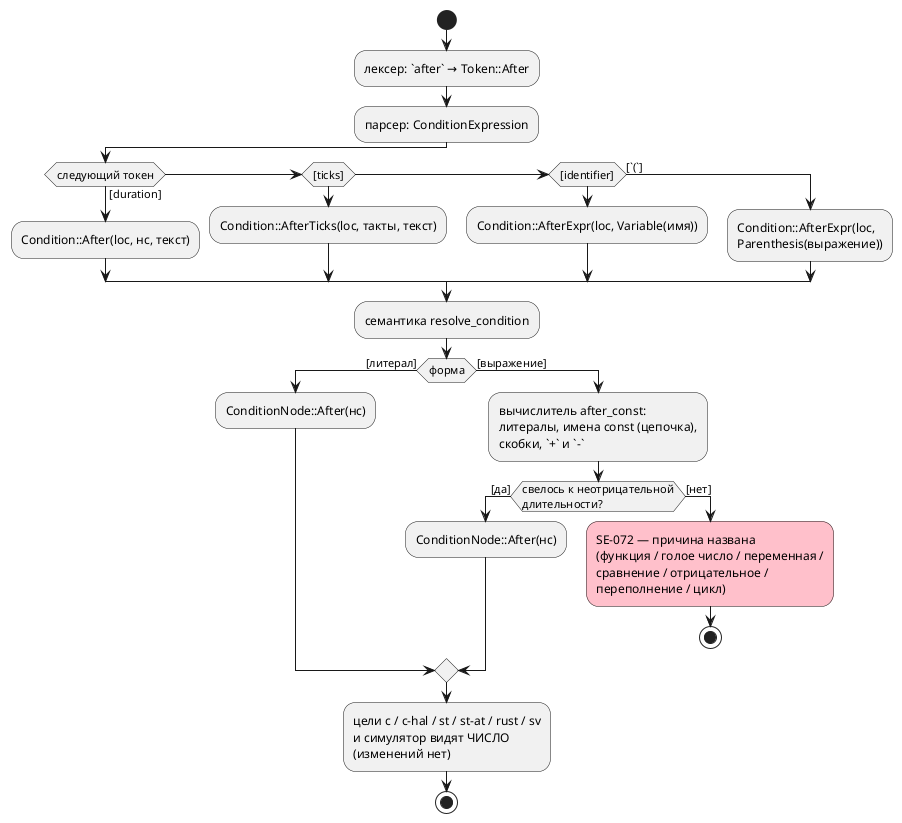

# ADR 0143: `after` принимает константу типа `duration`, а не только литерал

- **Status:** Accepted
- **Date:** 2026-07-29
- **Authors:** Архитектор + дизайнер языка
- **Related issues:** [Фича 0143](../features/0143-after-const-duration.md); смежно
  с [ADR 0134](0134-language-time-model.md) (модель времени: `clock`, `after`, `every`),
  [ADR 0042](0042-address-defines.md) (вычисление константного выражения адреса —
  прецедент «имена + арифметика в одном месте»)

## Context

Выдержка на переходе записывается литералом длительности:

```takt
state Overrun {
    ref Working: light = 1;
    ref Idle: after 3m;      // ← литерал, и только литерал
}
```

Именованную выдержку в `after` подставить **нельзя**: грамматика после `after`
требует терминал `duration` либо `ticks`. Проба (2026-07-29):

```
probe.takt:16:25: Ошибка компиляции [SY-002]: нераспознанный токен 'OVERRUN',
ожидалось duration, ticks
```

Между тем правило 27(е) свода само учит выносить длительность в константу
(«длительность записывается литералом длительности (`after 3m`, `const DWELL :=
3s`)»), а раздел документа `book/src/12-time/` писался под это правило — то есть
**свод и язык расходятся**: `const DWELL := 3s;` объявить можно, применить в
`after` — нет.

Отказ **громкий** (ошибка разбора, а не молча иное поведение), поэтому фича
устраняет неудобство и расхождение с правилом, а не дефект.

Существенное свойство текущей реализации: `after` **не доживает** до целей в виде
конструкции языка. АСД несёт уже разобранные наносекунды
(`Condition::After(Location, i64, String)`), семантика сводит их к
`ConditionNode::After(nanos)`, и все шесть потребителей (`c`, `c-hal`, `st`,
`st-at`, `rust`, `sv`, симулятор) видят **число**. Отсюда поток «как есть»:



## Decision Drivers

1. **Свод и язык обязаны говорить одно.** Правило 27(е) требует именованных
   выдержек; язык их не принимает. Расхождение обнаруживается автором примера, а
   не машиной, — то есть будет обнаруживаться снова.
2. **Шесть целей не должны узнать об изменении.** Всякая конструкция времени,
   доехавшая до бэкендов, — шесть шансов разойтись (урок `after` в 0134: тактовая
   и длительностная выдержки уже потребовали двух представлений). Решение,
   которое не меняет ни один бэкенд, безусловно предпочтительнее.
3. **Обратная совместимость.** `after 3m` обязан остаться разбираемым и давать
   вывод байт-в-байт прежним.
4. **Отказ остаётся громким.** Если имя не константа, не того типа или его нет
   вовсе, автор получает диагностику с позицией, а не выдержку «ноль» или
   потерянный переход.
5. **Объём соразмерен поводу.** Повод — именованная выдержка. Полное константное
   выражение (`after BASE + 30s`) — отдельный вопрос с отдельной ценой
   (вычислитель, переполнение, диагностики), и смешивать его с поводом значит
   вести две работы под одним номером.

## Considered Options

### Option A. Имя константы `duration` разворачивается в наносекунды на семантике

Грамматика принимает `after ИМЯ`; АСД получает вариант
`Condition::AfterConst(Location, Identifier)`; семантика (`resolve_condition`)
ищет константу в области видимости, проверяет тип `duration`, берёт значение и
возвращает **тот же** `ConditionNode::After(nanos)`. Цепочка констант
(`const A := 3m; const B := A;`) разрешается рекурсивно, с защитой от циклов.

**Pros:**
- Ни один бэкенд и симулятор не меняются вовсе: за семантикой имени нет.
- Обратная совместимость — по построению: прежняя ветвь грамматики цела, узел
  результата тот же, значит вывод корпуса байт-в-байт неизменен.
- Диагностики времени, уже существующие, работают без правок: `SE-068` («`after`
  вне ребра») ищется в **сыром** АСД — новая ветвь обязана быть разобрана, иначе
  сборка не соберётся; `SE-071` (во что пересчиталась выдержка) читает
  разрешённый узел и печатает наносекунды, откуда бы они ни пришли.
- Имя в `after` становится **использованием** константы: слой `semantic::usages`
  видит его, значит `references`/`rename` в LSP не разъезжаются с языком.

**Cons:**
- Нужен новый вариант АСД — а он валит сборку в трёх местах (`format/`,
  `usages/walk.rs`, исчерпывающие обходы `time_ast.rs`). Это цена, но она же и
  страховка: ни одно место не будет пропущено молча.
- Константа в **тактах** остаётся недостижимой: литерала `3t` в выражениях нет,
  поэтому `const D := 3t;` не объявить (см. Consequences).

### Option B. Произвольное константное выражение типа `duration`

`after` принимает выражение (`after BASE + 30s`, `after 2 * STEP`), которое
компилятор вычисляет в наносекунды.

**Pros:**
- Выразительнее: выдержка «база плюс запас» пишется на месте.
- Прецедент есть — вычислитель адреса (0042) умеет имена и целую арифметику.

**Cons:**
- Требует **своего** вычислителя над `duration`: сложение длительностей
  осмысленно, умножение длительности на длительность — нет; переполнение `i64`
  наносекунд нужно диагностировать (`SE-063`/`SE-064` — про пересчёт в такты, не
  про арифметику).
- Урок 0042 прямо предупреждает о цене: там арифметика **разъехалась** по двум
  матчерам и была сведена в одно место отдельной работой. Заводить второй
  вычислитель на другой предмет в фиче про именованную выдержку — тот же класс
  ошибки.
- Повод фичи (правило 27(е)) полностью закрывается именем; выражение — рост
  объёма без предъявленной нужды.

### Option C. Позднее связывание: имя доезжает до целей

`ConditionNode::AfterConst(имя)` живёт до генерации, каждый бэкенд печатает имя
константы (в C — `#define`/`enum`, в ST — `VAR CONSTANT`, в Rust — `const`).

**Pros:**
- В порождённом коде видно **имя** — читателю прошивки понятнее, откуда 180000
  тактов.

**Cons:**
- Шесть целей + симулятор + верификация обязаны узнать о новом узле, и разойтись
  они могут молча — ровно тот класс, который в проекте уже дважды стоил дефектов
  (0045 в SV, 0050 в Rust: гейт доказывает компилируемость, но не верность).
- Пересчёт «наносекунды → такты» зависит от профиля времени и **уже** сделан
  один раз в `duration::units`; связывание по именам потребует повторить его в
  каждой цели либо всё равно развернуть в число — то есть выгода мнимая.
- `SE-071` («во что пересчиталась выдержка») пришлось бы считать заново для
  каждой цели.

## Ревизия объёма 2026-07-29 (требование заказчика)

Заказчик расширил объём **после** принятия решения: `after` обязан принимать не
только имя, но и **выражение** — пример `after ((v + 1) - f)`; в выражении
недопустим вызов функции; результат выражения — `duration`; значения в выражении
— константы и переменные.

Расширение разобрано пробами, и два его пункта уточнены заказчиком там же
(2026-07-29):

1. **Голое число в выражении — ошибка.** Проба: `v + 1` при `v: duration` уже
   сегодня даёт `SE-065` («длительность сочетается только с длительностью»).
   Заказчик подтвердил: внутри `after` действует то же правило языка, верная
   запись — `after ((v + 1s) - f)`. Скрытой единицы времени (нс или такты) в
   выражении **не появляется**.
2. **Переменные — вне объёма 0143.** Проба: тип `duration` **не поддерживает ни
   одна цель** генерации (`var v: duration` даёт `CC-020`, `RS-023` и аналоги в
   `st`/`sv`), тогда как симулятор его исполняет. Выражение с переменной было бы
   исполнимо в отладке и невыразимо в прошивке — ровно то расхождение
   «симулятор ≠ цели», которого проект избегает. Заказчик выбрал: в этой фиче
   **только константы**, вычисляемая выдержка — отдельной фичей вместе с
   поддержкой типа `duration` в целях.

Следствие для решения: **Option A сохраняется и расширяется** — вычисляется не
только имя, но и константное выражение над длительностями. Ключевое свойство
(«за границей семантики этой формы нет, цели не правятся») не меняется, потому
что результат по-прежнему `ConditionNode::After(нс)`.

Попутно установлено пробами (и потому нормировано ниже, а не оставлено на
догадку):

- **оператор `as` отсутствует в грамматике УСЛОВИЙ**, а аргумент `after` — это
  условие. Поэтому форма `after (((v + 1) - f) as duration)`, названная
  заказчиком как возможная, сегодня не разбирается — и не из-за этой фичи.
  ⚠️ Само приведение в языке **есть** и определено как «число — это
  миллисекунды» (`left := 250 as duration;` даёт `250ms` — проба; так же сказано
  в разделе документа о типе `duration`); отдельная находка той же пробы: в
  **инициализаторе объявления** приведение не вычисляется
  (`const D := A as duration;` → `SIM-006`), тогда как в теле работает —
  записано кандидатом;
- **умножения и деления в выражении выдержки нет**: грамматика условий знает
  только `+` и `-`.

## Decision

Принимается **Option A** (с ревизией объёма выше).

Решающее — драйвер 2: выдержка, развёрнутая в наносекунды **до** семантического
узла, физически не может рассинхронизировать цели, потому что за границей
семантики её имени нет. Option C эту границу переносит в шесть мест и покупает
за это только читаемость порождённого кода, которую никто не заказывал; Option B
решает не тот вопрос, который поставлен, и тянет второй вычислитель.

**Нормативно (правило языка).**

1. `after` принимает **литерал длительности** (`after 3m`), **литерал тактов**
   (`after 3t`), **имя константы типа `duration`** (`after DWELL`) и
   **константное выражение в скобках** (`after (BASE + 30s)`).
2. Составное выражение обязано быть **в скобках**: `after` связывает крепче
   арифметики, поэтому `after A + 1s` есть `(after A) + 1s`, а не выдержка
   `A + 1s`. Скобки хранятся в дереве, чтобы форматтер печатал их обратно.
3. Выражение — арифметика **над длительностями**: литералы длительности, имена
   констант типа `duration`, скобки, операторы `+` и `-`. Значение вычисляет
   компилятор.
4. Имя разрешается в области видимости модели по обычным правилам (включая
   родительские области через `upper`) и обязано быть **константой** (`const`)
   **типа `duration`**. Переменная, порт, именованное условие, состояние или
   модель с тем же именем — ошибка, а не совпадение.
5. Значение константы обязано сводиться к длительности: литерал, имя другой
   такой константы (цепочка) либо их сумма и разность. Цепочка разрешается
   рекурсивно; цикл и предел глубины — ошибка, а не зависание.
6. В выражении **недопустимы**: вызов функции (значение неизвестно компилятору),
   голое число без единицы времени (длительность сочетается только с
   длительностью — то же правило, что `SE-065`), переменная и порт (значение
   известно лишь в такте), а также любая нечисловая форма условия (сравнение,
   логика, строка, обращение к биту или элементу массива).
7. Результат обязан быть **неотрицательным**: `after (1s - 3s)` — ошибка, а не
   выдержка «минус две секунды». Переполнение при вычислении — тоже ошибка.
8. Семантически `after DWELL` и `after (BASE + 30s)` **тождественны**
   `after <литерал того же значения>`: один и тот же `ConditionNode::After(nanos)`,
   одно и то же поведение во всех целях и в симуляторе, то же предупреждение
   `SE-071`.
9. Нарушения пунктов 4–7 диагностируются новым кодом **`SE-072`**; текст
   диагностики называет **причину**, позиция — узел, на котором вычисление
   остановилось.
10. Ограничение `after` «только в условии перехода `ref`» (`SE-068`, ADR 0134)
    сохраняется и распространяется на новую форму без изменений.

Целевой поток:



## Consequences

### Положительные

- Правило 27(е) свода становится исполнимым: `const DWELL := 3s; ref Idle: after
  DWELL;` компилируется, и выдержку видно в одном месте.
- Ни один генератор, ни симулятор, ни верификация не правятся — риск расхождения
  целей равен нулю по построению, а не по результату прогона.
- Имя в `after` — использование константы, видимое `semantic::usages`, поэтому
  «перейти к объявлению», «показать ссылки» и «переименовать» работают на нём с
  первого дня (правило 29).
- Ошибка остаётся громкой: было `SY-002` на этапе разбора, стало `SE-072` на
  этапе семантики — с более точным сообщением, чем «ожидалось duration, ticks».

### Отрицательные / Action items

- **Константа в тактах невыразима.** Литерал `3t` существует **только** внутри
  `after`; в выражениях его нет, поэтому `const D := 3t;` не объявить, и
  `after D` для тактовой выдержки недостижимо. В объём фичи не входит (потребовало
  бы литерала тактов в выражениях и типа для него) — **записать кандидатом**.
- **`every` остаётся литеральным.** `every 100ms { … }` — тот же класс
  неудобства, но другая конструкция и другая грамматическая позиция
  (`EveryDefine`, не условие). В объём не входит — **записать кандидатом**.
- **Вычисляемая выдержка (переменная в выражении) не поддерживается** — решение
  заказчика 2026-07-29. Требует сначала поддержки типа `duration` в целях
  генерации (сегодня `CC-020`/`RS-023`), иначе симулятор и цели разойдутся:
  **записать фичей-преемником**.
- **`as` не разбирается внутри `after`**: оператор есть только в грамматике
  выражений, а аргумент выдержки — условие. Форма `after ((x) as duration)`
  недоступна — **записать кандидатом**.
- **Умножения/деления в выражении выдержки нет** (грамматика условий их не
  содержит) — например `after (BASE * 2)` не разбирается.
- Новый вариант АСД обязывает пройти по трём машинным сторожам (`format/`,
  `usages/walk.rs`, исчерпывающие обходы `time_ast.rs`) — они валят сборку сами,
  но правки требуют.
- Приложение «Ошибки и предупреждения» получает строку `SE-072`; раздел
  `book/src/12-time/` — пример с именованной выдержкой и уточнение, что принимает
  `after` (правила 24, 26).

### Acceptance criteria

1. `const DWELL := 3m; ref Idle: after DWELL;` компилируется всеми целями и
   исполняется симулятором; вывод **байт-в-байт** совпадает с выводом того же
   исходника, где вместо `DWELL` стоит литерал `3m`. То же для выражения:
   `after ((BASE + TRIM) + 30s)` при `BASE := 2m; TRIM := 30s` даёт вывод,
   тождественный `after 3m`.
2. `after 3m` и `after 3t` разбираются и работают как прежде; корпус
   `examples/generated/` не меняется ни в одном байте.
3. `SE-072` выдаётся с позицией виновного узла на всех причинах пункта 6–7
   решения: имя не объявлено, имя — не константа (переменная / порт), тип не
   `duration`, значение не сводится к длительности, голое число, вызов функции,
   сравнение, отрицательный результат, цикл в цепочке констант.
4. `SE-068` продолжает отвергать именную форму вне ребра (`cond X = after DWELL;`
   — ошибка).
5. `taktc fmt` печатает `after DWELL` без потери текста; круговой рейс
   (`fmt` → разбор → `fmt`) устойчив.
6. `references`/`rename` LSP видят имя внутри `after` как использование
   константы.
7. `SE-071` печатает пересчёт для именной формы так же, как для литерала.
