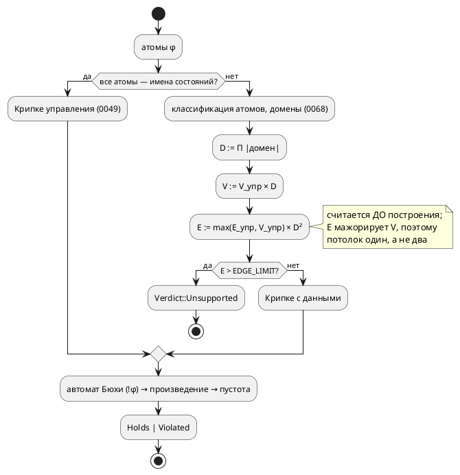

# ADR 0145: Потолок верификации по данным считается по рёбрам, а не по вершинам

- **Status:** Accepted
- **Date:** 2026-08-18
- **Authors:** Архитектор + аналитик
- **Related issues:** [Фича 0145](../features/0145-verify-vertex-budget.md);
  потолок и его нынешняя метрика — [ADR 0068](0068-verify-data-properties.md)
  (правило 4, Option D); абстракция управления и гарантия `Holds` —
  [ADR 0049](0049-model-checking-ltl.md); замер, вынесший класс кандидатом —
  [ADR 0136](0136-perf-benchmarks.md); «обходы итеративны, чтобы инструмент не
  падал молча» — [ADR 0052](0052-verify-iterative-traversal.md)

## Context

Фича [0068](../features/0068-verify-data-properties.md) ввела потолок
`VERTEX_LIMIT = 1_000_000` — «размер `|состояний| × Π|домен|` считается **до**
построения; превышение → `Unsupported`, а не долгий счёт» (правило 4 ADR 0068).
Смысл потолка — обещание: **любой** вход получает вердикт, в том числе вердикт
«не осилю».

Обещание не исполняется. Замер [0136](0136-perf-benchmarks.md) (2026-07-27):
верификация свойства над **двумя** отслеживаемыми `u8` не заканчивается за
90 секунд и процесс приходится убивать, а вершин там 131 072 — **вшестеро ниже**
потолка. То есть защита пропускает практически достижимый вход, и пользователь
получает не честный `Unsupported`, а молчащий процесс.

### Замер 2026-08-18 — что именно взрывается

Зонд `takt-lang/examples/probe_0145.rs` (release, `k` отслеживаемых `bit`-переменных,
цепочка из 3 состояний управления, φ = `G (Hot0 & … & Hot_{k-1})`). `D = 2^k` —
произведение доменов, то есть число оценок:

| `k` | `D` | вершин Крипке | рёбер Крипке | вершин произв. | рёбер произв. | время |
|---|---|---|---|---|---|---|
| 4 | 16 | 48 | 768 | 240 | 5 376 | < 0.001 с |
| 6 | 64 | 192 | 12 288 | 1 152 | 110 592 | 0.012 с |
| 8 | 256 | 768 | 196 608 | 5 376 | 2 162 688 | 0.25 с |
| 10 | 1 024 | 3 072 | 3 145 728 | 24 576 | 40 894 464 | 6.1 с |
| 11 | 2 048 | 6 144 | 12 582 912 | 52 224 | 176 160 768 | 29.9 с |
| 12 | 4 096 | **12 288** | 50 331 648 | — | — | **> 60 с, прервано** |

Последняя строка и есть диагноз: вершин **12 288** — в 81 раз ниже потолка
`1 000 000`, а инструмент не завершается.

Причина видна из устройства `data_kripke.rs`: управляющее ребро `k → k₂`
скрещивается с **любой** оценкой `j₂` (ход данных полностью недетерминирован —
правило 3 ADR 0068), поэтому

```text
вершин: V = V_упр × D          — линейно по D  ← это и меряет потолок
рёбер:  E = E_упр × D²         — КВАДРАТИЧНО по D  ← а это и есть стоимость
```

Метрика потолка отстаёт от стоимости на целую степень `D`. Работа же —
построение произведения и nested DFS — идёт **по рёбрам**: замер даёт
0.35–2.4 мкс на ребро Крипке (разброс — от размера автомата Бюхи, а он растёт
с числом операторов формулы).

Корпусной вход для калибровки (тот самый, ради которого потолок и подбирался) —
`examples/comprehensive.takt`, модель `Controller`, `cond Overheated =
temperature >= MAX_TEMP` (зонд `probe_0145b.rs`): 4 состояния, 8 рёбер
управления, `D = 256` → **1 024 вершины, 524 288 рёбер**, полная проверка
`verify_model` — **0.181 с**.

Целевой поток (правило 18 — схема нужна, потому что решение меняет **место и
предмет** проверки, а не только константу):



## Decision Drivers

1. **Обещание завершимости.** Инструмент обязан отвечать вердиктом на любом
   входе; «молчащий процесс» — худший из возможных ответов (он неотличим от
   зависшего инструмента и не говорит, что делать). Это исходный драйвер 2
   ADR 0068 — он просто не был исполнен.
2. **Метрика обязана мерить то, что взрывается.** Потолок по величине, растущей
   линейно там, где стоимость растёт квадратично, — не защита, а её видимость.
3. **Детерминизм вердикта.** Один и тот же вход обязан давать один и тот же
   вердикт на любой машине: вердикт участвует в тестах, в гейтах и в решениях
   пользователя о безопасности системы (правило проекта «генерация
   детерминирована» — для **вердикта** оно тем более обязательно).
4. **Не сужать то, что работает.** Входы, которые сегодня проверяются за
   доли секунды (корпусной `Controller`, тесты 0068), обязаны проверяться и
   после правки.
5. **Одно знание об одном предмете.** Два потолка, каждый со своей константой,
   разъедутся — класс, многократно оплаченный проектом (0084/0193/0195).

## Considered Options

### Option A. Оставить как есть

**Pros:**
- Ноль работы; вердикты не меняются ни на одном входе.

**Cons:**
- Обещание фичи 0068 остаётся неисполненным: вход с двумя `u8` (запись, которую
  автор напишет не задумываясь) вешает инструмент.
- Кандидат в `FEATURES.md` держит бенч в изувеченном виде: `bench_data_properties`
  меряет **одну** переменную, потому что двух он не переживёт, — то есть ось
  роста, ради которой бенч и заведён, не меряется.

### Option B. Снизить `VERTEX_LIMIT`

**Pros:**
- Правка в один символ.

**Cons:**
- Метрика остаётся неверной, меняется лишь запас. Чтобы отсечь `k = 12`
  (12 288 вершин), порог придётся опустить ниже 12 288 — и тогда отсекутся
  дешёвые входы с многими состояниями и крошечным доменом (200 состояний ×
  `bit` = 400 вершин — пройдёт, а 20 000 состояний × `bit` — уже нет, хотя
  стоит секунды).
- Обратное тоже верно: любой порог по вершинам пропускает вход с большим `D`
  при малом числе состояний. Класс не закрывается, только сдвигается.

### Option C. Потолок по числу рёбер Крипке с данными (`E_упр × D²`)

**Pros:**
- Меряет ровно то, что растёт: `E = E_упр × D²` — та величина, по которой идёт
  вся последующая работа (произведение, nested DFS).
- Считается **до** построения, точно (не оценкой): `E_упр` известно — управляющая
  Крипке уже построена, `D` считается из типов, как и сегодня.
- **Заменяет**, а не дополняет вершинный потолок: в валидной модели у каждого
  состояния есть хотя бы один преемник (безусловный `ref` либо самопетля
  `may_stutter`, ADR 0049), поэтому `E_упр ≥ V_упр` и `E ≥ V·D ≥ V`. Новый
  потолок строго строже старого — «стало разрешено больше» невозможно
  по построению.
- Детерминирован: вердикт зависит от входа, не от машины.

**Cons:**
- Не учитывает размер автомата Бюхи (множитель стоимости произведения) — см.
  Option F.
- Часть входов, которые сегодня «считаются часами», станет `Unsupported`. Это
  цель фичи, но формально — сужение.

### Option D. Бюджет времени (deadline и отказ по часам)

**Pros:**
- Ловит любую причину медленности, включая неучтённые.
- Даёт пользователю ручку: «дай ему минуту».

**Cons:**
- **Вердикт перестаёт быть детерминированным** (драйвер 3): один вход даёт
  `Holds` на свободной машине и `Unsupported` на загруженной. Тест на вердикт
  становится flaky, а гейт — недоказательным.
- Отказ приходит **задним числом**: время уже потрачено, тогда как потолок
  0068 обещал отказ **до** построения.
- Требует опроса часов в горячих циклах (`product`, `emptiness`) — то есть
  правки звеньев, которых Option D фичи 0068 сознательно не касалась.

### Option E. Ленивое представление Крипке/произведения

**Pros:**
- Снимает **память**: переходы регулярны (`succ(k,j) = succ_упр(k) × все оценки`)
  и хранить их незачем.

**Cons:**
- Не снимает **время**: nested DFS обязан обойти рёбра, а их `E_упр × D²`
  независимо от способа хранения. При `k = 12` это 5 × 10⁷ рёбер Крипке и
  ~7 × 10⁸ рёбер произведения — сотни секунд даже без единой аллокации.
  Граница отодвигается в разы, класс остаётся.
- Крупная переработка `Kripke`/`Product` — притом что потолок всё равно нужен.

### Option F. Потолок по рёбрам произведения (`E × |δ_Бюхи|`)

**Pros:**
- Ещё точнее: меряет прямо ту работу, что делает `emptiness`.

**Cons:**
- Требует строить автомат Бюхи **до** выбора Крипке, то есть переставить
  конвейер `verify.rs` ради множителя, который на реальных формулах невелик
  (замер: 6–28 состояний автомата) и притом коррелирует с `D` — формула со
  многими атомами и без того упирается в `D²`.
- Множитель проще заложить в сам порог, чем в перестановку конвейера.

## Decision

Принимается **Option C**: потолок считается **по числу рёбер** Крипке с данными
и **заменяет** потолок по вершинам.

```rust
// E = max(E_упр, V_упр) × D², считается ДО построения.
pub const EDGE_LIMIT: u128 = 1_000_000;
```

- **Формула.** `D` — произведение доменов отслеживаемых переменных (как
  сегодня); `E_упр` — число рёбер управляющей Крипке; `max(E_упр, V_упр)` —
  страховка: гарантия «у каждого состояния есть преемник» держится
  рассуждением о `may_stutter`, а страховка делает её свойством **кода**, и
  вершинный потолок после этого не нужен ни в каком виде.
- **Значение.** `1_000_000` рёбер — то же число, что стояло у вершин, но теперь
  у величины, которая стоимость предсказывает: по замеру это 0.2–2 с на
  проверку (разброс — от размера автомата). Корпусной `Controller` (524 288
  рёбер, 0.181 с) проходит с запасом вдвое; вход `k = 12` (5 × 10⁷) отвергается
  мгновенно, как и два `u8` (`E ≥ 2 × 4.3 × 10⁹`). Значение **инженерное**:
  менять можно, но вместе с замером времени — тем же зондом.
- **Совместимость.** `VERTEX_LIMIT` — публичная константа крейта; она
  **удаляется** (не остаётся синонимом: два имени одного потолка — ровно тот
  разъезд, о котором драйвер 5). Публичный API меняется → минорный подъём
  версии крейта `takt-lang`. Версия **языка** не меняется: язык не затронут.
- **Диагностика.** Причина отказа в тексте CLI названа уже сегодня
  («превышение потолка перечисления»); формулировка правится под новую метрику.
  Отдельный код или структурированная причина `Unsupported` в объём **не**
  входят — вынести кандидатом (сейчас `Unsupported` несёт только имена атомов,
  и это ограничение старше фичи).

## Consequences

### Положительные

- Обещание 0068 исполняется: вход получает вердикт **всегда** — либо `Holds`/
  `Violated`, либо `Unsupported` до начала счёта.
- Бенч `bench_data_properties` перестаёт быть увечным: две переменные больше не
  вешают прогон, а честно упираются в потолок (мерить можно по `bit`-переменным,
  как в зонде, — тонкая сетка `D = 2^k`).
- Потолок один, метрика одна, знание об этом — в одном месте.

### Отрицательные / Action items

- **Сужение.** Входы с `E > 10⁶` (например 200 состояний × один `u8`:
  ≈1.3 × 10⁷ рёбер) станут `Unsupported` там, где сегодня считались бы десятки
  секунд. Это заявленная цель, но её нужно **назвать** в документе (правило 24)
  и в тексте отказа.
- Проверить **все** существующие входы верификации по данным (юнит-тесты
  `data_kripke.rs`, тесты темы `verify`, корпус) — ни один не должен сменить
  вердикт. Это работа стадии анализа.
- Обновить: константу и её док-комментарий, текст `taktc verify`, раздел
  документа о верификации, живой контекст (`CLAUDE.md`), `CHANGES.md`.
- Зонды `takt-lang/examples/probe_0145*.rs` — временные, из дерева удаляются;
  воспроизводимость замера обеспечивает бенч, а не они.

### Acceptance criteria

1. `EDGE_LIMIT` считается **до** построения Крипке с данными по формуле
   `max(E_упр, V_упр) × D²`; `VERTEX_LIMIT` в коде отсутствует.
2. Вход из замера (`k = 12`, а равно два `u8`) даёт `Unsupported`
   **немедленно** — тест меряет не только вердикт, но и то, что построения не
   было (иначе он проверял бы терпение прогона).
3. Ни один сегодня проходящий вход не сменил вердикт: юнит-тесты `data_kripke`,
   тема `verify`, корпусной `Controller` (`G !Overheated`) — прежние вердикты.
4. Бенч `bench_data_properties` меряет **рост** по числу оценок (не менее двух
   точек) и завершается.
5. Текст `СВОЙСТВО НЕ ПРОВЕРЕНО` называет новую границу словами; раздел
   документа о верификации описывает, при каких входах инструмент отвечает
   `Unsupported` (правило 24).
