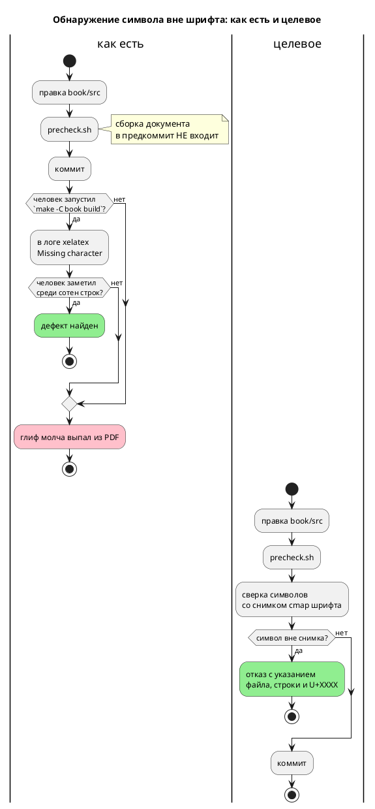

# ADR 0146: Гейт символов вне шрифта документа `book/`

- **Status:** Accepted
- **Date:** 2026-07-29
- **Authors:** Архитектор + системный аналитик
- **Related issues:** [Фича 0146](../features/0146-book-glyph-gate.md);
  повод — [фикс 0132-01](../fixes/0132-01-book-glyph-outside-font.md); смежное —
  [ADR 0133](0133-book-examples-gate.md) (гейт примеров документа),
  [ADR 0179](0179-repo-url-cleanup.md) (граница «согласованность, а не правильность»)

## Context

Документ `book/` собирается в PDF через `mdbook` → `pandoc` → `xelatex`, шрифт
текста **и** кода — **Fira Code** (`book.toml`: `mainfont`, `monofont`). Символ,
которого в шрифте нет, PDF **не роняет**: `xelatex` печатает предупреждение
`Missing character: There is no ⚠ (U+26A0) in font Fira Code Regular`, а глиф
**молча выпадает** из вывода.

Так и случилось: фича 0132 поставила во врезку `⚠️` (U+26A0 + U+FE0F), врезка
осталась без пометки, и обнаружилось это только **ручной** сборкой по запросу
заказчика ([фикс 0132-01](../fixes/0132-01-book-glyph-outside-font.md)).

Ловить дефект нечем:

- **сборка документа не входит** ни в `precheck.sh`, ни в CI — она требует
  `mdbook`, `mdbook-pandoc`, `pandoc`, `xelatex` и установленного шрифта;
- гейт [0133](0133-book-examples-gate.md) проверяет **примеры** документа
  компиляцией и симуляцией, но сам документ не собирает — дефект вёрстки ему
  невидим;
- предупреждение `xelatex` не влияет на код возврата, поэтому даже полная сборка
  ловит его лишь глазами человека в логе.

**Замеры (2026-07-29).** Инвентарь `book/src`: 27 файлов `.md`, 177 различных
символов, из них **21** вне ASCII и кириллицы (`—`, `«»`, `…`, `·`, `→`, `φ`,
`≥`, `ⁿ`, `–`, `≤`, `⁻`, `−`, `°`, `¹`, `ψ`, `←`, `₁`, `₂`, `↔`, `≠`). Сверка с
**реальным** `cmap` шрифта (`FiraCode-Regular.ttf`, Version 6.002, `fontTools`):
**все 21 покрыты**, документ сегодня чист. В примерах `book/src/**/*.takt` вне
ASCII — шесть символов (`«»`, `°`, `—`, `→`, `≈`), тоже покрыты. Все начертания
Fira Code (Regular/Bold/Medium/Light/SemiBold/Retina) имеют **идентичный** cmap
— 1586 кодовых точек, 152 непрерывных диапазона.

⚠️ **Существенно для выбора области:** `book/Makefile` содержит `⚠` в
комментарии — и это **не дефект**, Makefile в PDF не попадает. То есть гейт,
берущий «весь каталог `book/`», дал бы ложное срабатывание с первого же прогона.

## Decision Drivers

1. **Гейт обязан работать там, где работает предкоммит.** Локальная машина и CI
   не имеют ни TeX, ни шрифта; гейт, требующий их, будет вечно в «мягком
   пропуске» — то есть его не будет.
2. **Критерий — факт, а не догадка.** Проект уже платил за «правило, которое
   нельзя проверить командой» (ADR 0085) и за оценки без замера. Список
   допустимых символов обязан происходить из **реального `cmap` шрифта**, а не
   из представления о том, что «наверное, есть».
3. **Область — то, что попадает в PDF.** Ни больше (иначе ложные срабатывания на
   `Makefile`), ни меньше (иначе дыра: примеры `.takt` тоже печатаются, и
   заголовок с титульного листа тоже).
4. **Дешевизна.** Проверка текста на 27 файлах обязана стоить доли секунды —
   иначе она начнёт раздражать и её выключат.

## Considered Options

### Option A. Allowlist диапазонов, написанный руками

Скрипт держит список «ASCII + кириллица + десяток типографских символов»;
всё прочее — отказ.

**Pros:**
- Просто, читаемо, без данных на диске.

**Cons:**
- Список — **догадка** о покрытии шрифта: он и запрещает покрытые символы (`≈`
  из примеров, `ψ`, `₁`), и разрешил бы непокрытые, попади они в диапазон.
- Каждое расширение списка — вопрос «а есть ли этот глиф?», на который сам
  список ответа не даёт: проверять всё равно пришлось бы шрифтом.

### Option B. Опрос установленного шрифта во время проверки

Гейт читает `cmap` из `FiraCode-*.ttf` на машине (через `fontTools`/`fc-query`).

**Pros:**
- Точность по определению; снимок не нужен.

**Cons:**
- Требует шрифта **и** библиотеки чтения TTF. В CI нет ни того, ни другого,
  локально `fontTools` — не зависимость проекта. Гейт уходит в мягкий пропуск и
  не работает ровно там, где нужен (драйвер 1).
- Результат становится **зависимым от машины**: у двух разработчиков разные
  версии шрифта дадут разный вердикт на одном и том же тексте.

### Option C. Снимок `cmap` шрифта в репозитории + текстовая сверка

Однократно снятый (и проверяемо воспроизводимый) список диапазонов кодовых точек
Fira Code лежит в дереве; гейт сверяет с ним каждый символ документа.

**Pros:**
- Критерий — **факт** (реальный `cmap`), а не догадка (драйвер 2).
- Работает офлайн, без шрифта, без TeX, без сторонних библиотек — везде, где
  есть `python3` (прецедент: `scripts/check-links.py` в предкоммите).
- Вердикт одинаков на любой машине и в CI (драйвер 1).
- 1586 кодовых точек сжимаются в **152 диапазона** — файл обозримый и
  ревьюируемый.

**Cons:**
- Снимок может разойтись с версией шрифта на машине сборки. Граница осознанная,
  см. «Consequences».

### Option D. Денилист заведомо опасных диапазонов (эмодзи, селекторы вариаций)

**Pros:**
- Совсем дёшево, ловит конкретный случай 0132-01.

**Cons:**
- Ловит только то, о чём догадались: `⚠️` поймает, `ⅷ`, `∮`, `⌘` — нет.
  Ровно тот класс проверки, о котором проект уже записал: перечисление плохого
  проверяет фантазию автора, а не свойство.

## Decision

Принимается **Option C**.

- Снимок — `scripts/book-font-charset.txt`: диапазоны кодовых точек `cmap`
  Fira Code с шапкой, называющей **версию шрифта** и **команду воспроизведения**.
- Гейт — `scripts/check-book-glyphs.py`, вызывается из `precheck.sh` рядом с
  `check-links.py` под тем же `require_tool python3`.
- **Область проверки — то, что попадает в PDF:**
  - `book/src/**/*.md` — текст документа;
  - `book/src/**/*.takt` — примеры, вставляемые `{{#include}}` в блоки кода;
  - поля `title`, `authors`, `description` из `book/book.toml` — титульный лист.

  Прочие файлы `book/` (`Makefile`, `keywords.lua`, `takt.kate.xml`, `README.md`)
  **не проверяются**: они не рендерятся, а `Makefile` уже сегодня содержит `⚠` в
  комментарии — включение каталога целиком дало бы ложный отказ.
  ⚠️ `book.toml` берётся **не целиком, а тремя полями**: его комментарии — такой
  же служебный текст, как в `Makefile`, и вправе содержать `⚠`.
- Сообщение об отказе называет **файл, строку, колонку, `U+XXXX` и имя символа**
  — иначе искать невидимый глиф в тексте придётся вручную.
- У гейта есть режим **`--self-test`**: он подкладывает символ вне снимка и
  требует отказа. Проверка запускается предкоммитом вместе с самим гейтом.

## Consequences

### Положительные

- Класс дефекта 0132-01 закрыт машиной: символ вне шрифта не доживает до
  коммита.
- Гейт работает в CI и на любой машине с `python3` — без TeX, шрифта и сети.
- Примеры `.takt` документа впервые проверяются на вёрстку (гейт 0133 проверяет
  их поведение, но не глифы).

### Отрицательные / Action items

- **A-1. Гейт проверяет согласованность со снимком, а не с установленным
  шрифтом** (та же граница, что у [ADR 0179](0179-repo-url-cleanup.md)). Если на
  машине сборки стоит Fira Code иной версии с меньшим покрытием, гейт промолчит,
  а `xelatex` предупредит. Смягчение: шапка снимка называет версию (6.002) и
  команду пересъёмки; конечный арбитр — по-прежнему `make -C book build`.
- **A-2. Снимок надо пересобирать при смене шрифта документа.** Если `book.toml`
  сменит `mainfont`/`monofont`, снимок станет неверным **молча**. Смягчение:
  гейт читает имя шрифта из `book.toml` и отказывает, если оно не совпадает с
  записанным в шапке снимка.
- **A-3. Гейт не судит о стиле.** Символ, покрытый шрифтом, но неуместный в
  документе (декоративные стрелки, псевдографика), пройдёт. Это осознанно:
  предмет фичи — **выпадение глифа**, а не редполитика.
- **A-4. Пересъёмка снимка требует `fontTools`** — библиотеки, которой в
  зависимостях проекта нет. Она нужна **только** при пересъёмке (редкое
  событие), не при проверке; команда с `pip install fonttools` записана в шапке
  снимка.

### Acceptance criteria

1. `⚠️` (U+26A0 + U+FE0F), возвращённый в любой файл `book/src/**/*.md`, валит
   `precheck.sh` с указанием файла, строки, колонки и кода символа.
2. То же для примера `book/src/**/examples/*.takt`.
3. Текущее дерево гейт проходит **без правок документа** (замер: все 21+6
   символов покрыты).
4. `book/Makefile` с его `⚠` гейт **не** трогает (нет ложного отказа).
5. Смена `mainfont` в `book.toml` без пересъёмки снимка даёт отказ гейта (A-2).
6. `--self-test` проходит и **краснеет** при подмене снимка на пустой
   (взведённость ловушки).
