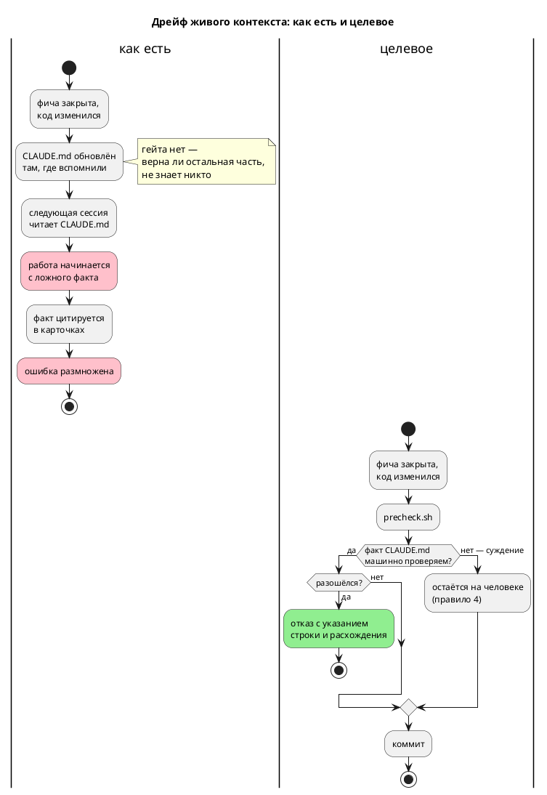

# ADR 0149: Гейт согласованности живого контекста `CLAUDE.md`

- **Status:** Accepted
- **Date:** 2026-07-29
- **Authors:** Архитектор + системный аналитик
- **Related issues:** [Фича 0149](../features/0149-claude-md-consistency-gate.md);
  смежные — [ADR 0085](0085-language-version-constant.md) (гейт версии языка),
  [ADR 0179](0179-repo-url-cleanup.md) и [ADR 0146](0146-book-glyph-gate.md)
  («правило, которое нельзя проверить командой, — не правило»)

## Context

`CLAUDE.md` — файл, который читается **в начале каждой сессии** любым
AI-инструментом и человеком, впервые входящим в проект. Его факты определяют, что
исполнитель считает истиной **до** того, как посмотрит в код. Ошибка здесь стоит
дороже ошибки в любом другом документе: по ней начинают работу.

Проверяется же он **ничем**. `scripts/check-language-version.sh` (фича 0085)
сверяет версию языка в двух источниках из трёх — константа `LANGUAGE_VERSION` и
`README.md`; `CLAUDE.md` он не читает. Карточка фичи приводит случай: живой
контекст показывал версию языка `0.4.0` при фактических `0.6.0`, и ошибка успела
разойтись **по трём карточкам** закрытых фич через цитирование.

**Замер (2026-07-29) показал, что дрейф шире версии и дороже.** Сплошная сверка
`CLAUDE.md` (1197 строк) с реестром фич и деревом исходников:

| Класс | Найдено | Пример |
|---|---|---|
| Статус фичи разошёлся с реестром | **2 места, 35 строк текста** | «Генератор C: порождённый C **сегодня не компилируется** (фичи 0026, 0029, **обе в работе**)» — обе `ГОТОВО`; «Форматтер (фича 0024, **в работе**)» — `ГОТОВО` |
| Полный путь к файлу не существует | **1** | `takt-lang/src/lsp.rs` — модуль давно разделён на `lsp/` |
| Ссылка на номер строки указывает не туда | **1 из 3** | `generator/c/mod.rs:150` — `get_c_type` там был, теперь на 291 |
| Версия крейта в прошедшем факте читается как настоящий | **2** | «Крейт `takt-sim` — 0.3.0» при фактических `0.7.0` |

⚠️ **Худшая находка — не номер версии, а действующая инструкция.** Запись про
цель `c` (34 строки) утверждает: `Bit` → `int`, `Rational` → `float` (f32) при
f64 в симуляторе, `Array(size, elem)` → невалидный `uint{size}_t`, и делает
вывод: **«Не используй вывод C как эталон»**. Сверка с кодом
(`generator/c/mod.rs::map_c_type`): `Bit` → `uint8_t`, `Rational` → `double`,
массивы идут через `bit_vector` либо дают диагностику. Корпус целью `c`
компилируется гейтом `cc` в предкоммите, а `conformance_c_tests` — **основной
эталон сверки** проекта. То есть живой контекст велит не доверять ровно тому, на
чём стоит проверка поведения.

## Decision Drivers

1. **Цена ошибки максимальна.** Ложный факт в `CLAUDE.md` — это ложная
   предпосылка **всей** последующей работы, а не одна неверная строка.
2. **Проверяемое подмножество существует и измерено.** Статусы фич, пути к
   файлам, версии — сверяются с реестром, деревом и манифестами. Замер выше
   показывает, что именно этот класс и дрейфует.
3. **Ложное срабатывание убивает гейт.** Наивная проверка путей даёт **73**
   ложных отказа из 105 упоминаний (сокращённые формы вида `semantic/tree.rs`).
   Гейт, который надо всё время затыкать, выключат.
4. **Один предмет — один гейт.** Версия языка уже проверяется
   `check-language-version.sh`; второй скрипт, проверяющий версии по-своему, —
   ровно тот источник дрейфа, который проект оплачивал дважды (CI-гейты 0090,
   формат позиции 0028-01).

## Considered Options

### Option A. Расширить только `check-language-version.sh` третьим источником

Буквальная наметка карточки: `CLAUDE.md` добавляется к сверке версии языка.

**Pros:**
- Минимальная правка, закрывает названный в карточке случай.

**Cons:**
- Закрывает **один** класс из четырёх найденных, причём **не самый дорогой**:
  ложная инструкция «не доверяй цели `c`» осталась бы жить.

### Option B. Полная сверка `CLAUDE.md` с кодом

Проверять все утверждения — включая «`Bit` → `int`» — сопоставлением с исходниками.

**Pros:**
- Ловил бы и содержательный дрейф.

**Cons:**
- **Неосуществимо:** это проверка прозы на истинность. Ровно та причина, по
  которой правило 15 разделило роли README и `book/`, а не завело «сверку
  текстов».

### Option C. Проверяемое подмножество + запрет непроверяемых форм

Гейт проверяет машинно-проверяемые классы, а форму записи, которая **гниёт молча
и проверке не поддаётся** (ссылка на номер строки), **запрещает**.

**Pros:**
- Закрывает все четыре найденных класса.
- Ложных срабатываний нет: разрешение путей по хвосту даёт **0** ложных отказов
  на текущем дереве (замер), плюс явный список законно-отсутствующих упоминаний.
- Запрет номеров строк снимает класс, который иначе пришлось бы «проверять»
  бессмысленно: строка существует почти всегда, а указывает уже не туда.

**Cons:**
- Требует однократной нормализации `CLAUDE.md` (исторические упоминания версий
  переписать в недвусмысленно прошедшую форму, номера строк заменить именами
  символов).

## Decision

Принимается **Option C**.

**Проверяемые классы:**

1. **Статус фичи.** Утверждение вида «фича `NNNN` … в работе / не закрыта»
   при `ГОТОВО` в `docs/features/README.md` — отказ.
2. **Путь к файлу.** Каждый путь в обратных кавычках, похожий на файл
   репозитория, обязан разрешаться — полностью либо **по хвосту**
   (`semantic/tree.rs` → `takt-lang/src/semantic/tree.rs`). Законно-отсутствующие
   упоминания (`TASKS.md`, `STATUS.md`, гипотетический `concat.takt`,
   `lib/ieclib.txt` из префикса MatIEC) — явным списком **с причиной** в самом
   гейте.
3. **Версия крейта.** Утверждение в канонической настоящей форме
   (``**сейчас `X.Y.Z`**``) сверяется с `Cargo.toml`.
4. **Номер строки.** Форма `` `файл.rs:NNN` `` **запрещена**: замер показал, что
   она гниёт молча (`generator/c/mod.rs:150` указывает не туда, а строка
   существует — проверка «строка есть» ничего не доказывает). Ссылаться следует
   именем символа (`generator/c/mod.rs::map_c_type`).

**Разделение по скриптам — по предмету, а не по файлу:**

- **версия языка** остаётся в `scripts/check-language-version.sh`, который
  получает `CLAUDE.md` **третьим** источником (драйвер 4: версия проверяется в
  одном месте, иначе два гейта разойдутся);
- **остальные классы** — новый `scripts/check-claude-md.py` (Python — из-за
  разрешения путей по хвосту; прецеденты `check-links.py`, `check-book-glyphs.py`).

**Вне объёма (осознанно):** истинность утверждений о поведении кода. Гейт не
скажет, что «`Bit` → `int`» неверно. Он лишь не даёт **соседнему** факту —
статусу фичи — врать молча, а найденные замером содержательные ошибки правятся в
рамках этой же фичи вручную.

## Consequences

### Положительные

- Классы дрейфа, найденные замером, закрыты машиной; случай из карточки (версия
  языка) — частный случай класса 3 и «третьего источника».
- Ложные факты, уже живущие в `CLAUDE.md`, вычищены при заведении гейта (иначе
  он был бы красным с первого прогона).
- Форма записи, гниющая молча, выведена из употребления.

### Отрицательные / Action items

- **A-1. Содержательный дрейф остаётся на человеке** (правило 4). Гейт проверяет
  форму и ссылки, а не смысл. Смягчение: он ловит **признак** устаревания
  (статус фичи, путь), который у содержательного дрейфа обычно сопутствует —
  как и вышло с записью о цели `c`.
- **A-2. Объём `CLAUDE.md` гейтом не ограничивается.** Замер: 1197 строк,
  ~85 000 символов, из них **76 %** — один плоский раздел «Технические подводные
  камни» (34 пункта, крупнейший — 100 строк). Это отдельный предмет —
  **сокращение** живого контекста, решение о котором принимает заказчик;
  заводится записью в бэклог, в объём 0149 не входит.
- **A-3. Нормализация форм — разовая.** Исторические упоминания версий
  переписаны в прошедшую форму, ссылки на номера строк заменены именами
  символов. Дальше форму держит гейт.

### Acceptance criteria

1. Заявление «фича `NNNN` в работе» при `ГОТОВО` в реестре валит `precheck.sh`
   с указанием строки.
2. Несуществующий путь в `CLAUDE.md` валит гейт; сокращённая форма
   (`semantic/tree.rs`) — **не** валит.
3. Форма `` `файл.rs:NNN` `` валит гейт.
4. Расхождение версии языка между `CLAUDE.md`, `LANGUAGE_VERSION` и `README.md`
   валит `check-language-version.sh`.
5. Текущее дерево после разовой правки `CLAUDE.md` гейт проходит; ложных
   срабатываний **ноль**.
6. Каждый класс проверен мутацией (взведённость ловушки).
