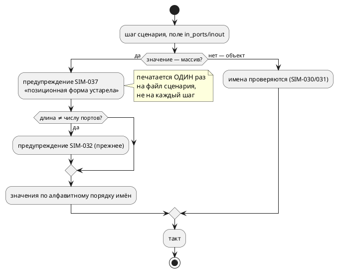

# ADR 0150: Позиционная форма сценария признана устаревшей и говорит об этом

- **Status:** Accepted
- **Date:** 2026-08-18
- **Authors:** Архитектор + аналитик (развилки — решения заказчика 2026-08-18)
- **Related issues:** [Фича 0150](../features/0150-sim-positional-scenario-deprecation.md);
  именованная форма и `SIM-032` — [ADR 0132](0132-sim-named-port-scenarios.md);
  квалифицированные имена портов — [ADR 0135](0135-sim-qualified-port-names.md);
  «пропущенный гейт зелёный, то есть неотличим от пройденного» —
  [ADR 0090](0090-ci-precheck.md)

## Context

Сценарий симулятора задаёт значения портов двумя формами:

```json
{ "in_ports": [0, 1, 0] }                       // позиционная (историческая)
{ "in_ports": {"floor_sensor_f2_bottom": 1} }   // именованная (0132)
```

Позиционная форма привязывает значение к **месту имени в алфавитном списке**
портов модели и её под-моделей. Проба фичи 0132: **один добавленный порт**
превратил «датчик этажа 2» в «верхний датчик этажа 1» — шаг молча стал описывать
другое событие. Именованная форма от этого защищена: несуществующее имя —
ошибка (`SIM-030`), двусмысленное — `SIM-031`.

Фича 0132 сделала три четверти работы: ввела именованную форму, перевела корпус,
записала риск в документ и в док-комментарий. Не сделано одно — **сама форма
по-прежнему принимается молча**. Предупреждение `SIM-032` существует, но говорит
о другом: о несовпадении **длины** массива с числом портов; массив верной длины
не вызывает ни звука.

### Замер 2026-08-18

Обход всех `.json` с поиском массива в полях `in_ports`/`inout`/`out`/`vars`:

| Файл | Что это |
|---|---|
| `takt-sim/tests/data/named0132/short_positional.json` | фикстура, специально проверяющая `SIM-032` |
| `book/src/18-showcase/examples/lift-sim.json` | **пример в документе** — то есть форму видел каждый читатель |

⚠️ **Второй файл нашёл гейт, а не человек.** Первый — ручной — обход смотрел
`examples/`, `takt-lang/tests` и `takt-sim/tests` и дал «ровно один файл»; каталог
`book/` в него не попал. Это лучший довод в пользу решения 4 ниже: список
проверяемых мест, составленный по памяти, неполон ровно там, где не ждёшь.



## Decision Drivers

1. **Молчание — худший ответ.** Форма, способная тихо изменить смысл шага,
   обязана о себе сообщать. Это тот же принцип, по которому в языке заведены
   `SE-090`/`SE-091` и `SIM-030`.
2. **Не ломать чужое без нужды.** Сценарий — вспомогательный файл; он живёт и вне
   репозитория, в чужих проектах, куда предупреждение дойдёт, а отказ — сломает.
3. **Гейт, а не дисциплина.** Корпус переведён; удержать его переведённым должна
   машина (урок 0090: пропущенная проверка неотличима от пройденной).
4. **Шум не должен глушить сигнал.** Предупреждение на каждый шаг длинного
   сценария (сотни строк) быстро научит его игнорировать.

## Considered Options

### Option A. Оставить как есть

**Pros:** ноль работы.

**Cons:** обещание фичи 0132 («риск задокументирован») остаётся бумажным:
документ предупреждает, инструмент — нет. Автор узнаёт о сдвиге, когда трасса
разойдётся, а не когда напишет массив.

### Option B. Предупреждение о форме (принято)

Новый код `SIM-037`: «позиционная форма устарела, перейдите на имена».

**Pros:**
- Контракт не ломается: чужие сценарии продолжают работать.
- Автор узнаёт сразу и видит, что делать.
- Стоимость — одна ветвь в уже существующем `resolve_values`.

**Cons:**
- Предупреждение можно игнорировать; форма остаётся в языке сценариев.

### Option C. Предупреждение плюс флаг строгости (`--strict-scenario`)

**Pros:** CI может требовать имена, ручной прогон остаётся мягким.

**Cons:**
- Ещё один флаг и ещё один режим на сопровождении — при том что репозиторий
  уже чист, и удержать его чистым достаточно гейта, который не меняет
  поведение инструмента.
- Флаг, включённый только в CI, создаёт **два** поведения одного входа —
  ровно то, чего проект избегает.

### Option D. Отказ сразу

**Pros:** одна форма вместо двух; никаких предупреждений.

**Cons:**
- Ломает сценарии вне репозитория без переходного периода. Форма прожила
  долго и разошлась по чужим проектам — судить о её употреблении по своему
  корпусу нельзя.

## Decision

Принимается **Option B** (решение заказчика 2026-08-18): позиционная форма
**принимается и предупреждает**.

1. **Новый код `SIM-037`** — «позиционная форма сценария устарела». Текст
   называет риск (индекс привязан к алфавитному месту имени, добавление порта
   сдвигает массив) и способ перейти (объект `{"имя": значение}`,
   квалификация `Модель::порт` при тёзках).
2. **Печатается один раз на прогон, а не на каждый шаг** (драйвер 4). Сценарий
   в сотню шагов иначе даёт сотню одинаковых строк, и следующее — настоящее —
   предупреждение потеряется.
3. **`SIM-032` сохраняется** и остаётся отдельным: он о **длине**, а не о форме.
   Слить их значило бы потерять различие «форма устарела» и «массив не той
   длины».
4. **Гейт предкоммита** (решение заказчика): в репозитории не должно быть
   позиционных сценариев, кроме **названного** исключения —
   `takt-sim/tests/data/named0132/short_positional.json`, который проверяет
   `SIM-032` и обязан остаться позиционным. Список исключений — с ратчетом, по
   образцу `scripts/module-size-baseline.txt`: запись, которой не соответствует
   ни один позиционный файл, валит гейт.
5. **Отказ не вводится** ни сейчас, ни флагом. Если понадобится — это отдельная
   фича с переходным периодом, и она будет опираться на то, что предупреждение
   к тому времени отработало.

## Consequences

### Положительные

- Инструмент говорит то же, что документ: форма опасна и устарела.
- Репозиторий удерживается на именованной форме машиной, а не памятью.
- Контракт вспомогательного файла не сломан — чужие сценарии работают.

### Отрицательные / Action items

- Предупреждение можно игнорировать: форма остаётся принимаемой. Это цена
  выбора B, и она названа.
- Нужен раздел документа: формы задания входов и статус позиционной
  (правило 24).
- Нужна запись в приложении «Ошибки и предупреждения» (`SIM-037`) и в реестре
  кодов — иначе гейт кодов покраснеет.
- Фикстура-исключение обязана быть **названа** в гейте с причиной, иначе первый
  же чистильщик её «починит», и сторож `SIM-032` останется без входа.

### Acceptance criteria

1. Позиционный массив в `in_ports`/`inout` (и в `guard`) даёт `SIM-037`
   **один раз за прогон**, независимо от числа шагов.
2. Именованная форма не даёт ни одного нового предупреждения.
3. `SIM-032` работает как прежде и не поглощён новым кодом.
4. Гейт предкоммита падает, если в репозитории появился позиционный сценарий вне
   списка исключений; список — с ратчетом (устаревшая запись валит гейт).
5. Код `SIM-037` описан в приложении документа и проходит гейт кодов.
6. Раздел документа о сценариях называет статус позиционной формы.
