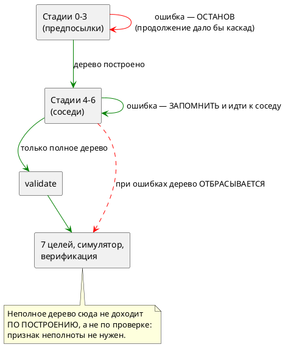

# ADR 0152: Восстановление на границе элемента в стадиях построения

- **Status:** Accepted
- **Date:** 2026-08-04
- **Authors:** Архитектор + Заказчик (решения по объёму и судьбе неполного дерева — 2026-08-04)
- **Related issues:** [Фича 0152](../features/0152-semantic-recovery-element-boundary.md); прямое продолжение [ADR 0130](0130-diagnostics-batch.md) (Option C, отложен); смежные — [фича 0155](../features/0155-semantic-nested-statement-resolution.md) (нельзя глотать ошибку разрешения оператора), [фича 0151](../features/0151-diagnostics-batch-within-check.md) (накопление внутри отдельной проверки `validate`)

## Context

Диагностики компилятора накапливаются **не везде**. Замер на файлах-зондах:

| Слой | Две независимые ошибки дают |
|---|---|
| Лексер и разбор | **2** диагностики |
| Стадии построения дерева 0–6 | **1** — терминально |
| Проверки `validate` | **2** диагностики |

То есть терминальный слой лежит **между** двумя накапливающими. Автор большой
модели правит ошибки в телах по одной, перезапуская компилятор на каждую, —
хотя и до, и после этого слоя инструмент показывает всё сразу.

Терминальность — **сознательное** решение ADR 0130 (Option C отложен), а не
недосмотр. Обоснование записано так: после ошибки дерево неполно, и продолжение
даёт сообщения о **следствиях**, а не о причинах.

### Что показала проба

Довод 0130 проверен пробой, а не принят на веру. В `construct_model_stage4`
временно заведено накопление по соседним состояниям; вход — модель с двумя
независимыми ошибками в телах разных состояний:

```takt
model M {
    var ok: u8 := 0;
    start S { always { ok := nope1 + 1; } ref T: ok > 0; }
    state T { always { ok := nope2 + 2; } }
}
```

Результат:

```
[ПРОБА 0152] Ошибка компиляции [SE-003]: Идентификатор 'nope1' не найден в области видимости
[ПРОБА 0152] Ошибка компиляции [SE-003]: Идентификатор 'nope2' не найден в области видимости
```

**Обе диагностики — самостоятельные причины.** Каждая называет своё
неопределённое имя; ни одна не является следствием другой. То есть довод
«продолжение даёт следствия» для **соседних** элементов внутри стадии не
выполняется.

Он выполняется для **другого** случая: ошибка в объявлении (`var x:
nosuchtype`) делает следствием всякое обращение к `x` в телах. Здесь
продолжение действительно дало бы лавину сообщений о следствиях.

Отсюда граница, которую эта фича и проводит:

> **Накопление безопасно там, где элементы — СОСЕДИ. Оно опасно там, где один
> элемент — ПРЕДПОСЫЛКА другого.**

| Стадия | Что строит | Соседи или предпосылки |
|---|---|---|
| 0 | имена моделей и состояний, импорты | **предпосылка** для всего |
| 1 | составные состояния | **предпосылка** |
| 2 | переменные, типы, порты | **предпосылка** для тел |
| 3 | именованные условия `cond` | **предпосылка** для рёбер |
| **4** | именованные блоки (`enter`/`exit`/`always`) | **соседи** — от блока не зависит никто |
| **5** | тела функций | соседи, но **связаны графом вызовов** |
| **6** | условия рёбер `ref` | **соседи** |

### Побочная находка пробы

Докблок `construct_model_stage4` утверждает: «При ошибке разрешения оператор
сохраняется в виде `StatementNode::Unresolved` (ошибка не пробрасывается)». Это
**неверно уже сейчас**: `resolve_named_blocks` пробрасывает `?`, а описанное
поведение было изъято фичей 0155 — именно потому, что цель `c` печатает
`Unresolved` **пустотой**, а симулятор его пропускает: терялась не диагностика,
а **сам оператор**. Комментарий описывает мир до 0155 и подлежит правке.

### Что такое «частично построенная модель»

Главный вопрос карточки. Ответ, принятый здесь: **её не существует за границей
построения**.

Неполное дерево живёт ровно столько, сколько нужно, чтобы обойти оставшихся
соседей и собрать их диагностики, после чего **отбрасывается**, а наружу идёт
`Err(Vec<Diagnostic>)`. Потребители — семь целей, симулятор и верификация —
неполного дерева не видят **никогда**, и менять их не требуется.

⚠️ Это тот же приём, которым проект пользуется в 0143, 0187, 0192 и 0199: за
границей слоя формы не существует, и потребителям **не по чему разойтись**.
Он строже варианта «признак неполноты + проверка у каждого потребителя»: там
гарантия держится на дисциплине девяти потребителей, здесь — на построении.



## Decision Drivers

1. **Замер важнее довода.** Проба показала: у соседних элементов вторая
   диагностика — причина, а не следствие. Довод 0130 остаётся верным там, где
   элементы связаны предпосылкой.
2. **Терминальный слой между двумя накапливающими — несогласованность**,
   заметная пользователю.
3. **Неполное дерево не должно существовать за границей построения.** Цена
   нарушения известна и измерена фичей 0155: цель `c` печатает нерешённый
   оператор **пустотой**, симулятор пропускает — теряется не диагностика, а
   поведение.
4. **Публичный API менять незачем.** `construct_model_with_files` по контракту
   отдаёт первую ошибку; менять его сигнатуру значило бы задеть `takt-sim` и
   тесты ради потребителей, которым нужна первая ошибка.
5. **Каскады не гасить, а не порождать.** Подавление повторов, отравленные
   имена и прочая машинерия не нужны, если накопление не переходит границу
   «сосед → предпосылка».

## Considered Options

### Option A. Накопление в стадиях 4–6; неполное дерево не покидает построение

Стадии 4, 5, 6 обходят **всех** соседей, собирая диагностики; стадии 0–3
остаются терминальными. `construct_stages` возвращает `Err(Vec<Diagnostic>)` и
отбрасывает дерево.

**Pros:**
- Даёт практическую пользу там, где она измерена: тела блоков, функций и рёбер.
- Каскадов не порождает **по построению** — граница проведена по природе
  элементов, а не по эвристике подавления.
- Потребителей не трогает: неполное дерево до них не доходит.
- Публичный API неизменен; `construct_model_with_files` продолжает отдавать
  первую ошибку.
- Признак «модель неполна» **не нужен**: гарантия сильнее проверки.

**Cons:**
- Ошибки стадий 0–3 по-прежнему показываются по одной — несогласованность
  сужается, но не исчезает.
- Стадия 5 связана графом вызовов: после ошибки в теле `f` тело `g`, зовущего
  `f`, может дать следствие. Требует отдельного решения (см. «Decision»).

### Option B. Накопление во всех стадиях 0–6

**Pros:**
- Единообразие: все слои накапливают.

**Cons:**
- Порождает **лавину следствий**: ошибка в объявлении переменной или типа даёт
  сообщение на каждое её упоминание. Зависимость тел от объявлений прямая.
- Требует машинерии подавления каскадов (отравленные имена, дедупликация по
  причине) — то есть заводит вторую сложную подсистему ради слоя, где польза
  сомнительна.
- Ошибка стадии 0 (имена, импорты) делает неполной **таблицу**, по которой
  строится всё остальное: дальнейшие сообщения не про исходник автора.

### Option C. Статус-кво

**Pros:**
- Ничего не ломает.

**Cons:**
- Оставляет измеренную несогласованность и измеренную же пользу
  неиспользованной: две независимые ошибки в телах показываются по одной.

## Decision

Принимается **Option A** — рекомендация архитектора и решение заказчика
(2026-08-04) совпали. Заказчиком отдельно решено: неполная модель не должна
давать порождённых артефактов.

**Форма исполнения этого решения — сильнее буквы.** Заказчик выбрал «признак
неполноты + запрет кодогенерации»; здесь запрет достигается тем, что неполное
дерево **не покидает** `construct_stages`. Признак не заводится: он был бы
проверкой, которую девять потребителей обязаны помнить, тогда как отсутствие
дерева — гарантия по построению. Требование заказчика («артефактов при неполной
модели нет») выполняется строго.

**Стадия 5 накапливает по вершинам графа вызовов, но останавливает обход ветви.**
Функции — соседи лишь частично: `g`, зовущая упавшую `f`, даст следствие.
Поэтому ошибка в теле `f` **исключает из обхода** функции, транзитивно
зависящие от `f`; независимые ветви графа продолжают разрешаться. Так
накопление остаётся в границе «соседи».

Стадии 0–3 остаются **терминальными**; это решение ADR 0130 подтверждается, а
не отменяется, и его обоснование уточняется: оно верно для предпосылок.

## Consequences

### Положительные

- Автор видит **все** ошибки тел за один прогон.
- Несогласованность «парсер накапливает, `validate` накапливает, а середина —
  нет» сужается до стадий, где терминальность обоснована.
- Обоснование 0130 становится точным: не «после ошибки продолжать нельзя», а
  «нельзя продолжать через предпосылку».
- Потребители дерева не задеты; публичный API неизменен.

### Отрицательные / Action items

- Ошибки стадий 0–3 по-прежнему по одной. Это **осознанный** остаток; он
  фиксируется в документе, чтобы не читаться как недоделка.
- `construct_stages` меняет тип ошибки на `Vec<Diagnostic>`; два вызывающих
  (`pipeline`, `lsp/diagnostics`) правятся, третий
  (`construct_model_with_files`) берёт первую и сохраняет контракт.
- Диагностики обязаны пройти `diagnostics::normalize` — порядок по позиции и
  дедупликация; иначе порядок обхода `BTreeMap` станет наблюдаемым.
- Правило 24: раздел документа о диагностике получает описание того, сколько
  ошибок автор видит за прогон и что при этом порождается.
- Стадия 4 несёт **устаревший** докблок (описывает поведение до 0155) — правится
  здесь же.

### Поправка замером: стадия 6 наблюдаемой пользы не даёт

Первая редакция этого ADR относила к стадии 6 «условия рёбер `ref`». Замер
показал, что это **неверно**, и обе ошибки такого рода приходят не оттуда:

| Что писал автор | Кто на самом деле отвергает | Накапливается? |
|---|---|---|
| `ref Nowhere;` — цель ребра не существует | **стадия 0** (`construct_states`, `SE-002`) | нет — стадия предпосылок |
| `ref T: qqq > 0;` — имя в условии не найдено | **`validate`** (`SE-025`) | да, но это другой слой |

Стадия 6 (`resolve_state_references`) на этих входах не отказывает вовсе.
Накопление в ней **оставлено** — оно единообразно с соседями и ничего не стоит,
— но заявлять по нему наблюдаемую пользу нельзя, и критерий приёмки исправлен.

⚠️ Побочно замер вскрыл, что `validate` на двух неразрешённых условиях в разных
состояниях выдаёт **одну** диагностику, хотя слой заявлен накапливающим. Это
territory фичи [0151](../features/0151-diagnostics-batch-within-check.md);
записано кандидатом, в объём 0152 не берётся.

⚠️ И там же: текст `SE-025` содержит `Debug`-дамп узла АСД
(`Variable(Identifier { loc: Source(0, 51, 54), name: "qqq" })`) — тот же класс,
что закрыла [0202](../features/0202-fmt-diagnostic-formatting.md), но в другом
месте. Тоже кандидат.

### Вне области

- Накопление в стадиях 0–3 (Option B) — отвергнуто по существу, не отложено.
- Накопление **внутри** отдельной проверки `validate` — это фича
  [0151](../features/0151-diagnostics-batch-within-check.md), другой слой.

### Acceptance criteria

1. Две независимые ошибки в телах **разных** состояний дают **две**
   диагностики за прогон.
2. То же для двух тел функций.
3. Ошибка в объявлении (стадия 2) по-прежнему даёт **одну** диагностику —
   каскада нет.
4. При ошибках построения **порождённых артефактов нет**: каталог вывода не
   создаётся либо остаётся пуст.
5. Диагностики упорядочены по позиции и не дублируются.
6. `construct_model_with_files` по-прежнему отдаёт **одну** диагностику
   (контракт публичного API не изменён).
7. Ошибка в теле функции `f` не порождает диагностику в теле `g`, зовущей `f`.
8. `./scripts/precheck.sh` — код возврата 0.
