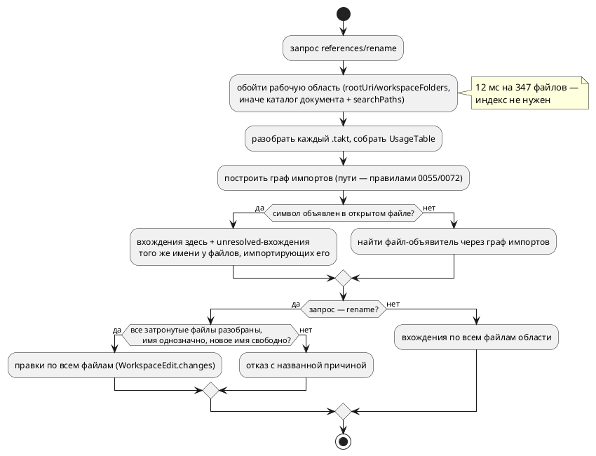

# ADR 0153: Рабочая область сканируется по требованию, а не индексируется

- **Status:** Accepted
- **Date:** 2026-08-18
- **Authors:** Архитектор + аналитик (развилки — решения заказчика 2026-08-18)
- **Related issues:** [Фича 0153](../features/0153-lsp-workspace-index.md);
  слой использований и «полнота или отказ» — [ADR 0131](0131-lsp-definition-references-rename.md);
  адресация `(file_no, offset)` — [ADR 0056](0056-lsp-goto-exact-file.md);
  пути поиска из `initializationOptions` — [ADR 0072](0072-lsp-initialization-options.md);
  каталог импортёра как неявный путь — [ADR 0055](0055-lsp-multifile.md);
  усыновление импортированных объявлений — [ADR 0184](0184-imported-shared-variables.md)

## Context

Сервер знает только открытый документ. Отсюда две границы, названные ещё в
0131:

- `references` ищет вхождения **в открытом файле**; символ, объявленный в
  импортированном файле, покажет свои вхождения «здесь» — правда, но не вся;
- `rename` **отказывает** для символа из чужого файла (`ForeignDeclaration`),
  для имени модели (`ModelName`) и для имени, которое обход не смог связать
  (`Incomplete` по `has_unresolved_named`). Это три из семи причин отказа, и
  все три — не свойство языка, а следствие того, что сервер не видит соседей.

Причина ограничения — устройство: `semantic::usages` обходит сырой АСД
**одного** разбора. Основание для кросс-файловой работы при этом уже есть:
`SymbolId` несёт `file_no` (0056), пути поиска приходят из
`initializationOptions` (0072), каталог документа — неявный путь импорта (0055),
а точные пути импортированных файлов хранит реестр (0053).

### Что «видно» через границу файла (замер устройства импорта)

| Форма | Что вносит в импортёра | Как выглядит вхождение у импортёра |
|---|---|---|
| `import "lib.takt";` | корень файла под именем `Lib` (CamelCase от имени файла) + **усыновление** объявлений: переменные, типы, функции (0184, фиксы 0182-03/04) | голое имя, для `usages` — **`unresolved`** |
| `import "lib.takt" as M;` | то же под именем `M` | `M` объявлен локально (вид `Model`), прочее — `unresolved` |
| `import { A as B } from "lib.takt";` | `B` объявлен локально; исходное `A` записано как `unresolved` (`note_import_originals`) | и `B`, и `A` в тексте импортёра |

То есть у импортёра вхождение импортированного символа **уже помечено** —
таблица вхождений говорит «имя есть, связать не с чем». Недостаёт ровно одного:
знания о том, **кто кого импортирует**, и оно есть только «вниз» (что импортирует
открытый файл), но не «вверх» (кто импортирует его).

### Замер 2026-08-18 — сколько стоит увидеть соседей

Зонд `probe_0153.rs` (release): обход дерева репозитория, чтение, разбор и
`collect_usages` каждого `.takt`.

| Область | Файлов | Объём | Время |
|---|---|---|---|
| весь репозиторий | 347 (325 разобрано, 22 — намеренно невалидные фикстуры) | 302 КиБ | **0.012 с** |
| `examples/` | 12 | 75 КиБ | 0.001 с |

5038 вхождений, неполных таблиц — **ноль**. Пропускная способность ≈ 25 МиБ/с,
то есть область в 10 000 файлов сканируется примерно за 0.35 с.

Целевой поток (правило 18 — схема нужна: меняется источник данных для двух
запросов):

## Decision Drivers

1. **Полнота — смысл `rename`.** Частичное переименование не «неполный
   результат», а испорченный исходник (0131). Расширяя охват, нельзя ослабить
   это правило до «сделаем сколько сможем».
2. **Устаревшее состояние хуже отсутствующего.** Индекс, разошедшийся с диском,
   даёт правки по несуществующим позициям — то есть ту же испорченность, но с
   уверенным видом.
3. **Правду говорить целиком.** `references`, показывающий часть вхождений без
   оговорки, воспитывает ложную уверенность («я проверил, больше нигде нет»).
4. **Граница обязана быть названа.** Файл вне рабочей области сервер не увидит
   **никогда** — это свойство задачи, а не реализации, и о нём должен знать
   пользователь.
5. **Цена запроса — измеренная величина, а не догадка.** Выбор «индекс против
   скана» решается замером, и он сделан.

## Considered Options

### Option A. Оставить как есть

**Pros:**
- Ноль работы; гарантия 0131 неприкосновенна.

**Cons:**
- Три причины отказа из семи остаются, и все три пользователь читает как «сервер
  не умеет», потому что так и есть.
- `references` продолжает отвечать полуправдой.

### Option B. Индекс рабочей области + `didChangeWatchedFiles`

Сервер строит таблицы при старте и обновляет их по уведомлениям клиента.

**Pros:**
- Быстрый ответ на больших областях (сотни тысяч файлов).
- Наметка карточки указывала именно сюда.

**Cons:**
- **Состояние, обязанное не устаревать** (драйвер 2): уведомления шлют не все
  клиенты и не обо всём (правки вне редактора, `git checkout`, генерация
  файлов). Расхождение индекса с диском проявляется как правка по неверному
  смещению.
- Регистрация наблюдателей — отдельный протокольный контракт
  (`client/registerCapability`), поддержанный клиентами неодинаково.
- Замер показывает, что выигрыш не нужен: 12 мс против 0.35 с на области, в 30
  раз большей корпуса.

### Option C. Сканирование по требованию (принято)

Каждый `references`/`rename` обходит область заново.

**Pros:**
- **Нет состояния — нет класса дефектов** «устаревший индекс».
- Данные всегда те, что на диске: правки строятся по свежим смещениям.
- 12 мс на 347 файлов (замер), линейно ~0.35 с на 10 000.
- Кэш «путь → (mtime, таблица)» можно добавить потом **отдельной** фичей, если
  замер потребует, — и он не меняет наблюдаемого поведения.

**Cons:**
- На очень больших областях ответ будет заметен пользователю.
- Повторная работа на каждый запрос (но запросы редки: это не автодополнение).

### Option D. Расширить только `references`, `rename` не трогать

**Pros:**
- Гарантия «полнота или отказ» не переопределяется вовсе.

**Cons:**
- Половина пользы фичи: три причины отказа остаются.
- Асимметрия «вижу все вхождения, но переименовать не могу» раздражает сильнее,
  чем честный отказ обоих.

## Decision

Принимается **Option C** — сканирование рабочей области **по требованию**, без
индекса и без слежения за файлами (решение заказчика 2026-08-18), и вместе с ним
**кросс-файловый `rename` в пределах области** (решение заказчика там же).

### 1. Что считается рабочей областью

`workspaceFolders`, иначе `rootUri`; при отсутствии обоих — каталог открытого
документа плюс `searchPaths` (0072). Обход рекурсивный, по расширению `.takt`,
с пропуском служебных каталогов (`.git`, `target`).

### 2. Правило связывания через границу файла

Символ `S` с именем `N`, объявленный в файле `A`. Файл `B` содержит ссылку на
`S`, если:

1. `B` транзитивно импортирует `A` (граф импортов строится теми же правилами
   поиска путей, что у ядра, — 0055/0072: каталог импортёра в конце списка);
2. вхождение имени `N` в `B` помечено таблицей как **`unresolved`** (локально
   не связано) — либо `N` введено самим `import` (алиас, исходное имя формы
   `{ A as B }`);
3. `N` не объявлено в `B` локально: локальное объявление **затеняет**
   импортированное, и такие вхождения принадлежат другому символу.

Правило консервативно и опирается на уже существующую пометку `unresolved`, а
не на второе разрешение имён: двух разных знаний о том, что откуда пришло, в
проекте быть не должно (класс 0084/0193/0195).

### 3. Гарантия `rename` переопределяется — и называется словами

Было: «полнота или отказ». Стало: **«полнота в пределах рабочей области или
отказ»**. Файл вне области (чужой проект, использующий этот как библиотеку)
не будет затронут никогда — это свойство задачи. Формулировка попадает в
сообщение об отказе, в живой контекст и в раздел документа об инструментах.

`rename` **отказывает**, если:

- хоть один файл области не разобрался, **и** он импортирует файл объявления
  (либо импортирует его транзитивно) — то есть мог содержать вхождения;
- имя неоднозначно: два импортированных файла объявляют `N`, и какой из них
  имеется в виду, таблица не говорит;
- **новое имя уже объявлено** в любом из затрагиваемых файлов — переименование
  создало бы затенение, то есть молча изменило бы смысл. Проверка новая: пока
  правился один файл, конфликт был виден автору, теперь — нет.

`references` в тех же случаях **не** отказывает, а показывает найденное:
показать лишнее вхождение безвредно, а `references` и не обещает правки.
Асимметрия намеренная и повторяет асимметрию 0131.

### 4. Что остаётся отказом и после фичи

- Переименование модели, чьё имя выводится **из имени файла** (`import
  "lib.takt";` вносит `Lib`): переименование затронуло бы имя файла, а файлы
  сервер не переименовывает.
- Внешние артефакты — карта адресов (`--address-map`), `--define`, сценарии
  симулятора: переименование их не догоняет. Названо в карточке, остаётся.
- Прочие четыре причины 0131 (`Unparsable`, `NoSymbol`, `NotAnIdentifier`,
  `Keyword`) — не связаны с областью и не трогаются.

## Consequences

### Положительные

- `references` перестаёт отвечать полуправдой: вхождения ищутся по всей области.
- Снимаются три причины отказа `rename` из семи (`ForeignDeclaration`,
  `ModelName` для моделей с собственным именем, `Incomplete` в части
  импортированных имён).
- Ни одного нового долгоживущего состояния в сервере — значит нечему устаревать.
- Появляется проверка «новое имя свободно», которой не было и в однофайловом
  режиме.

### Отрицательные / Action items

- **Гарантия переопределяется** — это решение заказчика и его нужно записать
  трижды: в сообщении отказа, в живом контексте, в разделе документа об
  инструментах.
- Ответ на очень большой области будет заметен; порог не назначается заранее —
  кандидат «кэш по mtime» заводится по замеру, а не по опасению.
- Обход области обязан быть **одним** знанием: и `references`, и `rename` зовут
  общий слой, иначе они разойдутся в том, что считают областью (класс 0084).
- Правила поиска пути импорта обязаны совпадать с ядром: своя копия дала бы
  «сервер видит не тот файл, что компилятор».
- `rename` теперь возвращает `WorkspaceEdit.changes` с **несколькими** URI —
  бинарник и тесты обязаны это отражать.

### Acceptance criteria

1. `references` на символе, объявленном в файле `A` и используемом в `B`,
   возвращает вхождения из обоих файлов; URI у вхождений разные.
2. `rename` такого символа отдаёт `WorkspaceEdit` с правками в обоих файлах;
   применение правок оставляет оба файла компилируемыми.
3. `prepareRename` на имени модели с собственным именем больше не отказывает;
   на модели, чьё имя выводится из имени файла, — отказывает с причиной.
4. Отказ наступает: (а) когда затрагиваемый файл области не разбирается,
   (б) когда имя неоднозначно, (в) когда новое имя уже объявлено в
   затрагиваемом файле. Для каждого — свой текст.
5. Область определяется одним слоем, и его же зовут оба запроса (сторож —
   тест, а не дисциплина).
6. Замер: `references` на корпусе укладывается в сотни миллисекунд; число
   разобранных файлов на запрос равно числу `.takt` области.
7. Живой контекст и раздел документа об инструментах называют новую гарантию и
   её границу.
