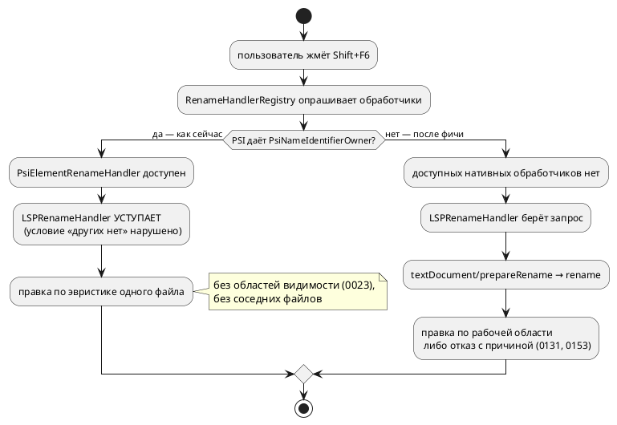

# ADR 0154: Переименование в плагине IntelliJ отдаётся серверу

- **Status:** Accepted
- **Date:** 2026-08-18
- **Authors:** Архитектор + аналитик
- **Related issues:** [Фича 0154](../features/0154-intellij-server-rename.md);
  серверный `rename` и «полнота или отказ» — [ADR 0131](0131-lsp-definition-references-rename.md);
  кросс-файловый охват — [ADR 0153](0153-lsp-workspace-index.md);
  PSI плагина и нативный rename — [ADR 0067](0067-intellij-rename-psi-import.md);
  подключение LSP4IJ — [ADR 0038](0038-intellij-semantic-tokens.md);
  единый источник форм деклараций — [ADR 0125](0125-intellij-takt-lsp-tooling.md)

## Context

Переименование в плагине сегодня делает **PSI плагина**, а не сервер. Устройство
(фича 0067): узел `TaktNameDecl` реализует `PsiNameIdentifierOwner`, узел
`TaktNameRef` несёт `PsiReference`, а роль узла определяет эвристика
`TaktSymbolScanner`. Разрешение ссылки — «первая одноимённая декларация файла»,
**без областей видимости** (осознанное ограничение 0023) и без кросс-файловости.

Сервер тем временем умеет больше: `rename`/`prepareRename` (0131) с реальными
областями видимости и правилом «полнота или отказ», а с фичи 0153 — по всей
рабочей области, с семью причинами отказа вместо молчаливой частичной правки.

### Замер 2026-08-18 — почему серверный путь сегодня недостижим

LSP4IJ 0.20.1 регистрирует свой обработчик **первым**:

```xml
<renameHandler id="LSPRenameHandler" order="first"
               implementation="…features.rename.LSPRenameHandler" />
```

Но `order="first"` решает не всё. Разбор байткода
`LSPRenameHandler.isAvailableOnDataContext` (javap) показывает три условия:

1. файл ассоциирован с языковым сервером, поддерживающим `rename`
   (`LanguageServiceAccessor.hasAny`);
2. `RenameHandlerRegistry.getRenameHandlers(dataContext).isEmpty()` — **других
   доступных обработчиков нет**;
3. либо все они `instanceof VariableInplaceRenameHandler` (единственный
   `instanceof` в предикате).

То есть LSP4IJ **сознательно уступает** нативным рефакторингам. Пока
`TaktNameDecl` объявлен `PsiNameIdentifierOwner`, доступен штатный
`PsiElementRenameHandler` — он не `VariableInplaceRenameHandler`, значит условие
2/3 не выполняется, и серверный путь не включается **никогда**, сколько бы
сервер ни умел.

Это и есть ответ на вопрос фичи: дубль не просто существует — он **перекрывает**
более строгую реализацию.



## Decision Drivers

1. **Одно поведение на одно действие.** Пользователь не должен получать разный
   результат от одного и того же Shift+F6 в зависимости от того, какой слой
   перехватил запрос.
2. **Строже — значит вернее.** PSI-вариант молча правит частично (затенение,
   соседние файлы); серверный отказывается, когда не уверен. Правило проекта —
   «полнота или отказ».
3. **Не дублировать семантику на Kotlin** (драйвер 2 ADR 0038): единый источник
   — крейт `takt-lang`.
4. **Деградация без сервера остаётся осмысленной.** Бинарник `takt-lsp` может
   быть не найден (тихая деградация 0038) — плагин обязан оставаться полезным.
5. **Проверяемость.** Плагин вне `precheck.sh`; всё, что можно проверить
   автоматически, должно проверяться в его Gradle-тестах, а не «глазами в IDE».

## Considered Options

### Option A. Оставить как есть

**Pros:**
- Ноль работы; rename работает без сервера.

**Cons:**
- Пользователь получает **худшую** из двух реализаций, и молча: эвристика
  «первая одноимённая декларация файла» ломает затенение и не видит импортёров.
- Серверный `rename`, доведённый фичами 0131 и 0153, в IntelliJ недостижим.

### Option B. Снять PSI-имена целиком (`NAME_DECL`, `NAME_REF`)

**Pros:**
- PSI становится по-настоящему плоским; сервер обслуживает всё.

**Cons:**
- Вместе с rename исчезает **навигация без сервера**: `TaktGotoDeclarationHandler`
  и find usages опираются на те же узлы.
- Ломает round-trip-сторож `LamPsiCorpusTest`? Нет, но объём правки велик, а
  выигрыш сверх Option C — только чистота.

### Option C. Снять у декларации `PsiNameIdentifierOwner`, узлы и ссылки оставить (принято)

**Pros:**
- Минимальная правка, точно снимающая причину: без `PsiNamedElement`
  `PsiElementRenameHandler` недоступен, условие LSP4IJ выполняется, серверный
  rename включается.
- Навигация и поиск использований по PSI **сохраняются** — деградация без
  сервера остаётся (драйвер 4).
- Проверяемо в Gradle-тестах **без живого сервера** — правда, не буквальным
  предикатом LSP4IJ, а его причиной: символ Takt перестаёт быть переименуемым
  нативно (см. поправку в разделе «Decision»).

**Cons:**
- Без сервера rename пропадает совсем (Shift+F6 ничего не предложит). Это
  осознанный размен: эвристический rename опаснее отсутствующего.
- `TaktNamesValidator` (валидатор имён для нативного rename, 0067) остаётся без
  своего потребителя — его судьбу решает анализ.

### Option D. Свой `RenameHandler`, делегирующий серверу

**Pros:**
- Полный контроль над диалогом и текстом отказа.

**Cons:**
- Дублирует `LSPRenameHandler` целиком, включая `prepareRename`, диалог и
  применение `WorkspaceEdit`, — то есть заводит на Kotlin ровно то, чего ADR
  0038 велел избегать.

## Decision

Принимается **Option C**: `TaktNameDecl` перестаёт быть
`PsiNameIdentifierOwner`; узлы имён и `PsiReference` сохраняются ради навигации
без сервера. Переименование обслуживает `LSPRenameHandler` LSP4IJ, то есть
серверный `textDocument/rename` со всеми его правилами (0131, 0153).

- **Условие включения проверяется тестом, а не верой.** ⚠️ **Поправка по итогу
  разработки:** сторож строится не на пустоте `RenameHandlerRegistry.getRenameHandlers`
  (как задумывалось здесь), а на `PsiElementRenameHandler.canRename` **нашего
  узла**. Зонд показал, что в синтетическом `DataContext` теста нативный
  обработчик доступен даже для `probe.txt`, где PSI плагина нет вовсе, — он
  предлагает переименовать **файл**. Буквальный предикат LSP4IJ в юнит-тесте
  невоспроизводим; проверяемо именно то, что символ Takt нативным рефакторингом
  не берётся. Подробности — в задаче 0154-01.
- **Тесты PSI-rename** (`TaktRenameTest`) переписываются: они проверяли
  поведение, которое фича намеренно убирает. Вместо них — сторож условия выше и
  сторож сохранённой навигации.
- **Ручная проверка в IDE обязательна и записывается в отчёт**: юнит-тест не
  поднимает языковой сервер, поэтому «сервер действительно переименовал»
  подтверждается запуском (`runIde`) — с явным указанием, что именно проверено.
- **Судьба `TaktNamesValidator`** — за анализом: если IDEA использует его только
  на нативном пути, он становится мёртвым кодом и снимается вместе с PSI-rename;
  если LSP4IJ спрашивает валидатор языка при вводе нового имени — остаётся.

## Consequences

### Положительные

- Одно поведение на одно действие: переименование в IntelliJ, VS Code и Zed
  делает один и тот же код — сервер.
- Пользователь получает кросс-файловый rename и честные отказы вместо
  молчаливой частичной правки.
- Плагин теряет реализацию, которую пришлось бы сопровождать параллельно
  серверной.

### Отрицательные / Action items

- **Без сервера rename недоступен.** Назвать в `README` плагина: если
  `takt-lsp` не найден, работают подсветка и навигация, но не переименование.
- Переписать `TaktRenameTest`; проверить, не осталось ли мёртвым
  `TaktNamesValidator` и `setIdentifierText`.
- Проверить, что `LamPsiCorpusTest` (round-trip по корпусу) остаётся зелёным:
  правка касается интерфейса узла, а не разбора.
- Плагин по-прежнему **вне** `precheck.sh`/CI (пусковой JDK 17…26, компиляция —
  JDK 21): его тесты гоняются локально `./gradlew --offline test`, и это надо
  сделать явным шагом отчёта.

### Acceptance criteria

1. `TaktNameDecl` не реализует `PsiNameIdentifierOwner`; узлы имён и
   `PsiReference` сохранены.
2. Тест: `PsiElementRenameHandler.canRename` на узле-декларации ложно — нативный
   рефакторинг за символ Takt не берётся (уточнение критерия — поправка в
   «Decision»).
3. Тест: навигация по PSI (goto declaration, разрешение ссылки) работает
   по-прежнему.
4. `./gradlew --offline test` зелёный; `LamPsiCorpusTest` в том числе.
5. Ручная проверка в IDE: переименование символа, объявленного в другом файле,
   правит оба файла; переименование в имя, занятое в затрагиваемом файле, даёт
   отказ с текстом сервера. Результат записан в отчёт.
6. `README` плагина называет новую границу (нет сервера — нет переименования).
