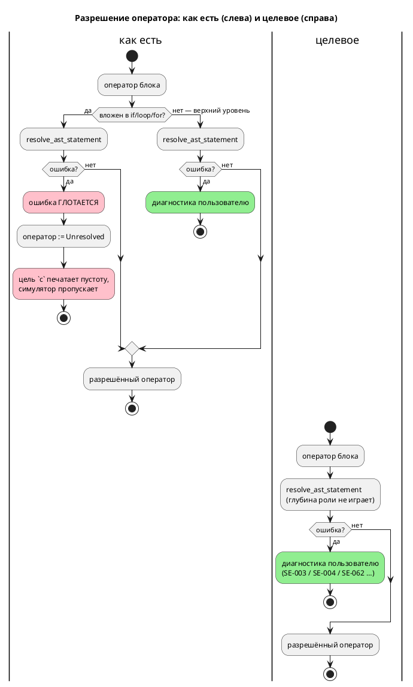

# ADR 0155: Семантическое разрешение тел вложенных операторов

- **Status:** Accepted
- **Date:** 2026-07-29
- **Authors:** Архитектор + системный аналитик
- **Related issues:** [Фича 0155](../features/0155-semantic-nested-statement-resolution.md);
  смежные — [ADR 0129](0129-semantic-deep-nesting.md) (сторож глубины `SE-062`),
  [ADR 0130](0130-diagnostics-batch.md) (несколько диагностик за прогон)

## Context

Разрешение операторов (`semantic/statement.rs::resolve_ast_statement`) устроено
несимметрично по глубине. Оператор **верхнего уровня** блока разрешается через
`?` — ошибка всплывает и становится диагностикой. Тело **вложенного** оператора
(`if`, `else`, `while`/`loop`, `for`: инициализатор и тело) разрешается через
`.unwrap_or_else(|_| StatementNode::Unresolved(...))` — ошибка **глотается**, а
оператор остаётся `Unresolved`.

Дальше `Unresolved` **не доезжает ни до какой диагностики**: цель `c`
(`generator/c/c_expr/stmt.rs:67`) печатает его как **пустоту**, симулятор
(`takt-sim/src/unit/statement.rs:210`) возвращает `Flow::Normal`. То есть
оператор не «не проверен» — он **исчезает из программы молча**. Цели `rust` и
`sv` на `Unresolved` дают ошибку, но это лишь означает, что до пользователя
дефект доходит случайно и зависит от выбранной цели.

Замер (зонды `taktc compile -t c`, 2026-07-29):

| Место оператора | Сегодня |
|---|---|
| тело `always`/`enter`, верхний уровень | `SE-003` ✔ |
| тело функции, верхний уровень | `SE-003` ✔ |
| плечо `match` | `SE-003` ✔ |
| **внутри `if` / `else`** | **молча принято, тело выброшено** ✗ |
| **внутри `while` / `loop`** | **молча принято, тело выброшено** ✗ |
| **внутри `for`** | **молча принято, тело выброшено** ✗ |
| **`: [Guard] …` в блоке** | **ошибка разрешения условия глотается, формула выброшена** ✗ |

Порождённый C для `always { if x > 0 { x := unknown_var_zzz; } }`:

```c
    if (model->x > 0) {
    }
```

Ошибки нет, тела нет. У inline-`Guard` в блоке — тот же механизм в другом
обличье: `filter_map(|c| resolve_condition(c, …).ok())` **выбрасывает из списка**
формулу, чьё условие не разрешилось, и сторож молча перестаёт сторожить.

⚠️ **Границу здесь легко провести не там.** `resolve_condition` **неизвестное
имя ошибкой не считает** — она возвращает `Ok(ConditionNode::Unresolved(…))`
(это инвариант рёбер `ref`, где условие намеренно не разрешается), а `SE-025`
поднимает позже `validate`. Поэтому глотание в inline-`Guard` прячет не
`SE-003`, а ошибки самого разрешения — например `SE-062` (замер: 60 скобок в
`: [Guard]` — «Скомпилировано» до правки, `SE-062` после). Случай «в
inline-`Guard` написано неизвестное имя» диагностируется молчанием **по другой
причине**: `validate` не обходит формулы вовсе — это видно и на уровне
состояния, вне всякой вложенности (`start A { : [Guard] неизвестное; }` — тишина,
тогда как `invariant Safe = неизвестное;` даёт `SE-025`, потому что
десахаризуется в `cond`). Отдельный дефект — **вне** объёма 0155, заводится
кандидатом.

Обоснование глотания записано в док-комментарии модуля: «позволяет обрабатывать
код с встроенными функциями (`debug`, `S`) без предварительной регистрации
встроенных символов». Обоснование **устарело**: встроенные функции
зарегистрированы в `semantic/builtin.rs` (`debug`, `S`, `min`, `max`, `abs`,
`clamp`) и разрешаются штатно. Зонд подтверждает: `debug(x)` на верхнем уровне
блока — где глотания нет — компилируется без ошибки.

Поток «как есть» и целевой:



## Decision Drivers

1. **Молчаливая потеря кода — худший класс дефекта.** Программа принимается, а
   исполняется не та, что написана. Это прямое нарушение цели проекта
   (правило 12): язык синтеза автоматов промышленных систем управления не имеет
   права терять оператор без единого слова.
2. **Диагностика не должна зависеть от глубины вложенности.** Один и тот же
   текст даёт `SE-003` вне `if` и тишину внутри `if` — это не свойство языка, а
   артефакт реализации.
3. **Обратная совместимость (правило 11).** Замер: 276 файлов `.takt`
   (`examples/`, `book/src/**`, `takt-lang/tests/data/`, `takt-sim/tests/data/`)
   дают **побайтно одинаковый** вывод до и после снятия глотания; полный прогон
   `cargo test --all-features` — зелёный. Отвергаемая программа — только та,
   которая **уже была неверна**.
4. **Сторож глубины 0129 должен работать.** `SE-062` для операторов сегодня
   недостижим: его `Err` глотается тем же механизмом. Замер: 60 вложенных `if`
   — сегодня «Скомпилировано», после снятия глотания — `SE-062`.

## Considered Options

### Option A. Пробрасывать ошибку разрешения из вложенного тела (паритет с верхним уровнем)

Снять `.unwrap_or_else(|_| Unresolved(...))` в пяти местах `statement.rs`
(`if`-then, `if`-else, тело цикла, `for`-init, `for`-body) и `filter_map(...ok())`
в inline-`Guard`; всюду — `?`.

**Pros:**
- Диагностика перестаёт зависеть от глубины — инвариант формулируется одной
  фразой и проверяется тестом.
- Снимает молчаливую потерю кода во всех целях сразу (правится ядро, а не цель).
- Делает достижимым `SE-062` (закрывает долг 0129).
- Нулевая цена совместимости — доказано замером (драйвер 3).
- Правка мала и локальна: один модуль, шесть мест.

**Cons:**
- Стадии построения терминальны (ADR 0130) — первая же ошибка во вложенном теле
  прекращает разбор, дальнейшие ошибки того же файла не показываются. Это
  поведение **уже** действует для верхнего уровня; фича его не ухудшает, а
  распространяет.

### Option B. Оставить `Unresolved`, но выдать предупреждение

Тело остаётся `Unresolved`, пользователь получает предупреждение «оператор не
разрешён и не будет исполнен».

**Pros:**
- Формально аддитивно: ничего ранее компилировавшегося не отвергается.

**Cons:**
- Узаконивает потерю кода: программа продолжает исполняться **не так**, как
  написана, а предупреждение легко не заметить (`--quiet` их глушит).
- Предупреждение о неизвестном имени — подмена: `SE-003` есть **ошибка** языка,
  и делать её предупреждением по признаку «оператор оказался вложенным» — это
  два разных языка в одном компиляторе.
- Не чинит `SE-062`: предел вложенности как предупреждение бессмыслен.

### Option C. Оставить ядро как есть, требовать ошибки от каждой цели

Ядро продолжает отдавать `Unresolved`, а цели `c`/`plantuml`/симулятор
приводятся к поведению `rust`/`sv` — отказ на `Unresolved`.

**Pros:**
- Ядро не трогается.

**Cons:**
- Диагностику по одному предмету пришлось бы завести **в шести потребителях**, и
  они разъедутся молча — ровно тот класс дрейфа, который проект уже оплатил
  (CI-гейты 0090, копия формата позиции 0028-01).
- Сообщение получается о следствии («неразрешённый оператор»), а не о причине
  («идентификатор не найден»), причём **без позиции** — координата теряется
  вместе с разрешением.
- Ломает законных потребителей `Unresolved`: ветка `_ =>` (`Assembly`,
  `Formula`, `StraySemicolon`) отдаёт `Unresolved` **штатно**, и цель, отвергающая
  любой `Unresolved`, начнёт отвергать их.

## Decision

Принимается **Option A**. Дефект лежит в ядре — там и правится; пять
однотипных мест и одно место inline-`Guard` заменяются на `?`. Устаревшее
обоснование глотания в док-комментарии модуля переписывается: оно ссылается на
проблему, снятую заведением `semantic/builtin.rs`, и именно оно удерживало
дефект.

Option B отвергнута как узаконивание потери кода, Option C — как размножение
одной диагностики по шести потребителям с потерей причины и позиции.

**Язык не меняется** — меняется полнота его проверки: ни синтаксис, ни семантика
корректной программы не затронуты (доказано побайтным равенством вывода на 276
файлах). Подъёма версии языка правило 22 здесь не требует: множество
**корректных** программ и их смысл прежние. Сужается лишь множество программ,
которые компилятор ошибочно принимал.

## Consequences

### Положительные

- Оператор во вложенном теле больше не исчезает из порождённого кода молча.
- `SE-003`/`SE-004`/`SE-062` и прочие ошибки разрешения работают на любой
  глубине; сторож глубины 0129 становится достижимым.
- Inline-`Guard` с неразрешимым условием перестаёт молча исчезать — проверка
  безопасности либо есть, либо программа отвергнута.
- Классы диагностик у целей `c`/`plantuml`/симулятора выравниваются с `rust`/`sv`
  без правки самих целей.

### Отрицательные / Action items

- **A-1.** Программа с ошибкой во вложенном теле, ранее компилировавшаяся,
  теперь отвергается. В корпусе таких нет (замер), но у стороннего пользователя
  быть могут. Фиксируется в `CHANGES.md` как изменение поведения инструмента.
- **A-2.** Терминальность стадий построения (ADR 0130) распространяется на
  вложенные тела: за прогон показывается первая ошибка разрешения. Накопление
  диагностик внутри стадий — предмет фичи
  [0151](../features/0151-diagnostics-batch-within-check.md), не этой.
- **A-3.** Правило 29 (редакторский слой): новых токенов, форм объявления и
  узлов АСД фича не вводит; новых кодов диагностик не заводит. Диагностика
  доезжает до LSP автоматически — сервер и `taktc` ходят через общий вход
  `collect_compile_diagnostics` (0130). Проверить фактом, а не рассуждением
  (тест LSP на вложенном теле), и зафиксировать в отчёте.
- **A-4.** Тест `takt-lang/tests/semantic/deep_nesting_tests.rs` содержит запись о
  недостижимости сторожа операторов — после правки она **неверна** и должна
  быть заменена работающей проверкой.

### Acceptance criteria

1. `always { if x > 0 { x := unknown_var_zzz; } }` даёт `SE-003` с позицией;
   то же для `else`, `while`/`loop`, `for` (инициализатор и тело), тела функции
   и вложенности в `match`.
2. Ошибка **разрешения** условия inline-`Guard` в блоке больше не глотается:
   `: [Guard]` с условием глубже предела даёт `SE-062`, а не тишину.
   ⚠️ Неизвестное **имя** в inline-`Guard` этим не закрывается (другая причина —
   `validate` не обходит формулы); заведено кандидатом.
3. 60 вложенных `if` дают `SE-062` (сторож 0129 достижим); тест недостижимости
   заменён.
4. Вывод компилятора на всех 276 файлах корпуса, документа и фикстур —
   **побайтно прежний**; `./scripts/precheck.sh` зелёный.
5. Порождённый C для валидного вложенного тела не изменился (тело на месте).
