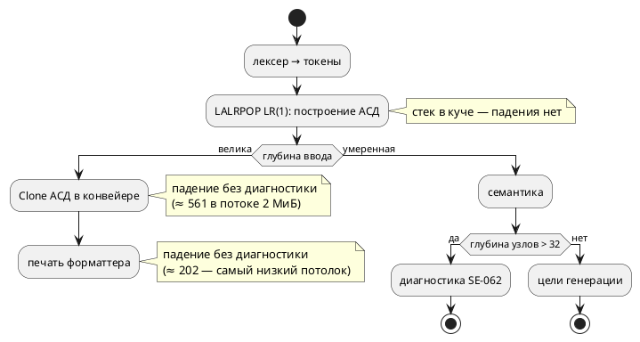
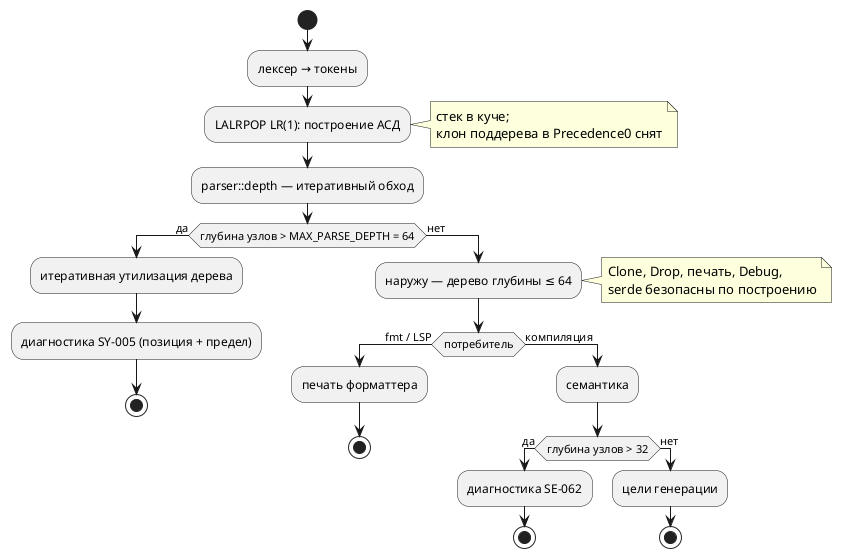

# ADR 0156: Ограничение глубины вложенности на уровне лексера/парсера

- **Status:** Accepted
- **Date:** 2026-07-31
- **Authors:** Системный аналитик, архитектор, лид разработки
- **Related issues:** [Фича 0156](../features/0156-parser-depth-limit.md); продолжение
  [ADR 0129](0129-semantic-deep-nesting.md) (предел глубины в семантике, `SE-062`)

## Context

Фича [0129](../features/0129-semantic-deep-nesting.md) закрыла переполнение стека
**в семантике**: построение семантического дерева рекурсивно по структуре текста,
и глубина ввода роняла `taktc compile`, `taktc verify` и `takt-sim`. Сторож
`SE-062` (предел `MAX_NESTING_DEPTH = 32`) поставлен в `construct_expression`,
`resolve_condition` и `resolve_ast_statement`.

Но дерево АСД до семантики **строится целиком**, и над ним работают другие
рекурсии — печать форматтера, производный `Clone`, производный `Drop`. Приёмка
0129 зафиксировала это как остаточный класс: `taktc fmt` падает без диагностики,
хотя сторож семантики формально стоит. `fmt` семантику **не зовёт вовсе**, то
есть `SE-062` его не защищает по построению.

### Замер (проба 2026-07-31, сборка debug, arm64)

Потолки измерены бинарным поиском по глубине на двух размерах стека: 8 МиБ
(главный поток CLI) и 2 МиБ (консервативная оценка рабочего потока — столько по
умолчанию у потока теста и у типичного рабочего потока сервера). Вход — два
класса: вложенные скобки `((((1))))` и цепочка без скобок `1+1+1+…` (левое
дерево той же глубины).

| Потребитель дерева | 2 МиБ | 8 МиБ |
|---|---|---|
| Печать форматтера `format_source` (скобки) | **≈ 208** | ≈ 879 |
| Печать форматтера `format_source` (цепочка) | **≈ 202** | ≈ 806 |
| Производный `Clone` АСД | ≈ 561 | ≈ 2246 |
| `parse` вложенных скобок | ≈ 561 | ≈ 2246 |
| `parse` цепочки + `Drop` дерева | ≈ 18 750 | ≈ 71 875 |

Из замера следуют три вывода, определяющие решение.

**1. Сам разбор не рекурсивен.** LALRPOP порождает LR(1)-автомат, его стек живёт
в куче: цепочка из 71 875 узлов разбирается и уничтожается без падения. Значит
глубокое дерево **можно построить безопасно** — падают потребители, а не
построение.

**2. Исключение из пункта 1 — не свойство парсера, а дефект действия грамматики.**
Разбор скобок упирается в тот же потолок, что `Clone` (561 / 2246 — совпадение до
единицы), потому что правило `Precedence0` для `"(" Expression ")"` **клонирует
поддерево**:

```rust
if let Some(Parameter{ ty, name: None, .. }) = &a[0].1 {
    return Expression::Parenthesis(ty.loc(), Box::new(ty.clone()));  // ← клон поддерева
}
```

Скобка редуцируется изнутри наружу, поэтому клонируется всё накопленное
поддерево на **каждом** уровне: рекурсия `Clone` (падение) и квадратичная
стоимость. Проба со снятым клоном (значение перемещается из `ParameterList`)
подняла потолок разбора скобок с ≈ 2246 до ≥ 50 000, то есть до общего потолка
`Drop`; локализация падения — `lldb`, кадр
`<takt_lang::parser::ast_expr::Expression as core::clone::Clone>::clone`.

**3. Самый низкий потолок — печать, и он опасно близок к правдоподобному вводу.**
≈ 200 в потоке 2 МиБ — это не «порождённый текст в мегабайт», а выражение,
которое **можно написать руками** (двести вложенных скобок или сумма двухсот
слагаемых). Печать зовут `taktc fmt` и LSP (`textDocument/formatting`,
`lsp/formatting.rs` — та же `format_source`), то есть падение бьёт по редактору
так же, как до 0129 било по компилятору.

### Как обрабатывается ввод сейчас



## Decision Drivers

1. **Инструмент не падает на пользовательском вводе.** Тот же драйвер, что у
   0129: отказ без сообщения — худший исход. `taktc fmt` сегодня падает именно
   так.
2. **Библиотеку зовут из LSP.** Переполнение стека в `takt-lang` обрушивает
   редактор; защита обязана работать в **любом** потоке, а не только в главном
   потоке CLI с его 8 МиБ.
3. **Защита должна покрывать всех потребителей дерева, а не перечисленных.**
   Рекурсивны `Clone`, `Drop`, печать, `Debug`, производный `PartialEq`, `serde`
   (за фичей `ast-serde`). Ставить сторож в каждого — работа без конца: следующий
   потребитель добавится молча.
4. **Граница не должна сужать язык фактически.** Семантика уже отвергает глубину
   > 32 (`SE-062`); любой предел разбора **выше** 32 не отнимает ни одной
   программы, которую сегодня принимают.
5. **Соразмерность.** Класс достижим порождённым текстом и очень длинным
   выражением, но не встречается в написанных руками спецификациях. Правка ядра
   грамматики высокого риска здесь — плохая сделка.

## Considered Options

### Option A. Счётчик вложенности в лексере (баланс скобок)

Лексер линеен, видит `(`/`)`, `{`/`}`, `[`/`]`; при превышении баланса — отказ.

**Pros:**
- Дёшево: пара счётчиков, дерево глубже предела не строится **по построению**.
- Ни один потребитель дерева не может быть забыт: до них дело не доходит.

**Cons:**
- **Не покрывает цепочки без скобок.** Замер: `1+1+…` из 202 слагаемых роняет
  печать при **нулевом** балансе скобок. Пришлось бы добавлять вторую,
  эвристическую метрику («операторов подряд в текущем уровне»), а это перенос
  знания о приоритетах грамматики в лексер — второй источник истины о синтаксисе.
- Оценка сверху заведомо грубая: длинный список аргументов `f(a, b, …)` и
  инициализатор массива глубины не добавляют, а метрику раздувают — законный
  ввод отвергался бы «за компанию».

### Option B. Отказ при построении узла в действиях грамматики

В каждом конструкторе вложенного узла (`Parenthesis`, бинарные и унарные узлы
`Expression`/`Condition`/`LtlExpr`, операторы) считать глубину нового узла и при
превышении писать ошибку в `parser_errors`, возвращая плоскую заглушку.

**Pros:**
- Дерево глубже предела не существует **никогда** — гарантия по построению, как
  у Option A, но точная (считается глубина узлов, а не скобок).

**Cons:**
- **Десятки точек правки** в `grammar.lalrpop` (только у `Condition` — 14
  конструкторов, у `Expression` — цепочка `Chain<Atom>` плюс `Precedence0`, плюс
  LTL и операторы). Пропуск одной точки не виден ни компилятору, ни тесту.
- Глубина узла при редукции неизвестна: её надо либо вычислять обходом (O(предел)
  на узел), либо вести теневой стек глубин, который **рассинхронизируется** при
  восстановлении после ошибки (`!` в грамматике у нас используется).
- Правка грамматики — самое дорогое место для ошибки: ошибка здесь меняет
  разбираемый язык молча.

### Option C. Проверка глубины сразу после разбора, в единой точке `parse`

`parse` после успешного разбора обходит АСД **итеративно** (явный стек, без
рекурсии) и при глубине выше предела возвращает диагностику вместо дерева.
Дополняется двумя вещами, без которых гарантия неполна: **итеративной
утилизацией** отвергнутого дерева (иначе его уничтожит рекурсивный `Drop`) и
**снятием клона** в `Precedence0` (иначе разбор скобок падает до всякой проверки).

**Pros:**
- **Одна точка** — `parse`. Через неё идут все инструменты: `taktc compile`,
  `verify`, `fmt`, `takt-sim`, LSP, форматтер. Ни один потребитель не может быть
  забыт, и новый потребитель защищён автоматически (драйвер 3).
- Наружу выходит дерево глубины ≤ предела, поэтому `Clone`, `Drop`, печать,
  `Debug`, `PartialEq` и `serde` безопасны **по построению** — их чинить не надо.
- Обход считает глубину **узлов** (точная метрика), а не скобок; ложных
  срабатываний на списках аргументов нет.
- Грамматика не трогается (кроме снятия клона, которое ценно само по себе:
  устраняет квадратичную стоимость разбора скобок).

**Cons:**
- Глубокое дерево всё-таки **строится** и занимает память до проверки (для
  отвергаемого ввода — впустую).
- Требуется исчерпывающий обход АСД: новый узел, не разобранный обходом, не
  считается. Лечится тем же приёмом, что в `semantic/usages/walk.rs` —
  `deny(clippy::wildcard_enum_match_arm)`, то есть `_ =>` не соберётся.
- Утилизация отвергнутого дерева — отдельный механизм, который надо написать и
  держать исчерпывающим (та же дисциплина).

### Option D. Убрать рекурсию у потребителей (ручные `Clone`/`Drop`/печать)

**Pros:**
- Границы языка не появляется вовсе.

**Cons:**
- Ручной `Drop` для типа с `Box`-полями **запрещает частичное перемещение** из
  значения (E0509) — а семантика разбирает АСД `match`-ем по значению. Правка
  расползается по всему ядру.
- Печать форматтера и производные `Clone`/`Debug`/`PartialEq`/`serde` пришлось бы
  переписать вручную и держать вручную **вечно**: каждый новый узел языка — новая
  порция ручного кода. Это ровно тот долг, который проект гасит атрибутом
  исчерпаемости, а не размножает.
- Не решает исходную задачу целиком: остаются рекурсии, которых мы ещё не знаем
  (драйвер 3).

### Option E. Увеличить стек рабочих потоков

**Pros:**
- Одна строка.

**Cons:**
- Отвергнуто ещё в 0129 по той же причине: лечит симптом и только у CLI;
  библиотека остаётся источником падения для LSP и любого встраивающего кода,
  а порог просто сдвигается.

## Decision

Принимается **Option C** — проверка глубины в единой точке `parse`, с двумя
обязательными дополнениями.

**Состав решения.**

1. **Модуль `parser::depth`** — итеративный (явный стек в куче) обход АСД,
   возвращающий глубину или первое место, где предел превышен. Обход
   исчерпывающий: `deny(clippy::wildcard_enum_match_arm)`, как в
   `semantic/usages/walk.rs`, — новый узел языка **валит сборку**, а не молча
   выпадает из счёта.
2. **Диагностика `SY-005`** — синтаксическая категория (отказ на разборе, до
   семантики), с позицией и названным пределом, по образцу `SE-062`.
3. **Предел `MAX_PARSE_DEPTH = 64`.** Обоснование — замер: самый низкий потолок
   потребителя (печать, ≈ 202 в потоке 2 МиБ) выше предела втрое, то есть запас
   есть и в самом стеснённом из поддерживаемых окружений; при этом 64 вдвое выше
   семантического предела 32, поэтому **внятную** диагностику пользователь
   по-прежнему получает от `SE-062` («вложено слишком глубоко», позиция, предел),
   а `SY-005` остаётся последним рубежом для того, что до семантики не доходит
   (прежде всего `taktc fmt` и форматирование в редакторе). Ни одна программа,
   принимаемая сегодня, не отвергается: всё глубже 32 уже отвергает семантика
   (драйвер 4).
4. **Итеративная утилизация отвергнутого дерева** перед возвратом `Err`: обход с
   явным стеком «отрезает» детей, заменяя их дешёвой заглушкой, поэтому
   производный `Drop` всегда получает мелкие узлы. Без этого ввод из ≈ 20 000
   слагаемых роняет процесс **в момент отказа** (замер: потолок `Drop` ≈ 18 750
   в потоке 2 МиБ).
5. **Снятие клона поддерева в `Precedence0`** (`ty.clone()` → перемещение
   значения). Иначе разбор скобок падает при глубине ≈ 561 (2 МиБ) — **раньше**,
   чем проверка успевает сработать, и решение не имеет силы для целого класса
   ввода. Побочно устраняется квадратичная стоимость разбора вложенных скобок.

**Целевой поток обработки:**



**Что решение сознательно не делает.** Оно не снимает рекурсию у потребителей
(Option D) и не превращает `SE-062` в рудимент: два предела остаются по разным
причинам — семантический говорит автору о его программе, парсерный защищает
инструмент от ввода, до семантики не доходящего.

## Consequences

### Положительные

- `taktc fmt` и форматирование в редакторе перестают падать без диагностики:
  вместо `SIGABRT` — `SY-005` с позицией.
- Гарантия распространяется на **всех** потребителей АСД разом, включая будущих:
  дерево глубже предела наружу не выходит.
- Разбор вложенных скобок перестаёт быть квадратичным и поднимает свой потолок с
  ≈ 561 до потолка `Drop` (побочный выигрыш от снятия клона).
- Класс «глубокая вложенность» закрывается целиком: семантика (0129) + разбор
  (0156) + безопасная утилизация.

### Отрицательные / Action items

- **Появляется вторая граница языка, названная числом** (`MAX_PARSE_DEPTH = 64`
  рядом с `MAX_NESTING_DEPTH = 32`). Обе документируются в приложении
  «Ошибки и предупреждения»; соотношение (парсерный предел строго выше
  семантического) — инвариант, который обязан держать тест.
- **Исчерпаемость обхода — на атрибуте, а не на человеке.** Модули обхода и
  утилизации объявляют `deny(clippy::wildcard_enum_match_arm)`; правило проекта
  (`docs/CODE.md`, гейт `scripts/check-exhaustive-nodes.sh`) распространяется на
  них — гейт обязан их видеть.
- **Отвергаемый ввод всё ещё строит дерево** (память до проверки). Для входа
  порядка мегабайта это десятки мегабайт кучи — приемлемо; ограничение по объёму
  ввода в объём фичи не входит и заводится кандидатом, если понадобится.
- **Замер сделан на debug.** В release кадры меньше и потолки выше, то есть
  выбранный предел консервативен — но замер надо повторить при смене толчейна,
  если потолок печати приблизится к пределу.

### Acceptance criteria

1. `taktc fmt` на файле с 3000 вложенных скобок и на файле из 3000 слагаемых
   даёт диагностику `SY-005` с позицией и не падает.
2. То же для `taktc compile`, `taktc verify`, `takt-sim` и для пути LSP
   (`formatting_edits`) — проверяется в потоке с 2 МиБ стека.
3. Ввод, порождающий дерево глубины ≈ 200 000 (заведомо выше потолка `Drop`),
   даёт `SY-005` и не роняет процесс — то есть утилизация работает.
4. Программа с глубиной между 33 и 64 по-прежнему получает `SE-062` (а не
   `SY-005`): парсерный предел не подменяет семантический.
5. Корпус `examples/` и весь `precheck.sh` зелёные; вывод `examples/generated/`
   байт-в-байт не изменился (снятие клона — оптимизация, а не смена поведения).
6. Новый узел АСД, не разобранный обходом глубины, **не собирается** (проверяется
   мутацией: временное добавление узла даёт ошибку компиляции).
