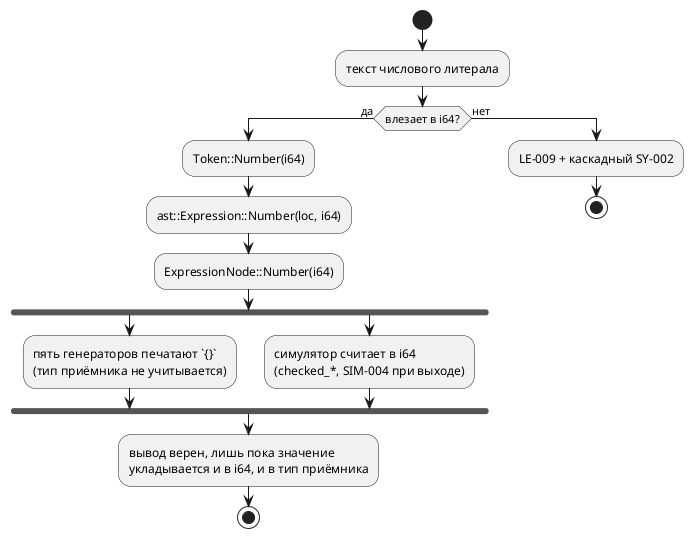

# ADR 0157: Представление числового литерала: полная маска [bit;64]

- **Status:** Accepted (вариант и объём утверждены заказчиком 2026-07-30)
- **Date:** 2026-07-30
- **Authors:** Архитектор
- **Related issues:** [Фича 0157](../features/0157-literal-u64-representation.md);
  предшественник — [ADR 0128](0128-lexer-literal-overflow.md) (паника → `LE-009`),
  смежные — [ADR 0078](0078-bit-array-semantics.md) (`[bit;N]`),
  [ADR 0127](0127-int-overflow-semantics.md) (переполнение целых),
  [фича 0144](../features/0144-int-literal-exponent.md) (экспонента у целого),
  [ADR 0171](0171-c-gate-werror.md) (гейт `c` под `-Werror`).

## Context

Язык объявляет типы `u64` и `[bit;64]` (при `N ≤ 64` — упакованный скаляр,
ADR 0078), но **носитель значения на всём тракте — `i64`**: `Token::Number(i64)`
→ `ast::Expression::Number(_, i64)` → `ExpressionNode::Number(i64)` →
`takt_sim::eval::Value::Number(i64)`. Верхняя половина диапазона `u64`
(и, в частности, маска «все единицы» у `[bit;64]`) **невыразима** — ни литералом,
ни вычислением.

### Что показали пробы (2026-07-30, все команды воспроизводимы)

| № | Вход | Наблюдаемое | Вывод |
|---|---|---|---|
| П1 | `var m: [bit;64] := 0xFFFFFFFFFFFFFFFF;` | `LE-009` + каскадный `SY-002` на `;` | обещанный тип имеет невыразимые значения; вдобавок пользователь видит **две** ошибки на одну причину |
| П2 | `var m: u64 := 18446744073709551615;` | `LE-009` + `SY-002` | то же для `u64` |
| П3 | `var m: u64 := 0x7FFFFFFFFFFFFFFF;` → цели `c`/`rust`/`st`/`sv` | все печатают голое десятичное `9223372036854775807` | печать числа **не знает о типе приёмника** |
| П4 | `uint64_t a = 18446744073709551615;` под `cc -Wall -Werror` | `error: -Wimplicitly-unsigned-literal` | цель `c` **обязана** печатать суффикс (`ULL`/hex+`ULL`), иначе гейт 0171 отвергнет вывод |
| П5 | `a <= 9223372036854775807;` в `logic [63:0]` под `verilator --lint-only -Wall` | `%Warning-WIDTHEXPAND` → `%Error` | цель `sv` ломается **уже на 33 битах** (проверено также на `8589934592` и `4294967295`); дефект существует **сегодня**, корпус его просто не содержит |
| П6 | `ULINT := 18446744073709551615;` и `16#FFFFFFFFFFFFFFFF` через `iec2c` | принято, код 0 | цель `st` к расширению готова |
| П7 | `(18446744073709551615, 0xFFFFFFFFFFFFFFFF)` как `u64` под `rustc -D warnings` | принято | цель `rust` к расширению готова |
| П8 | `var m: u64 := 9223372036854775807;` + `m := m + 1;` в симуляторе | `SIM-004` «переполнение при вычислении '+'» | у **вычисления** тот же потолок: `u64` неполноценен и без литерала (при этом `u8`/`u32` оборачиваются верно — ADR 0127 соблюдён) |
| П9 | `var a: u8 := 300;` / `var b: i8 := -200;` | `taktc` рапортует успех; `cc -Werror` → `-Wconstant-conversion`, симулятор → `SIM-003` | **диагностики диапазона по типу нет вовсе**: расширить носитель, не заведя её, значит расширить и класс молча невалидного вывода |

### Поток значения «как есть»

Существенно, что **три** независимых слоя упираются в одну границу: лексер
(приём), симулятор (вычисление), генераторы (печать). Расширение любого одного
слоя выразимости не даёт.

## Decision Drivers

1. **Язык не должен обещать типы с невыразимыми значениями.** `u64` и `[bit;64]`
   объявлены поддержанными (ADR 0078); сегодня половина их диапазона недоступна.
2. **Один смысл литерала на все цели.** Шесть потребителей (симулятор + пять
   генераторов) не имеют права разойтись в значении одного текста — урок 0042
   («арифметика в одном месте») и 0127 (нормированное переполнение).
3. **Расширение приёма без диагностики диапазона умножает молчаливый брак.**
   П9 доказывает: уже сегодня `u8 := 300` даёт невалидный C при рапорте об
   успехе; после расширения таких входов станет больше.
4. **Печать числа обязана знать тип приёмника.** П4 (C) и П5 (SV) показывают,
   что голое десятичное — не универсальная форма.
5. **Обратная совместимость (правило 11).** Все ныне валидные программы обязаны
   давать **байт-в-байт** прежний вывод: `examples/generated/` — снапшот
   (детерминизм 0048), его дифф несёт смысл.

## Considered Options

### Option A. Носитель `i128` на всём тракте + печать по типу приёмника

Токен, АСД, семантика и `eval::Value` несут `i128`; лексер принимает всё из
`[i64::MIN, u64::MAX]`, остальное — прежний `LE-009` с переписанным текстом
(диапазон становится свойством пары «литерал + тип»). Семантика получает
диагностику «литерал вне диапазона типа приёмника» (`SE-089`). Генераторы
печатают литерал **по целевому типу**: `c` — суффикс `ULL`, когда значение вне
`long long`; `sv` — размерная форма `64'd…`, когда естественная ширина ≠ 32 и не
равна ширине приёмника; `st`/`rust`/`plantuml` — как сейчас (П6, П7). Симулятор
считает в `i128`, а усечение и обёртку по типу делает существующий
`coerce_to_type` (ADR 0127) — этим закрывается П8.

**Pros:**
- Закрывает все три слоя одной идеей; `u64` становится полноценным.
- `i128` шире любого выразимого типа, поэтому промежуточный результат не
  переполняется там, где итог по типу законен (П8).
- Запас на будущее (`u128`/`[bit;128]`, если появятся) без второй такой правки.

**Cons:**
- Правка сквозная: лексер, грамматика (типы действий LALRPOP), АСД, семантика,
  три константных вычислителя, симулятор (`eval`, `state_io`), пять генераторов,
  LSP, фикстуры и снапшоты.
- В АСД становятся представимы значения, не принимаемые **ни одним** типом
  (`> u64::MAX` из лексера не приходит, но конструируется в коде) — границу
  держит диагностика, а не тип Rust.

### Option B. Носитель «модуль + знак» (`u64` + `bool`)

**Pros:**
- Точно покрывает потребность, не вводя непринимаемых значений.

**Cons:**
- Два поля в каждом узле и в каждом сравнении; `+0`/`−0` дают два представления
  одного числа — равенство узлов (у `Extend` оно уже с ручной семантикой, 0056)
  становится ещё тоньше.
- Любое вычисление всё равно уходит в более широкий тип — выигрыш мнимый.

### Option C. Бит-каст: оставить `i64`, широкий литерал складывать битовым шаблоном

`0xFFFFFFFFFFFFFFFF` → `Number(-1)`; форму восстанавливает печать по типу
приёмника.

**Pros:**
- Минимальная правка носителя (лексер + печать).

**Cons:**
- Значение литерала перестаёт быть свойством текста и становится свойством
  контекста — прямо против драйвера 2; три константных вычислителя (0042, 0143,
  0185) обязаны договориться о бит-касте, а они и так расходятся.
- `18446744073709551615 > 9223372036854775807` в константном выражении даёт
  **ложь**: сравнение идёт над бит-шаблоном.
- П8 не закрывается вовсе: вычисление остаётся в `i64`.

### Option D. Спецформа записи маски (`all`, `~0` как константа) вместо расширения

**Pros:**
- Дёшево; закрывает ровно заголовочный случай «все единицы».

**Cons:**
- `u64` в десятичной записи остаётся невыразим (П2), П8 не закрывается.
- Язык обрастает формой, существующей ради обхода внутреннего ограничения.
- ⚠️ Путь **уже сломан** независимо от 0157: `var u: u64 := ~0;` симулятор молча
  даёт `0` (константное выражение в инициализаторе им не вычисляется —
  `unit/initial.rs` отвечает «не константа»), а цель `c` печатает `~0` (все
  единицы). Опираться на эту форму нельзя, пока расхождение не устранено
  (вынесено в кандидаты, см. ниже).

## Decision

Принимается **Option A** (решение заказчика 2026-07-30). Объём подтверждён им
же **целиком**: диагностика диапазона, печать по типу приёмника в `c`/`sv` и
вычисление в `i128` у симулятора взяты в фичу, а не вынесены в преемники —
только этот состав делает `u64` полноценным разом по всем трём слоям (приём,
вычисление, печать). Итого **пять пунктов**:

1. **Носитель** `i128` в токене, АСД, семантике и `eval::Value::Number`.
2. **Лексер**: принимает `[i64::MIN, u64::MAX]`; вне — `LE-009` с переписанным
   текстом. Каскадный `SY-002` (П1) гасится: после лексической ошибки в этой
   позиции парсер не обязан вторично жаловаться на `;`.
3. **Семантика**: `SE-089` — литерал не помещается в тип приёмника (закрывает П9;
   без него расширение приёма увеличивает класс молча невалидного вывода).
4. **Цели**: печать литерала по типу приёмника — `c` (суффикс `ULL` при выходе за
   `long long`), `sv` (размерная форма при ширине ≠ 32; попутно закрывает П5).
   Условие печати — «когда иначе вывод невалиден», поэтому корпус
   `examples/generated/` обязан остаться **байт-в-байт прежним**.
5. **Симулятор**: вычисление в `i128`, усечение/обёртка — существующим
   `coerce_to_type` по типу (закрывает П8, соблюдая ADR 0127).

**Вне объёма** (записать кандидатами, не втягивать):

- Константное выражение в инициализаторе переменной не вычисляется симулятором:
  `var a: u8 := 1 + 2;` → симулятор `0`, цель `c` `3`. **Молча**, класс Tier 1.
- `~0` в инициализаторе — частный случай того же (Option D выше).
- Экспонента у целого литерала ([0144](../features/0144-int-literal-exponent.md))
  — упирается в тот же носитель, но имеет свою карточку.

## Consequences

### Положительные

- `u64` и `[bit;64]` становятся полноценными: значение выразимо литералом и
  достижимо вычислением.
- Цель `sv` перестаёт ломаться на литералах шире 32 бит (П5) — дефект, который
  сегодня ждёт первого же примера с такой константой.
- Диагностика диапазона (`SE-089`) переводит целый класс «валидный `.takt` →
  невалидный C» из молчания в отказ на этапе компиляции.

### Отрицательные / Action items

- Правка задевает порядка десяти модулей и все фикстуры с `Number(...)`;
  декомпозиция на подзадачи обязательна (правило 2).
- Печать по типу приёмника требует, чтобы генератор **знал** тип в точке печати
  литерала; там, где не знает (константа вне объявления), нужен либо проброс
  типа, либо консервативная форма. Это — вопрос стадии анализа.
- Документ `book/` (разделы `02-lexical`, `03-types`) и реестр диагностик
  обновляются в стадии документирования (правило 24).
- Версия языка растёт: `0.8.0 → 0.9.0` (расширено множество допустимых литералов,
  добавлена диагностика) — правило 22.

### Acceptance criteria

1. `var m: [bit;64] := 0xFFFFFFFFFFFFFFFF;` и `var m: u64 := 18446744073709551615;`
   компилируются всеми пятью целями; вывод принимается гейтами (`cc -Wall
   -Werror`, `rustc -D warnings`, `iec2c`, `verilator -Wall`, `yosys`).
2. Потактовая сверка симулятора и цели `c` на модели, где `u64` пересекает
   границу `i64::MAX` (обёртка по ADR 0127, а не `SIM-004`).
3. `var a: u8 := 300;` даёт `SE-089` с позицией, а не успех (П9).
4. Цель `sv`: литерал шириной 33…64 бита проходит `verilator --lint-only -Wall`
   без `WIDTHEXPAND` (П5).
5. `examples/generated/` — **байт-в-байт** без изменений (правило 11 + 0048).
6. `./scripts/precheck.sh` зелёный.
