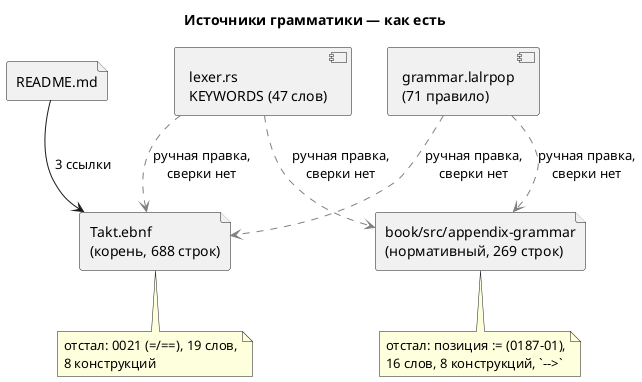

# ADR 0160: Синхронизация эталона Takt.ebnf с актуальным синтаксисом

- **Status:** Accepted
- **Date:** 2026-08-14
- **Authors:** Архитектор + Заказчик (решение о судьбе корневого эталона — 2026-08-14)
- **Related issues:** [Фича 0160](../features/0160-takt-ebnf-sync.md); смежные — [ADR 0021](0021-swap-assign-compare.md) (реформа операторов), [фича 0116](../features/0116-book-grammar.md) (приложение «Грамматика» книги), [ADR 0140](0140-backlog-revision-doc-split.md) (разделение ролей README и `book/`, правило 15), [ADR 0201](0201-dead-lexemes.md) (мёртвая лексика)

## Context

Грамматика языка Takt описана в репозитории **дважды**:

- корневой `Takt.ebnf` (688 строк) — «эталон», заведён до документа;
- приложение [`book/src/appendix-grammar/index.md`](../../book/src/appendix-grammar/index.md)
  (269 строк) — заведено фичей [0116](../features/0116-book-grammar.md) и объявлено в
  собственном первом абзаце **нормативным** источником по структуре программы.

Фича регистрировалась по одному наблюдению: корневой эталон **дореформенный** —
печатает `=` присваиванием и `==` равенством, то есть схему, изъятую фичей 0021.
Проба стадии архитектуры (обход обоих файлов против `grammar.lalrpop` и
`parser/lexer.rs`) показала, что наблюдение описывало **частный случай**, а класс
шире и хуже.

### Что показала проба

Замер вёлся по трём источникам истины кода: таблица `KEYWORDS`
(`takt-lang/src/parser/lexer.rs`, 47 записей), extern-блок терминалов и правила
`takt-lang/src/grammar.lalrpop` (71 правило).

| № | Что сверялось | `Takt.ebnf` | Приложение книги |
|---|---|---|---|
| P1 | Присваивание / равенство | `=` / `==` — **дореформенное** (0021) | `:=` / `=` — верно |
| P2 | Позиция присваивания | внутри `expression` | **внутри `expression`** — устарело (фикс [0187-01](../fixes/0187-01-assignment-is-statement-in-grammar.md)) |
| P3 | Ключевых слов в списке | 28 из 47 | **31 из 47** |
| P4 | `while` (синоним `loop` с условием) | нет | **нет** |
| P5 | `match` … `=>` … `_` | нет | **нет** |
| P6 | `invariant Имя = условие;` | нет | слово в списке, **правила нет** |
| P7 | `address Имя = выражение;` | нет | **нет** |
| P8 | `clock <частота>;`, `every <длительность> { … }` | нет | **нет** |
| P9 | `after` в условии (4 формы) | нет | **нет** |
| P10 | `at <адрес>` в объявлении порта | нет | **нет** |
| P11 | Анонимный порт `#АДРЕС` | нет | **нет** |
| P12 | Литералы `duration` / `frequency` / `ticks` | нет | **нет** |
| P13 | `-->` в сводке пунктуации | есть | **есть** — терминал изъят фичей [0201](0201-dead-lexemes.md) |
| P14 | `=>` (ветвь `match`) в сводке пунктуации | нет | **нет** |

**P2 — главный результат пробы и переоценка фичи.** Приложение книги, объявленное
нормативным, описывает присваивание как операцию **внутри выражения**. Фикс
0187-01 вынес `:=` из цепочки приоритетов ровно затем, чтобы `(value := 3) + 1`
отвергался **грамматикой** (`SY-006`), а не семантикой; сегодня нормативный
документ описывает язык, которого нет, — и именно в том месте, где отличие
наблюдаемо автором. То есть удаление корневого эталона «ради одного источника»
без правки книги оставило бы **одно неверное** описание вместо двух.

**Дефект не в файле, а в отсутствии сторожа.** Оба описания отстали независимо и
разными способами: корневое — на реформе операторов трёхлетней давности,
книжное — на четырёх последующих фичах (0134 время, 0185 параметры, 0187 порты,
0189 анонимные порты). Ни у одного из них нет машинной сверки с кодом: гейты
`book/` проверяют **символы шрифта** (0146) и **компилируемость примеров** (0133),
но не соответствие грамматики языку. Пока сверки нет, любой выбранный вариант
разойдётся снова — вопрос лишь в сроке.

**Живых потребителей у корневого эталона нет.** Обход трекнутых файлов: на
`Takt.ebnf` ссылается **только** `README.md` (три места: обзор синтаксиса, дерево
репозитория, раздел «Грамматика»). Ни один скрипт, гейт, тест или крейт его не
читает. Прочие вхождения — историческая проза `CHANGES.md` и артефакты стадий
закрытых фич, которые правилом 21 не переписываются.

### Поток «как есть»



## Decision Drivers

1. **Правило 15 свода — дубль снимают разделением ролей, а не сверкой прозы.**
   Оно заведено ровно по этому прецеденту: «дрейф уже случался (`Takt.ebnf`
   отстал от реформы операторов фичи 0021)». Решение, оставляющее два описания
   одного предмета, воспроизводит снятый класс.
2. **Нормативность уже назначена.** Приложение книги само объявляет себя
   нормативным источником, а README по правилу 15 отсылает к книге за описанием
   языка. Корневой эталон — остаток раскладки до 0140.
3. **Верность важнее полноты набора артефактов.** Неверный нормативный документ
   дороже отсутствующего: автор сверяется с ним и получает отказ инструмента.
4. **Сторож обязателен, но покрывает не всё.** Машинно сверить можно **лексику**
   (список ключевых слов ↔ `KEYWORDS`) и пунктуацию; правила EBNF против LALRPOP
   машина не сверит — это проза о форме. Значит гейт закрывает P3/P13/P14
   навсегда, а P1/P2/P4…P12 — разовая правка под ревью (правило 4).
5. **Цена сопровождения.** Каждый лишний описатель грамматики — работа при каждой
   языковой фиче (правило 24 уже требует стадии «Документирование»).

## Considered Options

### Option A. Удалить `Takt.ebnf`; единственный источник — приложение книги; завести гейт лексики

Корневой файл удаляется, три ссылки README перенаправляются на приложение;
приложение приводится к языку (P1…P14); заводится `scripts/check-book-keywords.py`,
сверяющий список ключевых слов и сводку пунктуации документа с `KEYWORDS`
и extern-блоком грамматики, с самопроверкой-ловушкой (образец — гейты 0146/0149/0177).

**Pros:**
- Снимает дубль по образцу правила 15 — источник по грамматике ровно один.
- Устраняет **обе** редакции устаревания разом: после правки нормативный документ
  описывает язык, а не его прошлое.
- Гейт закрывает механически размножающийся класс (лексика), у которого сегодня
  сверки нет ни у одного из четырёх списков документа.
- Уменьшает работу каждой будущей языковой фичи на один файл.

**Cons:**
- Файл `.ebnf` машиночитаемого вида (для генераторов парсеров, внешних
  инструментов) исчезает из корня. ⚠️ Замер: потребителей у него нет, а
  формально эталоном парсера служит `grammar.lalrpop`.
- Правки приложения (8 конструкций) — объём, сверяемый человеком.

### Option B. Синхронизировать оба файла и завести гейт лексики на оба

**Pros:**
- Артефакт в корне сохраняется — привычный вход для внешнего читателя.

**Cons:**
- Оставляет два описания одного предмета — прямое противоречие правилу 15 и
  прецеденту, которым оно обосновано.
- Гейт покрывает лишь лексику; **правила** двух файлов разойдутся снова, и
  проба показывает, что расходятся они по-разному (P1 против P2).
- Удваивает работу каждой языковой фичи вместо того, чтобы сократить.

### Option C. Порождать `Takt.ebnf` из приложения книги (генератор + гейт совпадения)

**Pros:**
- Один источник истины при сохранённом артефакте в корне.
- Расхождение невозможно по построению.

**Cons:**
- Новый генератор и его сопровождение ради файла **без потребителей** — цена без
  выгоды.
- Формат книги (Markdown с блоками ` ```ebnf `, прозой между ними) в чистый
  ISO EBNF не переводится механически: пояснения о приоритетах и `loop_cond`
  живут прозой и в порождённый файл не попадут — то есть порождённое будет
  беднее нынешнего эталона.

## Decision

Принимается **Option A** (решение заказчика 2026-08-14).

Корневой `Takt.ebnf` **удаляется**; единственным источником по грамматике
остаётся приложение `book/src/appendix-grammar/` — оно уже объявлено нормативным
и по правилу 15 принадлежит документу, а не README. Приложение приводится к
актуальному языку по всем позициям пробы. Лексическая часть (список ключевых
слов, сводка операторов и пунктуации) ставится **под машинный гейт**: она
размножается механически и потому обязана сверяться машиной, а не ревью.

⚠️ **Правило 18 — диаграмма.** ADR синтаксис и семантику языка **не меняет**
(меняется описание уже существующего языка), поэтому диаграмма активности/EBNF не
требуется; component-диаграмма потока источников выше добавлена как «строго
необходимая» для понимания решения — предмет ADR есть именно поток «код →
описание».

⚠️ **Обратная совместимость (правило 11).** Язык не затрагивается: ни одна
программа `.takt` не меняет смысла. Внешняя совместимость — только по пути
файла: ссылка `Takt.ebnf` из корня репозитория перестанет разрешаться. Замер
показал ноль потребителей внутри репозитория; внешние ссылки (если существуют)
получают 404 GitHub — заказчик принял эту цену, выбрав вариант A.

## Consequences

### Положительные

- Описание грамматики становится единственным и верным; расхождение между двумя
  описаниями невозможно, поскольку второго нет.
- Класс «список лексики документа отстал от языка» закрывается машиной — вместе
  с ним снимается кандидат блока 2 `FEATURES.md` о таблице ключевых слов
  документа (замер закрытия 0201).
- Каждая будущая языковая фича сопровождает на один файл меньше.

### Отрицательные / Action items

- **A1.** Приложение книги дополняется восемью конструкциями (P4…P12) и
  исправляется в позиции присваивания (P2) — объём, проверяемый человеком.
- **A2.** Гейт `check-book-keywords.py` покрывает **лексику**, а не правила: если
  будущая фича заведёт конструкцию без нового ключевого слова (как 0189 завела
  `#АДРЕС` на уже существующем токене `#`), машина её пропустит. Остаётся
  правило 24 (стадия «Документирование» у каждой языковой фичи) и правило 4.
- **A3.** Списков лексики в проекте после фичи остаётся **три** документных
  (`book/src/02-lexical/index.md`, `book/keywords.lua`, `book/takt.kate.xml`) плюс
  приложение. Гейт заводится на приложение; распространение на остальные три —
  кандидат в блоке 2 (та же проба, но иной формат файлов).
- **A4.** Таблица ключевых слов раздела `book/src/02-lexical/` отстала так же
  (замер 0201: нет `at`, `clock`, `after`, `every`). Фича 0160 её **не** правит —
  это отдельный предмет с отдельным форматом; запись остаётся кандидатом.

### Acceptance criteria

1. Файла `Takt.ebnf` в репозитории нет; три ссылки `README.md` ведут на
   приложение «Грамматика» книги; гейт ссылок правила 14 зелёный.
2. Приложение `book/src/appendix-grammar/index.md` описывает: присваивание как
   **оператор** (`statement_expr` / `call_arg`, не уровень `expression`); `while`;
   `match`/`=>`/`_`; `invariant`; `address`; `clock`; `every`; `after` (все
   формы); `at` в объявлении порта; анонимный порт `#АДРЕС`; литералы
   `duration`/`frequency`/`ticks`. Сводка пунктуации не содержит `-->` и
   содержит `=>`.
3. Список ключевых слов приложения равен `parser::lexer::all_keywords()` с точностью
   до явного, обоснованного в самом гейте списка исключений.
4. `scripts/check-book-keywords.py` включён в `precheck.sh`, имеет самопроверку
   (`--self-test`: ловушка ловится, законный текст — нет) и валит предкоммит при
   расхождении.
5. `./scripts/precheck.sh` зелёный; `make -C book build` собирает документ (либо
   пропуск с причиной, если тулчейн недоступен).
