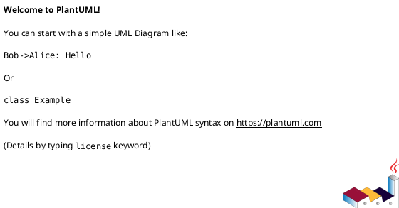

# ADR 0166: Корпусной SV-транслируемый пример на последовательную композицию +

- **Status:** Draft
- **Date:** 2026-07-29
- **Authors:** <роли: Архитектор + …>
- **Related issues:** [Фича 0166](../features/0166-sv-example-sequential-composition.md)<; связь с ADR YYYY-…>

## Context

<Какую проблему решаем, какие силы действуют, что в текущем состоянии.>

<!-- Правило 18: если ADR меняет потоки данных между компонентами или схема
     строго необходима — добавьте сюда/в Decision component-диаграмму PlantUML:

-->

## Decision Drivers

1. **<драйвер>.** <почему важно>
2. **<драйвер>.** <почему важно>

## Considered Options

### Option A. <название>

**Pros:**
- <плюс>

**Cons:**
- <минус>

### Option B. <название>

**Pros:**
- <плюс>

**Cons:**
- <минус>

### Option C. <название>

**Pros:**
- <плюс>

**Cons:**
- <минус>

## Decision

Принимается **Option <X>**. <Обоснование выбора.>

## Consequences

### Положительные

- <следствие>

### Отрицательные / Action items

- <следствие / что нужно сделать>

### Acceptance criteria

1. <проверяемый критерий закрытия>
2. <проверяемый критерий закрытия>
