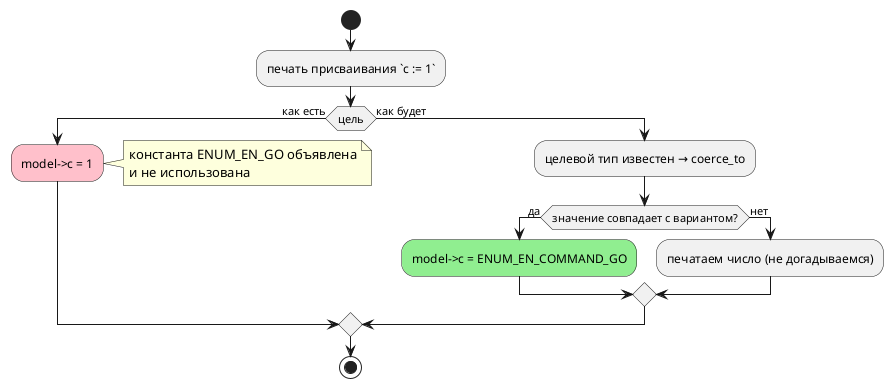

# ADR 0167: Цель `c` объявляет константы перечисления и не использует их

- **Status:** Accepted (Option C)
- **Date:** 2026-08-16
- **Authors:** Архитектор
- **Related issues:** [Фича 0167](../features/0167-c-enum-constants-usage.md); прямой образец — [ADR 0066](0066-st-bool-literals.md) (та же болезнь у цели `st`, приём `coerce_to`); смежно с [ADR 0195](0195-target-name-collisions.md) (имя перечислителя строит одна функция, столкновения имён в одном пространстве), [ADR 0193](0193-shared-const-qualified.md) (имя константы квалифицировано владельцем), [ADR 0060](0060-enum-width-shared-layer.md) (знак и ширина перечисления — общий слой)

## Context

Цель `c` **объявляет** константы перечисления и тут же их **не использует**:

```c
#define ENUM_EN_STOP 0
#define ENUM_EN_GO   1
#define ENUM_EN_HALT 2
…
model->c = 1;              /* а это, оказывается, Go */
```

Читатель порождённого C не узнает, что `1` — это `Go`, не заглянув в `.takt`.
Ровно то положение, из которого фича [0066](0066-st-bool-literals.md) вывела
цель `st`.

### Замер 1: три цели из четырёх вариант восстанавливают (проба 2026-08-16)

Вход: `enum Command { Stop = 0, Go = 1, Halt = 2 }`, тело `c := 1;`, условие
`c = 1`.

| Цель | Присваивание | Сравнение | Что говорит инструмент цели |
|---|---|---|---|
| `c` | `model->c = 1;` | `model->c == 1` | компилируется |
| `st` | `c := Command_Go;` | `IF c = 1` | `iec2c` принимает |
| `sv` | `en_c_next = COMMAND_GO;` | `== 1` | verilator принимает |
| `rust` | `self.c = Command::Go;` | `self.c == 1` | **`rustc` отвергает: E0308** |

⚠️ **Попутная находка, за пределами этой фичи.** Цель `rust` на сравнении
перечислимой переменной с числом порождает **невалидный** код (`expected
Command, found integer`). Гейт цели гоняет только корпус, а в корпусе такого
сравнения нет — тот же класс, что дефекты 0148-01/0148-02. Выносится кандидатом;
здесь важно, что **сравнение** у всех целей осталось голым числом, и это общий
пробел, а не особенность `c`.

### Замер 2: имя константы у цели `c` квалифицировано моделью, но не перечислением

```takt
enum Command { Stop = 0, Go = 1 }
enum Mode    { Stop = 5, Run = 6 }
```

```c
#define ENUM_TWO_ENUMS_STOP 0
#define ENUM_TWO_ENUMS_STOP 5   /* ← то же имя, другое значение */
```

Проба `cc -c -Wall -Werror` (**флаги гейта проекта**, фича 0171):

```
error: 'ENUM_TWO_ENUMS_STOP' macro redefined [-Werror,-Wmacro-redefined]
```

То есть вывод цели `c` на такой программе **не компилируется уже сегодня**, и
держится это лишь тем, что в корпусе одноимённых вариантов нет (в `elevator`
перечисления `Floor` и `Action` разошлись именами случайно).

Прочие цели квалифицируют **перечислением**: `Command_Stop` / `Mode_Stop` (`st`),
`COMMAND_STOP` / `MODE_STOP` (`sv`), `Command::Stop` / `Mode::Stop` (`rust`).
Модель в имя добавляет только `c` — и это правильно (одно пространство имён на
программу, класс [0193](0193-shared-const-qualified.md)); недостаёт **второго**
сегмента.

⚠️ **Отсюда прямое следствие для объёма фичи.** Начать использовать константы, не
починив имя, — значит внести **молчаливое расхождение значений**: `c := 0` дало
бы `ENUM_TWO_ENUMS_STOP`, который к моменту использования равен `5` (последнее
определение перекрывает первое). Читаемость улучшилась бы ценой неверного
автомата.

### Замер 3: что изменится в корпусе

`examples/generated/c/` содержит **15** констант в четырёх файлах
(`comprehensive`, `elevator`, `elevator_mini`, `extend_complex`). Смена формы
имени и подстановка констант изменят эти файлы — изменение **текста**, не
значений: макрос раскрывается в то же число.

⚠️ Эти четыре файла **не отслеживаются git** (`examples/generated/c/.gitignore`):
их перегенерирует гейт предкоммита при каждом прогоне. То есть диффа в коммите не
будет, и «обновить снапшот» здесь означает «прогнать гейт», а не «закоммитить
вывод». Отслеживаются рядом лежащие харнессы (`*_main.c`) и `batch_cycle.[ch]` —
перечислений в них нет.

### Поток «как есть» и «как будет»



## Decision Drivers

1. **Вывод не должен противоречить сам себе.** Цель объявляет имя и печатает
   число — тот же довод, которым закрывалась
   [0066](0066-st-bool-literals.md) для `st`.
2. **Использовать можно только то, что однозначно.** Имя, склеенное из модели и
   варианта, однозначным не является (замер 2), и его использование внесло бы
   ошибку значений.
3. **Не догадываться** (правило 4). Значение, не совпадающее ни с одним
   вариантом, печатается **числом**: перечислимой переменной можно присвоить
   произвольное число, и подмена «похожим» вариантом была бы тихой ложью.
   Правило дословно унаследовано от 0066.
4. **Поведение обязано остаться прежним.** Правка — о читаемости; значения до и
   после совпадают, и это проверяемый критерий, а не ожидание.
5. **Имя строит одна функция** (урок [0195](0195-target-name-collisions.md)):
   продюсер (`#define`) и потребитель (присваивание) обязаны звать один
   конструктор, иначе разъедутся — и вывод сошлётся на несуществующий макрос.

## Considered Options

### Option A. Оставить как есть

**Pros:**
- Ноль правок, вывод корпуса неизменен.

**Cons:**
- Вывод продолжает противоречить себе; дефект дубля `#define` (замер 2) остаётся
  и продолжает ждать первую программу с одноимёнными вариантами.

### Option B. Только подставить константы, имя не трогать

**Pros:**
- Минимальная правка, ровно по формулировке карточки.

**Cons:**
- **Вносит дефект значений.** На входе замера 2 присваивание `c := 0` напечатало
  бы `ENUM_TWO_ENUMS_STOP`, равный `5`. Читаемость за счёт верности —
  неприемлемый размен.

### Option C. Починить имя (сегмент перечисления) + использовать константы

Имя строит **одна** функция: `ENUM_<МОДЕЛЬ>_<ПЕРЕЧИСЛЕНИЕ>_<ВАРИАНТ>`. Её зовут
и продюсер `#define`, и печать присваивания, и печать сравнения с литералом.
Восстановление — через `coerce_to` по целевому типу (приём 0066).

**Pros:**
- Устраняет **обе** беды разом, причём вторая (дубль макроса) — предусловие
  первой.
- Приём и текст правила уже обкатаны на `st` (0066): «известен тип — печатай
  имя; не совпало — печатай число».
- Один конструктор имени — то, чего требует урок 0195.

**Cons:**
- Вывод корпуса меняется в четырёх файлах (замер 3); в git они не хранятся,
  поэтому проверка — зелёный гейт, а не дифф.
- Имена становятся длиннее (`ENUM_ELEVATOR_FLOOR_BOTTOM` вместо
  `ENUM_ELEVATOR_BOTTOM`); это плата за однозначность.

### Option D. Эмитить настоящий `enum` C вместо `#define`

**Pros:**
- Отладчик показывал бы имя; ближе к `rust`/`sv`.

**Cons:**
- Перечислители C — область видимости файла, и они столкнулись бы с
  перечислителями состояний и портов (`PORT_`, класс 0195) — то есть задача
  именования никуда не девается, а вывод меняется куда сильнее.
- Тип переменной берётся из `enum_facts` (`uint8_t`), а не из `enum`: два
  представления одного факта вместо одного.
- Объём несопоставим с предметом фичи.

## Decision

Принимается **Option C**.

- **Имя константы** — `ENUM_<МОДЕЛЬ>_<ПЕРЕЧИСЛЕНИЕ>_<ВАРИАНТ>` (все сегменты
  нормализуются тем же способом, что сегодня). Строит его **одна** функция в
  `generator/c/c_names.rs` — рядом с `port_enum_variant`, по тому же образцу.
- **Использование** — в присваивании (включая начальную инициализацию модели) и
  в **сравнении с литералом**: оба места — «тип перечислимого операнда
  известен», и правило у них одно. Реализуется одной функцией `coerce_to` по
  целевому типу.
- **Не догадываться:** значение, не совпадающее ни с одним вариантом, печатается
  числом.
- **Поведение неизменно:** значения до и после совпадают; доказывается
  потактовой сверкой, а не рассуждением.

**Вне объёма (границы названы, а не забыты):** невалидный код цели `rust` на
сравнении перечислимой переменной с числом (замер 1) — самостоятельный дефект
другой цели, выносится кандидатом. Форма `enum` C (Option D) не принимается.

## Consequences

### Положительные

- Порождённый C перестаёт противоречить себе: объявленное имя используется.
- Программа с одноимёнными вариантами двух перечислений начинает компилироваться
  (сегодня — `-Wmacro-redefined` под флагами гейта).
- Имя строит один конструктор — расхождение продюсера и потребителя становится
  невыразимым.

### Отрицательные / Action items

- **Вывод корпуса меняется** в четырёх файлах: и объявления (новая форма имени),
  и присваивания/сравнения. ⚠️ В git они не хранятся (замер 3), поэтому проверка
  здесь — не дифф, а **зелёный гейт**: компиляция корпуса под `-Wall -Werror` и
  детерминизм. Потактовые сверки обязаны остаться зелёными **без правок** — это и
  есть доказательство, что менялась читаемость, а не поведение.
- **Совместимость.** Имена макросов видны пользователю (он может ссылаться на
  них в своём коде вокруг порождённого). Смена формы — ломающее изменение
  **вывода**, не языка; версия языка не меняется, версия крейта — минорно.
- Документ (`book/`) правки не требует: язык и наблюдаемое поведение те же
  (карточка фичи, правило 24).

### Acceptance criteria

1. Константа объявляется как `ENUM_<МОДЕЛЬ>_<ПЕРЕЧИСЛЕНИЕ>_<ВАРИАНТ>`; два
   перечисления одной модели с одноимённым вариантом дают **разные** макросы, и
   вывод компилируется под `-Wall -Werror`.
2. Присваивание перечислимой переменной литералом печатается **именем
   константы**; то же — для начальной инициализации в `_init`.
3. Сравнение перечислимой переменной с литералом печатается именем константы.
4. Значение, не совпадающее ни с одним вариантом, печатается **числом**.
5. Имя строит одна функция; продюсер и потребитель зовут её же (сторож — тест,
   а не соглашение).
6. Потактовые сверки (`conformance_c_tests` и прочие) зелены **без изменений**:
   поведение не менялось.
7. Корпус перегенерирован гейтом и компилируется; гейт детерминизма зелён.
   (Файлы с перечислениями в git не хранятся — проверка не диффом, а гейтом.)
8. `./scripts/precheck.sh` зелёный.
