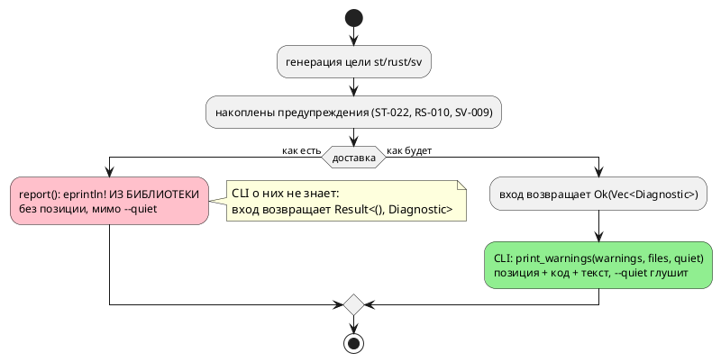

# ADR 0168: Предупреждения генераторов печатаются из библиотеки

- **Status:** Accepted (Option C)
- **Date:** 2026-08-16
- **Authors:** Архитектор
- **Related issues:** [Фича 0168](../features/0168-generator-warnings-return.md); дефект воспроизведён целью `sv` в [ADR 0064](0064-sv-divider-warning.md) (action A-6 — «чинить здесь нельзя, заведено кандидатом»); смежно с [ADR 0081](0081-lamc-print-warnings.md) (единая точка предупреждений компилятора), [фичей 0228](../features/0228-compile-warning-position.md) (позиция предупреждения теряется при печати), задачей 0028-01 (копия формата диагностики разошлась)

## Context

Библиотека `takt-lang` печатает часть диагностики **сама**, минуя вызывающего.
Три цели (`st`, `rust`, `sv`) заканчивают генерацию вызовом собственной функции
`report`, которая делает `eprintln!` и ничего не возвращает; их публичные входы
объявлены `Result<(), Diagnostic>` и предупреждений не отдают вовсе.

```rust
fn report(warnings: &[Diagnostic]) {
    for w in warnings {
        let code = w.code.as_deref().unwrap_or("SV");
        eprintln!("Предупреждение [{}]: {}", code, w.message);
    }
}
```

Функция скопирована в три модуля дословно (`generator/{st,rust,sv}/mod.rs`);
цель `sv` завела свою по образцу двух старших — **вместе с дефектом**, и ADR
0064 это прямо зафиксировал.

### Замер 1: `--quiet` не глушит (проба 2026-08-16)

| Цель | Вход | `--quiet` | Что напечатано |
|---|---|---|---|
| `st` | `invariant Safe = level < 3;` | да | `Предупреждение [ST-022]: охранная формула не транслируется…` |
| `st` | `extern fn sensor() -> u8;` | да | `Предупреждение [ST-009]: тело неизвестно… НИЧЕГО НЕ СДЕЛАЕТ` |
| `sv` | `c := a / b;` | да | `Предупреждение [SV-009]: деление по переменному делителю…` |

Тихий режим объявлен как «только ошибки компиляции» (`taktc --help`), и для
предупреждений **компилятора** он работает: их печатает CLI, где `quiet`
проверяется (`compile_cli::print_warnings`). Предупреждения **целей** идут мимо
этой точки, потому что печатаются из библиотеки, которая о флаге не знает.

### Замер 2: формат разошёлся, позиция теряется

| Канал | Строка |
|---|---|
| CLI (`print_warnings`) | `probe.takt:1:1: Предупреждение [SE-036]: переменная 'unused_var'…` |
| Библиотека (`report`) | `Предупреждение [ST-022]: охранная формула…` |

Библиотечная копия печатает **только код и текст**, то есть выбрасывает
координату, даже когда та есть. Это класс фичи
[0228](../features/0228-compile-warning-position.md): позиция в `loc` есть, а до
пользователя не доезжает.

⚠️ **Насколько содержательна координата у целевых предупреждений — измерено, и
ответ скромный.** У `ST-009`, `ST-010`, `RS-010`, `SV-009` позиция —
`Location::Codegen`, то есть её нет **по существу**. У `ST-022` она берётся из
`site.loc` реестра мест объявления формулы (фича
[0203](../features/0203-validate-formulas-traversal.md)), но `site.loc` — это
позиция **вместилища** (модели либо состояния), а не самой формулы: проба с
двумя `invariant` в одном файле даёт `1:1` обеим. Собственной позиции у
`Formula` в дереве нет.

Отсюда граница решения: фича **доставляет то, что есть**, и не выдумывает
координат. Появление позиции у каждой из этих диагностик — отдельная работа
(кандидат).

### Замер 3: на одной цели уживаются два канала с разным поведением

`compile_to_sv_mmio` **возвращает** `Vec<Diagnostic>` — но только адресные
предупреждения; `SV-009` внутри той же компиляции печатается `report`-ом. Проба
с `--quiet`: адресные молчат (их глушит CLI), `SV-009` печатается. Один вызов,
две судьбы.

### Замер 4: инвентаризация входов

| Вход | Сигнатура | Предупреждения цели |
|---|---|---|
| `compile_to_c` | `Result<(), Diagnostic>` | нет (у цели `c` канала не заведено) |
| `compile_to_plantuml` | `Result<(), Diagnostic>` | нет |
| `compile_to_st` | `Result<(), Diagnostic>` | **печатает** `ST-009`/`ST-010`/`ST-022` |
| `compile_to_rust` | `Result<(), Diagnostic>` | **печатает** `RS-010` |
| `compile_to_sv` | `Result<(), Diagnostic>` | **печатает** `SV-009` |
| `compile_to_c_hal` | `Result<Vec<Diagnostic>, Diagnostic>` | возвращает (адресные) |
| `compile_to_st_at` | `Result<Vec<Diagnostic>, Diagnostic>` | возвращает (адресные) |
| `compile_to_sv_mmio` | `Result<Vec<Diagnostic>, Diagnostic>` | возвращает адресные, **печатает** `SV-009` |

То есть правильный контракт в проекте **уже есть** и работает — просто не у всех.

### Замер 5: сколько кода зависит от сигнатуры

`compile_to_{st,rust,sv}` зовут 33 файла тестов (`takt-lang/tests`,
`takt-sim/tests`) и `compile_cli`. Большинство вызовов — `.expect(…)` / `if let
Err(…)`, и они переживают смену типа `Ok` без правки. Ломается тот код, где тип
функции **назван**: `type Compile = fn(…) -> Result<(), Diagnostic>` в
`type_inference_chain_tests.rs`, где четыре цели (`c`, `rust`, `st`, `sv`) лежат
в одном массиве. Это прямой довод против «починим только три из пяти»: массив
целей перестанет быть гомогенным.

### Поток «как есть» и «как будет»



## Decision Drivers

1. **Библиотека не разговаривает с пользователем.** Диагностику **возвращают**
   вызывающему, а не печатают из крейта — правило, которое проект уже
   сформулировал (`docs/RULE.md`, правило 29: «диагностику возвращают
   вызывающему, а не печатают из библиотеки») и соблюдает у трёх входов из
   восьми.
2. **Флаг обязан значить то, что обещает.** `--quiet` документирован как «только
   ошибки» и в этой части не работает (замер 1).
3. **Один формат на одну диагностику.** Две копии печати уже разошлись —
   позиция теряется (замер 2). Прецедент задачи 0028-01: копия формата в `taktc`
   печатала сообщение без кода.
4. **Гомогенность контракта целей** (замер 5): цели живут в массивах и таблицах;
   «две из пяти иначе» ломает и код, и рассуждение о нём.
5. **Тест не должен перехватывать stderr.** Сегодня факт предупреждения
   проверяется либо перехватом потока, либо инспекцией внутреннего приёмника
   `Fsm::warnings` — обе привязки хрупкие.

## Considered Options

### Option A. Оставить как есть

**Pros:**
- Ноль правок; публичный API не меняется.

**Cons:**
- `--quiet` продолжает обманывать; позиция `ST-022` продолжает теряться.
- Следующая цель скопирует `report` в четвёртый раз — прецедент уже был (`sv`
  по образцу `st`/`rust`, ADR 0064).

### Option B. Вернуть предупреждения только у трёх «виноватых» целей

`compile_to_{st,rust,sv}` → `Result<Vec<Diagnostic>, Diagnostic>`; `c` и
`plantuml` не трогать.

**Pros:**
- Минимальная правка; чинит ровно наблюдаемый дефект.

**Cons:**
- **Контракт целей остаётся разнородным**: `c`/`plantuml` — `()`, прочие — `Vec`.
  Массив `[(&str, Compile); 4]` (замер 5) перестаёт компилироваться, и его
  придётся разбирать вручную либо оборачивать.
- Вопрос «почему у `c` иначе» остаётся без ответа: у цели `c` предупреждений
  сегодня нет, но это свойство момента, а не решение.

### Option C. Единый контракт: все простые цели возвращают `Vec<Diagnostic>`

`compile_to_c`, `compile_to_st`, `compile_to_rust`, `compile_to_sv`,
`compile_to_plantuml` → `Result<Vec<Diagnostic>, Diagnostic>` (адрес-потребляющие
входы уже таковы). Печать — **только** в CLI, существующей точкой
`print_warnings`. Функция `report` удаляется из трёх модулей.

**Pros:**
- Контракт один на все восемь входов: «цель возвращает то, что хочет сказать».
- `--quiet` начинает работать; формат и позиция берутся из общей точки печати
  (`ST-022` обретает координату).
- `report` исчезает как класс — скопировать её в новую цель станет неоткуда.
- Массивы целей остаются гомогенными (замер 5).
- Пустой `Vec` у `c`/`plantuml` — не «мусор», а готовый канал: первое же
  предупреждение цели `c` поедет по нему без смены сигнатуры.

**Cons:**
- Публичный API меняется у пяти входов → **минорный подъём** версии крейта
  `takt-lang` (0.x: ломающее изменение — минор).
- Правка задевает 33 файла тестов; большинство переживёт её без изменений, но
  проверить обязан прогон, а не рассуждение.

### Option D. Приёмник-параметр: `&mut Vec<Diagnostic>` в сигнатуре

**Pros:**
- Не меняет тип возврата; внутри генераторов такой приём уже используется.

**Cons:**
- Меняет сигнатуру **сильнее**, чем Option C (новый аргумент у всех вызовов), и
  расходится с уже существующим контрактом `c-hal`/`st-at`/`sv-mmio` — то есть
  вводит **третью** форму доставки вместо устранения второй.

### Option E. Глобальный логгер (`log`-фасад) внутри библиотеки

**Pros:**
- Не трогает сигнатуры вовсе.

**Cons:**
- Диагностика перестаёт быть **значением** и становится побочным эффектом: её
  нельзя сосчитать в тесте, положить в отчёт, отдать редактору.
- Вводит зависимость и глобальное состояние ради того, что решается типом.

## Decision

Принимается **Option C**.

- Пять простых входов получают контракт `Result<Vec<Diagnostic>, Diagnostic>` —
  тот же, что у трёх адрес-потребляющих. Итого **восемь входов, один контракт**.
- Функция `report` удаляется из `generator/{st,rust,sv}/mod.rs`; накопленные
  предупреждения поднимаются наружу вместе с успехом.
- Печатает **CLI**, существующей точкой `compile_cli::print_warnings`: она уже
  умеет `quiet`, реестр файлов и общий формат (позиция + код + текст).
- `compile_to_sv_mmio` присоединяет предупреждения генератора к адресным —
  смешанной доставки не остаётся.
- Версия крейта `takt-lang` поднимается минорно (`0.30.0` → `0.31.0`).

**Вне объёма (границы названы, а не забыты):** содержательность координаты.
`ST-009`/`ST-010`/`RS-010`/`SV-009` несут `Location::Codegen` (позиции нет), а
`ST-022` — позицию **вместилища**, из-за чего два инварианта одной модели
неразличимы (замер 2). Фича доставляет то, что есть; появление настоящей
позиции — отдельная работа, кандидат. Предупреждения **компилятора** (`SE-…`) фича не трогает: их канал
закрыт фичами 0081/0232.

## Consequences

### Положительные

- `--quiet` начинает значить то, что обещает `--help`.
- Предупреждения целей печатаются общим форматом, той же точкой, что и
  предупреждения компилятора.
- Библиотека перестаёт писать в stderr — LSP, `takt-sim` и любой будущий
  потребитель получают диагностику значением.
- Тест на предупреждение цели становится обычной проверкой возвращённого
  списка: ни перехвата потока, ни инспекции внутреннего приёмника.

### Отрицательные / Action items

- **Совместимость публичного API нарушается осознанно** (правило 11): пять
  функций меняют тип `Ok`. Обоснование — устранение второго канала доставки,
  который иначе продолжит копироваться в новые цели (прецедент 0064). Внешних
  потребителей крейта, кроме собственных бинарников и тестов, у проекта нет.
- **Версия крейта** `takt-lang`: `0.30.0` → `0.31.0`. Версия **языка** не
  меняется — язык здесь ни при чём.
- **Документ:** раздел `book/src/16-diagnostics/` описывает, что печатает
  инструмент; поведение `--quiet` в части предупреждений целей меняется, и
  раздел обязан это отражать (правило 24).
- Реестр `docs/diagnostics/README.md` в части `ST-…`/`RS-…`/`SV-…` остаётся
  верным — коды и тексты не меняются, меняется доставка.

### Acceptance criteria

1. `compile_to_c`, `compile_to_st`, `compile_to_rust`, `compile_to_sv`,
   `compile_to_plantuml` возвращают `Result<Vec<Diagnostic>, Diagnostic>`.
2. `report` отсутствует в `generator/` (греп по `eprintln!` вне тестов — пусто).
3. `taktc compile --quiet` **не печатает** `ST-022`, `ST-009`, `SV-009`; без
   флага печатает их **в общем формате** (позиция при наличии, код, текст).
4. Ни одно предупреждение не потеряно: каждое, что печаталось раньше, приходит
   вызывающему теперь (`ST-009`, `ST-010`, `ST-022`, `RS-010`, `SV-009`).
5. `compile_to_sv_mmio` возвращает предупреждения генератора вместе с адресными.
6. Вывод корпуса `examples/generated/` **байт-в-байт** неизменен.
7. Версия крейта `takt-lang` — `0.31.0`; раздел документа о диагностике
   актуализирован.
8. `./scripts/precheck.sh` зелёный.
