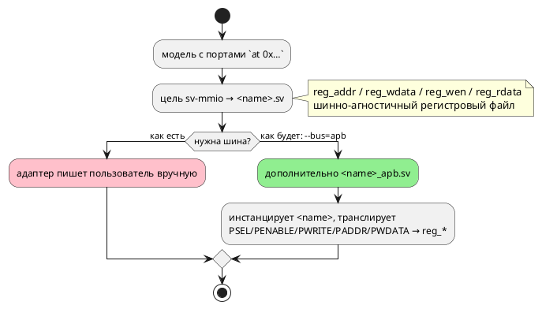

# ADR 0169: Адаптер шины APB для цели `sv-mmio`

- **Status:** Accepted (Option C)
- **Date:** 2026-08-16
- **Authors:** Архитектор
- **Related issues:** [Фича 0169](../features/0169-sv-mmio-bus-adapters.md); ядро — [ADR 0062](0062-sv-mmio-target.md) (шинно-агностичный регистровый файл, action A-2 которого и завёл эту фичу); [ADR 0045](0045-sv-backend.md) (два инструмента SV ловят непересекающиеся классы; тестбенч — принадлежность проверки, а не продукта)

## Context

Ядро цели `sv-mmio` порождает **шинно-агностичный** регистровый файл — именно
затем, чтобы не выбирать протокол без требования (ADR 0045: «выбор произволен, а
цена ошибки высока»). Интерфейс ядра:

```systemverilog
input  logic [10:0] reg_addr,   // адрес
input  logic [7:0]  reg_wdata,  // данные записи
input  logic        reg_wen,    // строб записи
output logic [7:0]  reg_rdata   // данные чтения (комбинационные)
```

Протокол диктует платформа. **Решение заказчика 2026-08-16: первый адаптер —
APB** (экосистема ARM/AMBA), адресация — **напрямую** (адрес шины равен адресу
из `at`). Прочие протоколы (AXI-Lite, Wishbone) остаются подзадачами зонта и
берутся только по отдельному требованию.

### Замер 1: устройство ядра (чтение кода + вывод корпуса)

- Ширины считаются по модели: `addr_width` — по максимальному адресу,
  `data_width` — по максимуму `bit + width` портов. У `stacker` это 11 и 8.
- **Запись регистров не гейтится `en`**: она стоит в `else if (reg_wen)`
  отдельной ветвью `always_ff`. Значит адаптеру про clock enable знать нечего —
  шина работает независимо от того, тикает ли автомат.
- Чтение (`reg_rdata`) — чисто комбинационное по `reg_addr`.

### Замер 2: канонические 32-битные шины валят гейт (проба 2026-08-16)

Обёртка с `input logic [31:0] paddr` и `[31:0] pwdata` при `data_width = 8`:

```
%Warning-UNUSEDSIGNAL: Bits of signal are not used: 'paddr'[31:11]
%Warning-UNUSEDSIGNAL: Bits of signal are not used: 'pwdata'[31:8]
%Error: Exiting due to 2 warning(s)
```

Гейт проекта гоняет `verilator --lint-only -Wall`, то есть **отвергает** такую
обёртку. Та же проба с точными ширинами (`paddr[10:0]`, `pwdata[7:0]`,
`prdata[7:0]`) принята **обоими** инструментами: verilator без замечаний, yosys
синтезировал.

⚠️ Сужение не противоречит AMBA: спецификация APB объявляет ширину `PADDR`
implementation-specific, а `PWDATA`/`PRDATA` допускает 8, 16 и 32 бита.
Порождаемый адаптер знает конкретную модель, поэтому вправе быть точным.

### Замер 3: функциональная проба (verilator `--binary`)

Рукописный тестбенч с классическим циклом APB (setup: `psel & !penable`;
access: `psel & penable`) на `stacker_apb`:

| Действие | Результат |
|---|---|
| запись `0x300 ← 0x01`, чтение `0x300` | `0x01` — записанное вернулось |
| запись `0x102 ← 0x07`, чтение `0x102` | `0x07` |
| чтение выходного `0x600` (регистр автомата) | `0x00`, `pready=1`, `pslverr=0` |

То есть форма адаптера работает, а не только компилируется — ровно то
разграничение, которое ADR 0045 требует держать (линт и синтез верности не
доказывают).

### Замер 4: где живут тестбенчи

`examples/generated/sv/tb/<name>_tb.sv` — **рукописные** (решение 0045-07:
тестбенч принадлежит проверке, а не продукту), прогоняются гейтом через
`verilator --binary --timing`, провал `assert`/`$fatal` валит предкоммит.

### Поток «как есть» и «как будет»



## Decision Drivers

1. **Ядро не должно меняться.** На нём стоят потактовые сверки регистров
   (`conformance_sv_mmio_tests`) и гейт двух инструментов; адаптер обязан быть
   надстройкой, а не переделкой интерфейса.
2. **Протокол берётся по требованию.** Карточка фичи запрещает делать
   «на всякий случай»; выбран APB (решение заказчика).
3. **Гейт проекта — часть контракта** (замер 2): всё, что не проходит
   `-Wall`, для этого проекта невалидно, каким бы каноническим оно ни было.
4. **Верность доказывается прогоном, а не линтом** (ADR 0045, замер 3).
5. **Карта регистров совпадает с исходником** (решение заказчика): адрес,
   написанный в `at 0x300`, софт видит по `0x300`.

## Considered Options

### Option A. Оставить как есть — адаптер пишет пользователь

**Pros:**
- Ноль правок; ядро уже даёт всё необходимое.

**Cons:**
- Требование заказчика не выполнено; каждый пользователь пишет одно и то же
  заново, и ошибка в цикле APB обнаруживается на плате.

### Option B. Заменить интерфейс ядра шинным (флаг меняет порты `<name>.sv`)

**Pros:**
- Один файл на выходе, без обёртки.

**Cons:**
- **Ядро перестаёт быть агностичным**: `reg_*` исчезает, и на нём стоят сверки
  регистров — их пришлось бы переписывать под каждый протокол.
- Второй протокол потребовал бы третьей формы того же модуля.

### Option C. Отдельный файл-обёртка `<name>_apb.sv`, включаемый флагом

`sv-mmio` порождает ядро как прежде; при `--bus=apb` рядом появляется обёртка,
инстанцирующая ядро и транслирующая APB в `reg_*`.

**Pros:**
- Ядро и его проверки не тронуты; обёртка проверяется отдельно (линт, синтез,
  собственный тестбенч).
- Следующий протокол — ещё один файл, а не ещё одна форма ядра.
- Обёртка тонкая (десятки строк) и целиком выводится из уже посчитанных ширин.

**Cons:**
- Два файла вместо одного; в проект нужно добавить оба.
- Появляется флаг CLI — то есть комбинация, которую обязан покрывать гейт.

### Option D. Поставлять адаптер как готовый файл-шаблон в репозитории

**Pros:**
- Не трогает компилятор вовсе.

**Cons:**
- Ширины (`addr_width`, `data_width`) зависят от модели — шаблон пришлось бы
  параметризовать и требовать от пользователя правильных значений; ошибка тихая.

## Decision

Принимается **Option C**.

- **Флаг** `--bus=apb` у цели `sv-mmio`. Умолчание — **без адаптера**
  (поведение прежнее, байт-в-байт). Слитная форма со значением, как у
  `--parameters=` (флаг без значения — ошибка, а не умолчание).
- **Файл** `<name>_apb.sv`, модуль `<name>_apb`, инстанцирует `<name>`.
- **Сигналы** (APB3, slave): `pclk`, `presetn`, `paddr`, `psel`, `penable`,
  `pwrite`, `pwdata`, `prdata`, `pready`, `pslverr`; наружу проброшены `en` и
  `is_done` ядра.
- **Ширины точные** (замер 2): `paddr` — `addr_width` ядра, `pwdata`/`prdata` —
  `data_width`. Канон APB это допускает, а гейт иного не принимает.
- **Адресация напрямую** (решение заказчика): `reg_addr = paddr`. Декодирование
  старших разрядов — обязанность внешнего декодера, который и формирует `psel`;
  адаптер их не видит.
- **`pready = 1`, `pslverr = 0`**: состояний ожидания нет, регистровый файл
  отвечает за такт. ⚠️ Это и делает `reg_wen = psel & penable & pwrite`
  корректным: access-фаза длится ровно один такт, значит запись происходит
  **однажды**. Появятся wait states — правило придётся менять вместе с ними.
- **Модель без адресованных портов** + `--bus=apb` → **отказ `SV-019`**:
  шина без регистров бессмысленна, а молчание оставило бы пользователя с
  ожиданием файла, которого нет.

**Вне объёма (границы названы, а не забыты):** AXI-Lite и Wishbone — отдельные
подзадачи зонта, берутся по требованию. `PSTRB`/`PPROT` (APB4) не эмитируются:
данные однословные, а защита к регистровому файлу отношения не имеет.

## Consequences

### Положительные

- Модель с портами `at 0x…` подключается к ARM-подсистеме без ручного кода.
- Ядро осталось агностичным: второй протокол не потребует его трогать.
- Адаптер проверяется тем же трёхслойным гейтом, что и ядро: линт, синтез и
  **прогон** тестбенча.

### Отрицательные / Action items

- **Новый флаг** → новая комбинация в гейте: корпус обязан собираться и с
  `--bus=apb`, и без него.
- **Вывод корпуса без флага не меняется** — проверяемый критерий (умолчание).
- **Документ** (правило 24): появляется наблюдаемый интерфейс цели — раздел
  `book/src/14-targets/` дополняется описанием флага и порождаемого файла.
- Тестбенч `tb/stacker_apb_tb.sv` пишется руками (решение 0045-07) и включается
  в гейт.

### Acceptance criteria

1. `taktc compile -t sv-mmio --bus=apb` порождает `<name>_apb.sv` рядом с
   `<name>.sv`; без флага — только `<name>.sv` (вывод байт-в-байт прежний).
2. Обёртка принимается **обоими** инструментами: `verilator --lint-only -Wall` и
   `yosys synth`.
3. Рукописный тестбенч через APB пишет регистр и читает записанное; выходной
   регистр автомата читается. Провал → ненулевой код выхода.
4. `--bus` без значения и с неизвестным значением — ошибка CLI с внятным
   текстом.
5. Модель без адресованных портов + `--bus=apb` → `SV-019`.
6. Ядро не изменилось: `conformance_sv_mmio_tests` зелены без правок.
7. Раздел `book/src/14-targets/` описывает флаг и порождаемый файл.
8. `./scripts/precheck.sh` зелёный.
