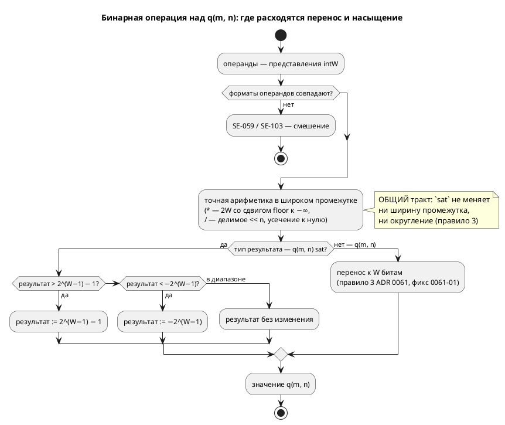

# ADR 0170: Насыщение (saturation) для fixed-point `q(m, n)`

- **Status:** Accepted
- **Date:** 2026-08-14
- **Authors:** Архитектор + Заказчик (форма записи и порядок работ — решения 2026-08-14)
- **Related issues:** [Фича 0170](../features/0170-fixed-point-saturation.md); смежные — [ADR 0061](0061-fixed-point-type.md) (тип `q(m, n)`, правило 3 — wraparound), фикс [0061-01](../fixes/0061-01-q-wrap-storage-width.md) (перенос к `W`), [ADR 0127](0127-int-overflow-semantics.md) (семантика переполнения целых), [фича 0096](../features/0096-fixed-point-native-float.md) (прозрачный `float` через `--float-as-q`)

## Context

Ядро 0061 зафиксировало правилом 3: `+`/`−` над `q(m, n)` дают **перенос**
(wraparound), как у целых типов языка. Правило записано **явно**, чтобы автор не
принял умолчание за обещание, а насыщение оставлено кандидатом — с прямой
пометкой «для регуляторов оно обычно нужнее переноса» (A-5 ADR 0061).

Регулятор — типовой потребитель fixed-point, и в корпусе он уже есть. Замер по
`examples/pid_regulator.takt`: anti-windup написан **вручную**, четырьмя строками
условий, а комментарий примера прямо фиксирует нехватку:

> «…в q(m, n)-представлении арифметика — ПЕРЕНОС, не насыщение; без ограничения
> интеграл `i_acc` переполнил бы q и «перевернулся» (+127 → −128) — регулятор
> стал бы неустойчивым. Поэтому `i_acc` ограничен `[−Imax, Imax]` условиями
> (насыщающего оператора в языке нет — кандидат на будущее)».

⚠️ **Ручное ограничение не эквивалентно насыщению операции.** Оно ограничивает
**результат уже вычисленного** выражения, а перенос случается **внутри**
операции: `i_acc + err` переполняется до того, как значение дойдёт до `if`.
На узких форматах (типичных для МК и FPGA) это наблюдаемо: `q(4, 4)` с
`i_acc = 7.9` и `err = 1.0` даёт не 7.9, а −7.1. Тот же довод закрывает и
встроенную `clamp(x, lo, hi)`, которая в языке уже есть: `clamp(acc + step, …)`
получает **обёрнутое** значение.

### Что показала проба

Проба стадии архитектуры (обход всех потребителей `TypeNode::Fixed` и `Value::Fixed`).

| № | Что проверялось | Результат |
|---|---|---|
| P1 | Мест, знающих о `TypeNode::Fixed` | **57** в 20 файлах (5 реализаций арифметики + типы целей + семантика + симулятор) |
| P2 | Имя `sat` в корпусе, книге, фикстурах | **0 вхождений** — форма `q(m, n) sat` не отбирает занятого имени |
| P3 | Прецедент «слово-не-ключевое» | Есть: конструктор `q` — **обычный `identifier`**, имя проверяет семантика (`SE-057`), иначе `q` перестало бы годиться как имя переменной |
| P4 | Ручное насыщение в корпусе | `examples/pid_regulator.takt` (4 строки условий), `examples/pid_law.takt` (anti-windup в законе), `examples/comprehensive.takt` (`fn clamp_temp`) |
| P5 | Смежность с `--float-as-q` (0096) | Флаг понижает **все** `float` в один формат `q(m, n)`; признак насыщения у понижённых значений взять неоткуда |
| P6 | Смежность с 0127 | У целых нормировано: беззнаковое — обёртка, знаковое — **ошибка** (`SIM-003`). У `q` (знакового по построению) — обёртка. Расхождение осознанное: `q` есть представление дроби, а не целое |
| P7 | Постфиксный `identifier?` в правиле `Type` — даёт ли LR(1)-конфликт | **Не даёт.** Сборка с `")" <sat:identifier?>` прошла LALRPOP; единственная ошибка — арность варианта АСД (её сообщил `rustc`, а не генератор парсера). Причина: после типа в языке всегда стоит разделитель (`;`, `:=`, `,`, `)`, `]`), поэтому идентификатор за `)` однозначен |

**P1 — главный расход фичи.** Признак насыщения обязан быть виден **всем пяти**
реализациям арифметики, иначе они разойдутся молча — ровно тот класс, который
только что стоил фикса 0061-01 (там расхождение прожило от 0061 до 0170).

## Decision Drivers

1. **Явность вместо смены умолчания.** Изменить поведение существующего
   `q(m, n)` нельзя: программы, написанные под перенос (включая корпусный
   регулятор с ручным anti-windup), молча поменяли бы смысл.
2. **Единство пяти реализаций — обязательное, а не желаемое.** Урок 0061-01:
   расхождение целей по переполнению не ловится ни одним гейтом языка, только
   сверкой значений.
3. **Ошибка компилятора вместо ревью.** Признак, который потребитель может
   «не заметить», обязан ломать сборку у того, кто его не разобрал.
4. **Стоимость записи для автора.** Регулятор пишут инженеры АСУ ТП; форма
   должна читаться в объявлении, а не растворяться в каждом выражении.
5. **Совместимость с уже принятыми решениями:** неявное смешение форматов `q`
   запрещено (`SE-059`, правило 6 ADR 0061) — новый признак обязан встать в тот
   же ряд, а не завести второе правило смешения.

## Considered Options

Форму записи заказчик выбрал **до** ADR — **свойство типа `q(m, n) sat`**
(альтернативы: насыщающие операторы `+|`, встроенные `sat_add`). Здесь
рассматривается **носитель признака** внутри компилятора.

### Option A. Поле в существующем варианте: `TypeNode::Fixed { m, n, sat }`

**Pros:**
- Компилятор **перечисляет** места, требующие решения: структурный паттерн
  `TypeNode::Fixed { m, n }` без `..` перестаёт собираться, и каждый из 57
  потребителей приходится осмотреть (драйвер 3).
- Формат и его семантика переполнения путешествуют **вместе** — как уже
  путешествуют `m`/`n`; невозможно передать формат, «забыв» признак.
- `Value::Fixed` симулятора правится тем же приёмом — эталон и типы остаются
  зеркальными.

**Cons:**
- Правка 57 мест, из них большинство — механические (`{ m, n, .. }`).
- Часть мест **обязана** остаться безразличной к признаку (печать типа хранения,
  ширина в `sv`) — и это придётся показать явно.

### Option B. Отдельный вариант `TypeNode::FixedSat { m, n }`

**Pros:**
- Нулевая правка существующих веток `Fixed`.

**Cons:**
- Потребитель, не знающий нового варианта, **молча** перестаёт видеть тип:
  `match … { Fixed { .. } => …, _ => отказ }` даст «тип не выводится» вместо
  насыщения. Это ровно молчаливая потеря, которой проект избегает.
- Дублирует все правила формата (границы `m`/`n`, ширина хранения, смешение) на
  два варианта — источник расхождения внутри одного компилятора.

### Option C. Признак вне типа (флаг переменной, таблица моделей)

**Pros:**
- Тип не меняется вовсе.

**Cons:**
- Арифметика получает операнды **выражениями**, а не переменными: у
  `(a + b) * c` промежуточный результат не привязан ни к какой переменной, и
  признак взять неоткуда. То есть вариант не выражает предмет фичи.

## Decision

Принимается **Option A**: признак — **поле `sat: bool`** в `TypeNode::Fixed`
(и симметрично в `Value::Fixed` симулятора).

Нормативные правила фичи (обязаны совпасть у симулятора и **всех** целей —
побитово, как правила ADR 0061):

1. **Форма.** `q(m, n) sat` — тип с насыщением; `q(m, n)` — прежний, с переносом.
   Умолчание **не меняется**.
2. **Насыщение — свойство типа результата.** Всякая операция, дающая
   представление `q(m, n) sat` — `+`, `−`, `*`, `/`, унарный минус, приведения
   `int → q`, `float → q`, `q → q` — вместо переноса **прижимает** значение к
   границам представления: `[−2^(W−1), 2^(W−1) − 1]`, `W = m + n`.
3. **Промежуток вычисляется точно, насыщается только результат.** У `*` это
   по-прежнему произведение шириной `2W` со сдвигом `floor` к −∞ (правило 4 ADR
   0061), и лишь итог прижимается к границам. Иначе `sat` менял бы ещё и
   округление.
4. **Смешение `sat` и не-`sat` — ошибка `SE-103`**, как и смешение разных
   `q(m, n)` (`SE-059`, правило 6 ADR 0061). Приведение между ними — **явное**:
   `x as q(8, 8) sat`.
5. **Деление на ноль остаётся ошибкой**, а не насыщением к границе: это не
   переполнение, а неопределённая операция (поведение 0061 сохраняется).
6. **Флаг `--float-as-q=m.n` (0096) даёт формат БЕЗ насыщения.** Признак — часть
   типа, который автор пишет сам; CLI логику автомата не меняет (принцип 0042).
   Насыщающий регулятор пишется на явном `q(m, n) sat`.

⚠️ **Правило 18 — диаграмма.** ADR меняет семантику языка, поэтому ниже —
диаграмма активности вычисления бинарной операции: она показывает **точку**, где
расходятся перенос и насыщение, и что до неё тракт общий.

⚠️ **Обратная совместимость (правило 11).** Полная: умолчание не меняется, новая
форма — надстройка. Программы корпуса, включая регулятор с ручным anti-windup,
дают побитово тот же вывод. Версия языка растёт (новая форма типа) — правило 22.

## Consequences

### Положительные

- Регулятор перестаёт нуждаться в ручном anti-windup **на уровне арифметики**:
  перенос больше не может «перевернуть» интеграл внутри операции.
- Признак путешествует вместе с форматом, поэтому пять реализаций получают его
  из одного места; забыть его на границе нельзя.
- Кандидат блока 2 `FEATURES.md` о нехватке насыщения снимается.

### Отрицательные / Action items

- **A1.** Правка 57 мест `TypeNode::Fixed` (большинство — механическое `..`), из
  них **пять** — содержательные: эталон `eval/fixed.rs` и четыре цели.
- **A2.** ⚠️ **Ручной anti-windup примера остаётся содержательным** и после
  фичи: насыщение защищает от переполнения представления, но не заменяет
  ограничение интеграла по **инженерному** пределу (`Imax` ≪ границы формата).
  Переписывать `pid_regulator.takt` на `sat` без сохранения смысла нельзя.
- **A3.** **`sat` — обычный идентификатор, не ключевое слово** (прецедент P3:
  так же живёт конструктор `q`). Проба P7 показала, что постфиксный
  `identifier?` в правиле `Type` конфликта LR(1) **не даёт**, а имя `sat` в
  корпусе свободно (P2). Слово, отличное от `sat`, отвергает **семантика**
  называющей диагностикой — как `SE-057` отвергает конструктор, отличный от `q`.
  ⚠️ Следствие: редакторский слой (правило 29) правится **минимально** — нового
  токена нет, но подсветка типа и автодополнение о форме знать должны.
- **A4.** ⚠️ **Цель `st`: насыщение к `W`, не к типу хранения.** Тот же капкан,
  что в 0061-01: `LINT_TO_INT` сузит к 16 битам раньше, чем сработает прижатие.
  Насыщение обязано считаться в `LINT` **до** сужения.
- **A5.** ⚠️ **Цель `sv`: насыщение стоит сумматора с проверкой переполнения.**
  Ширина `logic signed [W-1:0]` не даёт места промежутку — потребуется расширение
  на бит и сравнение; синтезируемость проверяется гейтом (verilator + yosys).
- **A6.** Документирование обязательно (правило 24): раздел
  [`book/src/03-types/`](../../book/src/03-types/index.md) и раздел о выражениях.

### Acceptance criteria

1. **A1.** `var x: q(8, 8) sat := 1.5;` разбирается; `q(8, 8)` продолжает
   означать перенос.
2. **A2.** Смешение `q(8,8)` и `q(8,8) sat` в одной операции → **`SE-103`** с
   называющим текстом; явное `as q(8, 8) sat` законно.
3. **A3.** Насыщение на **верхней и нижней** границах: `+`, `−`, `*`, унарный
   минус, приведение `int → q`. ⚠️ Обязательно проверить **отрицательную**
   границу: на положительных прижатие и перенос дают разные значения, но
   ошибиться знаком легко.
4. **A4.** Побитовая потактовая сверка: симулятор = `c` = `rust` = `st` = `sv`
   на каждом такте, включая формат с `W ≠ ширины хранения` (наследие 0061-01).
5. **A5.** Вывод для программ **без** `sat` не меняется байт-в-байт (корпус,
   снапшоты `examples/generated`).
6. **A6.** Версия языка поднята; `./scripts/precheck.sh` зелёный; разделы книги
   описывают обе семантики и говорят, какая по умолчанию.
