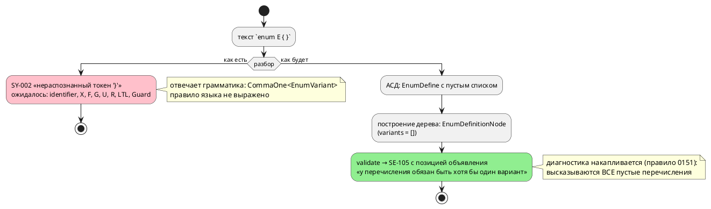

# ADR 0172: Семантика перечисления без вариантов

- **Status:** Accepted (Option B)
- **Date:** 2026-08-16
- **Authors:** Архитектор
- **Related issues:** [Фича 0172](../features/0172-empty-enum-semantics.md); прямое следствие [ADR 0060](0060-enum-width-shared-layer.md) (правило 3 — «пустое перечисление: трактовку выбирает цель, вопрос семантики языка вынесен кандидатом»); смежно с [ADR 0078](0078-bit-array-semantics.md) (тот же класс: язык не определил случай, ответ дала реализация), [ADR 0189](0189-anonymous-ports.md) и [ADR 0236](0236-c-unresolved-condition-refusal.md) (диагностику о программе автора даёт язык, а не чужой инструмент)

## Context

Язык допускает объявление `enum`. Чем должна быть запись **без вариантов** —
ошибкой языка или законным типом с пустым доменом, — язык не говорит **нигде**:
ни документ `book/`, ни диагностики, ни ADR. Сегодняшний ответ даёт грамматика,
и он случаен.

### Замер 1: что отвечает инструмент сегодня (проба 2026-08-16)

```takt
enum E { }
```

```
model.takt:1:10: Ошибка компиляции [SY-002]: нераспознанный токен '}',
  ожидалось identifier, "X", "F", "G", "U", "R", "LTL", "Guard"
```

Отвечает **парсер**: правило `EnumDefine` требует `CommaOne<EnumVariant>` —
«один или более». Три следствия:

- **Текст обманчив.** Автору сообщают не правило языка («у перечисления обязан
  быть хотя бы один вариант»), а внутренность LR-разбора; перечисленные
  ожидания включают контекстные слова LTL (`X`, `F`, `G`, `U`, `R`, `LTL`,
  `Guard`), которые к перечислению отношения не имеют вовсе.
- **Правила языка нет.** Отказ — свойство квантификатора в грамматике; смени его
  на `Comma<…>`, и запись станет законной **молча**, без единого решения.
- **Позиция указывает на `}`**, а не на объявление: искать нечего, потому что
  «ошибка» — в отсутствии текста.

Прочие входы того же класса (проба): `enum E { 42 }` → `SY-002`; `enum { A }` →
`SY-002`. Ветвь восстановления `enum <имя> { ! }` в грамматике **существует** и
строит `EnumDefine` с пустым списком вариантов, но `parse` при непустом списке
ошибок парсера возвращает `Err` — до семантики такой узел не доезжает.

**Вывод замера: пустое перечисление из исходника сегодня недостижимо ни одним
путём.** Боли у пользователя нет — открыт вопрос уровнем выше: что язык обещает.

### Замер 2: реализация к пустому перечислению уже готова — и разноголоса

`enum_facts` (общий слой знака и ширины, фича 0060) на пустом списке возвращает
`None` — «диапазона нет». Дальше каждая цель решает сама:

| Потребитель | Ответ на перечисление без вариантов | Где |
|---|---|---|
| цель `c` | `uint8_t` | `generator/c/mod.rs` |
| цель `st` | `USINT` (8 бит без знака) | `generator/st/st_type.rs` |
| цель `rust` | `u8` | `generator/rust/rust_type.rs` |
| цель `sv` | **`SV-004`** «ширина типа не определена» | `generator/sv/sv_type.rs` |
| форматтер | печатает `enum E {}` одной строкой | `format/mod.rs` |
| объявление в цели `c` | не печатает **ничего** (варианты идут `#define`) | `generator/c/c_decl.rs` |

То есть три цели молча считают домен непустым (8 бит без знака — 256 значений
там, где значений нет ни одного), четвёртая отказывает. ADR 0060 зафиксировал
это как «поведение сохраняется сегодняшним», прямо назвав унификацию **вопросом
семантики языка** и вынеся его кандидатом — этот кандидат и стал настоящей
фичей.

⚠️ Комментарий в `format/mod.rs` ссылается на фичу 0172 **поимённо**: печать
однострочной формы выбрана так, чтобы пережить круговой рейс, «если запись
однажды станет законной». Решение настоящего ADR закрывает и этот вопрос.

### Замер 3: смежный класс — структура без полей — ведёт себя иначе

Правило `StructDefine` использует `Comma<StructField>` («ноль или более»), и
`struct S { }` **принимается**. Проба (2026-08-16): цель `c` печатает

```c
typedef struct S {
} S;
```

Это не валидный C: пустая структура — расширение GNU (C11 6.7.2.1 требует
непустой `struct-declaration-list`). Гейт проекта (`-Wall -Werror`) её
**пропускает**, `cc -pedantic` отвергает (`-Wgnu-empty-struct`).

Класс тот же — «агрегатное объявление без элементов», — но предмет иной, и
устройство отказа тоже: у структуры сегодня отказывает **чужой инструмент** и
только под флагом, которого в гейте нет. Настоящий ADR решает **перечисление**;
структура выносится кандидатом (правило 7), чтобы не расширять объём фичи
задним числом (правило 2).

### Поток «как есть» и «как будет»



## Decision Drivers

1. **Правило языка обязано быть решением, а не побочным эффектом.** Класс
   [0078](0078-bit-array-semantics.md): язык не определил случай — ответ дала
   реализация. Сегодня ответ даёт квантификатор в `grammar.lalrpop`, и его
   правка изменила бы язык молча.
2. **Диагностика адресуется автору программы.** Правило пачки
   ([0130](../features/0130-diagnostics-batch.md)): сообщение обязано нести
   позицию и называть **правило**, а не устройство разбора. Текст `SY-002`
   (замер 1) не называет ни того, ни другого.
3. **Тип с пустым доменом не имеет представления ни в одной цели** (замер 2).
   Значение такого типа не существует, а переменная его получает: три цели
   выдают ей 8 бит без знака.
4. **Цена ответов несимметрична.** «Ошибка» стоит одной проверки; «законный тип»
   требует ответа от пяти целей, симулятора, верификации (домен из нуля
   значений) и слоя `enum_facts`.
5. **Недостижимость ветвей должна держаться названной причиной.** Сегодня
   `None`-ветви четырёх целей недостижимы **по случайности грамматики** — это в
   точности устройство, которое фича [0236](0236-c-unresolved-condition-refusal.md)
   назвала опасным: следующая конструкция языка способна открыть путь снова, и
   молча.

## Considered Options

### Option A. Оставить как есть — отказ парсера

**Pros:**
- Ноль правок; запись отвергнута, вывод корпуса неизменен по построению.

**Cons:**
- Правило языка так и не сформулировано: фича закрывается словами «и так
  нельзя», а `book/` по-прежнему молчит.
- Текст диагностики остаётся обманчивым (замер 1) — исправить его нельзя,
  сообщение строит LALRPOP.
- Недостижимость `None`-ветвей целей остаётся свойством квантификатора.

### Option B. Грамматика принимает, семантика отвергает диагностикой языка

`CommaOne<EnumVariant>` → `Comma<EnumVariant>`; новая проверка в
`validate/enums.rs` даёт **`SE-105`** с позицией объявления и текстом,
называющим правило.

**Pros:**
- Правило языка становится **решением**: «перечисление обязано иметь хотя бы
  один вариант» записано диагностикой, документом и тестом.
- Сообщение адресовано автору: позиция объявления, названная причина, названный
  способ исправить.
- Диагностика попадает в общий вход `collect_compile_diagnostics` — значит
  доезжает и до **LSP** (правило 29), и накапливается по правилу
  [0151](../features/0151-diagnostics-batch-within-check.md): два пустых
  перечисления дают две записи, а не одну.
- Недостижимость `None`-ветвей целей начинает держаться **названной** причиной
  (`SE-105`), а не квантификатором грамматики.
- Форматтер к форме уже готов (замер 2) — печать не изобретается заново.

**Cons:**
- Отказ переезжает из синтаксиса в семантику: файл с пустым перечислением
  проходит разбор, и `taktc fmt` (семантику не зовущий,
  [ADR 0024](0024-lam-formatter.md)) его **отформатирует** вместо отказа.
  Граница названа: `fmt` не судья программы, он и сегодня форматирует программы
  с семантическими ошибками.
- Ветвь восстановления `enum <имя> { ! }` в грамматике перестаёт быть
  единственным способом получить пустой список вариантов — сторож обязан
  различать «пусто» и «мусор внутри».

### Option C. Законный тип с пустым доменом

**Pros:**
- Ни одна запись не отвергается; язык беднее на одно правило.

**Cons:**
- **Ни одна цель не умеет его представить** (замер 2): нужен ответ от `c`, `st`,
  `rust`, `sv`, симулятора и верификации — цена несопоставима с пользой.
- Значения типа не существует, а переменная обязана иметь начальное значение:
  `var x: E := ?` неразрешимо, и три цели уже отвечают на это молчаливым нулём,
  не принадлежащим домену.
- Абстракция по данным ([0068](../features/0068-verify-data-properties.md))
  получает переменную с пустым множеством значений — вердикт над ней
  неопределён.

### Option D. Объявление законно, использование как типа — ошибка

**Pros:**
- «Заготовка» перечисления, которую заполнят позже, остаётся законной.

**Cons:**
- Два правила вместо одного, и второе — та же ошибка, но позже и в другом месте
  (у переменной, а не у объявления), то есть позиция указывает не туда, где
  правка нужна.
- Польза мнимая: неиспользуемое объявление никому не мешает и в отсутствие
  запрета; запрет же нужен ровно там, где тип **используется**, — а это и есть
  единственный наблюдаемый случай.

## Decision

Принимается **Option B**: **перечисление без вариантов — ошибка языка**,
выраженная диагностикой **семантики**, а не отказом разбора.

- Грамматика: `EnumDefine` принимает пустой список вариантов
  (`Comma<EnumVariant>`); ветвь восстановления `!` сохраняется — она отвечает за
  **мусор** внутри скобок (`enum E { 42 }`), а не за пустоту.
- Семантика: новая проверка в `validate/enums.rs` даёт **`SE-105`** — «у
  перечисления обязан быть хотя бы один вариант». Позиция — объявление
  перечисления. Проверка **накопительная** (правило 0151): каждое пустое
  перечисление высказывается само за себя, включая вложенные модели.
- Текст называет правило и способ исправить (добавить вариант либо удалить
  объявление), а не устройство разбора.
- `enum_facts` и `None`-ветви четырёх целей **сохраняются** без изменений: их
  недостижимость из исходника теперь держит `SE-105`. Менять трактовку целей
  незачем — вход до них не доходит, а правка сдвинула бы вывод корпуса.

**Вне объёма (граница названа, а не забыта):** структура без полей (замер 3) —
отдельный предмет с отдельным поведением (принимается языком, даёт невалидный по
стандарту C, гейт проекта молчит). Выносится кандидатом в `FEATURES.md`;
настоящая фича его не решает.

## Consequences

### Положительные

- Язык получает **сформулированное** правило вместо случайности грамматики;
  правило записано в `book/` (раздел «Типы», перечисления) и в приложении
  «Ошибки и предупреждения».
- Автор получает диагностику с позицией объявления и названной причиной вместо
  перечисления LTL-слов.
- Правило доезжает до **редактора**: `SE-105` идёт общим входом
  `collect_compile_diagnostics`, которым пользуется LSP (правило 29).
- Недостижимость `None`-ветвей целей `c`/`st`/`rust`/`sv` перестаёт быть
  случайной: у неё появляется названная причина и сторож.

### Отрицательные / Action items

- **Совместимость.** Изменение **не ломающее**: запись, которая была ошибкой,
  ею и остаётся — меняются код, текст и позиция диагностики. Программ, ставших
  невалидными, нет; программ, ставших валидными, — тоже.
- **Версия языка.** Правило языка меняется (диагностика — часть контракта), но
  подъёма не требует: текущий цикл `0.9.0` **не выпущен** (раздел
  `[Не выпущено]` в `CHANGES.md`), и по правилу 22 фича вносится в уже поднятую
  версию.
- **`taktc fmt` перестаёт отвергать такой файл** — он и не должен: форматтер
  семантику не зовёт (ADR 0024). Фиксируется как названная граница, а не дефект.
- **Сторож обязан различать пустоту и мусор**: `enum E { }` → `SE-105`,
  `enum E { 42 }` → `SY-002`. Иначе правка грамматики молча съест восстановление.
- `SE-105` вносится в приложение «Ошибки и предупреждения» (правило 25); раздел
  «Типы» дополняется правилом и блоком «Частые ошибки» (правило 26).
- Кандидат «структура без полей» заводится в `FEATURES.md` (правило 7).

### Acceptance criteria

1. `enum E { }` даёт **`SE-105`** с позицией **объявления** и текстом,
   называющим правило языка; `SY-002` на этом входе больше не возникает.
2. Проверка **накопительна**: файл с двумя пустыми перечислениями даёт **две**
   диагностики; пустое перечисление во вложенной модели высказывается тоже.
3. `enum E { 42 }` по-прежнему отвергается разбором (`SY-002`) — ветвь
   восстановления жива.
4. Круговой рейс форматтера на `enum E {}` устойчив (`fmt` идемпотентен), корпус
   `fmt --check` зелён.
5. `SE-105` доезжает до LSP (диагностика видна редактору).
6. Вывод корпуса `examples/generated/` **байт-в-байт** неизменен.
7. `SE-105` описан в приложении «Ошибки и предупреждения»; правило записано в
   разделе «Типы» документа `book/` вместе с блоком «Частые ошибки».
8. `./scripts/precheck.sh` зелёный.
