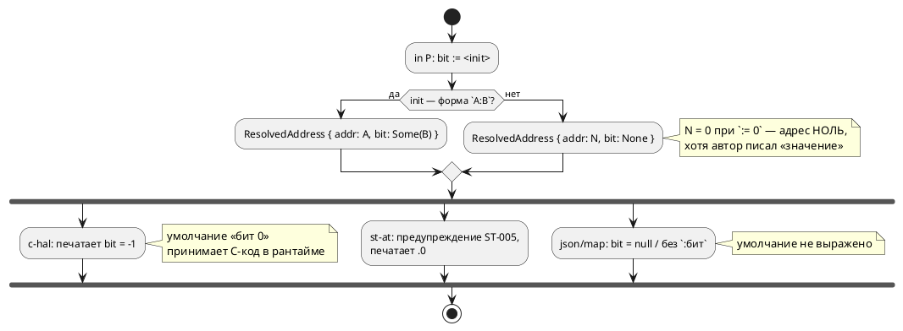
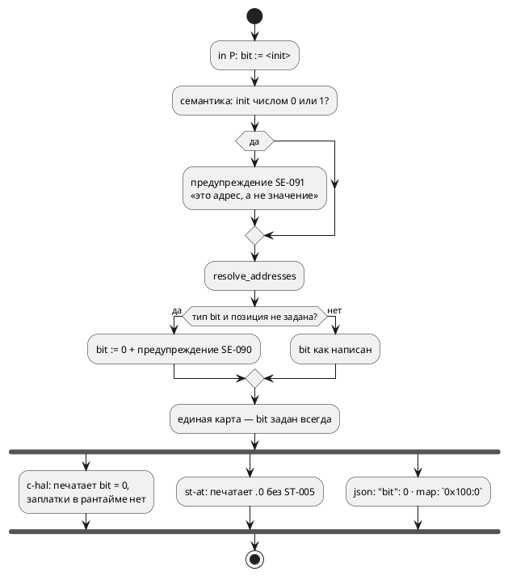

# ADR 0176: Позиция бита у bit-порта с голым адресом

- **Status:** Accepted
- **Date:** 2026-07-31
- **Authors:** Системный аналитик, архитектор, дизайнер языка
- **Related issues:** [Фича 0176](../features/0176-bit-port-address-position.md); продолжение
  [ADR 0070](0070-port-initializer-address-role.md) (инициализатор порта — адрес), смежно
  [0098](0098-port-bit-range-safe-hal.md) (диапазон бита, ширина доступа HAL) и
  [0020](0020-port-address-decl.md) (три источника адреса)

## Context

[ADR 0070](0070-port-initializer-address-role.md) снял с портов проверку значения
бита: `in BTN: bit := 0x00100000;` — адрес, а не значение. Две вещи она
сознательно **не** решала и вынесла кандидатом: у голого адреса нет позиции бита,
а `bit := 0/1` молча означает адрес 0/1. Это и есть предмет 0176.

### Что показала проба (2026-07-31)

**1. Умолчание «бит 0» уже существует — но живёт в трёх местах и выражено
по-разному.** Вход `in P: bit := 0x100;`:

| Потребитель | Что делает | Видит ли автор |
|---|---|---|
| `c-hal` | кладёт в таблицу `{ 0x100u, -1, 1 }`, а в рантайме `int s = b.bit < 0 ? 0 : b.bit;` | **нет**, молчит |
| `st-at` | печатает `%IX256.0` + предупреждение `ST-005` «принят бит 0» | да |
| `address-map --emit json` | `"bit": null` | не сказано, что подразумевается 0 |
| `address-map --emit map` | `P = 0x00000100;` | то же |

То есть решение «бит 0» принято трижды, независимо, и один из трёх принявших —
**сгенерированный C-код**, а не компилятор. Внешний генератор HAL, читающий
`json`, о нём не знает вовсе.

**2. `out ready: bit := 0;` даёт адрес `0x0` — и это в корпусе.** Пять примеров
(`regulator`, `float_regulator`, `pid_regulator`, `pid_law`, `batch_cycle`)
объявляют `out ready: bit := 0;`, и `c-hal` печатает:

```c
static const Regulator_PortBinding Regulator_Out_BitPort__ADDR[] = {
    [REGULATOR_REGULATOR_READY] = { (uintptr_t)0x0u, -1, 1 },
};
```

Дефолтный HAL пишет по этому адресу — то есть **разыменовывает нулевой
указатель**. Гейт `cc -c` такой код компилирует (он синтаксически безупречен),
а исполнения порождённого HAL в проекте нет, поэтому дефект молчит.

**3. Документ учит ловушке.** В `book/` пять таких мест, включая
`in light: bit := 0; // датчик: включён ли свет` — комментарий прямо утверждает
смысл «значение», а язык понимает «адрес 0». Читатель не может об этом
догадаться.

**4. Убрать инициализатор — не бесплатно.** `out ready: bit;` даёт `SE-052`
(«порт используется, но не имеет адреса») у `c-hal`/`st-at`; целью `c` собирается
как прежде.

### Как обрабатывается адрес bit-порта сейчас



## Decision Drivers

1. **Одно решение — одно место.** Умолчание «бит 0» — свойство **языка**, а не
   цели. Пока его принимают три потребителя порознь, они вправе разойтись, и
   разойдутся молча (прецеденты: `c-hal` против `st-at` здесь же).
2. **Молчаливо неверный продукт хуже отказа.** Запись по адресу `0x0` в
   порождённой прошивке — не стилистическая придирка: на МК это либо вектор
   сброса, либо ловушка. Компилятор обязан хотя бы **сказать**.
3. **Документ не имеет права учить ловушке.** Пример с комментарием «датчик»
   рядом с инициализатором, означающим адрес, — источник будущих ошибок
   пользователей.
4. **Корпус — не аргумент против правильной семантики, но цена считается.**
   Правка пяти примеров и пяти мест документа допустима; молчаливая порча
   продукта — нет.
5. **Соразмерность.** Ошибка (а не предупреждение) на `bit := 0` сделала бы
   незаконной форму, валидную сегодня, и потребовала бы выдумать адреса там, где
   автор их не имел в виду.

## Considered Options

### Option A. Умолчание «бит 0» нормируется в слое адресов + предупреждение

`resolve_addresses` для `bit`-порта с адресом без позиции подставляет `bit = 0` и
выдаёт предупреждение. Потребители получают уже нормированную карту.

**Pros:**
- Решение принимается **один раз**; `c-hal`, `st-at`, `sv-mmio` и обе выгрузки
  получают одинаковый ответ по построению.
- Рантайм-заплатка `b.bit < 0 ? 0 : b.bit` в порождённом HAL становится мёртвой
  и снимается: инвариант держит компилятор, а не C-код.
- `json` начинает печатать `"bit": 0` — внешний генератор HAL узнаёт умолчание.

**Cons:**
- Меняется вывод `c-hal` (`-1` → `0`) и выгрузок для голого адреса. Корпус это не
  задевает (в нём голых адресов у bit-портов нет, кроме `:= 0`, см. Option C).
- `ST-005` становится недостижимым — код надо вывести из обращения.

### Option B. Требовать явную позицию: `0xADDR:бит` иначе ошибка

**Pros:**
- Никаких умолчаний: у однобитного порта позиция всегда написана автором.

**Cons:**
- Ломает форму, валидную сегодня, ради случая, где умолчание очевидно (бит 0 —
  единственный разумный ответ для отдельно стоящего флага).
- Не решает главного: `out ready: bit := 0:0;` — по-прежнему **адрес 0**.
  Ошибка о бите заставила бы дописать `:0` и молча узаконила бы нулевой адрес.

### Option C. Диагностика на подозрительный адрес 0/1 у порта

Отдельно от позиции бита: инициализатор порта, равный `0` или `1`, — почти
наверняка «начальное значение», написанное по привычке.

- **C-1. Предупреждение** (принято): форма остаётся законной, автор извещён.
- **C-2. Ошибка `SE-0NN`**: гарантирует, что нулевой адрес не уедет в прошивку,
  но делает незаконной сегодняшнюю форму и требует выдумать адреса в примерах,
  где их нет по смыслу.
- **C-3. Не трогать**: ловушка остаётся, запись по адресу 0 продолжает уезжать в
  порождённый HAL.

### Option D. Оставить всё как есть, выровняв только тексты диагностик

**Pros:** нулевая цена.
**Cons:** три источника истины сохраняются (драйвер 1), нулевой адрес — тоже
(драйвер 2). Отвергнуто.

## Decision

Принимается **Option A + Option C-1** — решение заказчика 2026-07-31 по двум
поставленным вопросам.

1. **Умолчание «бит 0» нормируется в `resolve_addresses`.** Для порта типа `bit`
   с адресом без позиции карта получает `bit = Some(0)`, а разрешение выдаёт
   **предупреждение `SE-090`**: «у bit-порта позиция бита не задана: принят бит 0;
   укажите `0xADDR:бит`, если подразумевался другой». Предупреждение живёт там же,
   где решение, — в слое адресов, и достаётся всем адрес-потребляющим целям
   разом.
2. **`ST-005` выводится из обращения**: его ветка становится недостижимой (бит
   приходит заданным). Запись в реестре диагностик помечается `RETIRED` — код не
   переиспользуется, чтобы старые сообщения оставались опознаваемыми.
3. **Порт с адресом `0` или `1` даёт предупреждение `SE-091`** — «инициализатор
   порта задаёт **адрес**, а не начальное значение; адрес 0/1 почти наверняка
   ошибка». Проверка ставится в **семантике** (`collect_model_warnings`), а не в
   слое адресов: это свойство исходника, а не цели, и увидеть его должен и тот,
   кто собирает целью `c` (в том числе примеры документа — драйвер 3).
4. **Корпус и документ правятся.** Пять примеров `examples/` получают
   **настоящие** адреса (`out ready: bit := 0x600:0;` в духе `stacker`) — так
   покрытие гейтом `c-hal` сохраняется, а пример перестаёт вводить в
   заблуждение. В `book/` инициализатор убирается там, где адрес не является
   темой раздела (`out motor: bit;`): гейт документа собирает целью `c`, где
   адрес не нужен.

**Целевой поток:**



## Consequences

### Положительные

- Умолчание перестаёт быть решением сгенерированного C-кода и становится
  свойством языка: одно место, один ответ, видимый в выгрузке.
- Автор узнаёт про нулевой адрес до того, как прошивка запишет по нему.
- Документ перестаёт учить ловушке; примеры показывают адрес там, где он есть.
- Из порождённого HAL уходит ветка `b.bit < 0 ? 0 : b.bit` — мёртвый код,
  скрывавший инвариант.

### Отрицательные / Action items

- **Вывод `c-hal` и выгрузок меняется** для голого адреса (`-1` → `0`,
  `null` → `0`, `P = 0x100;` → `P = 0x100:0;`). Круговой рейс `map` →
  `--address-map` обязан остаться байт-в-байт замкнутым (R4 фичи 0043) —
  проверяется тестом.
- **`ST-005` выходит из обращения**; в реестре — `RETIRED`, в приложении
  документа статья помечается как снятая.
- **Пять примеров корпуса меняют текст** — их вывод в `examples/generated/`
  изменится (адрес 0x0 → настоящий). Это первое за долгое время осмысленное
  изменение снапшотов; дифф обязан состоять **только** из адресных строк.
- **Предупреждение `SE-091` увидят все цели**, включая `c` — в том числе на
  примерах документа, пока они не поправлены (порядок задач это учитывает).
- **Версия языка не поднимается**: `0.8.0` не выпущена, изменения накапливаются
  в неё (правило 22). Семантика формы не меняется — добавляются диагностики и
  нормируется умолчание, уже существовавшее де-факто.

### Acceptance criteria

1. `in P: bit := 0x100;` → карта несёт `bit = 0`; `c-hal` печатает `0`, `json` —
   `"bit": 0`, `map` — `0x100:0`; выдано `SE-090`.
2. `in P: bit := 0x100:3;` — вывод байт-в-байт прежний, предупреждения нет.
3. `out ready: bit := 0;` → `SE-091` при сборке **любой** целью, включая `c`.
4. `out ready: bit := 0x600:0;` (правленый корпус) — ни `SE-090`, ни `SE-091`.
5. Порождённый HAL не содержит `b.bit < 0`.
6. Круговой рейс `--emit map` → `--address-map` замкнут байт-в-байт.
7. `precheck.sh` зелёный; дифф `examples/generated/` состоит только из адресных
   строк правленых примеров.
8. `ST-005` в исходниках отсутствует, реестр диагностик и гейт согласованы.
