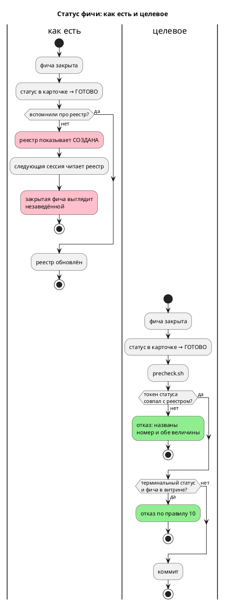

# ADR 0177: Гейт согласованности статуса в реестре и в карточке фичи

- **Status:** Accepted
- **Date:** 2026-07-29
- **Authors:** Архитектор + системный аналитик
- **Related issues:** [Фича 0177](../features/0177-features-registry-status-gate.md);
  смежные — [0164](../features/0164-registry-rebuild-gate.md) (реестры против
  диска), [ADR 0149](0149-claude-md-consistency-gate.md) и
  [ADR 0146](0146-book-glyph-gate.md) (тот же приём: правило + машинная проверка)

## Context

Статус фичи живёт в **двух** местах: поле `- **Статус:**` карточки
`docs/features/XXXX-*.md` и колонка «Статус» реестра
`docs/features/README.md`. Оба обновляются руками при закрытии, и шаг реестра
пропускался: аудит 2026-07-27 нашёл ~20 закрытых фич, показанных как
`СОЗДАНА`/`РАЗРАБОТКА`, и синхронизировал их **разово**.

**Дрейф вернулся за два дня.** Замер 2026-07-29 по всем **180** строкам:

```
РАСХОЖДЕНИЙ СТАТУСА: 1
  0138: реестр='СОЗДАНА' карточка='ГОТОВО'
```

Фича [0138](../features/0138-coverage-measurement.md) закрыта полным циклом —
ADR, анализ, две задачи разработки, тест-план, отчёт, раздел «Итог», запись в
`CHANGES.md`, — и отсутствует в витрине `FEATURES.md`. Не обновлена **только**
строка реестра, где она по-прежнему «`СОЗДАНА`, ADR/анализ не заведены (стадия 1)».

Это ровно то, о чём предупреждала карточка: разовая синхронизация без гейта
воспроизводит дрейф тем же путём.

⚠️ **Наивная сверка непригодна — 98 % ложных.** Прямое сравнение строк даёт
**48** находок из 180, и **47** — шум формы записи:

| Форма | Пример |
|---|---|
| выделение | `**ГОТОВО**` в карточке против `ГОТОВО` в реестре |
| значок | `✅ ГОТОВО` |
| приписка в реестре | `ГОТОВО (тег `v0.5.0`)`, `ГОТОВО (с оговоркой: A5 в CI не проверен)` |
| уточнение в карточке | `**ГОТОВО с оговоркой**` |

Срезание скобок тоже не работает: ячейка 0028 содержит вложенные скобки внутри
кода (`` `S(Модель) = Состояние` ``), и нежадный `\(.*?\)` рвёт её посередине.



## Decision Drivers

1. **Реестр — вход в проект.** По нему выбирают, что сделано и что брать. Строка
   «`СОЗДАНА`, стадия 1» у полностью закрытой фичи заставляет заводить работу
   заново.
2. **Ложное срабатывание убивает гейт** (урок 0149: 73 ложных отказа из 105
   упоминаний). Здесь наивная сверка даёт 47 ложных из 48 — гейт выключили бы
   немедленно.
3. **Правило уже есть, проверки нет.** Правила 10, 17 и 21 задают и набор
   статусов, и связь «терминальный статус ⇒ удалить из витрины». Соблюдение
   держалось на памяти.

## Considered Options

### Option A. Сравнение ячеек как строк

**Pros:** тривиально.

**Cons:** 47 ложных из 48 (замер). Потребовало бы вычистить форму записи во всех
180 строках и запретить приписки — а приписки полезны (`тег v0.5.0`,
`с оговоркой: A5 в CI не проверен`).

### Option B. Автопочинка реестра из карточек

Гейт не отказывает, а переписывает колонку.

**Pros:** дрейф исчезает без ручной работы.

**Cons:** машина затирает **приписки**, которые человек вносил осмысленно;
расхождение может означать и ошибку в **карточке** — тогда автопочинка
размножит её в реестр. Карточка предупреждает прямо: «чинить руками безопаснее».

### Option C. Сверка по **токену статуса** + проверка правила 10

Из обеих ячеек извлекается известный статус (`ГОТОВО`, `СОЗДАНА`, …);
сравниваются токены, а не текст. Дополнительно проверяется связь с витриной.

**Pros:**
- **0 ложных** на 180 строках (замер), 1 истинная находка.
- Форма записи остаётся свободной: выделение, значок и приписка допустимы.
- Неизвестный статус (опечатка, выдуманное слово) ловится тем же механизмом.
- Правило 10 («терминальный статус ⇒ фичи нет в витрине») становится проверяемым.

**Cons:**
- Требует держать список статусов в коде гейта — он же становится
  исполняемым определением набора.

## Decision

Принимается **Option C**. Гейт `scripts/check-feature-status.py` проверяет:

1. **Существование в обе стороны** — у строки реестра есть карточка, у карточки
   есть строка. Это предусловие сравнения, а не самоцель: полноценная сверка
   реестров с диском — предмет [0164](../features/0164-registry-rebuild-gate.md),
   чья область шире (все `docs/*/README.md`).
2. **Статус из известного набора** в обоих местах.
3. **Совпадение токенов** статуса.
4. **Правило 10**: терминальный статус (`ГОТОВО`/`ОТМЕНА`) ⇒ фичи **нет** в
   таблице `FEATURES.md`; нетерминальный ⇒ фича **есть** в таблице.

Автопочинки нет (Option B отвергнута). Самопроверка `--self-test` подкладывает
текст каждого класса.

**Набор статусов:** `СОЗДАНА`, `АРХИТЕКТУРА`, `АНАЛИЗ`, `РАЗРАБОТКА`,
`ТЕСТИРОВАНИЕ`, `ИСПРАВЛЕНИЕ`, `ЗАБЛОКИРОВАНА`, `ГОТОВО`, `ОТМЕНА` (правило 17)
плюс **`ЗАМОРОЖЕНА`**.

⚠️ **`ЗАМОРОЖЕНА` в правиле 17 отсутствует.** Она введена решением заказчика для
[0099](../features/0099-module-size-core.md) и описана в `FEATURES.md`, но в свод
не попала. Гейт её принимает (иначе отказал бы на законной строке), а
несоответствие свода практике заведено кандидатом — правка `docs/RULE.md` есть
изменение процесса и решается заказчиком, а не гейтом.

## Consequences

### Положительные

- Реестр перестаёт молча отставать от карточек; найденная строка 0138 исправлена.
- Правило 10 впервые проверяется машиной, а не памятью.
- Опечатка в статусе («ГОТВО») ловится сразу.

### Отрицательные / Action items

- **A-1. Гейт не судит, какая из двух величин верна.** При расхождении он
  называет обе и требует решения человека — это осознанно (Option B).
- **A-2. Список статусов дублирует правило 17.** Смягчение: в коде гейта стоит
  ссылка на правило, а расхождение с ним (`ЗАМОРОЖЕНА`) названо явно.
- **A-3. Область не расширена до прочих реестров** (`docs/adr/README.md` и др.) —
  это [0164](../features/0164-registry-rebuild-gate.md). Гейт 0177 уже считает
  существование в обе стороны, поэтому 0164 после него дешевеет.

### Acceptance criteria

1. Расхождение статуса (карточка `ГОТОВО`, реестр `СОЗДАНА`) валит `precheck.sh`
   с указанием номера и обеих величин.
2. Формы `**ГОТОВО**`, `✅ ГОТОВО`, `ГОТОВО (тег …)` ложного отказа **не** дают.
3. Неизвестный статус валит гейт.
4. Нарушение правила 10 (закрытая фича осталась в витрине) валит гейт.
5. Строка 0138 исправлена; текущее дерево гейт проходит, ложных — **ноль**.
6. Каждый класс проверен мутацией.
