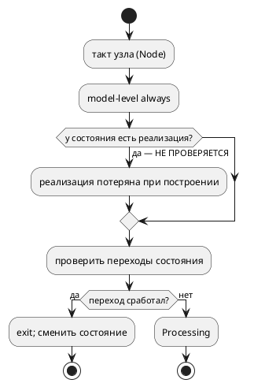
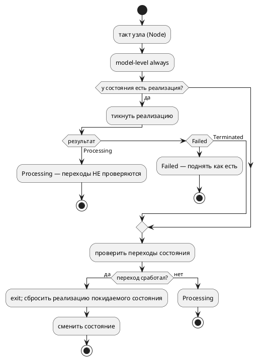

# ADR 0181: Симулятор исполняет реализацию состояния с переходом next

- **Status:** Accepted
- **Date:** 2026-07-29
- **Authors:** Архитектор + Аналитик
- **Related issues:** [Фича 0181](../features/0181-sim-state-implementation-tick.md); закрывает [фикс 0057-01](../fixes/0057-01-sim-composition-next.md); разблокирует [фичу 0166](../features/0166-sv-example-sequential-composition.md); наследует [ADR 0057](0057-sv-sequential-composition.md)

## Context

ADR 0057 объявил эталоном последовательной композиции `+` **две** реализации —
цель `c` (`generate_concat_tick`) и симулятор (`Unit::Sequential`), — предполагая
их совпадение. Они не совпадают: симулятор композицию, объявленную **реализацией
состояния**, при построении **теряет**.

Проба 2026-07-29 (`takt-sim -n 6`, модель `A` пишет `stage := 1`, `B` — `stage := 2`):

| Форма | Симулятор | Цель `c` (эталон) |
|---|---|---|
| `start P = A + B { next Done; } state Done;` | `[P] stage=0`, `Terminated` на такте 1 | 1, 1, 2, 2, `Done` |
| `start P = A + B;` | 1, **0**, 2, затем `[—]` | 1, 1, 2, 2 |

Корень — в `takt-sim/src/unit/builder.rs`, функция `build_impl`: реализация
состояния строится **только** по ветви `single_compound` — когда модель содержит
ровно одно состояние-реализацию **без переходов и без `next`**. Во всех прочих
случаях управление уходит в `build_node`, а `build_node` поле `implements`
состояния **не читает вовсе**. Узел остаётся с одним безусловным переходом и
закономерно уходит по нему на такте 1.

Двум другим расхождениям та же цена одного решения:

- ветвь `Extend::Concatenation` передаёт `shared_parent` **как есть**, тогда как
  `Extend::Parallel` при `None` общий контекст **создаёт**, — поэтому шаги `+` не
  делят переменные (провал `stage` в 0);
- `Context::get_value` у `Sequential` адресует `units[index]`, а по завершении
  `index == units.len()` — наблюдение обрывается (`[—]`).

### Поток «как есть»

### Целевой поток

## Decision Drivers

1. **Эталон один, а не два.** Пока симулятор и цель `c` расходятся, «эталонное
   поведение `+`» — пустой звук: любая новая цель вправе сослаться на любую из
   двух реализаций. Нормативной остаётся цель `c` (её вывод сверен с `sv`
   потактово), симулятор обязан ей соответствовать.
2. **Дефект молчалив.** Ни одна проверка не отказывает: модель компилируется,
   симулируется, завершается. Именно поэтому он дожил — трасса просто короче,
   чем должна быть.
3. **Правка ограничена симулятором.** Порождённый код (`c`/`rust`/`st`/`sv`)
   верен и меняться не должен — иначе фича вышла бы за свои границы.
4. **Лимит размера модуля.** `takt-sim/src/unit/mod.rs` — 988 строк при лимите
   1000: любая содержательная правка обязана начинаться с деления модуля.

## Considered Options

### Option A. Поле `state_impls` в `UnitKind::Node`

Реализация каждого состояния-реализации строится дочерним `Unit` и кладётся в
`HashMap<String, Rc<RefCell<Unit>>>` внутри существующего варианта `Node`.
Контекст узла передаётся ей общим родителем.

**Pros:**
- изменение **аддитивно**: все 63 места разбора `UnitKind::Node { .. }` по
  `takt-sim/src` продолжают компилироваться без правок;
- один механизм закрывает **все три** расхождения: общий контекст решает провал
  значения, а наблюдение через узел — обрыв после завершения;
- ветвь `single_compound` (горячий путь корпуса: `stacker`, `elevator_mini`)
  остаётся нетронутой — регресс невозможен по построению.

**Cons:**
- спуск в реализацию нужно добавить в каждый обход узла (`get_value`/`set_value`/
  `dump`/`execution`/`collect_active_states`/`clock`/`every`/`state_io`/
  `viewport`) — забытый обход даёт молчаливую потерю наблюдения.

### Option B. Новый вариант `UnitKind::Implemented { node, inner }`

Обёртка: узел с переходами плюс вложенная композиция отдельным вариантом.

**Pros:**
- разделение обязанностей явнее, чем поле внутри `Node`.

**Cons:**
- новый вариант перечисления **обязан** быть разобран во всех исчерпывающих
  `match` по `UnitKind` — правка расходится по всему крейту, включая пути, к
  дефекту отношения не имеющие;
- обёртка удваивает вопрос «чей это контекст»: узел и композиция оказываются
  соседями, а не родителем и ребёнком, — и общий контекст пришлось бы
  синтезировать третьей сущностью.

### Option C. Развернуть состояние-реализацию в `Sequential` из [реализация, узел-приёмник]

Понизить `start P = A + B { next Done; }` к последовательности «композиция, затем
узел с переходами».

**Pros:**
- ни новых полей, ни новых вариантов.

**Cons:**
- **семантически неверно**: переходы состояния `P` (`ref`-рёбра помимо `next`)
  обязаны проверяться, только когда композиция завершена, а не после неё в новом
  такте — понижение добавило бы такт, которого нет в цели `c`;
- `enter`/`exit`/`always` состояния `P` и его инварианты потеряли бы владельца.

## Decision

Принимается **Option A**.

Решающий довод — аддитивность: дефект в симуляторе, и цена его починки не должна
раскатываться по крейту (Option B) или менять потактовую семантику (Option C).
Общий родительский контекст — не побочная деталь, а суть: именно он делает
`stage` одной переменной для всех шагов и для наблюдателя, снимая сразу два
расхождения из трёх.

Нормативным остаётся поведение цели `c`: **переход берётся в ветви `is_done`** —
то есть на том же такте, на котором завершилась реализация, а не на следующем.

Порядок наблюдения: **собственный контекст узла — первым**, реализация — после.
Shared-переменные лежат в контексте узла, и обратный порядок дал бы наблюдателю
копию из ветви вместо общего значения.

## Consequences

### Положительные

- фикс 0057-01 закрыт; эталонов у `+` снова один, а не два;
- становится возможной **тройная** сверка sim↔C↔SV (сегодня — только SV↔C);
- фича [0166](../features/0166-sv-example-sequential-composition.md)
  разблокирована: корпусной пример на `+` сможет получить полноценный **контракт
  сценария**, а не исключение;
- `takt-sim/src/unit/mod.rs` выходит из-под лимита размера с запасом.

### Отрицательные / Action items

- меняется наблюдаемая трасса моделей, чьё состояние-реализация несёт переход. В
  корпусе таких два — `elevator.takt` и `extend_complex.takt`, **оба исключены**
  из `examples_scenario_tests` с причиной, то есть контрактов не ломают. Порядок
  вывода `takt-sim` по ним станет длиннее — это и есть исправление;
- порождённый код не затрагивается: `examples/generated/**` обязан остаться
  байт-в-байт прежним. Проверяется гейтом воспроизводимости и `git diff`;
- ⚠️ **риск забытого обхода**: спуск в реализацию нужен в девяти местах. Ловится
  значенческими тестами (наблюдение переменной внутри реализации), а не чтением.

### Acceptance criteria

1. `start P = A + B { next Done; } state Done;` в симуляторе даёт `stage` =
   1, 1, 2, 2 и завершение — байт-в-байт трасса цели `c`.
2. `start P = A + B;` не даёт провала значения в 0 на такте переключения шага и
   наблюдается после завершения композиции.
3. Сверки `conformance_sv_tests::sequential_composition_matches_generated_c` и
   `parallel_step_inside_concatenation_matches_generated_c` расширены до
   **тройных** (sim ≡ C ≡ SV) и зелены.
4. Реализация, не завершающаяся никогда, перехода не даёт (контрпример).
5. `examples/generated/**` не изменился; `./scripts/precheck.sh` зелёный,
   включая `scripts/check-module-size.sh` без новых записей в
   `scripts/module-size-baseline.txt`.
