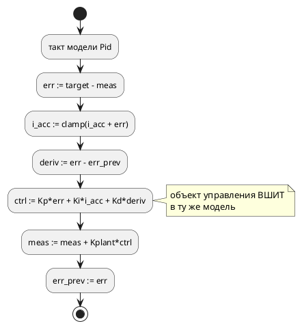
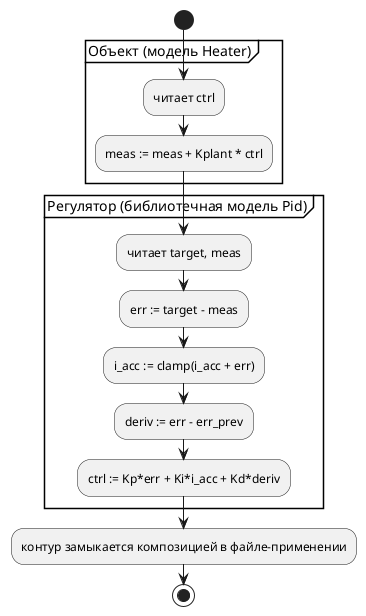

# ADR 0182: Библиотечный ПИД-регулятор и пример его применения

- **Status:** Accepted
- **Date:** 2026-07-29
- **Authors:** Архитектор + Аналитик
- **Related issues:** [Фича 0182](../features/0182-pid-library-and-application.md); смежно с [ADR 0097](0097-pid-regulator-example.md) и [ADR 0096](0096-fixed-point-native-float.md)

## Context

Заказчик просит **пример ПИД-регулятора на языке и пример его применения**
(2026-07-29). В корпусе ПИД уже есть — `examples/pid_regulator.takt` (фича
0097), — но он **самозамкнут**: объект управления вшит в ту же модель строкой
`meas := meas + kplant * ctrl`. Так сделано намеренно, чтобы модель проходила
корпусной гейт достижимости (фича 0030) без внешних входов.

Цена этого решения — регулятор **непереиспользуем**. Наружу он показывает
единственный порт `ready`; уставка, измерение и управляющее воздействие —
внутренние переменные. Приложить его к другому объекту нельзя, не переписав.
То есть «пример применения» в корпусе отсутствует не по недосмотру, а потому
что применять нечего: регулятор и объект — одно целое.

### Поток «как есть»

### Целевой поток

## Decision Drivers

1. **Переиспользуемость — суть запроса.** «Пример применения» имеет смысл
   только если регулятор можно применить, то есть если контур разомкнут и
   выведен в порты.
2. **Не сломать существующее.** `pid_regulator.takt` участвует в контракте
   сценария (`examples_scenario_tests`), гейтах `sv`, сверках
   `conformance_float_modes_tests` и в списке `FLOAT_AS_Q_EXAMPLES`. Его
   переделка — рябь по десятку мест ради задачи, которой он не решает.
3. **Пример — это документация языка** (правила 15, 16). Регулятор без
   объяснения, как он прикладывается, документацией не является.
4. **Гейты корпуса — не декорация.** Каждый новый `.takt` обязан пройти канон
   `fmt`, гейт воспроизводимости, компиляцию во все цели и получить **контракт
   сценария либо исключение с причиной**. Форма примера определяется этим не
   меньше, чем предметом.

## Considered Options

### Option A. Библиотечная модель + отдельный объект + файл-применение через `import`

Три файла: регулятор (библиотека, контур в портах), объект управления и корень,
импортирующий оба и замыкающий контур композицией.

**Pros:**
- прямо отвечает на запрос: «регулятор» и «его применение» — разные артефакты,
  и второй показывает **как** прикладывать;
- демонстрирует `import` и многофайловость на осмысленной задаче, а не на
  учебной (раздел `book/src/09-imports/` показывает механизм, но не пользу);
- библиотечный файл гейтом примеров `book/` standalone **не** компилируется —
  признак выводится грепом по `from "<имя>"` (фича 0133), то есть инфраструктура
  такой формы уже готова;
- существующий `pid_regulator.takt` не трогается вовсе.

**Cons:**
- корпус растёт на три файла; каждому нужен контракт или исключение, канон
  `fmt` и порождение во все цели;
- разомкнутый регулятор сам по себе сценария не имеет — контракт получает
  файл-применение, библиотека и объект идут с исключением «библиотечный,
  проверяется импортёром».

### Option B. Один файл с двумя моделями и композицией

Один `.takt`: модель регулятора, модель объекта и композиция в корне.

**Pros:**
- один файл, один контракт, минимум ряби.

**Cons:**
- **не показывает применение**: регулятор и объект снова связаны файлом, взять
  регулятор в другой проект нельзя — то есть повторяет дефект 0097 в новой
  обёртке;
- `import` не демонстрируется вовсе.

### Option C. Переделать `examples/pid_regulator.takt`

Разомкнуть существующий пример, вынеся объект.

**Pros:**
- корпус не растёт.

**Cons:**
- ломает контракт сценария (`Control → Settled → Done`), сверки
  `conformance_float_modes_tests`, гейт `sv` и запись в `FLOAT_AS_Q_EXAMPLES`;
- уничтожает **работающий** пример прозрачного `float` ради другой задачи —
  два предмета под одним номером (урок 0171);
- «до» и «после» становятся неразличимы: пример 0097 демонстрирует
  представление чисел, 0182 — переиспользование. Это разные уроки.

## Decision

Принимается **Option A**.

Единственный вариант, который **показывает применение**, а не имитирует его.
Цена — три новых файла и их обвязка — известна и ограничена: это ровно та
работа, которую корпусной пример стоит в этом проекте всегда.

Существующий `pid_regulator.takt` **сохраняется без изменений**: он про
представление чисел (`float` → q флагами сборки), новый пример — про
переиспользование. Разные уроки живут в разных файлах.

### Форма контура

Регулятор объявляет порты контура — уставку и измерение на вход, управляющее
воздействие на выход — и **не** содержит модели объекта. Коэффициенты —
объявления библиотечной модели; настройка под задачу выполняется в файле-
применении через общие переменные, поскольку параметризации моделей (generics)
в языке нет.

⚠️ Это **ограничение языка**, а не выбор ADR: подставить свои коэффициенты
«снаружи» иначе нечем. Ограничение фиксируется анализом и разделом документа
честно — оно и есть один из уроков примера.

### Раздел документа

Новый раздел в части **«Применение»** `book/src/SUMMARY.md`, после
«Практический пример»: сперва регулятор (модель, закон управления, anti-windup,
типичные ошибки по правилу 26), затем применение (объект, замыкание контура,
прогон симулятором, наблюдение сходимости). Номера фич, ссылки на ADR и
сведения о процессе в документ не попадают (правило 24).

## Consequences

### Положительные

- в корпусе появляется **переиспользуемая** модель и наглядный образец того,
  как из библиотеки и объекта собирается контур;
- `import` получает содержательную демонстрацию — сегодня он показан только
  учебным примером комнаты;
- раздел документа связывает язык с прикладной задачей, ради которой проект и
  существует (цель 12 свода — промышленные системы управления).

### Отрицательные / Action items

- корпус растёт на три `.takt` и их порождённые артефакты во всех целях;
- ⚠️ **anti-windup пишется условиями**: насыщающего оператора в языке нет. Если
  [0170](../features/0170-fixed-point-saturation.md) будет закрыта, пример и
  раздел документа придётся освежить — записать в её карточку как потребителя;
- ⚠️ **параметризация моделей отсутствует**: коэффициенты нельзя задать
  «снаружи» иначе как общими переменными. Если это признают неудобством —
  заводить отдельной фичей, а не расширять 0182.

### Acceptance criteria

1. Библиотечный файл регулятора — **без** модели объекта, контур в портах;
   импортируется и компилируется в составе применения.
2. Файл-применение импортирует регулятор и объект, замыкает контур, сходится и
   завершается.
3. У каждого нового файла — **контракт сценария** либо исключение **с причиной**
   в `examples_scenario_tests`; библиотечные идут с исключением.
4. Новый раздел `book/` описывает регулятор и его применение; примеры раздела
   проходят гейт `book/` (компиляция целью `c` + симуляция), символы — гейт
   шрифта (`scripts/check-book-glyphs.py`).
5. `examples/pid_regulator.takt` (фича 0097) **не изменён** — `git diff` пуст.
6. `./scripts/precheck.sh` зелёный.
