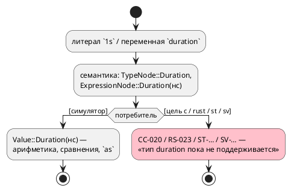
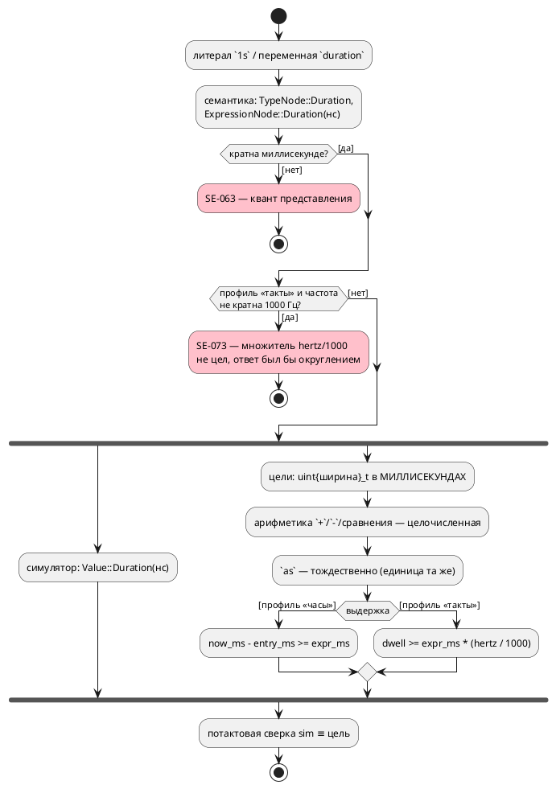

# ADR 0183: Тип `duration` в целях генерации и вычисляемая выдержка

- **Status:** Accepted
- **Date:** 2026-07-29
- **Authors:** Архитектор + дизайнер языка
- **Related issues:** [Фича 0183](../features/0183-duration-type-in-targets.md);
  вскрыта при разработке [0143](../features/0143-after-const-duration.md); смежно
  с [ADR 0134](0134-language-time-model.md) (модель времени),
  фикс [0134-02](../fixes/0134-02-duration-literal-in-body.md) (литерал
  длительности в теле — предпосылка сверки)

## Context

Тип `duration` **исполняется симулятором, но не поддерживается ни одной целью
генерации**. Пробы 2026-07-29 (переменная, **используемая** в теле):

```
Ошибка компиляции [CC-020]: переменная 'left': тип 'duration' целью 'c' пока не поддерживается
Ошибка компиляции [RS-023]: переменная 'left': тип 'duration' целью 'rust' пока не поддерживается
```

Заглушки поставлены фичей 0134 сознательно: «молча напечатать наносекунды обычным
целым значило бы выдать выдержку, не равную заявленной». Отказ громкий. Всего
формулировку «пока не поддерживается» несут **17** ветвей в двух крейтах —
большинство про этот тип.

Следствие, обнаруженное 0143: **вычисляемая выдержка** (`after (v + 1s)` со
значением, известным лишь в такте) невозможна — она была бы исполнима в отладке и
невыразима в прошивке.

Что уже нормировано языком и **не требует решения здесь**:

| Свойство | Как есть |
|---|---|
| Представление эталона | наносекунды (`Value::Duration(i64)`), `takt-sim/src/eval/duration.rs` |
| Арифметика | только `duration ± duration` и сравнения; умножения/деления **нет** |
| Смешение с числом | запрещено (`SE-065`) |
| Приведения | `duration as <целое>` → **миллисекунды**; `<целое> as duration` → число трактуется как **миллисекунды** |
| Непредставимая длительность | `SE-063` (не кратна кванту профиля), `SE-064` (не влезает в счётчик) |
| Механизм выдержки в целях | профиль «такты» — счётчик `takt_dwell` (ширина по `counter_bits`); профиль «часы» — метка `takt_entry_ms` + колбэк `now_ms`, **в миллисекундах** |

Существенное наблюдение, сужающее задачу: **источник времени длительностям-значениям
не нужен**. В языке нет выражения «сейчас»: `duration`-переменная — хранилище, над
которым делают `+`, `-` и сравнения. Время нужно только выдержке, и оно уже есть.



## Decision Drivers

1. **Симулятор и цели обязаны совпадать потактово.** Разрыв «в отладке работает, в
   прошивке нет» — худший для языка синтеза (правило 12 свода). Сверка, а не
   компиляция, — единственное доказательство (уроки 0045 и 0050).
2. **Арифметика времени живёт в одном месте.** `semantic::duration` — единственный
   слой пересчёта (правило 7 ADR 0134); новое представление не имеет права
   завести второй.
3. **Цена на целевой платформе.** Цель `c` — прошивка МК: 64-битная арифметика на
   Cortex-M0/AVR программная, и выбирать её без нужды нельзя.
4. **Приведение `as` уже нормировано миллисекундами.** Представление, совпадающее
   с этой единицей, делает приведение **тождественным** — нечему разойтись.
5. **Молчаливое округление недопустимо.** Там, где пересчёт неточен, нужен отказ
   (как `SE-063` для литералов), а не «примерно верно».

## Considered Options

### Option A. Миллисекунды, целое фиксированной ширины

`duration` в целях — целое без знака в **миллисекундах**; ширина по умолчанию 32
бита (49.7 суток), выбирается общим слоем.

**Pros:**
- Приведения `as` становятся **тождественными**: `v as u32` — то же значение,
  `n as duration` — то же значение. Расходиться нечему (драйвер 4).
- Профиль «часы» уже меряет время миллисекундами (`takt_entry_ms`, `now_ms`) —
  выдержка сравнивается **напрямую**, без арифметики.
- 32-битная арифметика на МК дешёвая (драйвер 3).
- Литерал переносим между сборками: значение переменной не зависит от частоты.

**Cons:**
- В профиле «такты» сравнение выдержки требует пересчёта `мс → такты`
  (`expr_ms * hertz / 1000`); он точен **только** при частоте, кратной 1000 Гц.
  Иначе нужен отказ — новая диагностика.
- Длительности мельче миллисекунды (`250us`) как **значения** невыразимы, хотя
  литерал в `after` при достаточной частоте работает. Асимметрия языка.

### Option B. Единицы профиля (такты либо миллисекунды)

`duration` хранится в тех же единицах, что счётчик выдержки: тактах (профиль
«такты») или миллисекундах (профиль «часы»).

**Pros:**
- Сравнение с выдержкой прямое в **обоих** профилях.
- Литерал `250us` при частоте 1 МГц выразим как значение — точность выше.

**Cons:**
- Значение переменной **зависит от частоты сборки**: одно и то же `left = 3000`
  означает 3 с при 1 кГц и 3 мс при 1 МГц. Записанное в EEPROM или переданное по
  шине значение меняет смысл — а язык обещает, что единица входит в тип.
- Приведение `as u32` (миллисекунды) требует пересчёта `такты → мс`
  (`v * 1000 / hertz`) — та же неточность, что у A, но ещё и в **обе** стороны.
- Отладка перестаёт совпадать с прошивкой по числам: симулятор печатает `3s`,
  прошивка держит `3000` или `3000000`.

### Option C. Наносекунды, 64-битное целое

`duration` в целях — `int64` наносекунд, как у эталона.

**Pros:**
- Тождественно эталону: ни пересчётов, ни округлений в арифметике.
- Полная точность вплоть до наносекунды.

**Cons:**
- 64-битная арифметика на МК: на Cortex-M0 сложение — вызов рантайма, сравнение —
  пара инструкций плюс ветвление; для DSL прошивок это цена без предъявленной
  нужды (драйвер 3).
- Сравнение с выдержкой требует привести счётчик к наносекундам
  (`dwell * ns_per_tick`), а `ns_per_tick = 1e9 / hertz` цел **не при всякой**
  частоте (3 Гц — нет) — то есть условие делимости не исчезает, лишь меняет вид.
- Приведение `as u32` (мс) требует деления на 1e6 — в цели `st` деления над
  длительностями нет вовсе (в IEC арифметика над `TIME` ограничена).

## Decision

Принимается **Option A** — миллисекунды, целое без знака, ширина выбирается общим
слоем (по умолчанию 32 бита).

Решающими были драйверы 4 и 1: единица приведения `as` **уже** назначена
миллисекундами решением заказчика (0134), поэтому представление в миллисекундах
делает границу «значение ↔ число» тождественной, и расходиться с эталоном может
только пересчёт выдержки — единственное место, которое остаётся доказывать
сверкой. Option B ломает переносимость значения (его смысл начинает зависеть от
флага сборки), Option C платит 64-битной арифметикой на МК и всё равно не
избавляется от условия делимости.

**Нормативно (правило языка и целей).**

1. Тип `duration` **представим во всех целях** генерации целым без знака в
   **миллисекундах**. Ширина — 32 бита; общий слой вправе выбрать шире, если
   этого требует литерал модели (`SE-064` остаётся при непредставимости).
2. **Значение мельче миллисекунды как переменная невыразимо**: `var v: duration
   := 250us;` → `SE-063` (тот же код, что у литерала выдержки в профиле «часы»,
   и по той же причине — квант представления).
3. Арифметика в целях — целочисленная над миллисекундами: `+`, `-`, сравнения.
   Умножения и деления над `duration` язык не имеет, и цели их не эмитят.
4. Приведения `as` **тождественны**: `v as <целое>` и `<целое> as duration` не
   порождают арифметики вовсе (значение уже в миллисекундах).
5. **Выдержка с переменным выражением** (`after (v + 1s)`) допускается:
   - профиль «часы» — сравнение `now_ms - entry_ms >= expr_ms` (обе части в
     миллисекундах, пересчёта нет);
   - профиль «такты» — сравнение `dwell >= expr_ms * (hertz / 1000)`; множитель
     `hertz / 1000` вычисляет **компилятор**.
6. **Частота, не кратная 1000 Гц, отвергается** там, где нужен множитель
   `hertz / 1000`, — то есть у **вычисляемой выдержки** в профиле «такты»: новый
   код **`SE-073`**. Причина названа: множитель не цел, и любой ответ был бы
   округлением.

   ⚠️ Уточнено до реализации: правило **не** распространяется на `duration` как
   значение вообще. Значение живёт в миллисекундах и с тактовым счётчиком не
   взаимодействует, пока их не сравнивают, — а сравнение и есть вычисляемая
   выдержка. Первая редакция пункта запрещала больше, чем требуется, и отсекла бы
   законные модели (частота 3 Гц, длительности только в переменных).
7. Ограничение фичи 0143 («в `after` только константы») **снимается**: `SE-072`
   перестаёт отвергать переменную и порт, сохраняя отказ на вызове функции, голом
   числе, сравнении и прочих неарифметических формах.
8. Поведение целей и симулятора совпадает **потактово** — доказывается сверками
   `conformance_{c,rust,st,sv}_*`, а не фактом компиляции.



## Consequences

### Положительные

- Тип `duration` перестаёт быть «только для отладки»: модель с таймерами
  синтезируется во все шесть целей.
- Вычисляемая выдержка становится возможной, и ограничение 0143 снимается
  осознанно, а не обходится.
- Приведения `as` не порождают кода — граница «длительность ↔ число» бесплатна и
  не может разойтись с эталоном.
- Диагностика `SE-073` делает несовместимость частоты **громкой** там, где раньше
  просто не было поддержки.

### Отрицательные / Action items

- **Асимметрия языка:** литерал `250us` в `after` при частоте 1 МГц законен, а
  `var v: duration := 250us;` — нет (`SE-063`). Это цена выбора единицы; описать в
  документе явно, иначе выглядит как дефект.
- **Частоты, не кратные 1000 Гц**, теряют возможность использовать `duration` как
  значение. Замер типовых частот прошивок (1 кГц, 2 кГц, 10 кГц, 100 кГц, 1 МГц)
  показывает, что правило не задевает практику; экзотические частоты (3 Гц)
  остаются с литеральными выдержками.
- **Ширина 32 бита** ограничивает значение 49.7 сутками. Модели с большими
  выдержками получают `SE-064`; расширение ширины флагом — **кандидат**, не объём.
- **Тесты фичи 0143**, пришпиливающие `SE-072` на переменной и порте, обязаны
  быть переписаны — это часть объёма, а не побочный ремонт.
- Цель `st`: тип IEC для длительности выбирается отдельно (`TIME` против
  `UDINT`) — решение задачи цели, но обязано остаться в миллисекундах.

### Acceptance criteria

1. `var v: duration := 1s;` с использованием в теле компилируется целями `c`,
   `c-hal`, `st`, `st-at`, `rust`, `sv`; вывод содержит целое в миллисекундах.
2. Потактовая сверка симулятора и каждой цели на модели с арифметикой
   длительностей совпадает (`conformance_*`).
3. `v as u32` и `250 as duration` не порождают арифметики (проверка текстом).
4. `after (v + 1s)` работает во всех целях и сверяется потактово; `SE-072` больше
   не отвергает переменную, но отвергает вызов функции и голое число.
5. `var v: duration := 250us;` даёт `SE-063`; частота 3 Гц с duration-значением
   даёт `SE-073` — оба с позицией и названной причиной.
6. Раздел документа о времени описывает представление, ограничение кванта и
   правило частоты; `SE-073` — в приложении «Ошибки и предупреждения».
