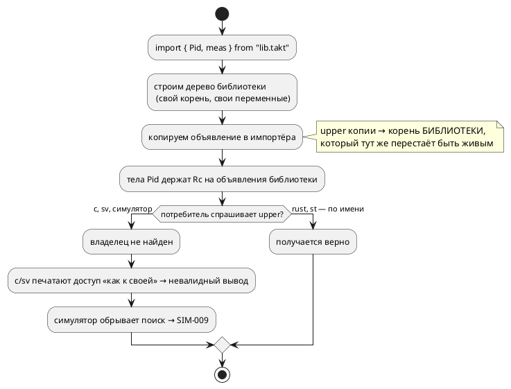
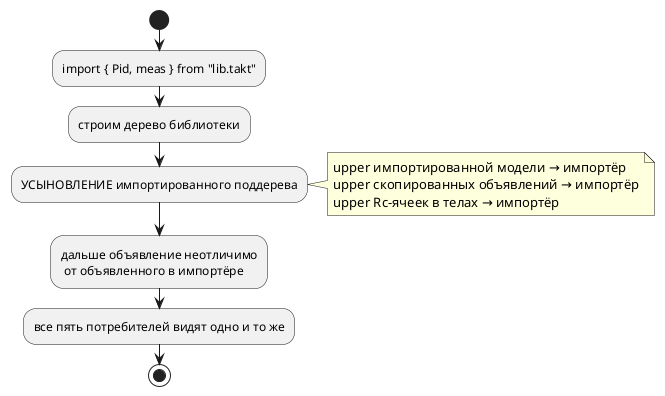

# ADR 0184: Общие переменные библиотечного файла в импортёре

- **Status:** Accepted
- **Date:** 2026-07-29
- **Authors:** Архитектор + Аналитик
- **Related issues:** [Фича 0184](../features/0184-imported-shared-variables.md); вскрыто пробами стадии разработки [0182](../features/0182-pid-library-and-application.md); механизм импорта — [ADR 0055](0055-lsp-multifile.md), правило доступа цели `c` — [ADR 0026](0026-c-root-typedef.md)

## Context

Язык предлагает два механизма для сборки большого из малого: **импорт** файла и
**композицию** моделей. Раздел документа
[`book/src/09-imports/`](../../book/src/09-imports/index.md) описывает оба и
прямо говорит, что модели в композиции общаются через **переменные корня**.

Из двух обещаний вместе рабочей формы **не следует**: модель, пришедшая
импортом, переменных корня-импортёра не видит, а если переменные объявить в
самой библиотеке и импортировать вместе с моделью — часть целей порождает
неверный код, причём **молча**.

### Что показали пробы (2026-07-29, файлы из двух строк)

Вход — `pidlib.takt` (`var ctrl`, `var meas`, `model Pid`, пишущая `ctrl` по
`meas`) и `app4.takt` (`import { Pid, ctrl, meas } from "pidlib.takt";`, своя
`model Plant`, композиция `Pid | Plant`). Контроль — тот же текст, но с
переменными, объявленными **в самом** `app4.takt`.

| Потребитель | Переменные объявлены локально (контроль) | Переменные импортированы |
|---|---|---|
| симулятор | работает | **`SIM-009`** «переменная 'meas' не найдена» |
| цель `c` | `main->meas` — `cc` принимает | **`model->meas`** → `cc`: `no member named 'meas' in 'struct App4Plant'` |
| цель `rust` | `shared.meas` | `shared.meas` — верно |
| цель `st` | `VAR_IN_OUT` + передача в вызове | `VAR_IN_OUT` + передача — верно |
| цель `sv` | `app4_meas_next` | **голое `meas`** → verilator: `Can't find definition of variable` |

То есть **пять потребителей разошлись на одном входе**: два верны, два порождают
невалидный вывод, один отказывает. Общий для всех источник данных — семантическое
дерево, значит расхождение есть свойство дерева, а не пять независимых ошибок.

### Причина (чтение кода + проба-мутация)

Импорт **копирует** объявление, не меняя его привязку к родителю:

```rust
// semantic/tree.rs, ветка ImportDefine::Rename
} else if let Some(v) = src.variables.get(orig) {
    variables.insert(alias, v.clone());   // upper по-прежнему → корень БИБЛИОТЕКИ
```

Корень библиотеки после импорта не жив: `Rc` на него уходит вместе с локальной
переменной, а в скопированном объявлении остаётся `Weak`, который больше не
апгрейдится. Дальше каждый потребитель обходится с этим по-своему:

- `c` и `sv` спрашивают у переменной **владельца** (`upper`), получают `None` и
  сваливаются в ветку «переменная своей модели», печатая `model->meas` / голое
  `meas`;
- `rust` и `st` строят доступ **по имени** из списков корня — и потому случайно
  правы;
- симулятор строит цепочку контекстов по `upper` **модели** — цепочка обрывается
  на мёртвом `Weak`, имя не находится.

Проба-мутация (перепривязка `upper` у импортируемой переменной **и** у
импортируемой модели) **чинит симулятор** (прогон идёт, `ctrl=1`, `meas=1`), но
**не** чинит `c`/`sv`: тела импортированной модели держат переменные за
`Rc<RefCell<VariableNode>>` — это второе представление того же объявления
(засада, зафиксированная ещё [ADR 0096](0096-fixed-point-native-float.md)), и
правка карты `variables` до него не доходит.

Смежно: `import "lib.takt";` (файл целиком) кладёт корень библиотеки в `models`
под именем файла, но **имя самого узла** остаётся пустым — цель `c` отказывает
`CC-004: Model with name ' ()' not found` (сообщение к тому же на английском,
правило 1). Симулятор ту же модель исполняет.

### Поток «как есть»



### Целевой поток



## Decision Drivers

1. **Молчание недопустимо.** `taktc` рапортует успех, а `cc`/`verilator`
   отвергают вывод — Tier 1 по мерке проекта (класс 0098, 0155). Любое решение
   обязано убрать именно молчание.
2. **Один источник истины.** Пять потребителей разошлись потому, что каждый
   додумывал недостающую привязку по-своему. Чинить надо там, где привязка
   теряется, а не в пяти местах.
3. **Переиспользование — заявленная возможность языка.** Раздел документа обещает
   вынос модели в файл; без связи с импортёром обещание пусто, а
   [0182](../features/0182-pid-library-and-application.md) нереализуема.
4. **Не расширять язык.** Синтаксис `import` менять не требуется — речь о том,
   чтобы уже описанное работало (правило 22: версия языка не растёт).
5. **Проверяемость сверкой, а не компиляцией.** Урок 0045/0050: гейт целевого
   языка доказывает валидность, но не верность. Нужна потактовая сверка на
   импортирующем входе.

## Considered Options

### Option A. Усыновление импортированного поддерева (перепривязка `upper`)

В момент импорта импортированные сущности становятся сущностями импортёра:
`upper` импортированной модели, скопированных объявлений и **Rc-ячеек в телах**
поддерева перепривязывается на модель-импортёра. Обход поддерева — по образцу
`semantic/lower_float.rs` (тот же класс задачи: мутация обоих представлений
`VariableNode`).

**Pros:**
- чинит **все пять** потребителей одной правкой в одном слое: после усыновления
  импортированное объявление неотличимо от объявленного в импортёре, и никакой
  потребитель ничего не додумывает;
- доказано частично: проба-мутация уже чинит симулятор;
- аддитивно, язык не меняется, существующие однофайловые входы не задеты
  (у них `upper` и так верен);
- образец обхода в проекте есть — писать «с нуля» нечего.

**Cons:**
- обход поддерева — новый код (порядка `lower_float.rs` по размеру), и он обязан
  быть исчерпывающим: пропущенный узел вернёт молчаливый дефект в другом месте;
- усыновление делает импортированную переменную **общей** — форма «один файл
  импортирован дважды» обязана быть покрыта тестом.

### Option B. Единое представление `VariableNode` (только за `Rc`)

Устранить дублирование «owned в `model.variables` + `Rc<RefCell>` в телах»,
оставив одно представление; тогда правка привязки в одном месте видна всем.

**Pros:** снимает **класс** засады, а не случай (ADR 0096 уже платил ту же цену
на типах: проход обязан был мутировать оба `ty`).
**Cons:** переделка ядра семантики, затрагивающая все проходы и все цели; риск
несоразмерен поводу. Отвергается **сейчас**, но записывается кандидатом — это
правильная цель для отдельной фичи.

### Option C. Починить резолверы целей `c` и `sv`

Научить `c_expr/resolve.rs` и `sv_fsm` искать переменную по имени среди
переменных корня, когда владелец недоступен.

**Cons:** лечит симптом в двух местах из пяти (симулятор всё равно падает),
закрепляет «додумывание» как приём и обязывает каждую будущую цель повторить
трюк. Прямо противоречит драйверу 2.

### Option D. Запретить импорт переменных диагностикой

Считать межфайловые общие переменные ошибкой и отвергать `import { meas }` явным
`SE-0xx`.

**Pros:** дёшево; молчание уходит.
**Cons:** уничтожает переиспользование — единственным механизмом связи
под-моделей остаётся внутрифайловый, то есть «библиотека» в языке возможна лишь
как самодостаточная модель без связи с импортёром. 0182 при этом закрывается
только отказом, а форма примера подстроилась бы под дыру вместо её устранения.

## Decision

Принимается **Option A**.

Чинится место, где привязка теряется, а не пять мест, где её отсутствие
по-разному додумывают. Объём ограничен слоем импорта и обходом импортированного
поддерева; язык не меняется.

Дополнительно в объём фичи включается **вторая ветка того же корня** — `import`
файла целиком: импортированному корню назначается имя, под которым он внесён в
`models`, чтобы цель `c` не отказывала `CC-004` на пустом имени.

**Вне объёма** (записано кандидатом в `FEATURES.md`): квалифицированный доступ к
переменной под-модели (`Pid.ctrl`), который цель `c` молча теряет, а симулятор
отвергает `SIM-014`. Это другой предмет — доступ, а не привязка (урок 0171: два
предмета под одним номером не ведут).

### Граница поведения (что именно обещаем)

- Импортированное объявление (`var`/`const`/порт) ведёт себя **точно так же**,
  как объявленное в импортёре: видно моделям импортёра и импортированным
  моделям, живёт в одном экземпляре, попадает в порождённый код один раз.
- Импортированная модель видит переменные **импортёра** ровно в той же мере, в
  какой их видит локально объявленная под-модель.
- Переменная импортёра, **не** импортированная в библиотеку, остаётся невидимой
  библиотечной модели — `SE-003` сохраняется (это не дефект, а область видимости).

## Consequences

### Положительные

- «библиотека + применение» становится рабочей формой: 0182 разблокируется;
- пять потребителей перестают расходиться на одном входе;
- цели `c` и `sv` перестают выдавать невалидный вывод при рапорте об успехе.

### Отрицательные / Action items

- обход импортированного поддерева обязан быть **исчерпывающим**; пропуск узла
  даст молчаливый дефект — покрывается сверкой на импортирующем входе, а не
  только фактом компиляции;
- Option B (единое представление `VariableNode`) остаётся незакрытым долгом —
  записать кандидатом;
- раздел документа `book/src/09-imports/` обязан описать границу видимости
  честно (правило 24) — сегодня он о ней умалчивает.

### Acceptance criteria

1. На входе «библиотека с переменными контура + применение с моделью-объектом»
   **все** потребители согласованы: симулятор исполняет, `cc` компилирует под
   `-Wall -Werror`, `verilator` и `yosys` принимают, `iec2c` принимает,
   `rustc` с `clippy -D warnings` принимают.
2. Потактовая **сверка значений** (не факт компиляции) на импортирующем входе:
   трасса симулятора совпадает с трассой порождённого `c` — новый тест в
   `takt-sim/tests/`.
3. `import "lib.takt";` целиком: цель `c` порождает код, а не `CC-004`.
4. `SE-003` на переменную импортёра, не импортированную в библиотеку,
   **сохраняется** (контр-пример в тестах).
5. Вывод для всего существующего корпуса `examples/` — **байт-в-байт прежний**
   (импорта верхнеуровневых переменных в корпусе нет; доказывают гейт
   воспроизводимости и `git diff` по `examples/generated/`).
6. Раздел `book/src/09-imports/` дополнен описанием границы видимости.
7. `./scripts/precheck.sh` зелёный.
