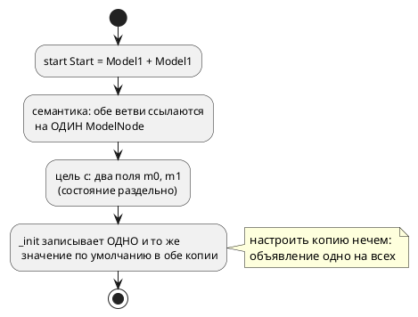
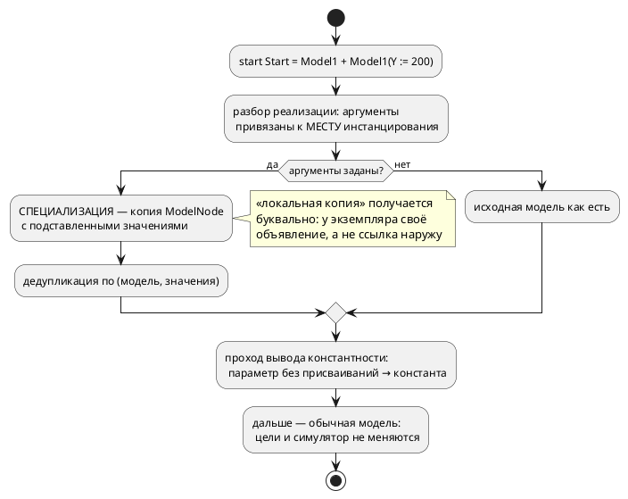

# ADR 0185: Параметризация моделей (ключевое слово `parameter`)

- **Status:** Accepted
- **Date:** 2026-07-29
- **Authors:** Архитектор + Аналитик
- **Related issues:** [Фича 0185](../features/0185-model-parameters.md); снимает ограничение О8 [анализа 0182](../analyze/0182-pid-library-and-application.md); опирается на [ADR 0026](0026-c-root-typedef.md) (структуры цели `c`), [ADR 0045](0045-sv-backend.md) (уплощение композиции), [ADR 0184](0184-imported-shared-variables.md) (усыновление импортированного поддерева)

## Context

Модель в Takt переиспользуема лишь наполовину: её можно подключить импортом и
поставить в композицию несколько раз, но **настроить каждую копию по-своему
нечем**. Всё, что объявлено внутри модели, одинаково у всех копий; всё, что
вынесено наружу, перестаёт быть её частью.

Цена видна на свежем примере. Библиотечный ПИД
([`examples/pid_law.takt`](../../examples/pid_law.takt), фича 0182) держит
коэффициенты внутри модели — и раздел документа честно пишет, что другая
настройка означает **правку библиотеки либо её копию**. Два контура с разной
настройкой в одной системе сегодня требуют двух файлов с одинаковым текстом.

### Форма, заданная заказчиком (2026-07-29, с уточнением)

```takt
model Model1 {
    var X: u8 := 100;          // переменная: живёт только внутри
    parameter Y: u8 := 100;    // параметр: 100 по умолчанию, задаётся извне
}

start Start = Model1 + Model1(Y := 200);
```

Четыре положения уточнения обязательны для решения:

1. **`parameter` — самостоятельное ключевое слово**, третья форма объявления
   наряду с `var` и `const`. Формы `var parameter` не существует.
2. **Константной формы нет.** Константность выводится семантически: параметр, не
   изменяемый в теле модели, есть константа; изменяемый — переменная с заданным
   начальным значением. Автор не обязан выбирать, компилятор видит это сам.
3. **`parameter` — локальная копия.** Значение вычисляется в месте
   инстанцирования и копируется в экземпляр; связи с внешним объявлением нет, и
   изменение внутри модели наружу не видно.
4. **Аргумент — константное выражение, а не только число** (уточнение
   2026-07-29, второе):

   ```takt
   start Start = Model1(X := Y + 1, C := 5s, D := calculate_parameter(U + 67));
   ```

   Допустимы арифметика над константными именами, литералы длительности и вызов
   **константной функции** — функции, вычислимой на этапе компиляции
   (генерации). Константность функции, как и константность параметра
   (положение 2), **выводится**, а не объявляется: функция константна, если её
   результат вычислим из одних аргументов и констант — она не читает переменные
   и порты и не зовёт `extern fn`. Невычислимый аргумент — диагностика с
   **названной** причиной (образец — `SE-072` фичи 0143), не молчаливый ноль.

### Что уже есть, а чего нет (пробы 2026-07-29)

| Факт | Проба | Следствие для решения |
|---|---|---|
| `Model1(Y := 200)` **разбирается** грамматикой как `Function(M, [Assign(y, 200)])` | компиляция входа из двух строк | правки грамматики выражений не нужны; работа — в `semantic/extend.rs` |
| объявление `parameter Y …` не разбирается (`SY-002`) | то же | новый токен → лексер, грамматика объявления, правило 29 |
| `M \| M` уже даёт **раздельные** экземпляры: `TwiceM m0; TwiceM m1;`, два узла в `--save-state` | цель `c` + симулятор | инфраструктура копий есть; не хватает **разных начальных значений** |
| константа модели в цели `c` — `#define CONST_CST_M_K 7` (**на модель**), в цели `st` — поле FB | сравнение выводов | параметр, выведенный константой, с разными значениями требует **разных моделей** |
| анализа изменяемости в семантике **нет** (`UsageSet` считает только использования) | чтение `semantic/unused.rs` | вывод константности — **новый проход**, а не даровая проверка |
| вычисления **функций** при компиляции нет; есть два узких вычислителя — адреса (0042) и выдержки `after` (0143) | чтение `address_map/eval.rs`, `semantic/condition/after_const.rs` | аргумент-вызов функции → **третий вычислитель**, побитово согласный с `takt-sim/eval` |

### Поток «как есть»



### Целевой поток



## Decision Drivers

1. **Пять потребителей дерева.** Симулятор и пять целей читают одно
   семантическое дерево. Урок 0184: механизм, требующий правки в каждом из них,
   расходится молча. Предпочтителен тот, который решает задачу **до** целей.
2. **«Локальная копия» — требование заказчика,** а не деталь реализации. Решение
   обязано давать копию буквально, без ссылок на внешнее объявление.
3. **Выведенная константа обязана остаться compile-time.** В цели `c` константа
   печатается макросом на модель; значит две настройки — две модели, иначе
   вывод константности пришлось бы отменить.
4. **Детерминизм вывода** (0048). Имена специализаций зависят только от входа, а
   не от порядка обхода: иначе два прогона дадут разный код.
5. **Обратная совместимость (правило 11).** Модели без параметров обязаны
   компилироваться байт-в-байт как раньше.
6. **Честная граница «настройка vs величина такта».** Параметр задаётся при
   сборке автомата; переменная меняется в такте. Язык обязан их различать, а не
   полагаться на дисциплину автора.

## Considered Options

### Option A. Специализация на месте инстанцирования (мономорфизация)

`M(Y := 200)` порождает **копию** `ModelNode` с подставленными значениями и
детерминированным именем; копии с одинаковым набором значений дедуплицируются.
Дальше в дереве стоит обычная модель, и ни цели, ни симулятор о параметрах не
знают.

**Pros:**
- «локальная копия» получается **буквально**: у экземпляра своё объявление
  (драйвер 2);
- выведенная константа остаётся compile-time — макрос печатается на
  специализацию (драйвер 3);
- цели и симулятор правок почти не требуют: задача решена в семантике, до них
  (драйвер 1, урок 0184);
- открывает дорогу к параметризации **размеров** (ширина вектора, длина
  массива) — не в этой фиче, но без потери такой возможности;
- потактовая сверка возможна сразу: специализация — обычная модель.

**Cons:**
- растёт число моделей в выводе: две настройки — две структуры в C;
- имена специализаций видны в порождённом коде — обязаны быть стабильными,
  читаемыми и детерминированными;
- дедупликация обязана быть по **значениям**, иначе `M(Y := 200)` в двух местах
  даст две одинаковые копии.

### Option B. Аргументы экземпляра (значения инициализации без копии модели)

`Extend::Model` несёт список аргументов; модель одна, значения подставляются при
инициализации конкретного экземпляра (в цели `c` — в `_init` поля, в `st` — в
вызов FB, в симуляторе — при построении `Unit`).

**Pros:** вывод компактнее (одна структура на модель); привычная «инстанциация с
аргументами».
**Cons:** параметр, выведенный **константой**, невыразим в цели `c` без смены
представления констант (макрос на модель) — то есть уточнение 2 пришлось бы
урезать; править нужно **все** пять потребителей — ровно тот класс работы, где
0184 показал молчаливое расхождение. Отвергается по драйверам 1 и 3.

### Option C. Гибрид: изменяемые параметры — по B, выведенные константы — по A

**Pros:** компактный вывод там, где параметр всё равно поле.
**Cons:** форма порождённого кода начинает зависеть от того, присваивают ли
параметру **где-то в теле**, — то есть невинная правка тела меняет структуру
вывода. Для пользователя это непредсказуемо, для тест-плана — удвоение.
Отвергается.

### Option D. Не вводить параметры; настройка — копией файла

**Pros:** нулевая стоимость.
**Cons:** оставляет в силе ограничение, ради снятия которого фича заведена;
копия библиотеки — известный источник расхождений.

## Decision

Принимается **Option A** — специализация на месте инстанцирования.

Механизм фиксируется так:

1. **Объявление.** `parameter ИМЯ: ТИП := ЗНАЧЕНИЕ;` — третья форма наряду с
   `var` и `const`. Инициализатор **обязателен**: это значение по умолчанию.
   (Обязательные параметры без умолчания — отдельная фича, если понадобятся.)
2. **Место объявления — только модель.** Параметр верхнего уровня файла
   инстанцировать нечем — явная диагностика.
3. **Инстанцирование.** `M(ИМЯ := ВЫРАЖЕНИЕ, …)` в выражении реализации: в
   композиции (`+`, `|`), в реализации состояния (`state S = M(…)`) и в корне
   (`start S = M(…)`). Значение — **константное выражение**, вычислимое при
   компиляции; ссылка на величину времени исполнения — ошибка. Константное
   выражение — это (положение 4 уточнения): литералы (число, бит, длительность —
   `5s` пересчитывается по правилам 0183), имена констант, видимых в месте
   инстанцирования, арифметика над ними и вызовы **константных функций**
   (`D := calculate_parameter(U + 67)`), вычисляемые компилятором до значения.
   Константность функции выводится по её телу (только аргументы и константы, ни
   переменных, ни портов, ни `extern fn`); вычислитель ограничен пределом
   шагов/глубины (образец — `MAX_NESTING_DEPTH`/`SE-062`), выход за предел и
   любая невычислимость — диагностика с названной причиной.
4. **Семантика — копия.** Каждый набор значений задаёт свою специализацию;
   специализации с одинаковым набором — одна и та же модель (дедупликация по
   ключу «исходная модель + значения в объявленном порядке»). Внутри модели
   параметр ведёт себя как обычное объявление: изменение видно только этому
   экземпляру.
5. **Имя специализации** детерминировано и производно от исходного имени и
   значений; полагаться на его конкретный вид не вправе никто, кроме гейта
   воспроизводимости (0048).
6. **Константность выводится**, а не объявляется: отдельный проход отмечает
   параметры, которым в теле модели **ни разу не присваивают**. Такой параметр
   эмитируется как константа (в цели `c` — макрос на специализацию), прочие — как
   переменные с начальным значением. ⚠️ Проход обязан считать присваивания во
   **всех** телах (блоки состояний, `always`/`enter`/`exit`, функции модели,
   тела вложенных операторов) — пропуск сделает изменяемый параметр константой,
   и вывод станет молча неверным.
7. **Модель без параметров и вызов без аргументов** ведут себя ровно как сегодня;
   вывод для существующего корпуса обязан остаться байт-в-байт прежним.

### Что остаётся за границей фичи

- **Обязательные параметры** без значения по умолчанию;
- **параметры-типы** (`model M<T>`) и параметризация размеров;
- **изменение параметра в рантайме** — противоречит понятию: для этого есть
  переменные и порты;
- **параметризация функций**.

## Consequences

### Положительные

- библиотечная модель становится настраиваемой: два контура с разной настройкой
  описываются одним файлом и двумя инстанцированиями;
- снимается ограничение О8 анализа 0182 — раздел
  [`19-library`](../../book/src/19-library/index.md) заменит оговорку «настройку
  задать нельзя» рабочим приёмом;
- различение «настройка сборки» и «величина такта» получает языковое выражение;
- автор не выбирает между «константой» и «переменной» — компилятор выводит это
  сам, и одна форма объявления покрывает оба случая.

### Отрицательные / Action items

- **рост вывода**: каждая различная настройка — своя структура в цели `c` и свой
  `FUNCTION_BLOCK` в `st`;
- **имена специализаций** попадают в порождённый код и диагностики — вид
  придётся стабилизировать и задокументировать;
- **новый проход изменяемости** — код, которого сегодня нет вовсе; его неполнота
  даёт молчаливо неверный вывод (см. пункт 6 решения), поэтому он обязан быть
  исчерпывающим по узлам (образец — `semantic/import/adopt.rs`);
- **константный вычислитель выражений и функций** — тоже код, которого нет: два
  существующих вычислителя (адреса 0042, выдержки 0143) функций не зовут. Это
  **второй интерпретатор** рядом с эталонным `takt-sim/src/eval/` (инвариант
  0025), и его арифметика обязана быть **побитово той же**: переполнение — по
  0127 (беззнаковое — обёртка, знаковое — ошибка), fixed-point — по 0061,
  длительности — через `semantic::duration::value_millis` (0183). Сторож —
  сверка значений: параметр, вычисленный при компиляции, равен значению той же
  функции, исполненной симулятором;
- **корпус и документ придётся освежить** (см. ниже);
- версия языка растёт: **0.7.0 → 0.8.0** (тег `v0.7.0` уже выставлен — цикл
  закрыт; правило 22).

### Влияние на пример библиотечного ПИД (запрос заказчика)

Фича прямо улучшает пример 0182, и это **измеримо**: сегодня раздел документа
вынужден признавать ограничение, после фичи оно исчезает.

**Было** (настройка внутри модели; менять — только правкой файла):

```takt
model Pid {
    var kp: float := 0.5;
    var ki: float := 0.0625;
    var kd: float := 0.25;
    var imax: float := 32.0;
    …
}
start Main = Pid;
```

**Станет** (настройка — часть инстанцирования):

```takt
model Pid {
    parameter kp: float := 0.5;
    parameter ki: float := 0.0625;
    parameter kd: float := 0.25;
    parameter eps: float := 0.5;
    parameter imax: float := 32.0;     // не изменяется в теле → выведется константой
    var i_acc: float := 0.0;           // накопитель — величина такта, не настройка
    …
}

// Быстрый контур и медленный — одна библиотека, две настройки.
start Plant = Pid(kp := 0.8, kd := 0.4) | Pid(kp := 0.2, ki := 0.02);
```

Что это даёт:

1. **Настройка под задачу без копии файла** — прямое снятие О8; сегодня два
   контура с разной настройкой требуют двух файлов с одинаковым текстом.
2. **Границы величин становятся видимыми в тексте.** `kp`/`ki`/`kd`/`imax` —
   настройка (параметры), `i_acc`/`err`/`deriv` — величины такта (переменные).
   Сегодня и то и другое пишется `var`, и различие держится только на
   комментарии.
3. **Пределы anti-windup выведутся константами** без единого слова от автора:
   им в теле не присваивают. Это ровно тот случай, ради которого заказчик и
   отказался от отдельной константной формы.
4. **Раздел [`19-library`](../../book/src/19-library/index.md) меняет
   содержание**: абзац «Настройку регулятора нельзя задать снаружи…» заменяется
   приёмом настройки. Это **обязательная** часть работы фичи, а не побочная.
5. ⚠️ **Уставку `target` параметром делать НЕ следует.** Она меняется в работе
   (оператор задаёт режим), а параметр фиксируется при сборке. Пример обязан
   показать границу явно: `target` остаётся переменной протокола, коэффициенты
   становятся параметрами. Без этого фича соблазняет превратить в параметры всё.
6. **`examples/pid_regulator.takt` (0097) не трогается** — он про представление
   чисел; смешивать предметы нельзя (урок 0171).

### Acceptance criteria

1. `parameter` объявляется в модели; инициализатор обязателен; параметр вне
   модели — явная диагностика.
2. `M(Y := …)` работает в композиции `+`/`|`, в реализации состояния и в корне;
   неизвестное имя параметра, повтор имени, неконстантное выражение и попытка
   задать не-параметр — **каждое** со своей диагностикой.
3. Аргумент-выражение вычисляется при компиляции во всех заявленных формах:
   арифметика над константами (`X := Y + 1`), литерал длительности (`C := 5s`),
   вызов константной функции (`D := calculate_parameter(U + 67)`).
   Контр-примеры: функция, читающая переменную/порт или зовущая `extern fn`, и
   вычисление, упирающееся в предел шагов, — каждый со своей диагностикой;
   значение, вычисленное компилятором, **сверено со значением симулятора**.
4. Два экземпляра с разными значениями дают **разное** поведение: потактовая
   сверка симулятора и цели `c` на входе `M(Y := 100) | M(Y := 200)`.
5. Экземпляры с одинаковыми значениями дедуплицируются: в выводе одна структура.
6. Вывод константности работает и **проверяется в обе стороны**: параметр без
   присваиваний эмитируется как константа, параметр с присваиванием — как
   переменная (контр-пример обязателен, включая присваивание из вложенного
   оператора и из функции модели).
7. «Локальная копия» доказана прогоном: изменение параметра в одном экземпляре
   не влияет на другой и не видно снаружи.
8. Вывод для существующего корпуса **байт-в-байт прежний**; гейт
   воспроизводимости (0048) зелёный.
9. Все цели принимают вывод на параметризованном входе: `cc` под `-Wall -Werror`,
   `iec2c`, `rustc` + `clippy -D warnings`, `verilator` + `yosys`.
10. Правило 29 отработано: токен `parameter` заведён в подсветке LSP, в списке
    автодополнения и в плагине IntelliJ; ответ зафиксирован в отчёте.
11. Разделы документа обновлены, включая снятие оговорки в `19-library`; версия
    языка поднята до 0.8.0 в трёх источниках (константа, README, живой контекст).
