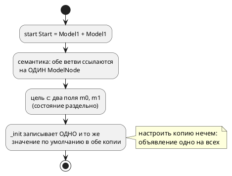
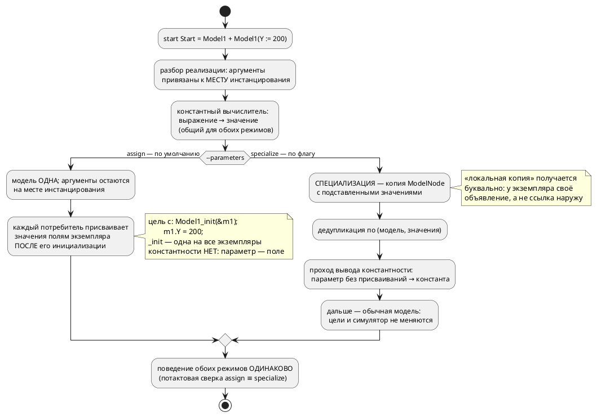

# ADR 0185: Параметризация моделей (ключевое слово `parameter`)

- **Status:** Accepted (решение пересмотрено 2026-07-30: вместо безусловной
  специализации принят гибрид по флагу генерации — см. Decision)
- **Date:** 2026-07-29, ред. 2026-07-30
- **Authors:** Архитектор + Аналитик
- **Related issues:** [Фича 0185](../features/0185-model-parameters.md); снимает ограничение О8 [анализа 0182](../analyze/0182-pid-library-and-application.md); опирается на [ADR 0026](0026-c-root-typedef.md) (структуры цели `c`), [ADR 0045](0045-sv-backend.md) (уплощение композиции), [ADR 0184](0184-imported-shared-variables.md) (усыновление импортированного поддерева)

## Context

Модель в Takt переиспользуема лишь наполовину: её можно подключить импортом и
поставить в композицию несколько раз, но **настроить каждую копию по-своему
нечем**. Всё, что объявлено внутри модели, одинаково у всех копий; всё, что
вынесено наружу, перестаёт быть её частью.

Цена видна на свежем примере. Библиотечный ПИД
([`examples/pid_law.takt`](../../examples/pid_law.takt), фича 0182) держит
коэффициенты внутри модели — и раздел документа честно пишет, что другая
настройка означает **правку библиотеки либо её копию**. Два контура с разной
настройкой в одной системе сегодня требуют двух файлов с одинаковым текстом.

### Форма, заданная заказчиком (2026-07-29, с уточнениями; последнее — 2026-07-30)

```takt
model Model1 {
    var X: u8 := 100;          // переменная: живёт только внутри
    parameter Y: u8 := 100;    // параметр: 100 по умолчанию, задаётся извне
}

start Start = Model1 + Model1(Y := 200);
```

Пять положений уточнений обязательны для решения:

1. **`parameter` — самостоятельное ключевое слово**, третья форма объявления
   наряду с `var` и `const`. Формы `var parameter` не существует.
2. **Константной формы нет.** Константность выводится семантически: параметр, не
   изменяемый в теле модели, есть константа; изменяемый — переменная с заданным
   начальным значением. Автор не обязан выбирать, компилятор видит это сам.
3. **`parameter` — локальная копия.** Значение вычисляется в месте
   инстанцирования и копируется в экземпляр; связи с внешним объявлением нет, и
   изменение внутри модели наружу не видно.
4. **Аргумент — константное выражение, а не только число** (уточнение
   2026-07-29, второе):

   ```takt
   start Start = Model1(X := Y + 1, C := 5s, D := calculate_parameter(U + 67));
   ```

   Допустимы арифметика над константными именами, литералы длительности и вызов
   **константной функции** — функции, вычислимой на этапе компиляции
   (генерации). Константность функции, как и константность параметра
   (положение 2), **выводится**, а не объявляется: функция константна, если её
   результат вычислим из одних аргументов и констант — она не читает переменные
   и порты и не зовёт `extern fn`. Невычислимый аргумент — диагностика с
   **названной** причиной (образец — `SE-072` фичи 0143), не молчаливый ноль.
5. **Два режима генерации, выбираемые флагом** (уточнение 2026-07-30, третье):

   ```sh
   taktc compile --parameters=assign     …   # по умолчанию
   taktc compile --parameters=specialize …   # копия модели на каждую настройку
   ```

   **`assign` — режим по умолчанию.** Модель одна; аргументы вычисляются при
   компиляции и **присваиваются полям конкретного экземпляра сразу после его
   инициализации**. В цели `c` это буквально `Model1_init(&self->m1);
   self->m1.Y = 200;` — функция `_init` **одна на все экземпляры**. Это заметно
   проще, и заказчик выбрал простоту умолчанием. **Цена принята им осознанно:
   константность в этом режиме не выражается** — параметр всегда поле
   экземпляра, и положение 2 эффекта в выводе не даёт.

   **`specialize` — режим по флагу.** `M(Y := 200)` порождает **копию** модели с
   подставленными значениями: свои `_init` в цели `c`, свой `FUNCTION_BLOCK` в
   `st`, и параметр без присваиваний эмитируется **константой**.

   ⚠️ **Режим меняет форму вывода, но не поведение.** Одна и та же программа под
   обоими режимами обязана давать одинаковую потактовую трассу; это сторож
   решения, а не пожелание.

### Что уже есть, а чего нет (пробы 2026-07-29)

| Факт | Проба | Следствие для решения |
|---|---|---|
| `Model1(Y := 200)` **разбирается** грамматикой как `Function(M, [Assign(y, 200)])` | компиляция входа из двух строк | правки грамматики выражений не нужны; работа — в `semantic/extend.rs` |
| объявление `parameter Y …` не разбирается (`SY-002`) | то же | новый токен → лексер, грамматика объявления, правило 29 |
| `M \| M` уже даёт **раздельные** экземпляры: `TwiceM m0; TwiceM m1;`, два узла в `--save-state` | цель `c` + симулятор | инфраструктура копий есть; не хватает **разных начальных значений** |
| константа модели в цели `c` — `#define CONST_CST_M_K 7` (**на модель**), в цели `st` — поле FB | сравнение выводов | параметр, выведенный константой, с разными значениями требует **разных моделей** |
| анализа изменяемости в семантике **нет** (`UsageSet` считает только использования) | чтение `semantic/unused.rs` | вывод константности — **новый проход**, а не даровая проверка |
| вычисления **функций** при компиляции нет; есть два узких вычислителя — адреса (0042) и выдержки `after` (0143) | чтение `address_map/eval.rs`, `semantic/condition/after_const.rs` | аргумент-вызов функции → **третий вычислитель**, побитово согласный с `takt-sim/eval` |

### Поток «как есть»



### Целевой поток



## Decision Drivers

1. **Простота умолчания.** Обычному автору нужен настраиваемый **экземпляр**, а
   не размноженные модели. Умолчание обязано быть простым в реализации и
   предсказуемым в выводе; всё, что сложнее, включается явно.
2. **Пять потребителей дерева.** Симулятор и пять целей читают одно
   семантическое дерево. Урок 0184: механизм, требующий правки в каждом из них,
   расходится молча. Механизм, который такой правки требует, обязан нести
   **сверку** — иначе он расходится молча и здесь.
3. **«Локальная копия» — требование заказчика,** а не деталь реализации.
   Изменение параметра в одном экземпляре не видно ни другому экземпляру, ни
   внешнему объявлению. Каким средством это достигнуто — копией объявления или
   полем экземпляра — заказчику безразлично; **свойство** обязательно.
4. **Выведенная константа требует копии модели.** В цели `c` константа
   печатается макросом **на модель**; значит две настройки константой выразимы
   только двумя моделями. Отсюда не следует «всегда копировать» — следует
   «константность доступна там, где копия есть».
5. **Детерминизм вывода** (0048). Имена специализаций зависят только от входа, а
   не от порядка обхода: иначе два прогона дадут разный код.
6. **Обратная совместимость (правило 11).** Модели без параметров обязаны
   компилироваться байт-в-байт как раньше — **в обоих режимах**.
7. **Честная граница «настройка vs величина такта».** Параметр задаётся при
   сборке автомата; переменная меняется в такте. Язык обязан их различать, а не
   полагаться на дисциплину автора.
8. **Режим — свойство вывода, а не программы.** Флаг генерации вправе менять
   **форму** порождённого кода, но не его поведение (граница из 0042; прецедент
   осознанного исключения — `--float-as-q` фичи 0096). Значит гибрид законен
   ровно до тех пор, пока режимы сверяются потактово.

## Considered Options

### Option A. Специализация на месте инстанцирования (мономорфизация)

`M(Y := 200)` порождает **копию** `ModelNode` с подставленными значениями и
детерминированным именем; копии с одинаковым набором значений дедуплицируются.
Дальше в дереве стоит обычная модель, и ни цели, ни симулятор о параметрах не
знают.

**Pros:**
- «локальная копия» получается **буквально**: у экземпляра своё объявление
  (драйвер 3);
- выведенная константа остаётся compile-time — макрос печатается на
  специализацию (драйвер 4);
- цели и симулятор правок почти не требуют: задача решена в семантике, до них
  (драйвер 2, урок 0184);
- открывает дорогу к параметризации **размеров** (ширина вектора, длина
  массива) — не в этой фиче, но без потери такой возможности;
- потактовая сверка возможна сразу: специализация — обычная модель.

**Cons:**
- растёт число моделей в выводе: две настройки — две структуры в C;
- имена специализаций видны в порождённом коде — обязаны быть стабильными,
  читаемыми и детерминированными;
- дедупликация обязана быть по **значениям**, иначе `M(Y := 200)` в двух местах
  даст две одинаковые копии;
- **дороже в реализации**, чем присваивание полю: копирование дерева, схема
  имён, дедупликация — код, которого нет вовсе.

### Option B. Аргументы экземпляра (значения инициализации без копии модели)

`Extend::Model` несёт список аргументов; модель одна, значения присваиваются
полям **конкретного экземпляра сразу после его инициализации** (в цели `c` —
`Model1_init(&self->m1); self->m1.Y = 200;` при **одной** `_init` на все копии,
в `st` — присваивание полям экземпляра FB, в симуляторе — при построении `Unit`).

**Pros:**
- **заметно проще**: ни копий дерева, ни схемы имён, ни дедупликации — значение
  ложится в уже существующее поле (драйвер 1);
- вывод компактнее: одна структура и одна `_init` на модель независимо от числа
  настроек;
- привычная «инстанциация с аргументами», предсказуемая по форме вывода;
- «локальная копия» (драйвер 3) выполняется **свойством поля**: поле принадлежит
  экземпляру, изменение другому экземпляру не видно.

**Cons:**
- параметр, выведенный **константой**, невыразим: в цели `c` константа — макрос
  на модель, а модель одна. Положение 2 уточнения в этом режиме **эффекта в
  выводе не даёт**;
- следствие того же: `parameter` **нельзя употребить там, где язык требует
  compile-time величины** — `after PARAM` (0143), размер массива, бит адреса
  порта;
- править нужно **все** пять потребителей — тот класс работы, где 0184 показал
  молчаливое расхождение (драйвер 2).

### Option C. Гибрид по признаку изменяемости: изменяемые параметры — по B, выведенные константы — по A

**Pros:** компактный вывод там, где параметр всё равно поле.
**Cons:** форма порождённого кода начинает зависеть от того, присваивают ли
параметру **где-то в теле**, — то есть невинная правка тела меняет структуру
вывода. Для пользователя это непредсказуемо, для тест-плана — удвоение.
Отвергается. ⚠️ Не путать с Option E: там режим выбирает **человек флагом**, и
правка тела форму вывода не меняет.

### Option D. Не вводить параметры; настройка — копией файла

**Pros:** нулевая стоимость.
**Cons:** оставляет в силе ограничение, ради снятия которого фича заведена;
копия библиотеки — известный источник расхождений.

### Option E. Гибрид по флагу генерации: B по умолчанию, A по `--parameters=specialize`

Оба механизма реализуются; какой применить — решает **флаг генерации**, единый
на прогон. Умолчание — B (просто, компактно, без константности); A включается
явно там, где нужны compile-time значения.

**Pros:**
- умолчание простое (драйвер 1), а сложная машинерия не навязана тем, кому она
  не нужна;
- константность (драйвер 4) не отменена, а **отложена до флага** — уточнение 2
  остаётся в языке целиком;
- «локальная копия» (драйвер 3) обеспечивается в обоих режимах, разными
  средствами;
- флаг меняет форму, а не поведение (драйвер 8) — и это **проверяемо**.

**Cons:**
- **два пути кодогена вместо одного** — главная цена: они обязаны совпадать по
  поведению, а совпадение двух реализаций одного смысла в этом проекте уже
  расходилось молча (0042: «арифметика — в одном месте»; 0090: два источника
  истины у гейтов);
- тест-план удваивается по всем критериям, где форма вывода различна;
- пользователь обязан **знать про флаг**: не включил — не получил константы;
  включил без нужды — распух вывод. Смягчается диагностикой (см. решение, п. 8).

## Decision

Принимается **Option E** — гибрид по флагу генерации: **`--parameters=assign` по
умолчанию, `--parameters=specialize` по требованию** (решение заказчика
2026-07-30). Прежняя редакция ADR принимала Option A безусловно; она заменена.

Механизм фиксируется так:

1. **Объявление.** `parameter ИМЯ: ТИП := ЗНАЧЕНИЕ;` — третья форма наряду с
   `var` и `const`. Инициализатор **обязателен**: это значение по умолчанию.
   (Обязательные параметры без умолчания — отдельная фича, если понадобятся.)
2. **Место объявления — только модель.** Параметр верхнего уровня файла
   инстанцировать нечем — явная диагностика.
3. **Инстанцирование.** `M(ИМЯ := ВЫРАЖЕНИЕ, …)` в выражении реализации: в
   композиции (`+`, `|`), в реализации состояния (`state S = M(…)`) и в корне
   (`start S = M(…)`). Значение — **константное выражение**, вычислимое при
   компиляции; ссылка на величину времени исполнения — ошибка. Константное
   выражение — это (положение 4 уточнения): литералы (число, бит, длительность —
   `5s` пересчитывается по правилам 0183), имена констант, видимых в месте
   инстанцирования, арифметика над ними и вызовы **константных функций**
   (`D := calculate_parameter(U + 67)`), вычисляемые компилятором до значения.
   Константность функции выводится по её телу (только аргументы и константы, ни
   переменных, ни портов, ни `extern fn`); вычислитель ограничен пределом
   шагов/глубины (образец — `MAX_NESTING_DEPTH`/`SE-062`), выход за предел и
   любая невычислимость — диагностика с названной причиной.
4. **Пункты 1–3 общие для обоих режимов.** Объявление, места инстанцирования и
   константный вычислитель от флага **не зависят**: флаг решает, во что
   превращается уже вычисленное значение, а не как оно получено.
5. **Режим `assign` (умолчание).** Модель в дереве **одна**; аргументы остаются
   привязанными к месту инстанцирования и потребляются каждым потребителем при
   инициализации экземпляра — значение присваивается полю **после** вызова
   инициализатора (цель `c`: `Model1_init(&self->m1); self->m1.Y = 200;` при
   **одной** `_init` на все экземпляры; `st` — присваивание полям экземпляра FB;
   `rust`/`sv`/симулятор — то же при построении экземпляра). Параметр в этом
   режиме — **всегда поле**; вывод константности (п. 7) не применяется.
   «Локальная копия» обеспечивается принадлежностью поля экземпляру.
6. **Режим `specialize` (по флагу).** Каждый набор значений задаёт свою
   специализацию — копию `ModelNode` с подставленными значениями; специализации
   с одинаковым набором — одна и та же модель (дедупликация по ключу «исходная
   модель + значения в объявленном порядке»). **Имя специализации**
   детерминировано и производно от исходного имени и значений; полагаться на его
   конкретный вид не вправе никто, кроме гейта воспроизводимости (0048). Внутри
   модели параметр ведёт себя как обычное объявление: изменение видно только
   этому экземпляру.
7. **Константность выводится**, а не объявляется — **и только в режиме
   `specialize`**: отдельный проход отмечает параметры, которым в теле модели
   **ни разу не присваивают**. Такой параметр эмитируется как константа (в цели
   `c` — макрос на специализацию), прочие — как переменные с начальным значением.
   ⚠️ Проход обязан считать присваивания во **всех** телах (блоки состояний,
   `always`/`enter`/`exit`, функции модели, тела вложенных операторов) — пропуск
   сделает изменяемый параметр константой, и вывод станет молча неверным.
8. **Параметр как compile-time величина доступен только в `specialize`.** Там,
   где язык требует значения, известного при генерации (аргумент `after` —
   0143, размер массива, бит адреса порта), употребление параметра в режиме
   `assign` — **диагностика, прямо называющая режим**: «здесь требуется
   константа; параметр является константой только при
   `--parameters=specialize`». Молчаливой деградации — превращения выдержки в
   вычисляемую (0183), усечения ширины, потери адреса — быть не должно: урок
   0042, где потерянный адрес диагностировался следствием (`SE-052`), а не
   причиной.
9. **Поведение от режима не зависит.** Одна и та же программа под обоими
   режимами даёт **одинаковую потактовую трассу**. Это главный сторож гибрида:
   два пути кодогена, реализующие один смысл, расходятся молча (урок 0090 —
   два источника истины у гейтов).
10. **Флаг — `--parameters=assign|specialize`** у `taktc compile`: единый на
    прогон генерации, общий для всех целей. Точечного выбора режима для
    отдельной модели **нет** — это была бы пометка в исходнике, другой механизм,
    противоречащий «флагу при генерации». Умолчание — `assign`; неизвестное
    значение флага — ошибка CLI, а не молчаливое умолчание.
11. **Модель без параметров и вызов без аргументов** ведут себя ровно как
    сегодня; вывод для существующего корпуса обязан остаться байт-в-байт прежним
    **в обоих режимах** — то есть на непараметризованном входе флаг не
    наблюдаем вовсе.

### Что остаётся за границей фичи

- **Обязательные параметры** без значения по умолчанию;
- **параметры-типы** (`model M<T>`) и параметризация размеров;
- **изменение параметра в рантайме** — противоречит понятию: для этого есть
  переменные и порты;
- **параметризация функций**.

## Consequences

### Положительные

- библиотечная модель становится настраиваемой: два контура с разной настройкой
  описываются одним файлом и двумя инстанцированиями;
- снимается ограничение О8 анализа 0182 — раздел
  [`19-library`](../../book/src/19-library/index.typ) заменит оговорку «настройку
  задать нельзя» рабочим приёмом;
- различение «настройка сборки» и «величина такта» получает языковое выражение;
- автор не выбирает между «константой» и «переменной» — компилятор выводит это
  сам, и одна форма объявления покрывает оба случая;
- **умолчание не требует от автора ничего знать про специализацию**: настройка
  экземпляра работает сразу, а сложный режим включается тем, кому он нужен.

### Отрицательные / Action items

Общие для обоих режимов:

- **константный вычислитель выражений и функций** — код, которого нет: два
  существующих вычислителя (адреса 0042, выдержки 0143) функций не зовут. Это
  **второй интерпретатор** рядом с эталонным `takt-sim/src/eval/` (инвариант
  0025), и его арифметика обязана быть **побитово той же**: переполнение — по
  0127 (беззнаковое — обёртка, знаковое — ошибка), fixed-point — по 0061,
  длительности — через `semantic::duration::value_millis` (0183). Сторож —
  сверка значений: параметр, вычисленный при компиляции, равен значению той же
  функции, исполненной симулятором;
- **два пути кодогена** — главная цена гибрида: они обязаны совпадать по
  поведению. Сторож — потактовая сверка `assign` ≡ `specialize` на одном входе
  (пункт 9 решения); без неё расхождение будет молчаливым;
- **тест-план удваивается** по всем критериям, где форма вывода различна;
- **корпус и документ придётся освежить** (см. ниже), причём документ обязан
  объяснить **оба** режима и границу между ними — иначе пользователь не поймёт,
  почему его параметр «вдруг не константа»;
- версия языка растёт: **0.7.0 → 0.8.0** (тег `v0.7.0` уже выставлен — цикл
  закрыт; правило 22).

Цена режима `assign` (умолчание):

- **правка всех пяти потребителей** — тот класс работы, где 0184 показал
  молчаливое расхождение: пропустивший потребитель просто не применит настройку,
  и экземпляр молча заработает со значением по умолчанию. Сторож — сверка
  значений, а не факт компиляции;
- **константность недоступна**: параметр — всегда поле. Положение 2 уточнения
  в этом режиме в выводе не проявляется;
- **параметр непригоден там, где нужна compile-time величина** (`after PARAM`,
  размер массива, бит адреса). Требуется **новая диагностика**, называющая
  режим (пункт 8 решения), — иначе пользователь получит отказ, из которого не
  видно, что лечится флагом.

Цена режима `specialize` (по флагу):

- **рост вывода**: каждая различная настройка — своя структура в цели `c` и свой
  `FUNCTION_BLOCK` в `st`;
- **имена специализаций** попадают в порождённый код и диагностики — вид
  придётся стабилизировать и задокументировать;
- **новый проход изменяемости** — код, которого сегодня нет вовсе; его неполнота
  даёт молчаливо неверный вывод (см. пункт 7 решения), поэтому он обязан быть
  исчерпывающим по узлам (образец — `semantic/import/adopt.rs`).

### Влияние на пример библиотечного ПИД (запрос заказчика)

Фича прямо улучшает пример 0182, и это **измеримо**: сегодня раздел документа
вынужден признавать ограничение, после фичи оно исчезает.

**Было** (настройка внутри модели; менять — только правкой файла):

```takt
model Pid {
    var kp: float := 0.5;
    var ki: float := 0.0625;
    var kd: float := 0.25;
    var imax: float := 32.0;
    …
}
start Main = Pid;
```

**Станет** (настройка — часть инстанцирования):

```takt
model Pid {
    parameter kp: float := 0.5;
    parameter ki: float := 0.0625;
    parameter kd: float := 0.25;
    parameter eps: float := 0.5;
    parameter imax: float := 32.0;     // не изменяется в теле → константа (под specialize)
    var i_acc: float := 0.0;           // накопитель — величина такта, не настройка
    …
}

// Быстрый контур и медленный — одна библиотека, две настройки.
start Plant = Pid(kp := 0.8, kd := 0.4) | Pid(kp := 0.2, ki := 0.02);
```

Что это даёт:

1. **Настройка под задачу без копии файла** — прямое снятие О8; сегодня два
   контура с разной настройкой требуют двух файлов с одинаковым текстом.
2. **Границы величин становятся видимыми в тексте.** `kp`/`ki`/`kd`/`imax` —
   настройка (параметры), `i_acc`/`err`/`deriv` — величины такта (переменные).
   Сегодня и то и другое пишется `var`, и различие держится только на
   комментарии.
3. **Пределы anti-windup выведутся константами** без единого слова от автора:
   им в теле не присваивают. Это ровно тот случай, ради которого заказчик и
   отказался от отдельной константной формы. ⚠️ Но проявится это **только под
   `--parameters=specialize`**; в умолчании `assign` `imax`/`eps` останутся
   полями экземпляра. Пример обязан показать оба вывода — иначе документ обещает
   константы, а сборка по умолчанию их не даёт.
4. **Раздел [`19-library`](../../book/src/19-library/index.typ) меняет
   содержание**: абзац «Настройку регулятора нельзя задать снаружи…» заменяется
   приёмом настройки. Это **обязательная** часть работы фичи, а не побочная.
5. ⚠️ **Уставку `target` параметром делать НЕ следует.** Она меняется в работе
   (оператор задаёт режим), а параметр фиксируется при сборке. Пример обязан
   показать границу явно: `target` остаётся переменной протокола, коэффициенты
   становятся параметрами. Без этого фича соблазняет превратить в параметры всё.
6. **`examples/pid_regulator.takt` (0097) не трогается** — он про представление
   чисел; смешивать предметы нельзя (урок 0171).

### Acceptance criteria

1. `parameter` объявляется в модели; инициализатор обязателен; параметр вне
   модели — явная диагностика.
2. `M(Y := …)` работает в композиции `+`/`|`, в реализации состояния и в корне;
   неизвестное имя параметра, повтор имени, неконстантное выражение и попытка
   задать не-параметр — **каждое** со своей диагностикой.
3. Аргумент-выражение вычисляется при компиляции во всех заявленных формах:
   арифметика над константами (`X := Y + 1`), литерал длительности (`C := 5s`),
   вызов константной функции (`D := calculate_parameter(U + 67)`).
   Контр-примеры: функция, читающая переменную/порт или зовущая `extern fn`, и
   вычисление, упирающееся в предел шагов, — каждый со своей диагностикой;
   значение, вычисленное компилятором, **сверено со значением симулятора**.
4. Два экземпляра с разными значениями дают **разное** поведение: потактовая
   сверка симулятора и цели `c` на входе `M(Y := 100) | M(Y := 200)` — **в обоих
   режимах**.
5. **Режим `assign` (умолчание) в тексте вывода:** одна структура и **одна**
   `_init` на модель, значения — присваиваниями полям экземпляра **после**
   вызова инициализатора; ни одного `#define` на параметр. Проверяется текстом
   порождённого C, а не только фактом сборки.
6. **Режим `specialize` в тексте вывода:** разные значения → разные структуры и
   разные `_init`; одинаковые значения → **одна** структура (дедупликация
   проверяет **число** структур).
7. **Сверка режимов:** одна и та же программа, собранная с `--parameters=assign`
   и `--parameters=specialize`, даёт **одинаковую потактовую трассу** (и обе
   совпадают с симулятором). Главный сторож гибрида.
8. Вывод константности работает **в режиме `specialize`** и **проверяется в обе
   стороны**: параметр без присваиваний эмитируется как константа, параметр с
   присваиванием — как переменная (контр-пример обязателен, включая присваивание
   из вложенного оператора и из функции модели).
9. **Параметр там, где нужна compile-time величина** (`after PARAM`, размер
   массива, бит адреса): под `specialize` — работает, под `assign` —
   диагностика, **называющая режим**; молчаливой деградации нет.
10. «Локальная копия» доказана прогоном **в обоих режимах**: изменение параметра
    в одном экземпляре не влияет на другой и не видно снаружи.
11. Вывод для существующего корпуса **байт-в-байт прежний в обоих режимах** (на
    непараметризованном входе флаг не наблюдаем); гейт воспроизводимости (0048)
    зелёный для обоих значений флага.
12. Неизвестное значение `--parameters=` — ошибка CLI с перечислением
    допустимых, а не молчаливое умолчание.
13. Все цели принимают вывод на параметризованном входе **в обоих режимах**:
    `cc` под `-Wall -Werror`, `iec2c`, `rustc` + `clippy -D warnings`,
    `verilator` + `yosys`.
14. Правило 29 отработано: токен `parameter` заведён в подсветке LSP, в списке
    автодополнения и в плагине IntelliJ; ответ зафиксирован в отчёте.
15. Разделы документа обновлены, включая снятие оговорки в `19-library`;
    **описаны оба режима и граница между ними**; версия языка поднята до 0.8.0 в
    трёх источниках (константа, README, живой контекст).
