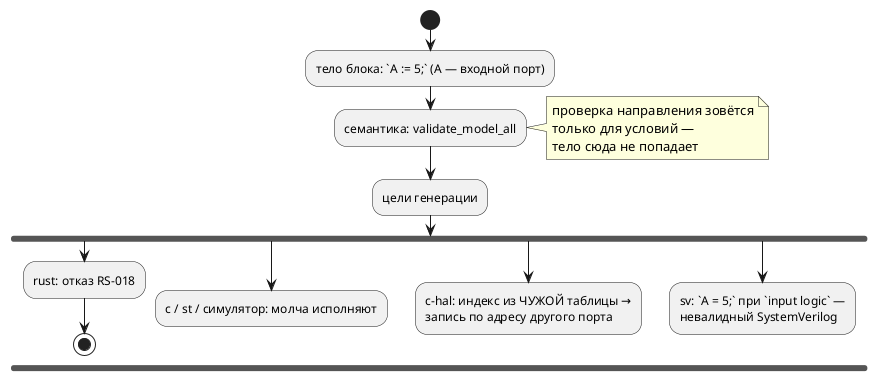

# ADR 0188: Направление порта проверяется во всех позициях

- **Status:** Accepted (решение заказчика 2026-07-31 — ось 3 проработки 0187)
- **Date:** 2026-07-31
- **Authors:** Системный аналитик, архитектор
- **Related issues:** [Фича 0188](../features/0188-port-direction-everywhere.md); ось 3 [ADR 0187](0187-port-io-redesign.md); опирается на [0020](0020-port-address-decl.md)

## Context

Язык объявляет: во входной порт писать нельзя (`SE-026`), из выходного читать
нельзя (`SE-027`). Правило реализовано в `validate/common.rs::validate_expression`,
но зовётся **только** из `validate_cond`/`validate_conditions` — то есть работает
на условиях переходов и именованных условиях. Тела блоков, тела функций и
инициализаторы не обходятся.

Проба 2026-07-31 (`always { A := 5; t := B; }` при `in A`, `out B`) показала, во
что это обходится: диагностики нет, а шесть потребителей расходятся —
подробности в [карточке фичи](../features/0188-port-direction-everywhere.md).
Худший исход у `c-hal`: индексы перечислений портов нумеруются **внутри своего
направления**, поэтому `write_numeric(A, …)` попадает в таблицу выходов по
индексу `A` и пишет **по адресу другого порта**. Гейт `cc -c` такой код
принимает: он безупречен синтаксически.

## Decision Drivers

1. **Молча неверный продукт — худший класс дефекта.** Запись по адресу чужого
   порта не отличима от правильной работы до появления железа.
2. **Правило уже объявлено.** Речь не о новой строгости, а о том, чтобы
   объявленное правило работало везде: сегодня язык обещает одно, а принимает
   другое.
3. **Цели не должны расходиться.** Сейчас единственная цель, ловящая нарушение
   (`rust`), ловит его случайно — потому что у неё направление выражено типом
   трейта, а не потому, что компилятор проверил.
4. **Цена миграции нулевая.** Нарушений нет ни в корпусе, ни в документе
   (проверено).

## Considered Options

### Option A. Распространить существующую проверку на все позиции

Обойти тела именованных блоков модели и состояний, тела функций и инициализаторы,
вызывая ту же `validate_expression`.

**Pros:**
- Правило остаётся **в одном месте** — новая проверка не решает заново, что
  законно, а лишь доставляет выражения существующему судье.
- Ошибка вместо тишины у всех целей сразу; расхождение целей исчезает как класс.

**Cons:**
- Требует правки самого судьи: ветка `Assign` рекурсирует в левую часть, поэтому
  законное `led := 1;` для `out led` дало бы `SE-027`. Исключение сегодня
  написано только для `BitAccess` — его надо обобщить на `Variable`.

### Option B. Ловить нарушение в каждой цели

**Pros:** цель знает свои возможности (`rust` так и делает).
**Cons:** шесть реализаций одного правила — ровно тот источник расхождения,
который фича закрывает. Отвергнуто.

### Option C. Разрешить чтение выхода, введя смягчение (аналог `buffer` в VHDL)

**Pros:** удобно там, где выход используют как «вспомнить, что выдали».
**Cons:** новая форма языка; заказчик отложил обсуждение форм до решения по осям
1–2 (ADR 0187). Вне объёма.

## Decision

Принимается **Option A**.

1. **Ветка `Assign` перестаёт считать левую часть чтением** — исключение
   обобщается с `BitAccess(Variable)` на `Variable` и `BitAccess(Variable)`.
   Иначе законная запись в выход стала бы ошибкой.
2. **Заводится проход `check_port_directions`** (`semantic/validate/`), который
   обходит тела именованных блоков модели и состояний, тела функций,
   инициализаторы переменных и вложенные модели, вызывая для каждого выражения
   существующую `validate_expression`. Накопление — по выражениям (одна ошибка
   на выражение), по образцу `literal_range` (0157).
3. **`inout` не затрагивается**: и чтение, и запись остаются законными.
4. **Смягчения не вводится** (Option C) — вопрос остаётся за ADR 0187.

## Consequences

### Положительные

- Нарушение направления перестаёт быть молчаливым в пяти потребителях из шести.
- Устраняется класс «запись по адресу другого порта» в `c-hal` и «невалидный
  модуль» в `sv` — конструктивно, а не проверкой каждой цели.
- `RS-018` цели `rust` становится недостижимым из компилятора (семантика
  отвергает раньше) — сторож остаётся как защита от прямого вызова генератора.

### Отрицательные / Action items

- **Программа, сегодня собираемая, может перестать собираться.** В корпусе и
  документе таких нет, но у пользователей могут быть — это ломающее изменение
  поведения (не синтаксиса). Версия языка не поднимается: `0.8.0` не выпущена,
  изменения накапливаются в неё (правило 22).
- **Чтение выхода становится невозможным вовсе** — до решения по ADR 0187
  обходной приём один: завести переменную, писать в неё и в порт.
- **`RS-018` рискует стать «мёртвым» кодом**: он должен остаться, но его тест —
  единственное, что его достигает. Помечается в реестре диагностик как
  достижимый только через прямой вызов генератора.

### Acceptance criteria

1. `always { A := 5; }` при `in A` → `SE-026` (цель значения не имеет).
2. `always { t := B; }` при `out B` → `SE-027`.
3. `always { B := 1; }` при `out B` — **законно** (регресс не допускается).
4. `always { B.0 := 1; }` при `out B: bit` — законно.
5. Нарушение внутри тела функции и внутри `if`/`loop`/`for` — тоже диагностика.
6. `inout` читается и пишется без диагностик.
7. Корпус и документ: `precheck.sh` зелёный, вывод генераторов байт-в-байт
   прежний.
