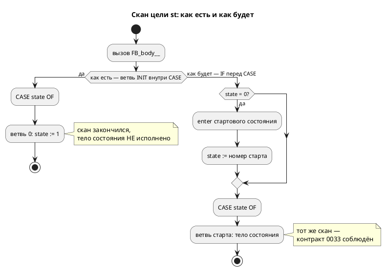

# ADR 0191: Цель `st` — потактовая сверка с эталоном и устранение расхождений

- **Status:** **Accepted** — Option A, 2026-08-02 (реализовано и закрыто той же датой)
- **Date:** 2026-08-02
- **Authors:** Архитектор + Аналитик
- **Related issues:** [Фича 0191](../features/0191-st-per-tick-conformance.md);
  связь с [ADR 0033](0033-init-tick-alignment.md) (вход в стартовое состояние не
  расходует такт), [ADR 0041](0041-st-backend.md) (бэкенд ST),
  [ADR 0078](0078-bit-array-semantics.md) (`[bit;N]` — упакованный скаляр)

## Context

Цель `st` расходится с эталоном **молча**, в двух независимых местах. Оба
воспроизведены пробами 2026-08-02.

### Р1. Синтетическое `INIT` расходует скан на каждом уровне вложенности

Вход: `model Blinker { out lamp: u8 at 0x600; var n: u8 := 7; start Run { always
{ n := n + 1; lamp := n; } } } start Main = Blinker;`

Замер трассы выходного порта (драйвер: `taktc -t st` → `iec2c` → `POUS.c` +
`cc`, печать **каждый** скан):

| Сторона | Трасса `lamp` |
|---|---|
| эталон (симулятор) | `8` уже на такте 1 |
| цель `c` | `8` уже на такте 1 (диспетчеризует `INIT` **до** `switch`) |
| цель `st` | **`0 0 8 8 8 8 8`** — два холостых скана |

Сдвиг равен **глубине вложенности**: каждый уровень эмитит собственную ветвь
`0: (* INIT *) state := 1;` **внутри** `CASE`, а `CASE` в IEC не проваливается в
следующую ветвь. Это ровно тот дефект, который фича
[0033](../features/0033-init-tick-alignment.md) устранила в цели `c` и объявила
**контрактом для будущих бэкендов** («не воспроизводить чужие `INIT`-такты»);
цель `st` (0041) его воспроизвела.

Цена: ПЛК отрабатывает первые N сканов вхолостую — при вложенности 3 это три
скана, на которых выходы держат нули. `iec2c` вывод принимает: он проверяет
валидность, а не верность.

### Р2. Инициализатор переменной типа `[bit;N]` теряется

Вход: `var small: [bit;8] := 255;` рядом с `var plain: u8 := 7;`

| Сторона | Результат |
|---|---|
| эталон | `small = 255` |
| цель `c` | `model->small = 255;` |
| цель `st` | `small : USINT;` — **без значения** (`plain : USINT := 7;` рядом) |

Причина найдена чтением: `st_decl.rs::literal_init` глушит инициализатор у
**любого** `TypeNode::Array` — и это верно для настоящих массивов (`iec2c`
отвергает `ARRAY [0..3] OF USINT := 0`), но `[bit;N≤64]` по
[0078](0078-bit-array-semantics.md) массивом **не является**: это упакованный
скаляр, и `get_st_type` печатает его как `USINT`/`UINT`/… через
`semantic::bit_vector`. То есть тип уже знает про упаковку, а инициализатор —
ещё нет.

### Почему оба дефекта дожили

`takt-sim/tests/conformance_st_tests.rs` крутит обе стороны **до завершения** и
сверяет только установившиеся значения. Сдвиг на N сканов в такой сверке
невидим **по построению**. Потактовой сверки `st` нет — смежный долг записан
кандидатом ещё при закрытии
[0183](../features/0183-duration-type-in-targets.md).

## Decision Drivers

1. **Контракт 0033 — обязательство, а не пожелание.** Он записан как контракт
   **для будущих бэкендов**; цель, которая его нарушает, делает несравнимыми
   эталон и продукт.
2. **Доказывать поведением, а не компиляцией.** `iec2c` принял неверный вывод —
   как принял его verilator у 0045 и rustc у 0050. Сверка обязана смотреть на
   трассу.
3. **Сверка и починка неразделимы.** Ввести сверку без починки — красный
   предкоммит; починить без сверки — недоказуемо. Значит одна фича.
4. **Не ломать то, что уже принято `iec2c`.** Корпус проходит гейт ST 8/8;
   новая форма обязана сохранить это.
5. **Правило 11.** Форма вывода цели `st` меняется — дифф корпуса
   просматривается, а не принимается на веру.

## Considered Options

### Option A. `IF state = 0 THEN … END_IF;` перед `CASE`

Прямой аналог цели `c` (`if (model->state == …_INIT) { … }` до `switch`): ветвь
`INIT` выносится из `CASE` в предшествующий `IF`, после чего тот же скан
попадает в ветвь стартового состояния.

**Pros:**
- **измерено**: `iec2c` форму принимает (код 0), трасса становится
  `8 8 8 8 8 8 8` — как у эталона и цели `c`;
- изменение локально: одна функция `st_model.rs`, состав ветвей `CASE` прежний
  минус ветвь `0`;
- узнаваемо для читателя порождённого ST: явный «первый скан» вместо
  синтетического состояния, о котором надо догадаться.

**Cons:**
- форма вывода меняется — дифф по всем восьми файлам корпуса;
- номер `0` перестаёт встречаться в `CASE`, хотя `state` по-прежнему
  инициализируется нулём: связь «0 = ещё не входили» остаётся, но выражена в
  другом месте.

### Option B. Убрать синтетическое состояние: `state : USINT := <номер старта>`

Инициализировать `state` сразу номером стартового состояния, а блок `enter`
перенести в инициализацию.

**Pros:**
- `CASE` становится ровно перечнем состояний, без служебных ветвей.

**Cons:**
- **`enter` исполнить негде.** `iec2c` порождает `_init__`, выставляющий
  объявленные начальные значения; пользовательского кода там нет. Значит `enter`
  пришлось бы исполнять под флагом «первый скан» — то есть под тем же `INIT`,
  только переименованным;
- у моделей **без** `enter` вариант работал бы, у моделей с `enter` — нет:
  поведение цели зависело бы от наличия блока, что хуже единообразия.

### Option C. Оставить как есть, задокументировать сдвиг

**Pros:**
- нулевая стоимость, дифф корпуса не меняется.

**Cons:**
- контракт 0033 остаётся нарушенным, и это **молчаливое** расхождение эталона с
  продуктом — ровно тот класс, ради которого фича заведена Tier 1;
- документированное расхождение не спасает ПЛК от холостых сканов.

## Decision

Принимается **Option A** для Р1.

Единственный вариант, который восстанавливает контракт 0033 и **измерен**: форма
принята `iec2c`, трасса совпала с эталоном и целью `c`. Option B разбивается о
то, что исполнять `enter` в ST негде, кроме тела скана; Option C оставляет
молчаливое расхождение, ради устранения которого фича и заведена.

Для **Р2** отдельного варианта не требуется: `literal_init` обязан глушить
инициализатор у настоящих составных типов и **не** глушить у упакованного
бит-вектора. Признак берётся из **того же** слоя, которым уже пользуется
`get_st_type` — `semantic::bit_vector::is_bit_vector`; заводить второе правило
упаковки нельзя (оно разъедется с печатью типа, и объявление получит значение
не той ширины).

**Сверка вводится вместе с починкой**, а не после: наблюдаемой точкой становится
значение **на каждом скане**, а не установившееся.

## Consequences

### Положительные

- контракт 0033 соблюдают все шесть целей, а не пять;
- `[bit;N]` в цели `st` получает объявленное значение;
- у цели `st` появляется потактовая сверка — закрывается смежный долг 0183 в
  части `st`;
- порождённый ST становится честнее: «первый скан» виден явно.

### Отрицательные / Action items

- **Дифф корпуса `examples/generated/st`** — просмотреть поштучно; генерация
  детерминирована ([0048](0048-deterministic-codegen.md)), поэтому дифф несёт
  смысл.
- Тест `st_model.rs`, стоящий на форме `0: (* INIT *)`, обязан быть **переписан**
  на новую форму, а не удалён.
- ⚠️ Сверка `st` дороже прочих: `iec2c` + `cc` + запуск. Смежный кандидат
  «сверки через `mmap` стоят ~90 с» предупреждает, что время предкоммита —
  ресурс; новая сверка должна остаться одиночной, а не разрастись на корпус.
- Потактовая сверка цели **`sv`** этой фичей не вводится — остаток долга 0183
  сохраняется и остаётся кандидатом.

### Acceptance criteria

1. Трасса выходного порта порождённого ST на фикстуре Р1 равна трассе эталона
   **такт в такт**, а не только в установившемся значении.
2. Сдвиг отсутствует при вложенности ≥ 2 (фикстура `Main = Blinker`).
3. `var small: [bit;8] := 255;` даёт в ST `small : USINT := 255;`, и значение
   наблюдается прогоном.
4. Настоящий массив (`var data: [u8;4] := 0;`) инициализатора по-прежнему **не**
   получает — иначе `iec2c` отвергнет объявление.
5. Гейт `iec2c` по корпусу зелёный (8/8), дифф `examples/generated/st`
   просмотрен и объяснён.
6. `./scripts/precheck.sh` зелёный; цели, кроме `st`, вывод не изменили.
