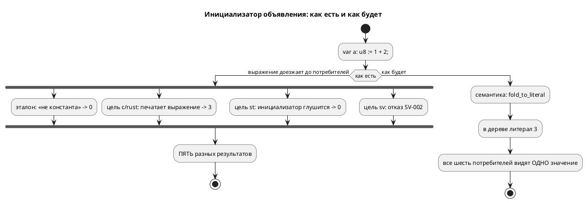

# ADR 0192: Константное выражение в инициализаторе объявления

- **Status:** **Accepted** — Option D, решение заказчика 2026-08-02 (аналитик рекомендовал A)
- **Date:** 2026-08-02
- **Authors:** Архитектор + Аналитик
- **Related issues:** [Фича 0192](../features/0192-const-init-fold.md); связь с
  [ADR 0187](0187-port-io-redesign.md) (тот же приём **уже применён к портам**),
  [ADR 0143](0143-after-const-duration.md) (константная выдержка сворачивается
  на семантике), [ADR 0185](0185-model-parameters.md) (общий константный
  вычислитель `semantic/const_eval/`)

## Context

Одно и то же объявление даёт **пять разных** результатов. Замер 2026-08-02,
вход `var a: u8 := 1 + 2;`:

| Сторона | Что получается | Класс |
|---|---|---|
| эталон (симулятор) | `a = 0` | **молча неверно** |
| цель `c` | `model->a = 1 + 2;` → 3 | верно |
| цель `rust` | `a: (1 + 2)` → 3 | верно |
| цель `st` | `a : USINT;` — **без значения** → 0 | **молча неверно** |
| цель `sv` | отказ `SV-002` («ветвь сброса выражений не вычисляет») | громкий отказ |

То есть расходятся не «эталон и цель», а **все со всеми**: две цели правы, одна
молча теряет, одна отказывает, эталон молча зануляет.

Другие формы того же класса (замерены):

| Вход | эталон | цель `c` |
|---|---|---|
| `var u: u8 := ~0;` | `0` | `~0` → 255 |
| `var n: [bit;64] := ~0;` | все нули | — |
| `var b: u8 := a + 1;` (ссылка на переменную) | `0` | `model->a + 1` → 6 |

⚠️ Запись кандидата утверждала, что `[bit;64] := ~0` падает `SIM-006`. Это
**устарело**: сейчас там молчаливые нули, то есть поведение стало **хуже**
(громкий отказ сменился тихой неверностью).

⚠️ Корпус чист: единственные «сложные» инициализаторы — `-32.0` в `pid_law` и
`pid_regulator`, и это **отрицательный литерал**, а не унарная операция;
эталон даёт −32. Живого дефекта в корпусе нет.

### Причина

`takt-sim/src/unit/initial.rs` относит унарные и бинарные операции к «не
константа» — с комментарием «свёртка принадлежит семантике». **А семантика её
не делает.** Переменная молча получает значение по умолчанию.

### Приём уже существует — и уже применён

Фича [0187](../features/0187-port-io-redesign.md) решила ровно эту задачу для
**портов**: `semantic/declaration.rs::resolve_port_init` сворачивает начальное
значение порта в литерал через `const_eval::fold_to_literal`, а невычислимое
отвергает `SE-094`. Обоснование записано там же:

> «Свёртка снимает вопрос целиком: за границей семантики выражения не
> существует, разойтись целям не по чему».

К `var`/`const` тот же приём просто не применили.

### Что даёт свёртка — измерено

Тот же вход, но с литералом (`var a: u8 := 3;`):

| Сторона | Результат |
|---|---|
| эталон | `a = 3` ✅ |
| цель `st` | `a : USINT := 3;` ✅ |
| цель `sv` | компилируется ✅ |

То есть свёртка чинит **все пять** расхождений одной правкой, а не примиряет две
стороны из пяти.

## Decision Drivers

1. **Расхождение молчаливое и множественное.** Две стороны из пяти дают неверное
   значение без единой диагностики — это Tier 1 по классификации проекта.
2. **Знание должно жить в одном месте.** Константный вычислитель уже есть
   (`const_eval`, фича 0185) и уже применяется к портам и к выдержке `after`.
   Учить сворачивать ещё и симулятор — это **четвёртый** текст правил арифметики
   (уроки 0042 и фикса 0134-01).
3. **Прецедент задан и обоснован.** 0187 уже провела эту границу для портов;
   разное правило для порта и переменной было бы произволом.
4. **Цена в корпусе нулевая** — арифметических инициализаторов в нём нет.
5. **Правило 11.** Форма может стать строже; что именно перестанет
   компилироваться, обязано быть названо.

## Considered Options

### Option A. Сворачивать в семантике; невычислимое — диагностика

`var`/`const` получают ту же обработку, что порты в 0187: инициализатор
сворачивается `const_eval::fold_to_literal`, невычислимое отвергается
диагностикой с названной причиной.

**Pros:**
- чинит **все пять** расхождений разом (измерено);
- ни одного нового правила арифметики: используется существующий вычислитель;
- единообразие с портами (0187) и выдержкой `after` (0143);
- за границей семантики выражения в инициализаторе больше не существует —
  расходиться целям **не по чему**.

**Cons:**
- **ломающее изменение**: `var b: u8 := a + 1;` (ссылка на другую переменную)
  сегодня цель `c` печатает и исполняет, а после — отказ. Значит рост версии
  языка (правило 22) и явная запись в «Ломающие изменения»;
- у автора отбирается форма, которая **в цели `c` работала** — пусть и
  расходясь с эталоном.

### Option B. Научить симулятор сворачивать

Добавить в `unit/initial.rs` вычисление унарных и бинарных операций.

**Pros:**
- ничего не ломает: все нынешние входы продолжают компилироваться;
- эталон сходится с целями `c` и `rust`.

**Cons:**
- **не чинит `st` и `sv`**: первый по-прежнему теряет инициализатор молча,
  второй по-прежнему отказывает. Из пяти расхождений устраняются два;
- заводит **четвёртый** константный вычислитель — ровно то, против чего
  написаны уроки 0042 и 0134-01; разъедется он молча;
- `var b: u8 := a + 1;` останется расхождением: до первого такта значения `a`
  у эталона нет, а цель `c` его читает.

### Option C. Оставить как есть, задокументировать

**Pros:**
- нулевая стоимость.

**Cons:**
- сохраняет молчаливо неверный продукт на входе из четырёх строк — предмет
  фичи Tier 1.

### Option D. Сворачивать, поддержав ссылки на **начальные значения** переменных

То же, что A, но `var b: u8 := a + 1;` не отвергается, а **вычисляется**: в
позиции инициализатора имя переменной означает её *начальное* значение, а не
значение в такте. Ссылаться можно на объявленное **выше** — вперёд нельзя.

**Pros:**
- устраняет расхождение **полностью**, включая форму со ссылкой (сегодня:
  эталон `0`, цель `c` `6`, `st` теряет, `sv` отказывает);
- **ничего не ломает**: всё, что компилировалось, компилируется и дальше —
  версия языка растёт как расширение, а не как ужесточение;
- узаконивает то, что цель `c` и так делает (`model->b = model->a + 1;` в
  `_init`), но делает это явно и одинаково для всех целей.

**Cons:**
- шире по объёму: нужен порядок объявлений, защита от циклов и от ссылок
  вперёд — то есть окружение «известные начальные значения», а не одна функция;
- ⚠️ послабление **нельзя** вносить в общий `resolve_name`: тот же вычислитель
  обслуживает выдержку `after` (0143), параметры моделей (0185) и порты (0187),
  где «значение переменной известно только в такте» — верное и нужное правило.
  Послабление обязано быть **локальным** для свёртки инициализаторов.

## Decision

Принимается **Option D** — **решение заказчика 2026-08-02**.

Аналитик рекомендовал Option A (по образцу портов из 0187: невычислимое —
отказ). Заказчик выбрал вариант, который **ничего не ломает** и при этом
устраняет расхождение целиком: ссылка на начальное значение объявленной выше
переменной вычисляется, а не отвергается. Довод в пользу D сильнее: форма
`var b := a + 1;` в цели `c` сегодня работает, и запрещать её значило бы отнять
у автора работающую запись ради чистоты правила.

Option B отвергается не потому, что дороже, а потому, что **оставляет две цели
расходящимися** и заводит четвёртый текст правил арифметики.

### Границы

- **Имя в позиции инициализатора = начальное значение**, а не значение в такте.
  Это язык, и раздел документа обязан сказать это прямо.
- **Только назад по тексту.** Ссылка вперёд и цикл — диагностика с названной
  причиной, а не молчаливый ноль.
- **Порт по-прежнему не годится** в инициализатор: его значение приходит извне
  (правило 0187 не трогаем).
- ⚠️ Послабление **локально** для свёртки объявлений; `resolve_name` общего
  вычислителя остаётся строгим — иначе `after (v + 1s)` начнёт молча брать
  начальное значение переменной вместо отказа, а это чужая семантика.
- Диагностика — **новая**, отдельная от портовой `SE-094`. Код назначает
  разработка; сообщение обязано называть, **что именно** не вычислилось.
- Версия языка растёт по правилу 22 (сейчас `0.8.0`, ещё не выпущена —
  изменения накапливаются в неё). Ломающих изменений **нет**.
- ⚠️ `const` уже обязан быть константой по смыслу; для него свёртка — не
  ужесточение, а исполнение обещания.

## Consequences

### Положительные

- одно значение у эталона и всех шести целей — по построению, а не по сверке;
- цель `st` перестаёт молча терять инициализатор, цель `sv` — отказывать на
  вычислимом выражении;
- запись `var a: u8 := 1 + 2;` начинает работать всюду (сегодня она верна лишь
  в двух целях из пяти).

### Отрицательные / Action items

- Требуется **сверка эталон ≡ цели** на свёрнутом инициализаторе: доказательство
  — равенство значений, а не факт компиляции.
- Комментарий в `unit/initial.rs` («свёртка принадлежит семантике») обязан
  перестать быть обещанием и стать **фактом**: после фичи туда доезжает литерал.
  Ветви унарных и бинарных операций остаются «не константа» — и это верно.
- ⚠️ Проверить, не опирается ли на нынешнее поведение `book/`: примеры документа
  прогоняются гейтом, и ломающее изменение обязано их не задеть.
- Записать ломающее изменение в `CHANGES.md` отдельным разделом.

### Acceptance criteria

1. `var a: u8 := 1 + 2;` — эталон и цели `c`/`rust`/`st`/`sv` дают **3**.
2. `var u: u8 := ~0;` — эталон и цель `c` совпадают.
3. `var a: u8 := 5; var b: u8 := a + 1;` — эталон и все цели дают `b = 6`.
4. Ссылка **вперёд** и цикл отвергаются диагностикой с названной причиной, а не
   молчаливым нулём.
5. Ссылка на **порт** в инициализаторе по-прежнему отвергается (правило 0187).
6. Общий вычислитель не ослаблен: `after (v + 1s)` над переменной по-прежнему
   отказывает (сторож — существующие тесты 0143/0183).
7. Корпус и примеры `book/` компилируются **без правок** — ломающих изменений
   нет; версия языка поднята как расширение.
8. `./scripts/precheck.sh` зелёный.
