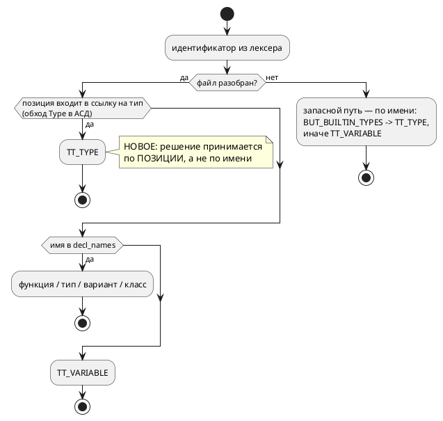

# ADR 0196: Подсветка имён типов отдельным цветом в LSP и плагинах

- **Status:** **Accepted** — Option B, 2026-08-02 (реализовано и закрыто той же датой)
- **Date:** 2026-08-02
- **Authors:** Архитектор + Аналитик
- **Related issues:** [Фича 0196](../features/0196-editor-type-highlighting.md);
  связь с [ADR 0038](0038-intellij-semantic-tokens.md) (семантические токены),
  [ADR 0022](0022-intellij-syntax-highlight.md) (палитра плагина)

## Context

Заказчик просит красить имена типов — встроенных (`bit`, `u8`, `bool`, `float`,
…) и объявленных через `type` — **своим** цветом, отличным от цвета
зарезервированных слов.

Замер 2026-08-02 (чтение кода + пробы) показал, что **инфраструктура уже есть**,
и предмет решения — не «добавить цвет», а **как определять, что перед нами имя
типа**:

- сервер отдаёт семантический токен `type`
  (`takt-lang/src/lsp/semantic_tokens.rs`), плагин отображает его в **отдельный**
  ключ палитры `TaktHighlighterColors.TYPE`
  (`DefaultLanguageHighlighterColors.CLASS_REFERENCE`) — то есть цвет уже не
  равен `KEYWORD` и настраивается пользователем;
- полнота **легенды** уже под сторожем (`TaktSemanticTokensColorsTest`).

Как классифицируется идентификатор сегодня — **по членству имени в множествах**:
`BUT_BUILTIN_TYPES` (13 имён, `lsp/keywords.rs`), затем `decl_names` (функции,
типы, варианты, классы), иначе — переменная. Позиция ссылки при этом не
учитывается.

Отсюда три наблюдаемых дефекта:

| # | Вход | Наблюдение |
|---|---|---|
| Д1 | `var f: q(8, 8) := 1.5;` | `q` красится **переменной**: его нет ни в `BUT_BUILTIN_TYPES`, ни в ключевых словах |
| Д2 | `var bit: u8 := 1;` | **компилируется** (проба), но `bit` в объявлении красится **типом** — имя переменной выдано за тип |
| Д3 | файл не разбирается | `decl_names` = `None`, и пользовательские `type`-псевдонимы теряют цвет, а встроенные — сохраняют |

Причина у всех трёх одна: **имя — не свойство ссылки**. Тот же урок проект уже
получал дважды: ADR [0056](0056-lsp-goto-exact-file.md) («позиция использования —
свойство ссылки») и фича [0131](../features/0131-lsp-definition-references-rename.md)
(«индекс видит вхождение, только если узел остался неразрешённым»).

Отдельная находка проб: **`string` — мёртвое ключевое слово.** Лексер выделяет
`Token::String` (`lexer.rs`), но грамматика его **не использует нигде**, поэтому
`var s: string := "x";` — синтаксическая ошибка `SY-002`. То есть «встроенный
строковый тип», который значится в подсказках LSP, в языке **не существует**;
он лишь красится как ключевое слово. Это вопрос **языка**, а не подсветки, и в
объём данного ADR не берётся (см. Action items).

Поток классификации — как есть и как будет:

## Decision Drivers

1. **Не врать пользователю цветом.** Цвет — утверждение о смысле имени.
   Покрасить переменную `bit` типом хуже, чем не покрасить ничего: неверная
   подсказка дороже отсутствующей.
2. **Не заводить очередной список имён.** Знание о типах уже размазано между
   грамматикой, `builtin_type_by_name` и `lsp/keywords.rs`; четвёртая копия
   разъедется молча (уроки 0042 и фикса 0134-01 — «знание в одном месте»).
3. **Не менять язык ради подсветки.** `q` намеренно **не** ключевое слово —
   грамматика прямо объясняет: иначе `q` перестал бы работать как имя
   переменной. Подсветка не повод это ломать.
4. **Деградировать предсказуемо.** Пока автор набирает текст, файл почти всегда
   не разобран; поведение в этот момент должно быть определено, а не случайно.
5. **Правило 29.** Изменение обязано пройти по LSP и **обоим** плагинам; ответ
   «правок не требует» тоже фиксируется.

## Considered Options

### Option A. Дополнить список имён (`q` в `BUT_BUILTIN_TYPES`) + сторож синхронизации

Добавить `q` в таблицу имён и завести тест «список редактора = множество имён
`builtin_type_by_name`» по образцу `TaktKeywordSyncTest`.

**Pros:**
- дёшево: правка в одном файле плюс тест;
- сторож действительно закрывает класс «новый тип забыли внести».

**Cons:**
- **Д2 не лечится вовсе** и даже усугубляется: `q` — законное имя переменной,
  и тогда всякая переменная `q` станет «типом»;
- Д3 не лечится;
- сторож невозможно сделать точным: `q` в `builtin_type_by_name` **отсутствует**
  (fixed-point проверяет `construct_fixed`), значит равенство множеств не
  выполняется и сторожу придётся знать исключение — список исключений станет
  третьим местом знания.

### Option B. Классифицировать по позиции: собрать ссылки на типы из АСД

Обойти разобранное дерево и собрать **позиции** всех ссылок на тип
(`Type::Alias` → `Identifier.loc`, `Type::Fixed` → `Location`, вложенные
`[T; N]` — рекурсивно). Токен, чья позиция попала в множество, получает
`TT_TYPE` **до** проверки по имени. Таблица имён остаётся **запасным путём** для
неразобранного файла и по-прежнему питает hover и автодополнение.

**Pros:**
- лечит Д1 и Д2 **по построению**: `q(8, 8)` в позиции типа — тип, переменная
  `q` — переменная; список имён для этого не нужен;
- покрывает будущие типы бесплатно: новый синтаксис типа попадает в обход, а не
  в четвёртый список;
- Д3 получает **явно описанное** поведение (запасной путь), а не случайное;
- данные уже есть: узлы `Type` несут `Location` (проверено чтением `ast.rs`).

**Cons:**
- нужен обход АСД по типам — новый код, который обязан быть исчерпывающим
  (иначе форма типа молча выпадет);
- на неразобранном файле остаются нынешние Д2/Д3 — запасной путь не точнее
  нынешнего, просто честно назван;
- обход АСД на каждый запрос токенов — работа пропорциональна размеру файла
  (сегодня платится тот же порядок: дерево и так строится).

### Option C. Лексическая подсветка типов в плагине

Научить `TaktLexer` плагина знать имена встроенных типов и красить их без
сервера.

**Pros:**
- цвет появляется мгновенно и не зависит от сервера;
- снимает наблюдение «типы не подсвечены, пока LSP не поднялся».

**Cons:**
- **четвёртый** список имён — прямо против драйвера 2, и он неизбежно разъедется
  (именно так уже выпал `q`);
- лексер не знает контекста, то есть воспроизводит Д2 в чистом виде;
- плагин Zed своих списков не ведёт — решение не переносится, редакторы
  разойдутся в поведении.

## Decision

Принимается **Option B**.

Единственный вариант, который отвечает на вопрос «это имя типа?» тем же
способом, каким на него отвечает компилятор — по **месту** в разобранном тексте,
а не по совпадению строк. Он же снимает необходимость синхронизировать список,
из-за отсутствия которой `q` и выпал: обход дерева видит любую форму типа,
включая те, которых ещё нет.

Цена — обход АСД по узлам `Type` — известна и ограничена; данные для него уже
лежат в дереве.

Таблица `BUT_BUILTIN_TYPES` **сохраняется** в роли, для которой заведена:
подсказки hover и автодополнение (там классификация по имени уместна — имени
ещё нет в тексте). Запасным путём для неразобранного файла она тоже остаётся,
но это **явно названное** ограничение, а не умолчание.

Язык **не меняется**: `q` остаётся идентификатором, ключевые слова не
добавляются, версия языка не растёт.

## Consequences

### Положительные

- `q(8, 8)`, псевдонимы `type` и вложенные `[T; N]` красятся цветом типов;
- переменная, названная именем типа, больше не выдаётся за тип;
- новый синтаксис типа получает подсветку **без** правки списков;
- плагин Zed получает улучшение даром (наследует сервер), плагин IntelliJ —
  без единой правки: маппинг `type` → палитра уже на месте.

### Отрицательные / Action items

- Обход по `Type` обязан быть **исчерпывающим**; при добавлении формы типа он
  должен ломать сборку, а не молчать — применить приём фичи 0093
  (`deny(clippy::wildcard_enum_match_arm)`), как это уже сделано в
  `lsp/semantic_tokens.rs` для токенов.
- Поведение на **неразобранном** файле зафиксировать тестом: сегодня оно
  «как получится», после фичи — описанный запасной путь.
- ⚠️ **`string` — мёртвое ключевое слово** (лексер знает, грамматика не
  использует, `var s: string` → `SY-002`). Это дефект языка, а не подсветки:
  в объём 0196 **не берётся**, записывается кандидатом в `FEATURES.md`.
  Пока он жив, `string` красится как ключевое слово — и это верно, потому что
  типом он не является.
- Правило 29: плагин IntelliJ правок не требует (проверить тестом, что маппинг
  на месте), плагин Zed — не требует по построению; ответ зафиксировать в
  отчёте.

### Acceptance criteria

1. `var f: q(8, 8) := 1.5;` — токен `q` имеет тип `type` (тест на `semantic_tokens`).
2. `type Celsius = u8; var t: Celsius := 20;` — оба вхождения `Celsius`
   (объявление и ссылка) имеют тип `type`.
3. `var bit: u8 := 1;` — токен `bit` в позиции **имени переменной** имеет тип
   `variable`, а `u8` — `type`.
4. Вложенная форма `var m: [q(4, 4); 8];` — и `q`, и элементы внутри `[…]`
   классифицированы верно.
5. На неразобранном файле поведение соответствует описанному запасному пути
   (тест с намеренно битым входом).
6. Обход `Type` исчерпывающий: добавление варианта в `ast::Type` ломает сборку
   (проверяется мутацией при тестировании).
7. `./scripts/precheck.sh` зелёный; вывод компилятора не изменился (подсветка —
   слой редактора).
