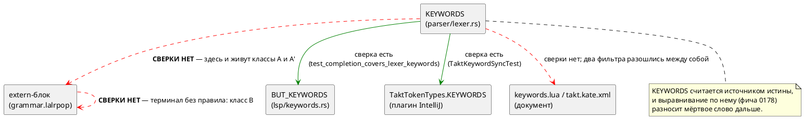

# ADR 0201: Мёртвая лексика: слова и терминалы, которых грамматика не знает

- **Status:** Accepted
- **Date:** 2026-08-04
- **Authors:** Архитектор + Заказчик (решения по объёму и направлению — 2026-08-04)
- **Related issues:** [Фича 0201](../features/0201-dead-lexemes.md); смежные — [ADR 0021](0021-swap-assign-compare.md) (изъятие `==` из языка), [ADR 0178](0178-editor-layer-language-sync.md) (согласование редакторского слоя с языком)

## Context

Лексер языка Takt держит таблицу `KEYWORDS` (48 записей) — она считается
источником истины о ключевых словах: по ней выравниваются список
автодополнения LSP, список плагина IntelliJ и фильтры подсветки документа.
Грамматика (`takt-lang/src/grammar.lalrpop`) объявляет свой набор терминалов в
extern-блоке (93 записи). **Сверки между этими двумя множествами нет ни
одной** — обе существующие сверки (`test_completion_covers_lexer_keywords`,
`TaktKeywordSyncTest`) идут от `KEYWORDS` наружу, к редакторскому слою.

Кандидат блока 2 `FEATURES.md` называл одно расхождение: `string`. Проба
стадии архитектуры (обход всех 48 слов и всех 93 терминалов) нашла **пять**
мёртвых лексем в трёх классах:

| Класс | Лексема | Чем мертва |
|---|---|---|
| **A** — слово в `KEYWORDS`, в extern-блоке грамматики отсутствует | `string` | употребление → `SY-002` |
| **A** | `template` | употребление → `SY-002`; механизма шаблонов в языке нет вовсе |
| **A′** — вариант `Token` есть, лексер его не производит **никогда** | `pragma` | слова нет в `KEYWORDS`, поэтому недостижим и он, и весь его механизм |
| **B** — терминал объявлен в extern, ни одним правилом не используется | `==` | изъят из языка фичей 0021 |
| **B** | `-->` (`Token::PeirceArrow`) | LTL-импликация пишется `->` |

### Чем это плохо

Отказ разбора **громкий**, молчаливой потери нет — и этим дефект отличается от
большинства разбираемых проектом. Цена в другом.

**Лексема обещает возможность, которой в языке нет.** `string` занимает место в
шести местах, и в одном из них — с описанием «строковый тип» в автодополнении
LSP; `template` — с описанием «объявление шаблона». Автор видит слово в списке
дополнения, пишет его и получает отказ разбора.

**Обещание расходится само с собой.** Два фильтра подсветки документа
классифицируют `string` по-разному: `book/keywords.lua` — ключевое слово,
`book/takt.kate.xml` — **тип** (в одном списке с `q` и `rational`).

**Дефект размножается механически.** `CHANGES.md` фиксирует, что `template` и
`string` попали в редакторские списки фичей 0178 — **автоматическим
выравниванием по `KEYWORDS`**. Пока `KEYWORDS` считается истиной, а сверки с
грамматикой нет, каждая следующая правка редакторского слоя будет разносить
мёртвое слово дальше. Это и есть главный мотив фичи: удалить пять строк
дёшево, но без сторожа шестая придёт тем же путём.

**Класс A′ вдобавок несёт цену на такте разбора.** Страж `Iterator::next`
проверяет `last_tokens` на **каждом** токене ради ветви, которая не может
сработать; поле обновляется тоже на каждом токене.

### Что показала проба

Пробы прогонялись настоящим `taktc` на файлах-зондах; для класса B собраны
**две редакции грамматики** (с терминалом в extern и без).

| № | Вход | Результат |
|---|---|---|
| P1 | `var s: string := "x";` | `SY-002` в `2:12`: «нераспознанный токен 'string', ожидалось identifier, "[", "X", …» |
| P2 | `template T;` | `SY-002` в `2:5`, список ожидаемых — 31 терминал |
| P3 | `a == b`, **две редакции** | первая диагностика **байт-в-байт одинакова**; с терминалом в extern добавляется **вторая, каскадная** — `SY-002` на `}` |
| P4 | `a --> b`, **две редакции** | то же, что P3 |
| P5 | `var string: u8 := 1;` | `SY-002` — имя занято словом |
| P6 | `var bit: u8 := 1;` | **компилируется** — эталон: имя встроенного типа как идентификатор законно |
| P7 | `var pragma: u8 := 1;` | **компилируется** — `pragma` уже обычный идентификатор |
| P8 | `pragma solidity 0.8;` | `SY-002` — директива грамматикой не принимается |

**P3/P4 опровергли рабочую гипотезу.** Ожидалось, что объявление `==` в
extern-блоке — намеренное «надгробие» фичи 0021: терминал объявлен, чтобы
отказ на изъятом операторе был внятным. Замер это не подтвердил: сообщение о
самой ошибке **не меняется**, а объявление добавляет **каскадную** вторую
диагностику — следствие первой, а не второй дефект. Фича 0130 накапливает
диагностики ради **разных** ошибок за прогон; каскад по одной причине — шум.

**P6/P7 задают эталон решения.** Имя встроенного типа (`bit`) и имя `pragma`
уже сегодня законны как идентификаторы, потому что ключевыми словами не
являются. Это ключ к дешевизне изъятия: типы в грамматике — **обычные
идентификаторы** (`Type: Alias(Identifier)`), а `bit`, `bool`, `u8`, `q`
намеренно не в `KEYWORDS`. Именно статус ключевого слова и блокирует `string`.

### Где место проверке

Расхождение существует между **двумя таблицами внутри компилятора**, поэтому
проверке место там же, а не в редакторском слое и не в CI-скрипте: оба
удалены от источника и оба уже показали, что дефект переживают.

## Decision Drivers

1. **Обещание языка обязано быть исполнимым.** Слово в списке автодополнения —
   это обещание; отказ разбора на нём — дефект доверия к инструменту, даже
   когда он громкий.
2. **Один источник истины.** Проект последовательно сводит расходящиеся
   представления одного знания в одну точку (0084, 0143, 0187, 0192, 0193,
   0195). Здесь их два — `KEYWORDS` и extern-блок, — и они разошлись.
3. **Класс закрывается сторожем, а не правкой.** Пять строк удаляются за
   минуту; без машинной сверки шестая придёт тем же автоматическим
   выравниванием, каким пришли эти.
4. **Решение не должно закрывать дорогу строковому типу.** Если язык однажды
   получит строки, изъятие слова не должно этому мешать.
5. **Замер вместо чтения.** Судьбу класса B решает проба на двух редакциях
   грамматики, а не рассуждение о намерениях фичи 0021.

## Considered Options

### Option A. Изъять мёртвые лексемы; завести сверку `KEYWORDS` ↔ грамматика

Удалить `string`, `template`, `pragma` из лексера **полностью** (вариант
`Token`, запись `KEYWORDS`, ветвь `Display`, ветвь `semantic_tokens`) и из всех
списков, обещающих их пользователю. Удалить недостижимый механизм `pragma`.
Удалить терминалы `==` и `-->` из extern-блока. Завести тест, сверяющий
`all_keywords()` с терминалами грамматики в обе стороны.

**Pros:**
- Обещание и возможность сходятся: ни одно слово списка не даёт отказа разбора.
- `var s: string;` начинает давать `SE-034` «Локальный тип 'string' не найден» —
  сообщение по существу вместо «нераспознанный токен» со списком из 8 терминалов.
- Имена `string` и `template` освобождаются под идентификаторы — как `bit`
  сегодня (P6).
- Каскадная вторая диагностика на `==`/`-->` исчезает (P3/P4).
- Уходит недостижимый код и проверка `last_tokens` на каждом токене.
- Строковый тип позже вводится **одной строкой** в `builtin_type_by_name` —
  ровно как `duration` в 0134.
- Сторож закрывает класс, а не случай.

**Cons:**
- Слома нет, но формально язык меняется — требуется запись в анализе (правило 22)
  и правка документа (правило 24).
- Сторож читает грамматику текстом (`include_str!`) — привязка к форме файла,
  а не к разобранному дереву.
- Осознанные исключения придётся оформлять списком, а список — место, куда
  легко спрятать пропуск (та же оговорка, что у `COMPLETION_EXCLUDED`).

### Option B. Ввести настоящий строковый тип

Сделать `string` рабочим типом языка: представление (длина, память без
аллокации для МК), отображение в шесть целей, исполнение в эталоне,
потактовые сверки.

**Pros:**
- Обещание исполняется буквально: слово начинает означать то, что написано в
  автодополнении.
- Внутренний `TypeNode::BuiltinString` уже существует (тип параметра `debug`),
  то есть точка входа есть.

**Cons:**
- Не решает задачу: `template`, `pragma`, `==`, `-->` остаются мёртвыми, а
  сверки как не было, так и нет.
- Цена несопоставима с находкой: в SystemVerilog строки не синтезируются, в
  `rust` под `no_std` и в ST это отдельные подсистемы.
- Для DSL конечных автоматов ценность сомнительна: сегодня строка нужна только
  `debug` и путям `import` — и там она уже работает **литералом**, без типа.

### Option C. Статус-кво + запись в документ

Оставить лексемы, но описать в документе, что они зарезервированы «на будущее».

**Pros:**
- Нулевая цена правки; резерв имени под будущую конструкцию сохраняется.

**Cons:**
- Обещание остаётся неисполнимым, а расхождение фильтров подсветки — неснятым.
- Резерв ничего не резервирует: типы в языке — обычные идентификаторы, поэтому
  ввести `string` типом можно и **не** держа его ключевым словом (P6 — эталон
  `bit`).
- Сверки по-прежнему нет: следующее мёртвое слово придёт тем же путём.

## Decision

Принимается **Option A** — рекомендация архитектора и решение заказчика
(2026-08-04) совпали. Заказчиком отдельно решено: `template` берётся **в объём
0201**, терминалы `==`/`-->` **разбираются в 0201**.

Класс A′ (`pragma`) найден **после** этих решений и включается по тому же
основанию: это та же болезнь на уровень глубже — лексема, которой не знает уже
не грамматика, а сам лексер.

Судьба класса B решена **замером, а не намерением**: гипотеза «объявление
`==` — намеренное надгробие 0021» опровергнута пробами P3/P4. Сообщение об
ошибке от объявления не зависит, а сама ошибка получает лишнюю каскадную
спутницу. Оба терминала удаляются.

Специальной диагностики на изъятые лексемы **не заводится** — по прецеденту
0021 отказ возникает естественно и проверяется контрпримером.

## Consequences

### Положительные

- Ни одно слово из `KEYWORDS` не обещает несуществующей конструкции.
- `var s: string;` и `var t: template;` дают `SE-034` — диагностику по существу.
- `var string: u8;` и `var template: u8;` становятся законными; имена свободны.
- Каскадная вторая диагностика на `a == b` и `a --> b` исчезает.
- Из лексера уходит недостижимый механизм и проверка на каждом токене.
- Класс закрыт машиной: новая мёртвая лексема валит сборку.

### Отрицательные / Action items

- **Язык меняется, но версия НЕ поднимается.** Цикл `0.8.0` открыт и не
  выпущен, а по правилу 22 версия накапливается по циклам. ⚠️ На этих граблях
  проект наступал дважды (ADR 0157 и 0187 писали «`0.8.0 → 0.9.0`» ошибочно).
  Факт изменения языка обязан быть зафиксирован в анализе.
- **Правило 29 — редакторский слой.** Правки нужны в `lsp/keywords.rs`,
  `lsp/semantic_tokens.rs` и в плагине IntelliJ. ⚠️ `TaktKeywordSyncTest`
  сверяет на **равенство** и в `precheck.sh`/CI **не входит** — гонять вручную.
  Плагин Zed своих списков не ведёт; ответ «правок не требует» фиксируется.
- **Правило 24 — документ.** Таблица зарезервированных слов
  `book/src/02-lexical/`, плюс приведение в согласие `book/keywords.lua` и
  `book/takt.kate.xml`.
- **Тесты с жёсткими списками покраснеют** (`lexer_tests.rs`,
  `lexer_tests/part2.rs`) — их правка есть часть работы.
- ⚠️ **`Takt.ebnf` в объём не входит.** Его список ключевых слов устарел широко
  и независимо (нет `template`, `while`, `match`, `at`, `after`, `every`,
  `parameter`, `address`, …) — это объём фичи 0160; находка передаётся туда.
- Сторож читает грамматику текстом, поэтому обязан вырезать комментарии перед
  счётом употреблений — иначе терминал, упомянутый только в комментарии,
  сойдёт за живой.

### Acceptance criteria

1. `all_keywords()` не содержит `string` и `template`; вариантов
   `Token::{String, Template, Pragma}` в `parser/token.rs` нет.
2. Терминалов `"=="` и `"-->"` нет в extern-блоке грамматики; `a == b` даёт
   **одну** диагностику вместо двух.
3. `var string: u8 := 1;` и `var template: u8 := 1;` компилируются целью `c`.
4. `var s: string;` даёт `SE-034`, а не `SY-002`.
5. Сторож существует и **краснеет от восстановленного дефекта**: возврат
   `"string" => Token::String` в `KEYWORDS` валит тест (мутационная проверка).
6. Строковые литералы не задеты: `import "…"` и `debug("…")` работают,
   `semantic_tokens_string_literal` зелёный.
7. `./scripts/precheck.sh` — код возврата 0; `./gradlew --offline test` плагина
   IntelliJ зелёный.
