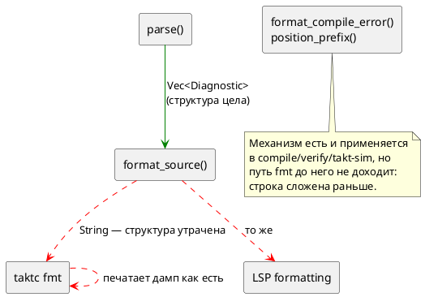

# ADR 0202: taktc fmt печатает синтаксическую ошибку Debug-дампом

- **Status:** Accepted
- **Date:** 2026-08-04
- **Authors:** Архитектор
- **Related issues:** [Фича 0202](../features/0202-fmt-diagnostic-formatting.md); смежные — [ADR 0053](0053-diagnostics-file-id.md) (формат позиции — свойство диагностики, а не бинарника), [ADR 0028](0028-c-generator-stubs.md) (копия формата в `taktc` уже расходилась), [фича 0168](../features/0168-generator-warnings-return.md) (библиотека печатает диагностику сама — тот же принцип, другой канал)

## Context

`taktc fmt` при любом отказе разбора печатает **`Debug`-дамп** структуры
диагностики вместо принятого в проекте сообщения. Причина — одна строка в
`takt-lang/src/format/mod.rs`:

```rust
crate::parse(source, 0).map_err(|d| FormatError::Parse(format!("{d:?}")))?;
```

`parse` возвращает `Vec<Diagnostic>` — со структурой, кодом и позицией. Здесь
вектор **склеивается в строку внутри библиотеки**, и восстановить формат
вызывающему уже нечем: у него на руках `String`.

### Чем это плохо

**1. Нарушено обещание документа.** Раздел о диагностике
(`book/src/16-diagnostics/`) заявляет формат как **единообразный** — «Сообщение
строится единообразно: `путь:строка:колонка: <вид> [<код>]: <текст>`», — и там
же, разбирая `SY-005`, прямо говорит: «такое сообщение выдаёт **и
форматирование**». Инструмент этого не делает. То есть дефект не «некрасивый
вывод», а **расхождение с нормативным описанием языка**.

**2. Позиция теряется дважды.** В дампе координата присутствует как
`loc: Source(0, 20, 22)` — байтовые смещения внутреннего представления. Человеку
нужны строка и колонка, а перевод делает `position_prefix`, которому нужен
**путь**; путь же в этот момент `file: None` — библиотека его не знает, а
вызывающий, знающий путь, уже получил строку.

**3. Несколько ошибок сливаются в одну строку.** `parse` накапливает
диагностики (фича 0130), и `fmt` печатает их **одним** `Debug`-блобом вектора:
две ошибки — одна нечитаемая строка. `compile` на том же входе печатает две
строки, каждую с позицией.

**4. Кавычки экранированы.** Внутри дампа сообщение — Rust-литерал, поэтому
ожидаемые токены выглядят как `\";\", \":\", \":=\"`.

### Что показала проба

Прогон `taktc` на файле с ошибкой `var x u8 := 1;`:

| Инструмент | Вывод |
|---|---|
| `taktc compile` | `…/bad.takt:2:11: Ошибка компиляции [SY-002]: нераспознанный токен 'u8', ожидалось ";", ":", ":="` |
| `taktc fmt --check` | `Ошибка форматирования '…/bad.takt': не удалось разобрать исходник: [Diagnostic { file: None, loc: Source(0, 20, 22), level: Error, ty: ParserError, message: "нераспознанный токен 'u8', ожидалось \";\", \":\", \":=\"", code: Some("SY-002"), notes: [] }]` |

Проба уточнила запись кандидата **в трёх местах**:

1. **Коды возврата верны** — `1` у всех трёх путей (`fmt`, `fmt --check`,
   `fmt --stdin`). Дефект чисто в тексте; CI не обманут.
2. **Вторая ветвь `FormatError` не задета.** `Unsupported` печатается
   по-человечески: «печать узла 'Formula' пока не поддерживается форматтером».
   ⚠️ Но она **не несёт позиции** — в большом файле неизвестно, какой именно
   элемент не поддержан. Это отдельный, меньший пробел (см. «Вне области»).
3. **Класс шире одного места.** Дамп получают все три пути `fmt` (файлы,
   `--check`, `--stdin`) и, через `formatting_edits`, слой LSP.

### Готовое решение уже есть в библиотеке

`diagnostics::batch::format_compile_error` строит ровно нужную строку, и его
докблок формулирует принцип, который здесь и нарушен:

> Формат живёт в **библиотеке**… вид диагностики — её собственное свойство.
> Функция **не печатает** — возвращает текст. Печать остаётся за вызывающим:
> библиотека, пишущая в `stderr`, лишает его выбора.

То есть недостаёт не механизма, а **применения** механизма: `format_source`
обязан отдать диагностику наружу, а не строку.



## Decision Drivers

1. **Формат диагностики — свойство диагностики, а не инструмента** (ADR 0053).
   Копия формата в `taktc` уже расходилась однажды (задача 0028-01).
2. **Документ нормативен.** Раздел о диагностике обещает единый формат и прямо
   называет форматирование среди его источников; расхождение чинится в коде, а
   не переписыванием обещания.
3. **Библиотека не решает за вызывающего.** Она не печатает и не склеивает —
   отдаёт структуру (тот же принцип ведёт фичу 0168).
4. **Позицию можно проставить только там, где известен путь** — в вызывающем.
5. **Накопление диагностик (0130) не должно пропадать** на пути `fmt`.

## Considered Options

### Option A. `FormatError::Parse` несёт `Vec<Diagnostic>`; печатает вызывающий

`format_source` отдаёт диагностику как есть. `taktc fmt` проставляет путь
(`with_file_if_unset`) и печатает **построчно** через `format_compile_error`.

**Pros:**
- Вывод `fmt` становится тождествен выводу `compile` — обещание документа
  исполняется буквально.
- Позиция появляется, потому что путь проставляет тот, кто его знает.
- Несколько ошибок печатаются несколькими строками (0130 доезжает).
- Механизм не заводится: используются существующие `format_compile_error`,
  `position_prefix`, `with_file_if_unset`.
- LSP получает структуру и волен превратить её в настоящие LSP-диагностики.

**Cons:**
- Меняется публичный тип `FormatError` → рост версии крейта `takt-lang`.
- `Display for FormatError` теряет возможность дать позицию (пути он не знает) —
  придётся честно определить, что он печатает.

### Option B. Оставить `Parse(String)`, но строить строку внутри библиотеки

`format_source` сам зовёт `format_compile_error`.

**Pros:**
- Публичный тип не меняется; правка в одну функцию.

**Cons:**
- **Позиции не будет всё равно:** `position_prefix` без `file` возвращает пустой
  префикс, а `file` внутри библиотеки `None`. Главный симптом не лечится.
- Структура по-прежнему теряется — LSP не сможет показать диагностику.
- Закрепляет ровно тот приём (склейка внутри библиотеки), который проект
  последовательно изживает.

### Option C. Статус-кво + правка документа

Убрать из документа обещание про форматирование.

**Pros:**
- Нулевая цена.

**Cons:**
- Лечит симптом со стороны, где дефекта нет: единый формат — **верное**
  свойство, и от него отказываются ради одной непочиненной строки.
- Дамп остаётся нечитаемым, а несколько ошибок — слитыми.

## Decision

Принимается **Option A**.

`FormatError::Parse(Vec<Diagnostic>)`; печать — за вызывающим, через
существующий `format_compile_error`. `Display for FormatError` сохраняется (тип
обязан оставаться `std::error::Error`) и печатает диагностики **без** префикса
позиции — честно отражая, что путь на этом уровне неизвестен; вызывающие,
знающие путь, идут по структурному пути и получают полный формат.

Версия крейта `takt-lang`: **0.27.0 → 0.28.0** (ломающее изменение публичного
типа). Версия **языка** не меняется: синтаксис и семантика не затронуты, речь о
форме сообщения инструмента.

## Consequences

### Положительные

- `fmt` печатает то же, что `compile`: `путь:строка:колонка: Ошибка компиляции
  [КОД]: текст` — обещание документа исполняется.
- Несколько ошибок разбора печатаются несколькими строками.
- Экранированные кавычки и байтовые смещения исчезают из вывода.
- Слой LSP получает структуру вместо строки.

### Отрицательные / Action items

- Ломающее изменение публичного API → версия крейта `0.28.0`.
- Правило 24: раздел «Инструментарий» документа получает пример отказа `fmt`
  (сегодня показан только случай «требуется форматирование»).
- Правило 29: путь LSP (`formatting_edits`) правится вместе с CLI.
- ⚠️ Сторож обязан сравнивать вывод `fmt` с выводом `compile` **на одном
  входе**. Проверка «в выводе нет слова `Diagnostic`» поймала бы дамп, но не
  расхождение формата — а именно расхождение и есть предмет фичи.

### Вне области

- **Позиция у `FormatError::Unsupported`.** Ветвь печатается по-человечески, но
  не говорит, **где** непокрытый узел. Реальный, но отдельный пробел: он про
  полноту печати форматтера, а не про потерю структуры диагностики. Записывается
  кандидатом.
- **Фича 0168** (цели печатают предупреждения прямо в `stderr`) — тот же
  принцип, другой канал и другие функции; объединять не следует.

### Acceptance criteria

1. `taktc fmt --check` на файле с ошибкой разбора печатает строку, **совпадающую**
   с выводом `taktc compile` на том же файле.
2. Две ошибки разбора дают **две** строки, а не одну.
3. В выводе `fmt` нет подстрок `Diagnostic {`, `Source(`, `code: Some`.
4. Коды возврата не изменились: `1` у `fmt`, `fmt --check`, `fmt --stdin`.
5. `FormatError::Unsupported` печатается как прежде (регресс не задет).
6. Версия крейта `takt-lang` — `0.28.0`.
7. `./scripts/precheck.sh` — код возврата 0.
