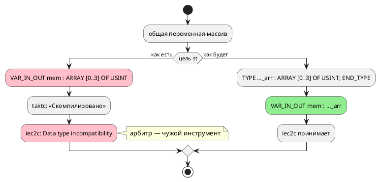

# ADR 0210: Общий массив даёт невалидный ST; индекс массива — только литерал или имя

- **Status:** Accepted (Option A1 + B1 + C1)
- **Date:** 2026-08-16
- **Authors:** Архитектор
- **Related issues:** [Фича 0210](../features/0210-st-array-shared-and-index.md); находка задачи [0186-01](../development/0186-01-book-processor-example.md); класс «цель рапортует об успехе при негодном выводе» — [ADR 0184](0184-imported-shared-variables.md); ловушки MatIEC — [ADR 0041](0041-st-backend.md)

## Context

Фича заведена из кандидата **без проработки** (запрос заказчика 2026-08-03), и её
карточка прямо предупреждает: замеры кандидата не перепроверялись, их
актуальность подтверждает архитектура (урок 0195 — записи кандидатов
устаревают). Пробы 2026-08-16 подтвердили **оба** заявленных предмета и вскрыли
**третий**.

### Замер 1: общий массив → невалидный ST (подтверждён)

```takt
var mem: [u8; 4] := {1, 2, 3, 4};
model Reader { var got: u8 := 0; start Read { always { got := mem[1]; } … } }
start Root = Reader;
```

`taktc` рапортует об успехе, `iec2c` отвергает вывод:

```
error: Data type incompatibility between parameter 'mem' and value being passed,
       when invoking FB 'reader0'
```

Скалярная общая переменная при этом работает. Это класс
[0184](0184-imported-shared-variables.md): цель принимает вход и порождает
негодный код, а арбитром оказывается чужой инструмент.

### Замер 2: причина — **анонимный** тип массива в параметре (новое)

Кандидат называл симптом, но не причину. Две пробы на чистом ST, отличающиеся
одной строкой:

| Объявление параметра `VAR_IN_OUT` | Ответ `iec2c` |
|---|---|
| `mem : ARRAY [0..3] OF USINT;` | **ошибка** «Data type incompatibility» |
| `TYPE MemArr : ARRAY [0..3] OF USINT; END_TYPE` + `mem : MemArr;` | **принят** |

То есть MatIEC требует **именованного** типа для массива в объявлении параметра.
Лечение известно и дёшево — не отказ, а правильная эмиссия.

### Замер 3: индекс-выражение (подтверждён) — и цена его снятия

`mem[pc + 1]` → `SY-002` «ожидалось `]`»; `mem[pc]` и `mem[3]` принимаются.
Причина — грамматика: индекс задан **двумя** правилами (число и идентификатор),
по отдельности, и в выражениях, и в условиях.

⚠️ **Проба показала, что цена снятия мала, а карточка предполагала обратное**
(«кандидат отдельной фичей»). Замена обоих правил на `Expression`/`Condition`:

- собирается **без конфликтов** LR (LALRPOP не жалуется);
- срез `mem[l:r]` не задет (различается двоеточием);
- **все потребители уже готовы** — печатники рекурсивны:

| Потребитель | `got := mem[pc + 1];` |
|---|---|
| цель `c` | `model->got = model->mem[model->pc + 1];` |
| цель `rust` | `self.got = self.mem[self.pc.wrapping_add(1) as usize];` |
| цель `st` | `got := mem[pc + 1];` |
| симулятор | исполняет верно (`mem[1]` при `pc = 0`) |
| форматтер | печатает |

То же в условии: `ref Done: mem[pc + 1] > 15;` → `if (model->mem[model->pc + 1] > 15)`.

### Замер 4: переменная-индекс не считается использованной (находка, кандидат не знал)

```
model.takt:2:1: Предупреждение [SE-036]: переменная 'pc' объявлена,
                но нигде не используется
```

— при том что `pc` стоит индексом: `got := mem[pc];`. Причина в
`semantic/unused.rs`: ветвь `ExpressionNode::ArraySubscript(var_rc, _)`
**игнорирует** второй элемент. Сборщиков в модуле одиннадцать, и ветвь
повторяется в четырёх местах (выражения и условия, дважды каждый).

⚠️ Это ложное срабатывание **сегодня**, но после снятия ограничения индекса оно
станет чаще: в индексе появятся целые выражения с несколькими именами.

### Поток «как есть» и «как будет»



## Decision Drivers

1. **Цель не вправе рапортовать об успехе, выдавая негодный код** (класс 0184):
   либо правильная эмиссия, либо честный отказ.
2. **Причина найдена и лечится дёшево** (замер 2) — значит отказ был бы
   капитуляцией, а не решением.
3. **Ограничение индекса — свойство грамматики, а не языка.** Оно не
   документировано, не объяснено и не следует ни из семантики, ни из
   возможностей целей (замер 3).
4. **Ложное предупреждение хуже отсутствующего** (замер 4): оно учит
   игнорировать диагностику.
5. **Корпус ни того, ни другого не покрывает** — сторожа обязаны быть
   фикстурными, а гейт `iec2c` должен увидеть новую форму.

## Considered Options

### Предмет A — общий массив в цели `st`

#### A1. Именованный тип массива (принимается)

`TYPE <модель>_<переменная>_arr : ARRAY [0..N] OF <тип>; END_TYPE`, параметр
объявляется им.

**Pros:** вывод становится валидным, семантика сохраняется, замер это
подтверждает прямо.
**Cons:** в файл добавляется тип; имена типов делят пространство со стандартной
библиотекой IEC (ловушка `Concat`/`PID`, ADR 0041) — имя обязано быть
квалифицированным.

#### A2. Честный отказ `ST-023` вместо невалидного вывода

**Pros:** дёшево, класс 0184 закрыт формально.
**Cons:** отнимает у пользователя работающую конструкцию, причём **без причины**
— замер 2 показывает, что она выразима.

#### A3. Массив как `VAR_GLOBAL` (по образцу портов `st-at`)

**Pros:** обходит параметры вовсе.
**Cons:** `VAR_GLOBAL` вне `CONFIGURATION` недопустим (проба ADR 0041), то есть
цель `st` (без `-at`) так не умеет; и это меняет модель разделения данных.

### Предмет B — индекс массива

#### B1. Разрешить выражение (`Expression` в выражениях, `Condition` в условиях)

**Pros:** снимает необъяснимое ограничение; замер 3 показал, что грамматика
собирается, а все шесть потребителей уже готовы.
**Cons:** язык меняется (расширение) → версия языка; появляются входы, которых
корпус не видел.

#### B2. Оставить как есть, вынести отдельной фичей

**Pros:** объём фичи меньше.
**Cons:** предмет назван **в самой карточке 0210**; откладывать то, что стоит
одной строки грамматики, — процессная волокита. Замер снял довод «это дорого».

### Предмет C — ложное `SE-036`

#### C1. Обойти индекс во всех сборщиках `unused`

**Pros:** снимает ложное срабатывание; после B1 становится обязательным.
**Cons:** ветвей четыре, и они повторяются — риск поправить не все (сторож
обязан проверять **обе** позиции: выражение и условие).

## Decision

Принимается **A1 + B1 + C1** — три предмета одной фичи, связанные причинно:
без C1 фича B1 добавила бы ложных предупреждений, а A1 и B1 вместе делают
массивы в `st` пригодными к работе.

- **A1.** Цель `st` объявляет для массива-параметра именованный тип
  `TYPE <уникальное имя> : ARRAY […] OF <тип>; END_TYPE` и использует его в
  `VAR_IN_OUT`. Имя квалифицируется владельцем (ловушка пространства имён IEC) и
  строится **одной** функцией — продюсер типа и его потребитель обязаны звать её
  же (урок 0195).
- **B1.** Индекс массива — **выражение**: `Expression` в выражениях, `Condition`
  в условиях. Срез `[l:r]` не меняется. Версия языка растёт (расширение
  синтаксиса).
- **C1.** Все сборщики `semantic/unused.rs` обходят индекс; сторож проверяет обе
  позиции.

**Вне объёма (границы названы, а не забыты):** срез `mem[l:r]` остаётся с
числовыми границами — это другая конструкция (битовый срез), и требования на неё
не поступало. Массив как **параметр модели** (`Pid(prog := {…})`) закрыт фичей
0209 и здесь не рассматривается.

## Consequences

### Положительные

- Модель, где под-модели общаются через массив, начинает переводиться в ПЛК —
  сегодня она даёт файл, который отвергает `iec2c`.
- Индекс перестаёт быть особым местом языка: `mem[pc + 1]` работает во всех
  целях и в симуляторе.
- Исчезает ложное «переменная не используется» на переменной-индексе.

### Отрицательные / Action items

- **Версия языка растёт** (B1 — расширение синтаксиса): текущий цикл `0.9.0` не
  выпущен, поэтому изменение вносится в него (правило 22).
- **Корпус не покрывает ни одного из трёх случаев** — сторожа фикстурные, и
  гейт `iec2c` обязан увидеть общий массив.
- **Документ** (правило 24): индекс-выражение — синтаксис языка, затронуты
  разделы о массивах (`book/src/03-types/`) и выражениях
  (`book/src/05-expressions/`).
- ⚠️ Имя типа массива обязано пережить ловушку MatIEC: идентификаторы IEC
  **регистронезависимы** и делят пространство со стандартной библиотекой.

### Acceptance criteria

1. Модель с общим массивом переводится целью `st`, и `iec2c` принимает вывод.
2. Тип массива объявляется именованным; имя строит одна функция и оно
   квалифицировано владельцем.
3. `mem[pc + 1]` принимается в выражении и в условии; все цели и симулятор дают
   согласованный результат (потактовая сверка).
4. Срез `mem[l:r]` работает по-прежнему.
5. Переменная, использованная **только** индексом, не даёт `SE-036` — ни в
   выражении, ни в условии.
6. Версия языка поднята/актуальна; документ описывает индекс-выражение.
7. `./scripts/precheck.sh` зелёный, гейт `iec2c` включает новую форму.
