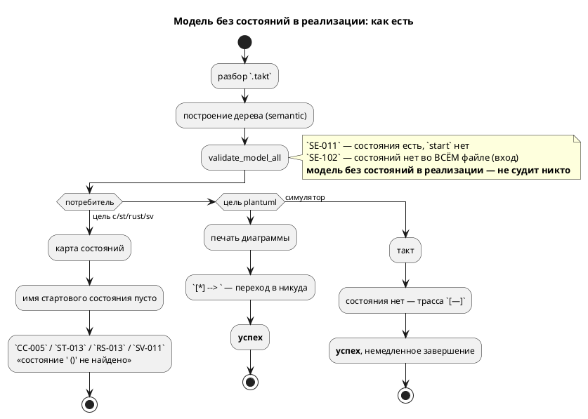
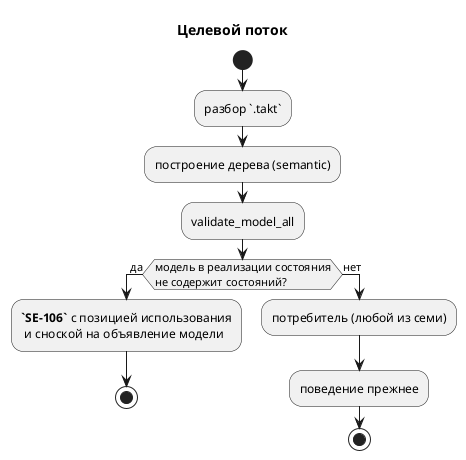

# ADR 0211: Модель без стартового состояния: цель c отказывает бессодержательно

- **Status:** Accepted
- **Date:** 2026-08-16
- **Authors:** Архитектор + системный аналитик
- **Related issues:** [Фича 0211](../features/0211-c-missing-start-state-diagnostic.md);
  родственные решения — [ADR 0199](0199-model-implements-brace-form.md) (форма
  `model M = A | B { … }`), фикс
  [0182-02](../fixes/0182-02-library-file-without-start.md) (`SE-102`:
  библиотечный файл в позиции входа).

## Context

Кандидат блока 2 `FEATURES.md` описывал единственный симптом: цель `c` на входе
`model Empty { var z: u8 := 0; } start App = Empty;` отвечает
`CC-005: State with name ' ()' not found` — по-английски (правило 1) и с пустым
именем, то есть не говорит ни что не так, ни где.

**Замер 2026-08-16 (проба воспроизведена, класс оказался шире записи кандидата).**
Тот же вход, все семь потребителей дерева:

| Потребитель | Ответ | Оценка |
|---|---|---|
| `c`, `c-hal` | `CC-005: State with name ' ()' not found` | отказ без смысла, по-английски |
| `st`, `st-at` | `ST-013`: «стартовое состояние ' ()' отсутствует в таблице номеров» | отказ без смысла |
| `rust` | `RS-013`: «Состояние ' ()' не найдено» | отказ без смысла |
| `sv`, `sv-mmio` | `SV-011`: «Состояние ' ()' не найдено» | отказ без смысла |
| `plantuml` | **успех**, файл содержит `[*] --> ` | **молча битый вывод** |
| симулятор | **успех**, шаг 1 `[—]`, немедленное завершение | молча пустая трасса |

То есть кандидат назвал одну строку из шести расходящихся ответов, а худший из
них — не тот, о котором он говорит: цель `plantuml` рапортует об успехе и пишет
диаграмму с переходом в никуда, а эталон исполняет автомат, которого нет. Это
ровно тот класс, ради которого заведены сверки трасс: инструменты расходятся
**молча**.

**Форма записи роли не играет** — пусто в реализации оказывается четырьмя
путями, и все дают тот же результат:

```takt
start App = Empty;              // прямая ссылка
start App = Empty | Work;       // параллельная композиция
start App = Work + Empty;       // последовательная (эталон теряет и Work: трасса [—])
model App = Empty { … }         // форма реализации модели (фича 0199)
```

Вложенность тоже не спасает: `model Mid { start S = Inner; }` при пустом
`Inner` даёт то же самое на уровень глубже.

**Соседние случаи уже закрыты, и путать их нельзя.**

- Модель, у которой состояния **есть**, а `start` среди них нет, — `SE-011`
  («должно быть только одно начальное состояние»), сообщение осмысленно и с
  позицией. Пробой подтверждено: `model Empty { state E { … } } start App = Empty;`
  отвергается и целью, и симулятором **одинаково**.
- Файл **целиком** без состояний в позиции входа — `SE-102` («это библиотека, а
  не автомат», фикс 0182-02).
- Модель без состояний, которую **никто не использует** в реализации, законна и
  сегодня: она служит контейнером объявлений. Проба `model Lib { var z … }` рядом
  с обычным `start S { … }` компилируется и исполняется.

Дыра ровно одна и лежит между ними: **модель без состояний вовсе, поставленная в
реализацию состояния**. Ни одна семантическая проверка её не судит, и решение о
такой программе принимает каждый потребитель сам — отсюда шесть ответов.

Поток «как есть» и целевой:





## Decision Drivers

1. **Один вход — один вердикт.** Проект последовательно снимает расхождения
   потребителей, свёртывая решение на семантике (`after` 0143, начальное
   значение порта 0187, инициализатор объявления 0192, форма реализации 0199).
   Здесь ровно тот же случай: решение о законности программы принимают семеро
   порознь.
2. **Молчание дороже отказа.** Худшие ответы — не бессодержательный `CC-005`, а
   успех `plantuml` с битым файлом и успех эталона с пустой трассой. Правка,
   лечащая только текст `CC-005`, оставляет оба.
3. **Диагностика обязана называть место** (правило 0130: «заводя диагностику,
   ставь позицию»). У `CC-005` позиция — `Location::Codegen`, то есть её нет
   вовсе; позиция использования модели в реализации в дереве **есть** —
   `Extend::Model` хранит use-site с фичи 0056.
4. **Не задеть законное.** Модель без состояний как контейнер объявлений —
   существующая и осмысленная запись; отказ обязан бить только по реализации.
5. **Язык на русском** (правило 1): текст `CC-005` — английский, и это нарушение
   само по себе.

## Considered Options

### Option A. Осмысленный текст в целевых диагностиках (`CC-005` и соседи)

Оставить решение за потребителями, но научить их печатать имя модели и позицию.

**Pros:**
- Правка локальна, языка не меняет, обратная совместимость абсолютна.
- Закрывает буквальную формулировку кандидата.

**Cons:**
- **Не лечит класс.** `plantuml` по-прежнему рапортует об успехе с битым файлом,
  эталон — с пустой трассой; сверка трасс sim ≡ C на таком входе невозможна.
- Требует **четырёх** одинаковых правок в четырёх целях — ровно та форма, из
  которой в проекте многократно вырастало расхождение (0084, 0193, 0195).
- Позиции у целевых диагностик нет и взяться ей неоткуда: карта состояний
  работает с уникальными именами, а не с узлами АСД.

### Option B. Семантический отказ на модель без состояний в реализации (`SE-106`)

Новая проверка в `validate`: если реализация состояния (`Extend`) ссылается на
модель с пустым `states`, — ошибка с позицией использования и сноской на
объявление модели. За границей семантики такой программы не существует, и семь
потребителей расходиться не могут.

**Pros:**
- Лечит **весь** класс разом, включая молчаливые `plantuml` и эталон.
- Позиция и текст — по правилам проекта (русский, место, способ починки).
- Проверка встаёт рядом с `SE-011`/`SE-102`, дополняя их до полного разбора
  «где нет состояний»: те два случая уже разведены, третий получает своё имя.
- Целевые `CC-005`/`ST-013`/`RS-013`/`SV-011` остаются как страховка последней
  инстанции — недостижимой из корректной программы, как `CC-023` (фича 0236).

**Cons:**
- **Меняет язык**: вход, который симулятор и `plantuml` принимали, становится
  ошибкой → подъём версии языка (правило 22) и раздел «Документирование»
  (правило 24).
- Требует обхода `Extend` — ещё одного места, знающего форму реализации.

### Option C. Считать модель без состояний в реализации пустым шагом (разрешить)

Узаконить: такая модель ничего не делает, композиция идёт без неё.

**Pros:**
- Ничего не ломает; эталон уже так себя и ведёт.

**Cons:**
- Требует правки **четырёх** целей (научить их печатать автомат без состояния) —
  работа много больше, чем отказ, ради записи без единого применения.
- Узаконивает опечатку: `start App = Emty;` при опечатке в имени даст `SE-003`,
  а `start App = Empty;` при забытом `start` внутри — молчаливое «ничего не
  делаем». Автор просил автомат, получит пустоту.
- Противоречит `SE-102`: файл без состояний как вход мы уже назвали ошибкой по
  тому же доводу («автомата нет, исполнять нечего»). Разные ответы на один
  вопрос в двух местах — расхождение, заведённое руками.

## Decision

Принимается **Option B**.

Довод решающий и он один: правка, оставляющая решение потребителям, оставляет и
**молчаливые** ответы — успех `plantuml` с диаграммой `[*] --> ` и успех эталона
с пустой трассой. Кандидат этого не знал (он видел только `CC-005`), замер
показал. Текст диагностики цели поправить нельзя так, чтобы `plantuml` перестал
печатать битый файл: он не отказывает вовсе.

Форма отказа — **`SE-106`**, ошибка на **месте использования** модели в
реализации, со сноской на объявление модели. Сообщение называет причину
(«модель не содержит ни одного состояния») и **способ починки** («добавьте
стартовое состояние… либо уберите модель из реализации»), как это делают
`SE-101` и `SE-102`.

Обратная совместимость (правило 11) **нарушается осознанно и в безопасную
сторону**: программы, отвергнутые новой проверкой, сегодня отвергают шесть
потребителей из семи. Практически теряют законность лишь те входы, что работали
**только** в `plantuml` и симуляторе, — то есть заведомо не доводились до
целевого кода. Корпус `examples/` такой записи не содержит; это подтверждает
гейт предкоммита (сборка всех примеров всеми целями), а не рассуждение.

## Consequences

### Положительные

- Один вердикт на семь потребителей; расхождение «успех против отказа» снято.
- Диагностика получает позицию, русский текст и способ починки.
- Разбор «где нет состояний» становится полным: `SE-011` (нет старта среди
  состояний), `SE-102` (нет состояний во всём файле-входе), `SE-106` (нет
  состояний у модели, поставленной в реализацию).

### Отрицательные / Action items

- **Версия языка** поднимается по правилу 22 (накопительно, тегом помечает
  первая закрывшая фича цикла).
- **Документирование** (правило 24): приложение «Ошибки и предупреждения»
  получает `SE-106`; раздел о композиции моделей — упоминание в «Частых
  ошибках» (правило 26).
- **Редакторский слой** (правило 29): проверить, доезжает ли `SE-106` до LSP —
  новых токенов и узлов АСД фича не вводит, но диагностика обязана дойти до
  редактора.
- Целевые `CC-005`/`ST-013`/`RS-013`/`SV-011` становятся недостижимыми из
  корректной программы; удалять их **нельзя** (страховка последней инстанции —
  тот же довод, что у `CC-023` фичи 0236).

### Acceptance criteria

1. Вход `model Empty { var z: u8 := 0; } start App = Empty;` отвергается
   **семантикой** с кодом `SE-106`, позицией использования и сноской на
   объявление; текст — по-русски, называет модель и способ починки.
2. Тот же вердикт — на всех четырёх формах реализации (`= M`, `= A | B`,
   `= A + B`, `model M = A { … }`) и на вложенном уровне.
3. Все семь потребителей (шесть целей + симулятор) отвечают **одинаково**;
   `plantuml` больше не печатает `[*] --> `, симулятор не даёт пустую трассу.
4. Модель без состояний, **не** участвующая в реализации, по-прежнему законна.
5. `SE-011` и `SE-102` продолжают отвечать на свои случаи (проверка не
   перехватывает их).
6. `./scripts/precheck.sh` зелёный; корпус `examples/` и документ `book/`
   правки не потребовали.
