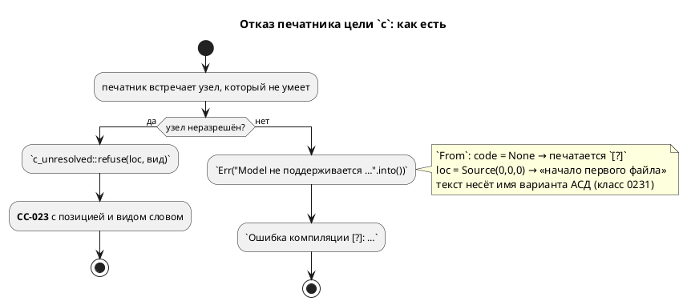
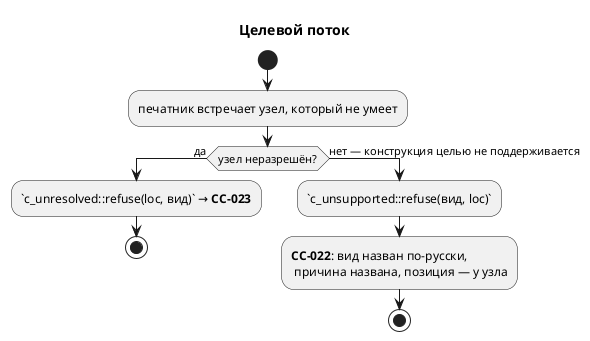

# ADR 0212: Диагностика цели c без кода

- **Status:** Accepted
- **Date:** 2026-08-17
- **Authors:** Архитектор + системный аналитик
- **Related issues:** [Фича 0212](../features/0212-c-diagnostic-without-code.md);
  образцы решения — [ADR 0236](0236-c-unresolved-condition-refusal.md)
  (воронка `CC-023`), [ADR 0229](0229-format-unsupported-position.md)
  (`FM-001`: один код, вид узла назван словом, позиция у узла),
  [ADR 0231](0231-diagnostic-text-no-debug.md) (в тексте диагностики нет
  внутреннего представления).

## Context

Кандидат описывал одну строку: вход `lvl := Ctl.ctrl;` даёт
`Ошибка компиляции [?]: Model не поддерживается как выражение в C генераторе` —
кода нет, текст наполовину английский.

**Замер 2026-08-17 (проба воспроизведена, картина шире записи).**

Два входа, достижимых из корректного текста, и все потребители:

| Вход | `c`, `c-hal` | `st` | `rust` | `sv` | эталон |
|---|---|---|---|---|---|
| `lvl := Ctl.ctrl;` | **`[?]`** «Model не поддерживается как выражение в C генераторе» | `ST-011` «модель как выражение» | `RS-011` «модель в позиции выражения» | `SV-002` | `SIM-014` в такте |
| `res := mem[1:2];` | **`[?]`** «ArraySlice не поддерживается в C генераторе» | `ST-011` «…в IEC 61131-3 нет операции среза» | `RS-011` «…в no_std нет alloc» | `SV-002` | `SIM-010` |

Отказывают **все**, и это правильно. Расходится **качество ответа**: у трёх
целей и у эталона есть код, а формулировка объясняет **причину** («в IEC
61131-3 нет операции среза»); цель `c` отвечает без кода и печатает **имя
варианта перечисления Rust** — `Model`, `ArraySlice`. То есть нарушены сразу
три правила проекта: код диагностики (реестр 0077), русский язык (правило 1) и
запрет внутреннего представления в тексте (0231).

**Мест такого рода в цели `c` — девятнадцать** (замер грепом по
`takt-lang/src/generator/`): `Err("…".into())` и `format!(…).as_str().into()`.
За пределами цели `c` в генераторах их **нет**: `st`, `rust`, `sv`, `plantuml`
чисты — у каждой своя воронка с кодом.

**Механизм известен поимённо.** Безликость даёт не забывчивость, а удобство,
встроенное в тип:

```rust
impl From<&str> for Diagnostic {
    fn from(s: &str) -> Diagnostic {
        Diagnostic { file: None, loc: Default::default(), /* … */ code: None, notes: vec![] }
    }
}
```

`code: None` печатается как `[?]`, а `loc: Default::default()` — это
`Location::Source(0, 0, 0)`, то есть **не «позиции нет», а «файл 0, смещение
0»**: координата, выглядящая настоящей и указывающая в начало первого файла.

**Гейт кодов этот класс не видит по устройству.** `check-diagnostic-codes.sh`
сверяет коды исходника с реестром `docs/diagnostics/README.md`; диагностика
**без кода** в его выборку не попадает — искать нечего. Это не пробел скрипта, а
граница его предмета.

**Достижимость мест измерена, а не предположена.** Из девятнадцати:

| Класс | Мест | Достижимость |
|---|---|---|
| Конструкция целью не поддерживается (`Model`, `ArraySlice`) | 2 | **достижима** (пробы выше) |
| Конструкция не поддерживается, но отсекается раньше (`Address` → `SY-008`, неизвестная встроенная функция → `SE-004`) | 2 | недостижима сегодня |
| Мёртвые узлы АСД (`CodeBlock`, `NamedFunctionBox`, `List`, `Type`) — класс 0201 | 4 | недостижима по построению |
| Дефект понижения (неразрешённый владелец порта ×3, переменная, определение функции, пустое выражение, `Unresolved function` в `c_decl`) | 7 | недостижима из корректной программы — предмет `CC-023` (фича 0236) |
| Прочее (`debug`/`S` — намеренный пропуск, константа без вычисленного значения) | 4 | частью намеренный пропуск (0189), частью внутренний инвариант |

⚠️ Недостижимость **держат другие фичи** (грамматика, семантика, отсутствие
правила у мёртвого узла). Именно поэтому оставлять эти места безликими нельзя:
каждая новая конструкция языка способна открыть путь заново — тот же довод, что
записан в `CC-023`.





## Decision Drivers

1. **Паритет с соседями.** Три цели из четырёх и эталон отвечают кодом и
   причиной. Отставание одной цели — расхождение, которое видит пользователь.
2. **Код диагностики — контракт проекта** (ADR 0077): по коду ищут в реестре и в
   приложении документа. `[?]` не ищется никак.
3. **Текст без внутреннего представления** (0231). Класс правился трижды и
   каждый раз находился глазами; здесь он живёт в семи текстах сразу.
4. **Недостижимость — не повод молчать.** Её держат чужие фичи; `CC-023`
   заведена ровно по этому доводу (защита в глубину).
5. **Правило, которое нельзя проверить командой, — не правило** (ADR 0027).
   Без сторожа двадцатое место заведётся по образцу девятнадцати.

## Considered Options

### Option A. Проставить коды точечно в девятнадцати местах

**Pros:**
- Минимальная правка, предмет фичи закрыт буквально.

**Cons:**
- Девятнадцать конструкторов диагностики — девятнадцать формулировок, которые
  разойдутся (класс 0084/0193/0195, ровно та беда, из-за которой заведены
  воронки `CC-023`, `FM-001`, `SIM-014`).
- Не мешает завести двадцатое безликое место.

### Option B. Воронка `CC-022` + расширение `CC-023` + машинный сторож

Один конструктор на класс «конструкция целью `c` не поддерживается»
(`c_unsupported::refuse(вид, loc)` → **`CC-022`**), вид узла — перечисление с
**русским** названием и причиной; места «дефект понижения» уходят в уже
существующую воронку `CC-023` (фича 0236). Сторож — тест, который грепом по
`takt-lang/src/generator/` требует отсутствия диагностик без кода и **падает
списком** мест.

**Pros:**
- Формулировка одна на класс — расходиться нечему.
- Оба класса получают разные коды, и это **осмысленное** различие: `CC-022` —
  «язык умеет, цель `c` не умеет» (ответ автору), `CC-023` — «узел не прошёл
  понижение» (дефект инструмента).
- Сторож закрывает **все** цели, а не только `c`: новая цель получает правило, а
  не образец.
- Ложится на существующие образцы (0229, 0231, 0236) — новых понятий не вводит.

**Cons:**
- Требует позиции у выражения, а метода `ExpressionNode::loc()` в проекте нет —
  он живёт приватной копией в симуляторе (`loc_of`).

### Option C. Удалить `impl From<&str> for Diagnostic`

Тогда компилятор запретит безликую диагностику **везде**, включая семантику.

**Pros:**
- Сторож не нужен: правило держит тип.

**Cons:**
- Тащит за собой **восемь** мест семантики (`function.rs` ×3, `tree.rs` ×2,
  `named_block.rs`, `condition/mod.rs`, `extend.rs`), каждому нужен свой код
  `SE-…` **с описанием в приложении** (правило 25). Это удвоение объёма и
  размывание предмета: фича заведена про цель `c`.
- Часть этих мест — внутренние инварианты семантики, и правильный ответ для них
  ещё надо продумать (общий код «внутренняя несогласованность» или свои).

### Option D. Поддержать `Ctl.ctrl` — доступ к переменной под-модели

Кандидат ставил вопрос объёма: не узаконить отказ, а **научить** цель `c`.

**Pros:**
- Снимает саму нужду в диагностике для главного примера кандидата.

**Cons:**
- Формы нет **ни у кого**: эталон отвечает `SIM-014`, `st`/`rust`/`sv` —
  своими кодами. То есть это **не дефект цели `c`, а отсутствующая
  конструкция языка** — её введение есть отдельная фича со своим ADR (и, по
  классу 0211, с отказом на уровне семантики, а не шести целей порознь).
- Не закрывает предмет: восемнадцать остальных мест остаются безликими.

## Decision

Принимается **Option B**.

Довод решающий: расходится **не наличие отказа, а его качество**, и лечится это
не девятнадцатью правками, а одним конструктором на класс — так же, как уже
сделано в `CC-023`, `FM-001` и `SIM-014`. Сторож грепом по `generator/`
превращает договорённость в правило, проверяемое командой.

Форма:

- **`CC-022`** — «конструкция не транслируется целью `c`»: вид узла назван
  **по-русски** (перечисление `UnsupportedNode`, как `UnresolvedNode` у 0236), и
  где причина известна — она названа, по образцу `ST-011`/`RS-011`.
- **`CC-023`** (существующая воронка) принимает места класса «дефект понижения»:
  неразрешённый владелец порта, переменная, определение функции, пустое
  выражение. Перечисление `UnresolvedNode` расширяется, его сторож перечисляет
  виды и падает списком — механизм готов.
- **Позиция.** `ExpressionNode` получает метод `loc()` в `semantic/` —
  переносом приватного `loc_of` симулятора, который переключается на общий
  метод. Второе знание о позиции узла снимается, а не заводится.

**Option D отклоняется по существу, а не по объёму:** доступ к переменной
под-модели не поддержан **ни одним** потребителем, то есть это отсутствующая
конструкция языка. Заводится кандидатом.

**Option C отклоняется как объём другой фичи**, но его предмет не теряется:
восемь мест семантики заводятся кандидатом с прямой ссылкой на этот ADR.

## Consequences

### Положительные

- Цель `c` отвечает наравне с `st`, `rust`, `sv` и эталоном: код, русский текст,
  причина, позиция.
- Имена вариантов АСД (`Model`, `ArraySlice`, `CodeBlock`, …) исчезают из
  сообщений — класс 0231 закрывается в цели `c` целиком.
- Правило «диагностика несёт код» становится машинным для **всех** целей.

### Отрицательные / Action items

- Новый код `CC-022` — строка в реестре `docs/diagnostics/README.md` и разбор в
  приложении `book/src/appendix-errors/` (правила 25, 26).
- Правка задевает `takt-sim` (перевод `loc_of` на общий метод) — сверки трасс
  обязаны остаться зелёными.
- Кандидаты: (1) восемь безликих мест семантики; (2) доступ к переменной
  под-модели как конструкция языка; (3) позиция у отказов `st`/`rust`/`sv`
  (сегодня `Location::Codegen`).

### Acceptance criteria

1. `lvl := Ctl.ctrl;` и `res := mem[1:2];` дают целью `c` диагностику **с кодом
   `CC-022`**, по-русски, с причиной и с позицией узла.
2. В текстах диагностик цели `c` нет имён вариантов АСД.
3. Места класса «дефект понижения» отвечают `CC-023`.
4. Тест-сторож падает **списком**, если в `takt-lang/src/generator/` заведётся
   диагностика без кода.
5. `ExpressionNode::loc()` — единственное знание о позиции выражения; симулятор
   зовёт его же, сверки трасс зелёные.
6. `./scripts/precheck.sh` зелёный; вывод корпуса не изменился (диагностики на
   корпусе не возникают — он компилируется).
