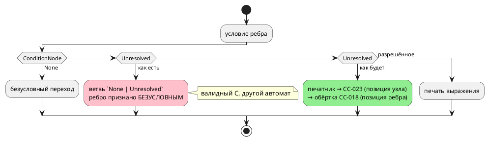

# ADR 0236: Печатник цели c печатает пустоту на неразрешённом условии

- **Status:** Accepted (Option B)
- **Date:** 2026-08-16
- **Authors:** Архитектор
- **Related issues:** [Фича 0236](../features/0236-c-unresolved-condition-refusal.md); находка [фичи 0203](../features/0203-validate-formulas-traversal.md) (validate не обходил формулы); смежно с [ADR 0028](0028-c-generator-stubs.md) (отказ вместо комментария-заглушки), [ADR 0189](0189-anonymous-ports.md) (оператор терялся молча), [ADR 0229](0229-format-unsupported-position.md) (`FM-001` — один код, вид узла в тексте, позиция из АСД)

## Context

Фича [0203](../features/0203-validate-formulas-traversal.md) закрыла молчание в
**семантике**: опечатка в имени внутри охранной формулы стала ошибкой
компиляции. Она же назвала оставшуюся границу: на входе `: [Guard] levl < 3;`
цель `c` печатала

```c
assert( < 3);
```

и рапортовала об успехе — отказ приходил от **`cc`** («expected expression»).
Предмет этой фичи — не формулы (их закрыла 0203), а **класс**: неразрешённый
узел, дошедший до печатника цели `c`, обязан давать диагностику языка с
позицией, а не пустоту.

### Замер 1: путь из исходника сегодня закрыт — но не целью

Проба (2026-08-16, три входа: неразрешённое имя в формуле, в условии ребра, в
теле `always`). Все три отвергает **построение дерева** — до генератора вход не
доходит:

| Вход | Ответ | Кто отвечает |
|---|---|---|
| `: [Guard] levl < 3;` | `SE-025` | `semantic` (после 0203) |
| `ref Done: levl < 3;` | `SE-025` | `semantic` |
| `always { levl := 1; }` | `SE-003` | `semantic` |

То есть **недостижимость ветвей цели держится другой фичей**, а не самой целью.
Ровно так же она держалась и до 0203 — пока не выяснилось, что формулы не
обходит никто. Следующая конструкция языка способна открыть тот же путь снова, и
**молча**.

### Замер 2: инвентаризация ветвей цели `c` (чтение кода + проба)

| Узел | Место | Что происходит сегодня |
|---|---|---|
| `ConditionNode::Unresolved` | `c_expr/condition.rs` (`generate_condition_expr`) | `Ok("")` — **пустая строка** |
| он же, решение «условный ли переход» | `c_model.rs` (`generate_state_transitions`) | ребро считается **БЕЗУСЛОВНЫМ** |
| `StatementNode::Unresolved` | `c_expr/stmt.rs` (`generate_code_block`) | пропуск — **оператор исчезает** |
| `ExpressionNode::Unresolved` | `c_expr/expr.rs` (`generate_expr`) | `Err` **без кода и без позиции** |
| `VariableNode::Unresolved` | `c_expr/resolve.rs`, `c_header.rs`, `c_decl.rs` | `Err` без кода / пропуск объявления |
| `FunctionDefinitionNode::Unresolved` | `c_expr/names.rs` (`get_function_name`) | `unreachable!` — **паника инструмента** |

⚠️ **Худшее здесь — не пустая строка, а вторая строка таблицы.** Пустое условие
даёт невалидный C, и его ловит `cc`. А ребро, признанное безусловным, даёт
**валидный** C с **другим автоматом**: переход срабатывает всегда. Это в
точности класс, ради которого заведён [ADR 0028](0028-c-generator-stubs.md)
(«мёртвый автомат, обнаруживаемый на объекте, а не в CI»), — только с обратным
знаком.

### Замер 3: из пяти целей молчит одна

| Цель | Ответ на `ConditionNode::Unresolved` |
|---|---|
| `c` | `Ok("")` — пустота |
| `rust` | `RS-011` «неразрешённое условие» |
| `st` | отказ «условие не прошло семантическое понижение» |
| `sv` | `SV-002` «неразрешённое условие» |
| симулятор | отказ в такте |

### Замер 4: не всякий `Unresolved` — дефект

Правая часть паттерна `S(Модель) = Состояние` приходит в цель
**неразрешённой по инварианту проекта**: `End` — состояние модели-аргумента, и
семантика разрешить его не может и не должна (проход
`resolve_state_references` запрещён; сторож —
`reference_model_tests::reference_model_compiles_and_translates_state_ref`).
Разбирает эту форму `generate_state_comparison`, **до** общего печатника.

Отсюда прямое следствие для выбора решения: **запрет «в дереве не бывает
`Unresolved`» неверен**, и любое решение обязано оставить эту форму работать.

## Decision Drivers

1. **Молчаливая потеря недопустима.** Класс [0028](0028-c-generator-stubs.md) /
   [0155](../features/0155-semantic-nested-statement-resolution.md) /
   [0189](0189-anonymous-ports.md): язык принимает запись, а диагностику даёт
   чужой инструмент — или не даёт никто.
2. **Подмена смысла хуже невалидного вывода.** Условное ребро, ставшее
   безусловным, компилируется без замечаний.
3. **Легитимный `Unresolved` существует** (замер 4) — решение обязано его
   пропустить, не заводя второго знания о форме паттерна (класс 0203: разборов
   формы было три, и судья отставал).
4. **Диагностика обязана нести позицию** (правило пачки, фича
   [0130](../features/0130-diagnostics-batch.md)): в сообщении без координаты
   искать нечего. Все три узла её несут — `ast::Condition::loc()`,
   `ast::Expression::loc()`, `ast::Statement::loc()`.
5. **И код** — «диагностика цели `c` без кода» уже заведена фичей
   [0212](../features/0212-c-diagnostic-without-code.md) как отдельный класс;
   новая диагностика не имеет права его пополнять.

### Поток «как есть» и «как будет»



## Considered Options

### Option A. Точечная правка: отказ только на условии

Разделить ветвь `None | Unresolved` в `generate_condition_expr`.

**Pros:**
- Минимальная правка; закрывает ровно тот вход, который назвала 0203.

**Cons:**
- **Не закрывает класс.** Оператор (`StatementNode::Unresolved`) остаётся
  исчезающим молча, выражение — отказом без кода и позиции. Карточка фичи
  требует обратного прямым текстом.
- Ветвь «условие `Unresolved` = безусловный переход» в `c_model.rs` живёт
  отдельно от печатника и правкой печатника не лечится.

### Option B. Единая воронка отказа цели `c` для узлов, несущих позицию

Один конструктор диагностики (`c_unresolved::refuse(loc, вид)`) → **`CC-023`**,
вид узла назван в тексте; зовут его три печатника — условия, выражения,
оператора. Плюс правка решения «условный ли переход» в `c_model.rs`. Сторож —
перечисление видов узлов в тесте.

**Pros:**
- Закрывает класс целиком: три места, где неразрешённый узел сегодня теряется
  или отказывает безлико, отвечают одинаково.
- Образец уже есть в проекте и оправдал себя: `format::unsupported(loc, вид)` →
  `FM-001` (фича [0229](0229-format-unsupported-position.md)) — **один** код,
  вид узла в тексте, позиция из АСД.
- Легитимный `Unresolved` не задет: `generate_state_comparison` разбирает
  паттерн **раньше** и второго знания о форме не заводит.
- Ребро с неразрешённым условием перестаёт быть безусловным.

**Cons:**
- Сторож обязан строить узлы **руками**: из исходника такое дерево не
  получить (замер 1), значит тест живёт внутри крейта, а не в `tests/`.
- Отказ на входе, недостижимом сегодня, — «мёртвый код» до тех пор, пока
  недостижимость держится. Ровно это и есть предмет фичи.

### Option C. Проход семантики «в дереве не осталось `Unresolved`»

Проверка перед вызовом любой цели — закрывает все цели разом.

**Pros:**
- Одно место на все шесть целей.

**Cons:**
- **Отвергается замером 4:** легитимный `Unresolved` существует (правая часть
  `S(Модель) = Состояние`), и проход обязан был бы его исключить — то есть
  завести **второе** знание о форме паттерна. Первое живёт в
  `semantic/condition/state_of.rs`, и фича 0203 закрывалась ровно потому, что
  таких разборов было три и они разошлись.
- Проверка дублирует `validate`, стоит обхода на каждой сборке и отвечает о
  **дефекте компилятора** там, где остальные проверки отвечают о программе
  автора.

### Option D. Типизировать: разные типы дерева до и после понижения

Убрать варианты `Unresolved` из узлов, которые видит генератор.

**Pros:**
- Класс закрывается **компилятором Rust**, а не тестом: невыразимое состояние
  становится непредставимым.

**Cons:**
- Масштаб несопоставим с предметом: `Unresolved` — рабочее состояние построения
  дерева, узлы делят представление между стадиями, затронуты все шесть целей,
  форматтер, LSP и симулятор.
- Легитимный `Unresolved` (замер 4) потребовал бы отдельного узла в
  «разрешённом» дереве — то есть та же развилка, но в типах.

## Decision

Принимается **Option B**.

- Новый код **`CC-023`** — «неразрешённый узел дошёл до печатника цели `c`».
  **Один** код на три вида узла; вид назван словом в тексте («условие»,
  «выражение», «оператор»), позиция берётся из АСД-узла, который несёт
  `Unresolved`. Образец — `FM-001` фичи 0229.
- Конструктор диагностики — **один** (`c_unresolved::refuse`): текст и код
  собираются в одном месте, а печатники его лишь зовут.
- Решение «условный ли переход» (`c_model.rs`) перестаёт считать `Unresolved`
  отсутствием условия: такое ребро идёт в печатник, получает `CC-023` и
  доезжает до автора обёрткой `CC-018` — с позицией **ребра** и исходной
  причиной заметкой (устройство ADR 0028 сохраняется).
- Легитимная форма `S(Модель) = Состояние` не задета: её разбирает
  `generate_state_comparison` до общего печатника.

**Вне объёма (границы названы, а не забыты):** `VariableNode::Unresolved`,
`FunctionDefinitionNode::Unresolved` и `StateNode::Unresolved` позиции **не
несут** — у них нет АСД-узла в полезной нагрузке, поэтому «отказ с позицией» для
них невыразим; безликие отказы этих ветвей — предмет фичи
[0212](../features/0212-c-diagnostic-without-code.md), а `unreachable!` в
`get_function_name` — кандидат (см. `FEATURES.md`).

## Consequences

### Положительные

- Пустое условие и исчезнувший оператор заменяются диагностикой языка **с
  позицией**; `cc` перестаёт быть арбитром корректности вывода.
- Ребро с неразрешённым условием больше не превращается в безусловный переход.
- Цель `c` отвечает на неразрешённый узел так же, как остальные четыре цели.

### Отрицательные / Action items

- **Совместимость.** Меняется поведение на входе, который сегодня из исходника
  недостижим (замер 1). Вывод корпуса обязан остаться **байт-в-байт** — это
  проверяемый критерий, а не ожидание.
- **Сторож живёт внутри крейта.** Печатники объявлены `pub(in crate::generator::c)`,
  и построить неразрешённый узел из исходника нельзя — тест строит узлы руками.
  Плата за это названа: тест видит внутреннее устройство цели.
- **Недостижимость остаётся** до появления конструкции, которая её откроет.
  Значит, тест обязан проверять **ветвь**, а не «программу, которая падает».
- `CC-023` вносится в приложение «Ошибки и предупреждения» (правило 25).
  ⚠️ Замер попутно: в таблице приложения нет `CC-020`…`CC-022`, а описание
  `CC-019` оборвано на полуслове — актуализируется кандидат «Таблица кодов
  приложения отстаёт от компилятора».

### Acceptance criteria

1. `ConditionNode::Unresolved`, `ExpressionNode::Unresolved` и
   `StatementNode::Unresolved`, дойдя до печатника цели `c`, дают **`CC-023`** с
   позицией из АСД-узла.
2. Ребро с неразрешённым условием **не** печатается безусловным переходом:
   ответ — `CC-018` с позицией ребра и заметкой-причиной `CC-023`.
3. Легитимная форма `S(Модель) = Состояние` переводится по-прежнему (сторож
   `reference_model_tests` зелён).
4. Вывод корпуса `examples/generated/` **байт-в-байт** неизменен.
5. `CC-023` описан в приложении «Ошибки и предупреждения».
6. `./scripts/precheck.sh` зелёный.
