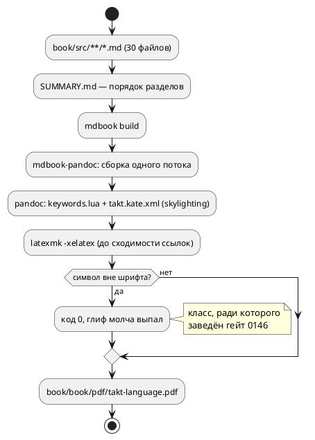
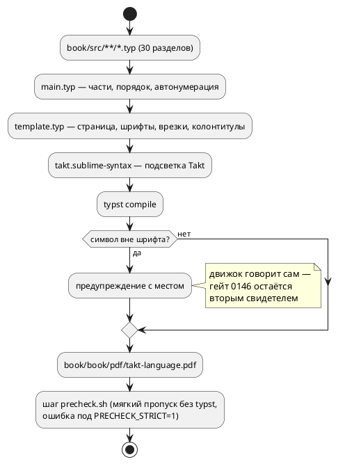

# ADR 0240: Перевод документа book/ в формат Typst

- **Status:** Accepted
- **Date:** 2026-08-17
- **Authors:** Архитектор + Системный аналитик
- **Related issues:** [Фича 0240](../features/0240-book-typst.md); формат исходников
  и включение сборки в гейты — **решение заказчика 2026-08-17** (см. «Decision»).

## Context

Документ `book/` («Язык Takt — описание») собирается связкой из **шести**
внешних инструментов: `mdbook` → `mdbook-pandoc` → `pandoc` → `latexmk` →
`xelatex`, плюс `rsvg`/`dot` для диаграмм верификации. Сборка вне
`precheck.sh`, то есть **машина её не запускает вовсе** — отказ вёрстки виден
только тому, кто собрал документ руками.

**Замеры сняты заново** (2026-08-17, урок 0195 — записи устаревают):

| Величина | Записано в карточке | Измерено |
|---|---|---|
| Объём исходника | 60 файлов | **30 файлов `.md`** (6540 строк) + 33 файла примеров/вывода/диаграмм |
| Объём PDF | ≈101 страница | **151 страница** (544 КБ) |
| Время `make -C book build` | не записано | **26.6 с** (wall clock, тёплый кеш) |

Вокруг документа держатся **четыре гейта**, и каждый завязан на нынешний
конвейер:

- **символы** (0146, `scripts/check-book-glyphs.py`) — сверяет каждый символ
  `book/src/**/*.{md,takt}` и титульных полей `book.toml` со снимком `cmap`
  Fira Code. Заведён потому, что **xelatex молчит**: символа нет в шрифте —
  код 0, предупреждение, глиф выпал;
- **примеры** (0133, шаг `precheck.sh`) — каждый `.takt` документа
  компилируется целью `c` и прогоняется симулятором;
- **лексика приложения «Грамматика»** (0160, `scripts/check-book-keywords.py`)
  — список ключевых слов приложения против таблицы `KEYWORDS` лексера **в обе
  стороны**, разбор **по абзацу**;
- **примеры внутри PDF** держит вручную поддерживаемая подсветка
  `book/takt.kate.xml` (skylighting) и lua-фильтр `book/keywords.lua`
  (ключевые слова в инлайн-коде).

⚠️ **Факт, найденный при проработке:** оба списка подсветки **отстали от
лексера и сторожа не имеют** — в `takt.kate.xml` отсутствуют `parameter`,
`clock`, `at`, `after`, `every` (в лексере 48 записей). Это класс 0084/0193:
два списка одного набора расходятся молча. Гейт 0160 их не проверяет — он
сверяет **приложение грамматики**, а не подсветку.

### Поток «как есть»



## Decision Drivers

1. **Число внешних инструментов.** Шесть против одного. Сборка документа сегодня
   невозможна там, где нет TeX Live (≈4 ГБ) — то есть в CI её нет и не будет
   без отдельной установки.
2. **Молчание нынешнего движка.** `xelatex` не считает пропавший глиф ошибкой;
   ради этого класса заведён отдельный гейт со снимком `cmap`. Движок, который
   об отсутствующем глифе **говорит**, снимает причину, а не следствие.
3. **Оформление задаётся кодом, а не набором опций.** Сегодня вёрстка живёт в
   `book.toml` семнадцатью строками `header-includes` на LaTeX (fancyhdr,
   `\@mkboth`, `\pretocmd`) — правка требует знания TeX. Typst — язык, и
   оформление в нём пишется функциями.
4. **Скорость.** 26.6 с на документ означает, что сборка не может быть шагом
   предкоммита. Проба Typst на разделе — 0.19 с.
5. **Обратная совместимость (правило 11).** `make -C book build` и путь
   `book/book/pdf/takt-language.pdf` — публичный контракт (README, CLAUDE.md,
   правило 24). Он обязан сохраниться при любом варианте.

## Considered Options

### Option A. Полный перенос: исходники становятся `.typ`, сборка — `typst compile`

30 файлов `.md` однократно конвертируются в разметку Typst и дальше документ
ведётся на Typst. `mdbook`, `mdbook-pandoc`, `pandoc`, `xelatex`, `latexmk`,
`rsvg` уходят целиком; остаётся **один** бинарник `typst`.

Технические пробы (2026-08-17, Typst 0.15.1) — все положительные:

- `pandoc -t typst` даёт **машинную заготовку**, а не бумагу для ручного
  перевода: заголовки, таблицы, `#strong`, `#quote`, а блоки кода выводятся
  готовым Typst-синтаксисом ```` ```takt ```` — конверсия 29 файлов заняла
  секунды;
- **Fira Code + кириллица** — работает; **`⚠️` рендерится цветным emoji**
  (fallback-шрифт), тогда как xelatex его терял;
- **подсветка Takt** — через `book/takt.sublime-syntax` и
  `#set raw(syntaxes: …)`: ключевые слова, типы, числа, комментарии, строки
  (проба приложена к отчёту стадии 6);
- **`{{#include}}`** заменяется на `#raw(read("examples/x.takt"), lang: "takt")`
  — то же поведение, но **без внешнего препроцессора**;
- **SVG-диаграммы** вставляются нативно (`#image("…svg")`) — `rsvg-convert`
  из конвейера уходит;
- **курсив** у Fira Code отсутствует; в Typst он получается show-правилом
  `#show emph: it => box(skew(ax: -12deg, it.body))` — замена костылю
  `AutoFakeSlant` в `book.toml`.

**Pros:**
- один внешний инструмент вместо шести; TeX Live не нужен;
- сборка становится **дешёвой** — её можно поставить шагом предкоммита;
- оформление и вспомогательные функции (врезка, пример, ссылка на раздел) —
  код на Typst, а не опции трёх инструментов;
- у обоих списков подсветки появляется **одно место** и возможность сторожа
  против лексера (закрывает молчаливое расхождение, найденное выше);
- отвечает заголовку фичи: документ становится **в формате Typst**.

**Cons:**
- единовременная работа: вычитка 30 конвертированных файлов (машинная
  заготовка не свободна от артефактов — `---` вместо `—`, `\;`, кириллические
  метки, `#figure(kind: table)` вокруг каждой таблицы);
- три гейта читают `.md` — их область правится (`.md` → `.typ`), а титульные
  поля берутся из шаблона, а не из `book.toml`;
- Markdown как формат исходников теряется: правка требует знания Typst.

### Option B. Markdown остаётся, Typst — только движок вывода

Цепочка `mdbook` → `pandoc -t typst` → `typst compile`. Уходит только TeX.

**Pros:**
- исходники и все четыре гейта не трогаются вовсе;
- работа на порядок меньше.

**Cons:**
- инструментов остаётся **три** (`mdbook`, `mdbook-pandoc`, `pandoc`) — то
  есть главный драйвер не закрыт, и сборка по-прежнему тяжела для гейта;
- вёрстка задаётся шаблоном pandoc: контроль слабее нынешнего LaTeX-варианта,
  а `mdbook-pandoc` — сторонний бэкенд, чья поддержка вывода `typst` не
  является его заявленной целью;
- заголовок фичи не исполняется: формат документа остаётся Markdown.

### Option C. Markdown внутри Typst (пакет `cmarker`)

`.md` не меняются, Typst — единственный внешний инструмент, Markdown
рендерится пакетом `cmarker` из Typst Universe.

**Pros:**
- исходники и гейты не трогаются;
- один внешний бинарник.

**Cons:**
- зависимость от **пакета** (загрузка из Universe при первой сборке; для
  офлайн-сборки его пришлось бы вендорить в репозиторий);
- `{{#include}}` пакетом не поддерживается — препроцессор нужен всё равно;
- подсветка кода, таблицы и врезки внутри `cmarker` подчиняются его
  ограничениям, а не нашим — часть нынешнего оформления пришлось бы
  проверять пробами и, возможно, потерять;
- документ остаётся Markdown-ом, живущим внутри чужого рендерера: **две**
  системы разметки вместо одной.

## Decision

Принимается **Option A** — **решением заказчика 2026-08-17** (вопрос был
поставлен как открытый пункт 3 карточки; варианты A/B/C предъявлены с
замерами). Тем же решением заказчика **сборка документа включается в
`precheck.sh` и CI**: после перевода она стоит один бинарник и доли секунды,
поэтому отказ вёрстки обязан быть виден до коммита, а не при ручной сборке.

Целевой поток:



Устройство:

| Что | Где | Заменяет |
|---|---|---|
| Шаблон (страница, шрифты, врезки, колонтитулы, титул, оглавление) | `book/src/template.typ` | `book.toml` + `header-includes` (LaTeX) |
| Порядок частей и разделов | `book/src/main.typ` | `book/src/main.typ` |
| Подсветка Takt | `book/takt.sublime-syntax` | `book/takt.kate.xml` |
| Ключевые слова в инлайн-коде | show-правило в `template.typ` над общим списком | `book/keywords.lua` |
| Вставка примера | `#example("examples/x.takt")` над `raw(read(…))` | `{{#include}}` |
| Ссылка на раздел | метка раздела + `@label` | ссылка на `../*/index.md` |

Расположение разделов (`book/src/<NN-имя>/index.*`, примеры в
`examples/`, порождённый код в `generated/`, диаграммы в `images/`)
**сохраняется**: от него зависят гейт примеров, скрипт `render_verify_graphs.sh`
и относительные пути включений.

## Consequences

### Положительные

- Требование к окружению: **`typst`** вместо `mdbook` + `mdbook-pandoc` +
  `pandoc` + `latexmk` + `xelatex` + `rsvg-convert`. Сборка документа
  становится доступна в CI без TeX Live.
- Сборка становится шагом `precheck.sh` — класс «вёрстка сломана» перестаёт
  быть невидимым для машины.
- Оформление документа программируется; врезка `⚠️`, пример и ссылка на раздел
  получают **по одной** функции вместо повторяемой разметки.
- Списки подсветки получают одно место и сторожа против `KEYWORDS` лексера —
  закрывается молчаливое расхождение, найденное на стадии архитектуры.

### Отрицательные / Action items

1. **Правка трёх гейтов** (`check-book-glyphs.py`, `check-book-keywords.py`,
   шаг примеров `precheck.sh`): область `.md` → `.typ`, титульные поля — из
   шаблона вместо `book.toml`. ⚠️ Разбор «по абзацу» в гейте лексики (0160)
   сохранить: построчный поиск даёт зелёную проверку, не проверяющую ничего.
2. **Артефакты машинной конверсии вычитать**: `---` → `—` (иначе em dash не
   виден гейту символов, а в PDF появляется), `\;` → `;`, кириллические метки
   → латинские, `#figure(kind: table)` → таблица без подписи.
3. **Отказ от Markdown** зафиксировать в `README.md`, `book/README.md`,
   `CLAUDE.md` и правиле 24 (`docs/RULE.md` упоминает mdBook дважды).
4. **`⚠️` перестаёт быть проблемой шрифта, но гейт 0146 остаётся**: он
   сторожит и `.takt`-примеры, и снимок `cmap`; отменять сторожа на основании
   «новый движок предупреждает» нельзя — предупреждение не роняет сборку.
5. **Диаграммы верификации**: `render_verify_graphs.sh` (taktc → dot → SVG)
   сохраняется как есть; из сборки уходит только `rsvg-convert`, потому что
   SVG вставляет сам Typst.

### Acceptance criteria

1. `make -C book build` собирает `book/book/pdf/takt-language.pdf` **без
   `mdbook`, `pandoc`, `xelatex`, `latexmk`, `rsvg-convert`** в `PATH`
   (проверяется прогоном с урезанным `PATH`).
2. Объём документа сохранён: 21 языковой/прикладной раздел + 5 приложений +
   титул/введение/назначение; число примеров `.takt` (33 включения) и таблиц
   не уменьшилось; постраничный объём — не менее 90 % прежних 151 страницы.
3. Все 4 гейта документа зелёные на новом формате; шаг сборки Typst добавлен
   в `precheck.sh` (мягкий пропуск без `typst`, ошибка под `PRECHECK_STRICT=1`).
4. Подсветка Takt в PDF работает и её список **сверяется с `KEYWORDS`
   лексера** машиной (в обе стороны, как гейт 0160).
5. `./scripts/precheck.sh` зелёный; в `book/` не осталось файлов прежнего
   конвейера (`book.toml`, `SUMMARY.md`, `keywords.lua`, `takt.kate.xml`).
