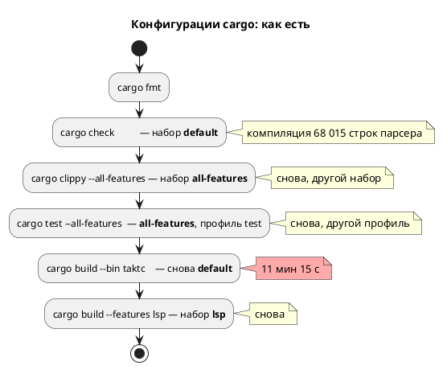

# ADR 0241: Ускорение предкоммита

- **Status:** Accepted
- **Date:** 2026-08-17
- **Authors:** Архитектор + системный аналитик
- **Related issues:** [Фича 0241](../features/0241-precheck-speedup.md); предыдущий
  профиль — [ADR 0234](0234-precheck-time-profile.md) (каталог гейта),
  [фича 0190](../features/0190-precheck-selective-gates.md) (параллельные тесты).

## Context

**Повод — замер, а не ощущение.** Прогон 2026-08-17: **69 мин 39 с**, и он
**упал** (код 1). Норматив, записанный фичей 0234, — 230 с.

| Фаза | Время | Доля |
|---|---|---|
| `cargo test --all-features` | 2450.9 с | 59 % |
| `cargo build` бинарников | 675 с (11 мин 15 с) | 16 % |
| `fmt` + `check` + `clippy` + мелкие гейты | ~1050 с | 25 % |
| Гейты целевых языков | **не дошли** — падение раньше | — |

**Что отброшено замером, а не рассуждением:**

| Подозрение | Замер | Вердикт |
|---|---|---|
| Гигиена чистит каталог каждый прогон (0234) | запись `deps` = 0.67 МиБ при пороге 4 МиБ | не виновата |
| Внешний том (USB SSD) медленный | линейная запись 405 против 695 МБ/с; 2000 мелких файлов — 2.97 против 2.08 с | не объясняет 10 минут |
| Компиляция тестов | сумма исполнения 144 наборов = 2604 с при wall-clock 2450 с | время в **исполнении**, не в сборке |

**Найдены три независимые причины.**

**(1) Компиляция `takt-lang` однопоточна и повторяется.** LALRPOP порождает из
1111 строк `grammar.lalrpop` **68 015 строк** Rust, и `rustc` компилирует их в
один поток: замер `cargo build --all-features --bin taktc --bin takt-lsp` —
**10 мин 19 с при загрузке процессора 11 %** (одно ядро из двенадцати).
Предкоммит гонял cargo в **пяти** конфигурациях — `check` (default) →
`clippy` (all-features) → `test` (all-features) → `build --bin taktc` (default)
→ `build --features lsp` (lsp), — и каждая смена набора фич заставляет
компилировать этот файл заново. В каталоге гейта осталось **16** build-каталогов
`takt-lang`, 4 `.rlib` и 7 `.rmeta`.

**(2) Сверки SystemVerilog собирают C++ в один поток.** 85 % тестового времени —
в **шести наборах из 29 тестов** (711.9 / 368.2 / 331.7 / 316.2 / 249.2 /
233.2 с), тогда как набор из **1093** юнит-тестов укладывается в 49.9 с.
Наблюдение вживую: `verilator --binary --timing` → `clang++ -Os`, минуты на один
тестбенч. У `verilator` сборка порождённого C++ по умолчанию **однопоточная**.

**(3) Скрытый дефект: гейт искал бинарники не там, где собирал.** С фичи 0234
сборка идёт в `$PRECHECK_TARGET_DIR` (`target/precheck`), но две строки
(`LAMC="./target/debug/taktc"`, вызов `./target/debug/takt-sim`) смотрели в
**рабочий** `target`. Работало это лишь потому, что там случайно лежал ранее
собранный бинарник; после первой же чистки рабочего каталога гейт упал — и
**соврал о причине**: «Примеры не в каноне» вместо «нет `taktc`».

## Decision Drivers

1. **Гейт, идущий час, перестают запускать.** Правило проекта («каждое изменение
   заканчивается сборкой и тестами») держится на том, что предкоммит дёшев.
2. **Причины независимы**, и каждая лечится своим средством — смешивать их в
   одно «ускорение вообще» нельзя.
3. **Правка не имеет права ослаблять проверки.** Ускорение за счёт отказа от
   гейта — не ускорение, а потеря (урок 0234: `cargo-nextest` и объединение
   целей отвергнуты замером, а не мнением).
4. **Дефект (3) — не оптимизация, а поломка**, и её надо чинить независимо от
   скорости.

## Considered Options

### Option A. Только починить пути (3), скорость не трогать

**Pros:** минимальная правка, гейт снова зелёный.
**Cons:** 69 минут остаются; правило 5 продолжает нарушаться на практике.

### Option B. Свести конфигурации cargo и распараллелить verilator

- `cargo check` убрать: `clippy` выполняет тот же анализ и строже (`-D warnings`).
- Бинарники собирать **одной** командой с `--all-features` — тем же набором, что
  у `cargo test`, чтобы артефакты переиспользовались.
- В вызовы `verilator --binary` (9 мест в сверках, 2 в гейтах) добавить `-j 0`.

**Pros:**
- Бьёт в измеренные причины, а не в предполагаемые.
- Проверок не убавляет: `clippy --all-targets --all-features` покрывает то же,
  что `check`; `-j 0` меняет только параллелизм сборки C++.
- Замер эффекта: набор `conformance_param_modes_tests` — **110.6 с** против
  316–331 с в прошлом прогоне (≈ 2.9×).

**Cons:**
- Бинарники собираются с фичей `lsp` — они «толще», чем в релизе. Для гейта
  безразлично (фичи аддитивны, поведение то же).

### Option C. Вынести парсер в отдельный крейт

Тогда артефакт LALRPOP переживал бы смену фич основного крейта.

**Pros:** снимает корень причины (1) целиком.
**Cons:** архитектурная правка публичных путей (`takt_lang::parse`, `parser::ast`
— сотни мест), риск несоизмерим с выигрышем **этой** фичи. Заводится кандидатом.

### Option D. `cargo-nextest`, объединение тестовых целей

**Cons:** отвергнуто **замером** ещё фичей 0234: ускоряет то, чего в бюджете нет
(исполнение мелких тестов — 50 с из часа). Повторять отвергнутое без нового
замера нельзя.

## Decision

Принимается **Option B**, дефект (3) чинится в её составе как обязательная часть.

Обоснование: обе правки Option B адресуют **измеренные** статьи расхода —
11 минут повторной компиляции парсера и 85 % тестового времени в шести
наборах, — и ни одна не убирает проверку. Option C правильна по существу, но её
цена принадлежит другой фиче; она вынесена кандидатом.

## Consequences

### Положительные

- Конфигураций cargo — три вместо пяти; парсер компилируется на две сборки реже.
- Сборка тестбенчей SV идёт на всех ядрах.
- Гейт перестаёт зависеть от содержимого **рабочего** `target` — а значит,
  перестаёт врать о причине падения.

### Отрицательные / Action items

- Бинарники гейта собираются с `--all-features`; если когда-нибудь появится
  фича, **меняющая поведение** (а не добавляющая), это правило придётся
  пересмотреть — сегодня фичи аддитивны (`ast-serde`, `lsp`).
- Кандидат: вынос парсера в отдельный крейт (Option C).
- Кандидат: `-CFLAGS -O0` для тестбенчей — скорость симуляции там не важна, а
  время `clang++` — важно; требует отдельного замера.

### Acceptance criteria

1. `./scripts/precheck.sh` **зелёный** и не зависит от рабочего `target`.
2. Время прогона измерено и записано; ожидание — кратное сокращение против
   69 мин 39 с.
3. Ни одна проверка не удалена: список гейтов прежний, `-D warnings` на месте.
4. Сверки SV проходят с тем же результатом (параллелизм сборки не меняет
   поведения тестбенча).
