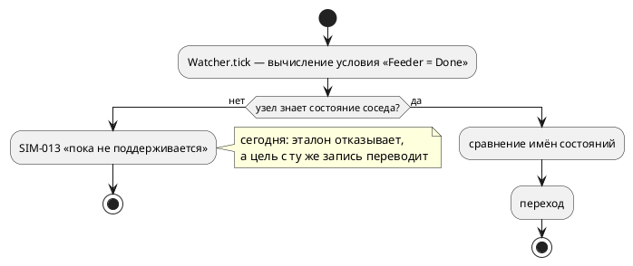

# ADR 0245: Симулятор исполняет `S(Модель)` — проверку состояния под-модели

- **Status:** Accepted
- **Date:** 2026-08-17
- **Authors:** Архитектор + Системный аналитик
- **Related issues:** [Фича 0245](../features/0245-sim-state-of-model.md); повод —
  [фича 0237](../features/0237-book-state-of-model-section.md) (документирование
  конструкции); форма паттерна — [0203](../features/0203-validate-formulas-traversal.md),
  перевод в цель `c` — [0075](../features/0075-lib-src-reference-model.md).

## Context

Язык допускает проверку состояния под-модели двумя равносильными записями —
`S(Модель) = Состояние` и краткой `Модель = Состояние` (решение заказчика
2026-08-15, фича 0203). Семантика принимает обе, форму разбирает **одна**
функция `semantic::condition::state_of`.

**Замер потребителей** (2026-08-17, проба `Feeder = Done` при
`start Main = Feeder | Watcher;`):

| Потребитель | Ответ |
|---|---|
| **симулятор (эталон)** | **`SIM-013`** — «сравнение с моделью пока не поддерживается» |
| `c`, `c-hal` | переводит: `main->main.feeder0.state == PROBE_FEEDER_DONE` |
| `plantuml` | рисует |
| `rust` | `RS-020`/`RS-011` — отказ |
| `st` | `ST-011` — отказ |
| `sv` | `SV-002` — отказ |

То есть **эталон не исполняет конструкцию, которую цель `c` переводит**, а
документ (раздел «Цели генерации») обещает: «поведение модели одинаково во всех
целях и в симуляторе». Пока это так, конструкцию нельзя ни документировать по
правилу 27(д) (пример раздела обязан проверяться симуляцией), ни отлаживать
симулятором — тем самым инструментом, который проект называет эталоном.

Причина отказа — **ветвь-заглушка**: `predicate.rs` отвечает `SIM-013` на
`ConditionNode::Model`/`State` с комментарием «отдельная задача внутри фичи
0025». Задача не была заведена, и заглушка пережила саму фичу — тот самый класс,
что вынесен кандидатом [0217](../features/0217-stub-branch-gate.md).

### Что мешает вычислить условие сегодня

Условие записано в одной модели, а спрашивает о состоянии **другой**. Предикат
вычисляется в контексте своего узла (`Predicate::evaluate(&mut Unit)`), а узлы
дерева `Unit` ссылок друг на друга не имеют: `Parallel`/`Sequential` держат
детей, но ребёнок не знает ни родителя, ни сестёр.

## Decision Drivers

1. **Эталон обязан исполнять язык.** Расхождение «цель умеет, эталон нет» —
   ровно тот класс, ради которого заведены потактовые сверки: молча неверная
   трансляция и неисполнимая конструкция одинаково подрывают доверие к трассе.
2. **Порядок наблюдения должен совпасть с целью `c`.** В порождённом C
   под-модели тикаются по очереди (`ProbeFeeder_tick(…); ProbeWatcher_tick(…);`),
   и наблюдатель видит состояние соседа **уже обновлённым на этом такте**.
   Любое решение обязано дать ту же трассу.
3. **Одно знание о форме паттерна.** Разбор `S(Модель)`/`Модель` уже сведён в
   одну функцию (0203). Второй разбор в симуляторе разъехался бы — прецедент
   был: судья знал только полную форму, цели — обе.
4. **Дешевизна.** Фича обслуживает документную 0237; она не вправе перестраивать
   дерево исполнения.

## Considered Options

### Option A. Реестр состояний: общая карта «имя модели → текущее состояние»

Один `Rc<RefCell<HashMap<String, String>>>` на прогон; узел кладёт в него своё
состояние при входе и при каждом переходе, условие читает через новый метод
трейта `Context::model_state(&self, model: &str)`.

**Pros:**
- не требует обратных ссылок и не трогает форму дерева `Unit`;
- порядок совпадает с целью `c` **по построению**: сёстры тикаются по очереди,
  реестр обновляется в момент перехода;
- согласован с уже принятым в проекте принципом адресации **по имени модели**
  (фича 0135: `Модель::порт`, тёзки неразличимы) — новых компромиссов не вводит;
- работает независимо от порядка построения узлов (условие может ссылаться на
  модель, построенную позже).

**Cons:**
- две под-модели с одинаковым именем неразличимы (тот же компромисс, что у
  0135, но теперь он касается и условий);
- состояние живёт в двух местах — в узле и в реестре; рассинхронизация
  возможна, если новая точка смены состояния забудет обновить реестр.

### Option B. Обратные ссылки: `Weak` на родителя, поиск по дереву

Узел хранит `Weak<RefCell<Unit>>` родителя; условие поднимается вверх и ищет
модель по имени среди детей.

**Pros:**
- одно место истины — состояние остаётся только в узле;
- поиск может учитывать положение в дереве (ближайшая одноимённая модель).

**Cons:**
- обратные ссылки в дереве `Unit`, которое сегодня односторонне: их придётся
  расставлять во всех строителях (`Node`, `Parallel`, `Sequential`,
  `state_impls`) и поддерживать при восстановлении из снимка;
- заимствование `RefCell` вверх по дереву во время такта родителя даёт
  **панику** (`already mutably borrowed`): родитель уже занят `tick_parallel`.
  Обход требует отдельного прохода — то есть той же карты, что в Option A.

### Option C. Связывание при построении: предикат держит `Weak` на нужный узел

Строитель, встретив условие о модели `M`, замыкает в предикат ссылку на её узел.

**Pros:**
- адресуется конкретный узел, а не имя: тёзки различимы;
- чтение без поиска.

**Cons:**
- порядок построения: узел-аргумент может быть ещё не создан (условие в первой
  под-модели о второй), нужен отложенный второй проход;
- предикат перестаёт быть чистой функцией условия и начинает знать о дереве —
  слой адаптеров (`predicate.rs`) по ADR 0025 семантики и структуры не содержит.

## Decision

Принимается **Option A**.

Устройство:

1. **Форма паттерна берётся у `takt-lang`.** `semantic::condition::state_of`
   становится публичным API (`state_of_model`, `compared_state_name`); симулятор
   и цель `c` зовут **одну** функцию — второго разбора формы в проекте не
   появляется (правило 0203).
2. **Реестр состояний** (`StateRegistry`) создаётся строителем на корень и
   раздаётся узлам. Обновляется в трёх точках: при постройке узла (стартовое
   состояние), при переходе (`tick_node`, шаг 6) и при восстановлении из снимка
   (`state_io::restore`).
3. **Чтение** — новый метод `Context::model_state`; умолчание `None`
   (контекст без модели, мок в тестах), у `BlockScope`/`FunctionScope` —
   делегирование внешнему контексту.
4. **Вычисление** — в ветвях `Equal`/`NotEqual` адаптера условий: если левая
   часть есть паттерн «состояние модели», сравниваются **имена состояний**;
   прочие формы идут прежним путём.
5. **Модель не запущена** (в реестре её нет) → отказ **`SIM-036`** с названием
   модели, а не «условие ложно»: цель `c` на такой модели тоже отказывает
   (`CC-012`), и молчаливое `false` дало бы расхождение эталона с прошивкой —
   ровно то, ради чего заведены сверки.

## Consequences

### Положительные

- Эталон исполняет конструкцию, которую переводит цель `c`; трасса и прошивка
  сверяемы потактово.
- Фича [0237](../features/0237-book-state-of-model-section.md) получает
  возможность дать **прогоняемый** пример (правило 27д) и снять висячую ссылку
  раздела «Выражения».
- Ветвь-заглушка `SIM-013` для `Model`/`State` исчезает — на один экземпляр
  класса 0217 меньше.

### Отрицательные / Action items

1. **Тёзки неразличимы.** Две под-модели с одним именем делят запись реестра;
   компромисс тот же, что у 0135, и он **называется** в документации метода.
2. **Состояние в двух местах.** Новая точка смены состояния обязана обновлять
   реестр; сторож — потактовая сверка sim ≡ c (расхождение проявится трассой).
3. **Цели `rust`, `st`, `sv` по-прежнему отказывают** — это не регресс и не
   предмет 0245; выносится кандидатами.
4. **Реестр диагностик** пополняется `SIM-036`; приложение «Ошибки и
   предупреждения» документа — записью о нём (правило 25).

### Acceptance criteria

1. Проба из «Context» (`Feeder = Done` при `Main = Feeder | Watcher`)
   исполняется симулятором, трасса совпадает с целью `c` **потактово**.
2. Обе формы записи (`S(Feeder) = Done` и `Feeder = Done`) и оба сравнения
   (`=`, `!=`) дают один результат; проверка работает в условии ребра, в
   именованном `cond` и в инварианте.
3. Модель, не запущенная в прогоне, даёт `SIM-036` с её именем, а не `false`.
4. `SIM-013` для `Model`/`State` больше не эмитится; реестр диагностик и
   приложение документа обновлены.
5. `./scripts/precheck.sh` зелёный.
