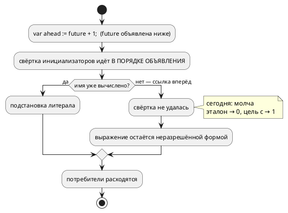

# ADR 0246: Ссылка вперёд в инициализаторе переменной — ошибка компиляции

- **Status:** Accepted
- **Date:** 2026-08-17
- **Authors:** Архитектор + Системный аналитик
- **Related issues:** [Фича 0246](../features/0246-init-forward-reference.md); повод —
  проба при взятии [0222](../features/0222-book-variables-const-fold.md);
  свёртка инициализатора — [0192](../features/0192-const-init-fold.md).

## Context

Фича [0192](../features/0192-const-init-fold.md) ввела правило: имя переменной
в позиции инициализатора значит её **начальное значение** и ссылается только
**назад по тексту** (решение заказчика). Правило записано в карточке фичи, но
**никем не проверяется**: ссылка вперёд принимается молча, и пять потребителей
отвечают на неё по-разному.

**Замер** (2026-08-17, вход `var ahead: u8 := future + 1; var future: u8 := 3;`):

| Потребитель | Ответ |
|---|---|
| **эталон (симулятор)** | `ahead = 0` — свёртка не удалась, значение потеряно молча |
| **цель `c`** | `model->ahead = model->future + 1;` печатается **до** `model->future = 3;` → `ahead = 1` (проверено сборкой и запуском) |
| **цель `st`** | компилируется, инициализатор до вывода не доезжает |
| **цель `rust`** | отказ `RS-017` (текст про тело функции — к делу не относится) |
| **цель `sv`** | отказ `SV-002` |

То есть **один вход даёт пять разных ответов**, и два из них — молчаливые
(эталон и `c`), причём различающиеся между собой: 0 против 1. Это ровно тот
класс, ради которого в проекте заведены потактовые сверки.

⚠️ **Ссылка вперёд на КОНСТАНТУ работает согласованно** (проверено: эталон и
цель `c` дают одно значение) — проходы разрешения констант идут до неподвижной
точки (фича [0204](../features/0204-const-ref-type-inference.md)). Дефект
касается только переменных.

## Decision Drivers

1. **Молчаливое расхождение хуже отказа.** Автор, написавший ссылку вперёд,
   получает работающую сборку и другое поведение в прошивке.
2. **Правило языка уже принято** (0192: «только назад»), и оно не проверяется —
   правило без сторожа не правило (прецедент ADR 0027).
3. **Документируемость.** Фича [0222](../features/0222-book-variables-const-fold.md)
   обязана описать свёртку инициализатора; описывать правило, которое инструмент
   не соблюдает, нельзя.
4. **Соразмерность.** Правка обязана быть точечной: она не должна ни расширять
   язык, ни трогать константы, у которых поведение согласовано.

## Considered Options

### Option A. Диагностика: ссылка вперёд на переменную — ошибка

Свёртка, не сумевшая вычислить инициализатор, проверяет причину: если в
выражении встретилось имя **переменной** (`var`) той же области видимости,
объявленной **ниже по тексту**, — отказ с новым кодом.

**Pros:**
- исполняет уже принятое решение 0192 и делает его проверяемым;
- все пять потребителей начинают отвечать одинаково — отказом компилятора,
  до генерации;
- правка точечная: одно место (`fold_variable_initializers`), константы и порты
  не затронуты.

**Cons:**
- вход, который прежде «работал» (в цели `c` со значением 1), становится
  ошибкой — формально ломающее изменение (в корпусе таких записей нет,
  проверено грепом).

### Option B. Сделать ссылку вперёд законной (как у констант)

Свёртка идёт до неподвижной точки, порядок объявления перестаёт значить.

**Pros:**
- запись `var a := b + 1;` перестаёт быть ловушкой;
- единообразие с константами.

**Cons:**
- **меняет язык**: решение 0192 «только назад» принято заказчиком осознанно, и
  его отмена — не задача фичи, обслуживающей документ;
- у переменных возможна взаимная ссылка (`var a := b; var b := a;`) — понадобится
  обнаружение цикла и своя диагностика, то есть работа много больше;
- порядок инициализации в целях (`c`, `st`) задан порядком объявления: чтобы
  ссылка вперёд работала **в прошивке**, генераторам пришлось бы сортировать
  присваивания топологически.

### Option C. Оставить как есть, описать в документе

**Pros:**
- нулевая работа в коде.

**Cons:**
- документ обязан был бы описать, что запись даёт **разные** значения в
  симуляторе и в прошивке, — то есть узаконить расхождение;
- правило 24: деталей реализации в языковом разделе быть не должно, а иначе
  описать это нечем.

## Decision

Принимается **Option A** (решение заказчика 2026-08-17: «сначала диагностика,
потом документ»).

Устройство:

1. Диагностика **`SE-109`** эмитится в `fold_variable_initializers`
   (`semantic/declaration.rs`) — там, где свёртка уже знает и порядок
   объявлений, и множество вычисленных имён.
2. Причина отказа проверяется **точно**: имя из инициализатора принадлежит
   переменной (`VariableNode::Simple`) той же карты объявлений, а её позиция
   объявления **больше** позиции текущей. Прочие невычислимые формы (порт,
   вызов функции, обращение к полю) остаются законными — язык не ужесточается.
3. **Константы не затрагиваются**: у них ссылка вперёд разрешается проходами до
   неподвижной точки и даёт согласованный результат.
4. Позиция диагностики — **у имени** в инициализаторе, а не у объявления:
   сообщение в пачке без координаты бесполезно (правило 0130).

## Consequences

### Положительные

- Один вход перестаёт давать пять ответов: компилятор отвергает его до
  генерации, одинаково для всех целей и эталона.
- Правило 0192 «имя ссылается только назад» становится проверяемым.
- Фича [0222](../features/0222-book-variables-const-fold.md) получает право
  описать правило как правило, а не как обещание.

### Отрицательные / Action items

1. **Формально ломающее изменение** (правило 11): запись, которую цель `c`
   прежде переводила, становится ошибкой. Обоснование: она давала **разные**
   значения в эталоне и в прошивке, то есть работала неверно у всех, кроме
   одного потребителя. В корпусе `examples/` и в фикстурах таких записей нет
   (проверено грепом при разработке).
2. Реестр диагностик и приложение «Ошибки и предупреждения» пополняются
   `SE-109`.
3. **Ссылка на порт в инициализаторе** остаётся законной и молчаливой: эталон
   даёт 0, цель `c` читает порт при инициализации. Это соседний класс, фичей не
   затрагивается — выносится кандидатом.

### Acceptance criteria

1. `var ahead: u8 := future + 1;` при `future`, объявленной ниже, даёт `SE-109`
   с позицией имени.
2. Ссылка **назад** (`var later := 7; var early := later + 1;`) работает как
   прежде — значение 8 у эталона и у цели `c`.
3. Ссылка вперёд **на константу** остаётся законной.
4. Прочие невычислимые инициализаторы (порт, вызов функции) по-прежнему
   принимаются.
5. Реестр диагностик согласован; приложение документа дополнено.
6. `./scripts/precheck.sh` зелёный.
