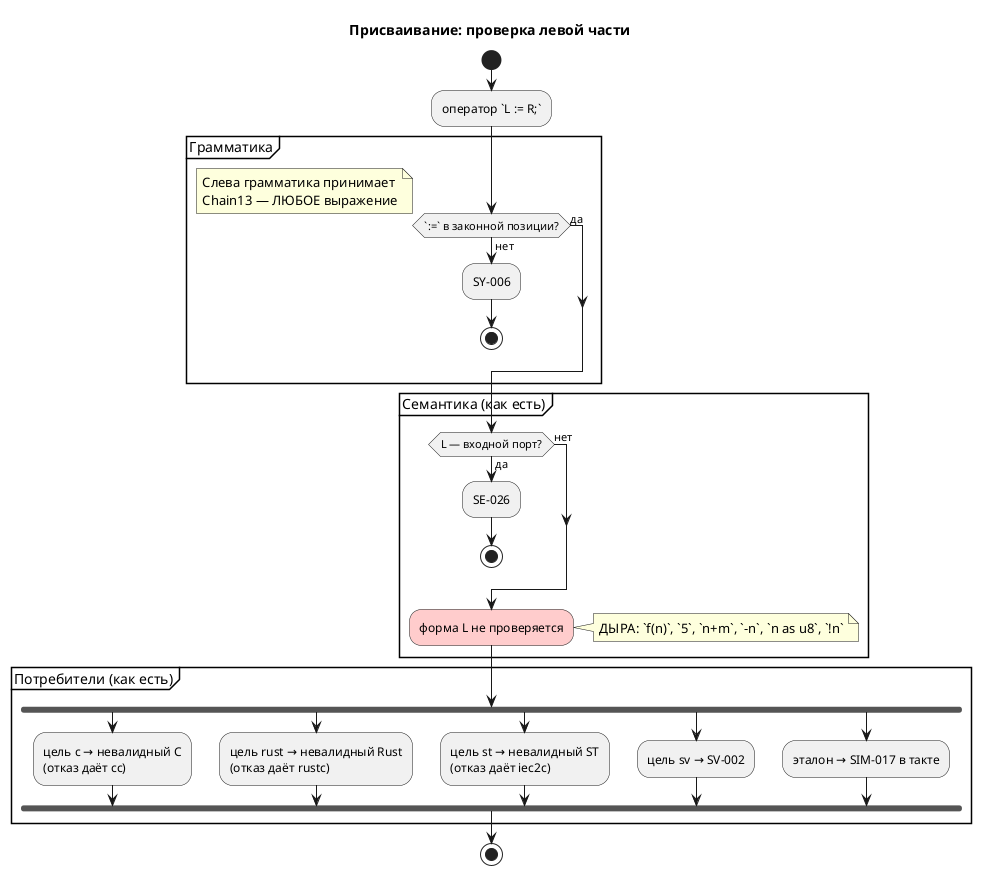
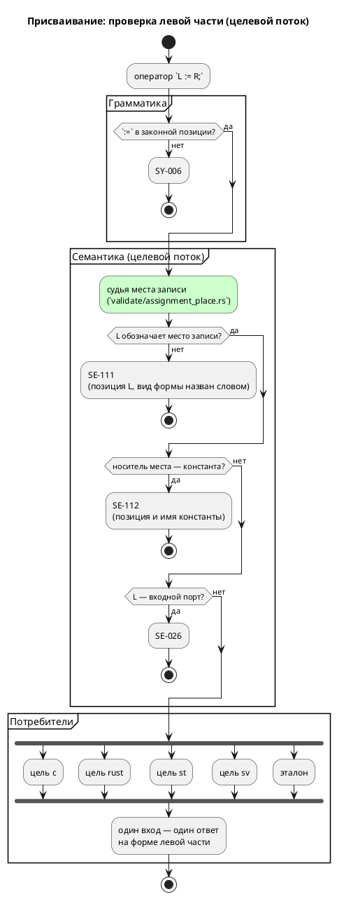

# ADR 0249: Левая часть присваивания — место записи

- **Status:** Accepted
- **Date:** 2026-08-18
- **Authors:** Архитектор + аналитик
- **Related issues:** [Фича 0249](../features/0249-assign-to-call-place.md);
  находка гейта заглушек — [ADR 0217](0217-stub-branch-gate.md);
  позиции присваивания — [ADR 0187](0187-port-io-redesign.md) и фикс
  [0187-01](../fixes/0187-01-assignment-is-statement-in-grammar.md);
  образец «обход доставляет, судья решает» — [ADR 0188](0188-port-direction-everywhere.md),
  [ADR 0203](0203-validate-formulas-traversal.md);
  образец «молчаливый успех — худший ответ» — [ADR 0211](0211-c-missing-start-state-diagnostic.md)

## Context

Фича [0187](0187-port-io-redesign.md) нормировала **позиции** присваивания:
`:=` разбирается ровно в трёх местах (оператор тела, шаг `for`, именованный
аргумент вызова), всё прочее отсекает грамматика (`SY-006`) или судья
`SE-095`. Но **левую часть** как место записи не судил никто: грамматика
принимает слева `Chain13<Precedence1Full>` — то есть **произвольное
выражение**, а семантика на его форму не смотрит.

### Что показала проба (2026-08-17 — 2026-08-18)

**1. Класс шире, чем вызов функции.** Вход `<левая часть> := 1;` при
`var n: u8`, `var m: u8`, `fn f(x: u8) -> u8`:

| Левая часть | Что печатает цель `c` |
|---|---|
| `f(n)` | `Badplace_f(model, model->n) = 1;` |
| `5` | `5 = 1;` |
| `n + m` | `model->n + model->m = 1;` |
| `-n` | `-model->n = 1;` |
| `n as u8` | `(uint8_t)model->n = 1;` |
| `!n` | `!model->n = 1;` |
| `(f(n))` | `(Badplace_f(model, model->n)) = 1;` |

Семантика **все семь** принимает и рапортует об успехе.

**2. Отказ приходит от чужого инструмента — на порождённом файле.** Вход
`f(n) := 1;`:

| Потребитель | Ответ |
|---|---|
| семантика (`taktc compile`) | **принимает**, код возврата 0 |
| цель `c` | `cc`: `error: expression is not assignable` |
| цель `rust` | `rustc`: `E0070: invalid left-hand side of assignment` |
| цель `st` | `iec2c`: три ошибки, «invalid variable before ':=' in ST assignment statement» |
| цель `sv` | честный отказ `SV-002` при генерации |
| цель `plantuml` | код 0 (тела не печатает) |
| эталон | `SIM-017` **в такте**, прогон остановлен |

Это ровно то положение, из которого 0187 вывела **позицию** присваивания:
язык позволяет написать то, чего не умеет ни один потребитель, а диагностику
дают чужие инструменты — с координатами порождённого файла, а не исходника.

**3. Побочная находка: `SIM-017` покрывает ТРИ разных случая.** Его текст
(«присваивание не в переменную, поле или элемент массива») перечисляет три
законных места и умалчивает об остальных, а ветвь `resolve_place` в
`takt-sim/src/unit/statement.rs` разбирает `Variable`, `Parenthesis`,
`BitAccess(_, Member::Identifier)` и `ArraySubscript`, отвечая `_ => Ok(None)`
на всё прочее. Под это `_` попадают:

| Форма | Законна ли | Ответ четырёх целей | Ответ эталона |
|---|---|---|---|
| `f(n) := 1` | **нет** (не место) | невалидный код у трёх, `SV-002` у одной | `SIM-017` |
| `b.2 := 1` (запись бита) | **да** | переводят **двое**: `c` — `model->b = (model->b & ~(1u << 2)) \| ((1 & 1u) << 2);`, `sv` — `b_next[2] = 1;`. `rust` и `st` печатают **чтение бита слева от присваивания** | `SIM-017` |
| `arr[0:2] := 1` (запись среза) | да, но не транслируется | `CC-022`, `RS-011`, `ST-011`, `SV-002` — все отказывают | `SIM-017` |

Средняя строка — **самостоятельный дефект другого класса**, и он шире, чем
казалось при регистрации фичи. Замер 2026-08-18 на `var b: u8; b.2 := 1;`:

| Потребитель | Что печатает | Приговор инструмента |
|---|---|---|
| `c` | `model->b = (model->b & ~(1u << 2)) \| ((1 & 1u) << 2);` | `cc` принимает — **верно** |
| `sv` | `bit1_b_next[2] = 1;` | **верно** |
| `rust` | `(((self.b >> 2) & 1) != 0) = true;` | `rustc`: **E0070** |
| `st` | `(USINT_TO_BYTE(b) AND 16#04) <> 16#00 := 1;` | `iec2c`: **invalid statement** |
| эталон | — | `SIM-017` |

То есть `rust` и `st` печатают **выражение чтения** там, где нужна запись: у
обоих печатник левой части не отличает место от значения. Починка нетривиальна
— в IEC сдвигов над числами нет вовсе (урок 0061), маску придётся строить
константой, — и это **отдельная работа**, а не следствие правила о месте
записи. Выносится фичей **0250** (правило 2: крупное декомпозировать).

Нижняя строка расхождения **не даёт**: срез не переводит никто, и `CC-022`
прямо называет его в своём тексте («модель в выражении, **срез массива**,
встроенная функция отладки»). Отказ эталона здесь — заодно со всеми.

**4. Третий случай: запись в КОНСТАНТУ, и он худший из трёх.** Вход
`const K: u8 := 5; … always { K := 1; n := K; }`:

| Потребитель | Ответ |
|---|---|
| семантика | **принимает**, код возврата 0 |
| цель `c` | `CONST_CONSTW_K = 1;` при `#define CONST_CONSTW_K 5`, то есть `5 = 1;` — `cc`: `error: expression is not assignable` |
| эталон | **молча исполняет**: трасса `vars:n=1`, то есть константа стала единицей |

Здесь расходятся не сообщения, а **значения**: эталон говорит `1`, прошивка не
собирается вовсе. Форма левой части при этом законна (`Variable`) — незаконен
её **носитель**: константа обозначает величину, а не хранилище. Это отдельный
вопрос к тому же судье и отдельная диагностика (см. «Решение»).

### Поток «как есть» и целевой

## Decision Drivers

1. **Молчаливый успех — худший ответ** (урок 0211). Сегодня `taktc compile -t c`
   на `f(n) := 1;` возвращает **0** и кладёт на диск файл, который не
   компилируется. Автор узнаёт о дефекте от `cc`, на чужих координатах.
2. **Правило записывается один раз** (уроки 0084, 0193, 0195, 0203). Пять
   потребителей на одном входе дают четыре разных ответа; правило о форме
   левой части принадлежит **языку**, а не каждой цели порознь.
3. **Отказ обязан приходить от своего компилятора, а не от чужого.** Уроки
   0195 и 0211: запрещается не работающая запись, а уже существующий отказ
   получает позицию и причину.
4. **Диагностика несёт позицию и называет причину словом** (правила 0212,
   0231). Отказ без координаты в пачке сообщений бесполезен; `Debug`-дамп узла
   в тексте — класс, правленный трижды.
5. **Обратная совместимость.** Ни одна работающая программа сломаться не
   должна: под запрет попадает только то, что сегодня **не исполняет ни один**
   потребитель.

## Considered Options

### Option A. Сузить грамматику: слева от `:=` — нетерминал `Place`

Ввести `Place: Expression = { Identifier | Place "." Member | Place "[" … "]" |
"(" Place ")" | AnonPort }` и разбирать `StatementExpr = Place ":=" Expression`.

**Pros:**
- Правило держится машиной: незаконная форма не строится вовсе.
- Тот же приём, каким фикс 0187-01 вернул в грамматику **позицию** присваивания.

**Cons:**
- **Конфликт LR(1).** `Place ⊂ Expression`, а `StatementExpr` принимает и то и
  другое: разбирая `f(n)`, парсер обязан решить, свёртывать ли в `Place` или в
  `Expression`, ещё не видя `:=`. Это reduce/reduce, и LALRPOP его отвергнет.
- **Диагностика хуже.** Отказ выродится в `SY-002` «нераспознанный токен `:=`,
  ожидалось …» — сообщение о токене, а не о том, что автор сделал. Ровно этот
  довод грамматика уже фиксирует у `CallArg`: сужение левой части до
  `Identifier` отобрало бы у `Tuner(1 := 5)` внятную `SE-076`.
- Ячейка `#АДРЕС` и битовый доступ пришлось бы описать в грамматике **дважды**
  — в `Place` и в выражении.

### Option B. Судья в семантике на общем обходе тел (`bodies.rs`)

Завести `semantic/validate/assignment_place.rs` — **третьего** судью на том же
обходе, что уже доставляет выражения `common::validate_expression` (`SE-026`/
`SE-027`) и `assignment_position` (`SE-095`). Судья смотрит на форму левой
части и отвечает `SE-111`, если она не обозначает места записи.

**Pros:**
- Правило написано **один раз** и действует во всех позициях, где обход уже
  бывает: тела блоков, тела функций, вложенные операторы, шаг `for`,
  под-модели. Заводя новую позицию, её добавляют в обход, а не пишут второе
  правило (образец 0188).
- Диагностика своя: код, позиция левой части, вид формы **словом**
  («вызов функции», «литерал», «арифметическое выражение»).
- Список законных мест оказывается **в одном месте** и виден целиком.
- Ничего не ломает у грамматики: `Tuner(1 := 5)` по-прежнему `SE-076`.

**Cons:**
- Разбор форм придётся держать исчерпывающим вручную (`deny(clippy::wildcard_enum_match_arm)`),
  иначе новый узел АСД молча выйдет из-под правила.
- Правило живёт в семантике, а не в грамматике: `taktc fmt` его не зовёт —
  форматтер по-прежнему напечатает `f(n) := 1;` без замечания. Приемлемо:
  форматтер семантику не запускает по решению ADR 0024.

### Option C. Оставить как есть, дописать отказы в цели `c`, `rust`, `st`

**Pros:**
- Правки локальны, языка не касаются.

**Cons:**
- **Три копии одного правила** — ровно тот класс, который проект правил
  четырежды (0084, 0193, 0195, 0203). Четвёртая цель заведётся без правила.
- Отказ приходит поздно: `taktc compile -t plantuml` по-прежнему рапортует об
  успехе, эталон по-прежнему падает **в такте**.
- Не снимает расхождения по `x.N` и не убирает заглушку `SIM-017`.

## Decision

Принимается **Option B**.

Довод против A решающий и технический: `Place ⊂ Expression` даёт
reduce/reduce, а даже если бы не давал — сообщение о нераспознанном токене
хуже сообщения о сделанном. Довод против C — арифметика: три копии правила
против одной.

### Что считается местом записи

Список **конечен** и живёт в одном модуле:

| Форма | Пример | Кто исполняет |
|---|---|---|
| переменная (в т.ч. порт) | `n := 1;`, `led := 1;` | все |
| поле структуры | `p.x := 1;`, `p.y.v := 1;` | все |
| элемент массива | `arr[1] := 1;` | все |
| бит | `b.2 := 1;` | `c` и `sv`; `rust`, `st` и эталон — **фичей 0250** |
| срез массива | `arr[0:2] := 1;` | **никто**: `CC-022`, `RS-011`, `ST-011`, `SV-002`, `SIM-017` |
| ячейка `#АДРЕС` | `#0x200.5 := 1;` | `c-hal`, `st-at`, `sv-mmio`, эталон |
| скобки над любым из них | `(n) := 1;` | прозрачны |

Всё прочее — **`SE-111`**.

**Носитель места тоже судится: константа целью записи быть не может —
`SE-112`.** Код отдельный, а не «вид» внутри `SE-111`, по образцу пары
`SE-026`/`SE-027` (запись во вход и чтение из выхода — один предмет, два кода):
диагноз и способ исправить разные. `f(n) := 1;` — «слева не хранилище, а
вычисление»; `K := 1;` — «хранилище есть, но оно только для чтения: объявите
`var`». Один код с двумя текстами оставил бы автору сообщение не о том, что он
сделал.

⚠️ Проверка носителя смотрит на `VariableNode::Const`, поэтому **параметр
модели под `--parameters=specialize`** (фича 0185 понижает неизменяемый
параметр в `Const`) под запрет не попадает: параметр, которому в теле
присваивают, помечен `mutated` и в `Const` не понижается вовсе — проход
константности идёт **до** стадии 2 и как раз по факту присваивания.

⚠️ **Срез в списке остаётся**, хотя его не переводит никто. Причина: он не
перестаёт быть обозначением хранилища оттого, что цель его не умеет, и
отказывают на нём **все пятеро** — расхождения нет. Проект уже так его и
классифицирует: текст `CC-022` («конструкция в языке есть, цель её не умеет»)
называет срез массива поимённо, а чтение среза отвергается тем же `CC-022`.
Запретив запись в срез семантикой, мы завели бы правило, по которому
`arr[0:2] := 1` — ошибка языка, а `r := arr[0:2]` — неумение цели: два ответа
об одной конструкции.

### Судьба `SIM-017`

Фича **не снимает** заглушку, и это изменение относительно замысла регистрации
— замер выше показал почему. После `SE-111` ветвь остаётся достижимой двумя
законными формами:

| Форма | Кто ещё её не умеет | Судьба |
|---|---|---|
| запись бита `b.2 := 1` | `rust` (E0070), `st` (`iec2c`) | **фича 0250** — она и снимет заглушку |
| запись среза `arr[0:2] := 1` | никто не умеет: `CC-022`, `RS-011`, `ST-011`, `SV-002` | остаётся: отказ эталона идёт **заодно с целями**, расхождения нет |

Поэтому запись в `scripts/stub-branches.txt` **сохраняется**, а держатель
меняется с `0249` на `0250`. Текст `SIM-017` при этом правится: сегодня он
перечисляет три законных места («не в переменную, поле или элемент массива») и
умалчивает о бите, срезе, порте и ячейке — то есть врёт автору о причине.
Новый текст называет **обе** оставшиеся формы.

⚠️ Гейт `scripts/check-stub-branches.py` требует держателя в **незакрытом**
статусе, поэтому фича 0250 регистрируется этой же работой — иначе запись
осиротеет и прогон покраснеет.

### Форма диагностики

`SE-111` строит **одна** воронка (образец `FM-001` фичи 0229 и `CC-023` фичи
0236): код один, вид формы назван **словом**, позиция берётся у АСД-узла левой
части. Текст называет способ исправить — как `SE-095`.

## Consequences

### Положительные

- Один вход — один ответ: `f(n) := 1;` отвергается семантикой, до целей не
  доезжает, и четыре разных ответа исчезают.
- Отказ приходит **на координатах исходника**, а не порождённого файла.
- Текст `SIM-017` перестаёт врать: он перечислял три законных места и молчал о
  бите, срезе, порте и ячейке — теперь называет обе формы, которые остались за
  ним.
- Замер попутно назвал следующую работу поимённо: запись бита `x.N := v`
  печатают верно только `c` и `sv`, а `rust` и `st` печатают чтение слева от
  присваивания (фича 0250).

### Отрицательные / Action items

- **Язык меняется** (правило 22): запись, которую семантика принимала,
  становится ошибкой. Версия языка `0.10.0` уже поднята циклом (фича 0243) —
  подъёма не требуется, изменение вносится в неё.
- **Обратная совместимость** (правило 11): формально ломающее изменение,
  фактически — нет. Под `SE-111` попадают только формы, которые сегодня **не
  исполняет ни один** потребитель: три цели порождают невалидный код, `sv` и
  эталон отказывают. Программы, работавшей на такой записи, существовать не
  может.
- **Правило 24**: приложение об ошибках (`book/src/appendix-errors/`) получает
  `SE-111` и `SE-112`; раздел о присваивании — оговорку о том, что стоит слева.
- **Правило 29**: изменение семантики без новых токенов и узлов АСД —
  редакторский слой проверить и ответ зафиксировать в анализе и отчёте.
- Разбор форм в новом модуле обязан быть **исчерпывающим**
  (`deny(clippy::wildcard_enum_match_arm)`), иначе новый узел языка молча
  выйдет из-под правила.

### Acceptance criteria

1. `f(n) := 1;`, `5 := 1;`, `n + m := 1;`, `-n := 1;`, `n as u8 := 1;`,
   `!n := 1;`, `(f(n)) := 1;` дают `SE-111` с позицией левой части и названным
   видом формы; ни одна цель до генерации не доходит.
1a. `K := 1;` при `const K` даёт `SE-112` с позицией и именем константы;
   молчаливое расхождение «эталон `1` — прошивка не собирается» снято.
2. Законные места (`n`, `p.x`, `p.y.v`, `arr[1]`, `b.2`, `led`, `#0x200.5`,
   `(n)`) проходят без диагностики — сторож перечисляет их **списком** и падает,
   называя осиротевшее.
3. Накопление: несколько незаконных левых частей в одном теле дают
   **несколько** диагностик, а не первую (образец `literal_range`, 0157).
4. Реестр заглушек: держатель `SIM-017` — фича **0250** (зарегистрирована),
   текст ветви называет запись бита и запись среза, гейт
   `scripts/check-stub-branches.py` зелёный.
6. `./scripts/precheck.sh` зелёный; корпус `examples/` и фикстуры не затронуты.
