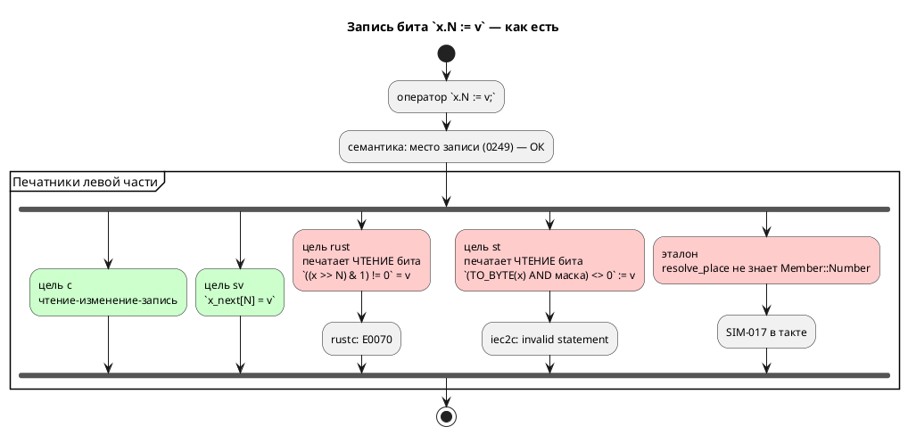
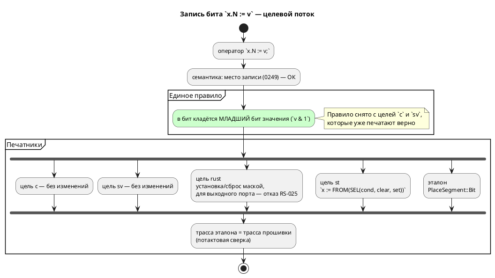

# ADR 0250: Запись бита `x.N := v` работает или отказывает по названной причине

- **Status:** Accepted
- **Date:** 2026-08-18
- **Authors:** Архитектор + аналитик
- **Related issues:** [Фича 0250](../features/0250-bit-write-in-targets.md);
  место записи — [ADR 0249](0249-assign-to-call-place.md);
  находка гейта заглушек — [ADR 0217](0217-stub-branch-gate.md);
  эталон не вправе отставать — [ADR 0248](0248-sim-builtin-functions.md);
  `[bit;N]` как упакованный вектор — [ADR 0078](0078-bit-array-semantics.md);
  «в IEC сдвигов над числами нет» — [ADR 0061](0061-fixed-point-type.md);
  «гейт доказывает компилируемость, не верность» — [ADR 0045](0045-sv-backend.md),
  [ADR 0050](0050-rust-backend.md)

## Context

Фича [0249](0249-assign-to-call-place.md) внесла запись одного бита в список
**мест записи** языка. Документ обещает её прямым текстом: раздел о типах
показывает `flags.3 := 1;` под заголовком «установить бит».

Обещание исполняют не все.

### Замер 2026-08-18 — носитель «переменная»

Вход `var b: u8 := 0; … always { b.2 := 1; r := b; }`:

| Потребитель | Что печатает | Приговор инструмента |
|---|---|---|
| `c` | `model->b = (model->b & ~(1u << 2)) \| ((1 & 1u) << 2);` | `cc -Wall -Wextra -Werror` принимает — **верно** |
| `sv` | `f_var_b_next[2] = 1;` | **верно** |
| `rust` | `(((self.b >> 2) & 1) != 0) = true;` | `rustc`: **E0070 invalid left-hand side of assignment** |
| `st` | `(USINT_TO_BYTE(b) AND 16#04) <> 16#00 := 1;` | `iec2c`: **invalid statement in case element** |
| эталон | — | `SIM-017`, прогон остановлен |

`rust` и `st` печатают **выражение чтения бита** там, где нужна запись: у обоих
печатник левой части не отличает место от значения. Отказ приходит от чужого
инструмента, на координатах порождённого файла.

### Замер по всем носителям

| Носитель | Пример | `c` | `rust` | `st` | `sv` | эталон |
|---|---|---|---|---|---|---|
| переменная (скаляр ≤ 64) | `b.2 := 1` | ✔ | **невалидно** | **невалидно** | ✔ | `SIM-017` |
| `[bit;N ≤ 64]` | `v.3 := 1` | ✔ | **невалидно** | `ST-011` | ✔ | `SIM-017` |
| элемент массива | `arr[1].2 := 1` | ✔ | **невалидно** | `ST-011` | `SV-002`¹ | `SIM-017` |
| поле структуры | `p.x.2 := 1` | ✔ | `RS-011`¹ | ✔² | `SV-002`¹ | `SIM-017` |
| порт `bit` | `led.0 := 1` | ✔ `write_bit` | `RS-018` | ✔ `led := 1` | ✔ | `SIM-017` |
| порт числовой | `bank.3 := 1` | ✔ HAL RMW | `RS-018` | **невалидно** | ✔ | `SIM-017` |
| `[bit;N > 64]` | `w.70 := 1` | **невалидно**³ | **невалидно**³ | `ST-011` | ✔ | `SIM-017` |

¹ Общее ограничение цели, не про биты: `rust` отвергает структуры и без бита
(`p.x := 1` → `RS-011`), `sv` отвергает и структуру, и массив (`SV-002`).
² Цель `st` печатает `p.x := 1` верно, а `p.x.2 := 1` — нет: тип поля она не
выводит (`inner_expr_type` знает переменную, скобки и `as`).
³ **Отдельный дефект, шире этой фичи.** У `[bit;96]` сломано и чтение, и сама
инициализация: `c` печатает `model->w = 0;` при `uint64_t w[2]` (`cc`: «array
type is not assignable»), `rust` — `w: [u64; 2]` с инициализатором `w: 0` и
доступом `self.w >> 70`. Проверено прогоном **без единой записи бита**. Цель
`sv` тот же вход переводит верно (`logic [95:0]`, `w_next[70] = 1`) — то есть
ломается не форма, а её представление в двух целях.

### Три вывода замера

1. **Ядро класса — носитель-скаляр.** Форма, которую `c` и `sv` печатают верно,
   а `rust`, `st` и эталон не умеют, — это переменная (в том числе
   `[bit;N ≤ 64]`) и элемент массива.
2. **Часть клеток таблицы — не про биты.** Структуры в `rust`/`sv` и массивы в
   `sv` не поддержаны вовсе; ровнять их этой фичей значило бы взять чужую
   работу.
3. **`[bit;N > 64]` сломан независимо от записи** и должен уйти кандидатом:
   починка касается объявления, инициализации, чтения и записи сразу в двух
   целях.

### Поток «как есть» и целевой





## Decision Drivers

1. **Язык обещает то, чего нет.** Документ показывает `flags.3 := 1;` как
   способ установить бит; на деле это работает у двоих потребителей из шести.
2. **Эталон не вправе отставать от целей** (уроки 0245, 0248). Модель с записью
   бита нельзя сверить с прошивкой ни на одном такте.
3. **Невалидный код при рапорте об успехе — худший ответ** (урок 0211). `rust`
   и `st` возвращают ноль и кладут на диск файл, который не собирается.
4. **Правило записывается один раз.** «Что попадает в бит» — свойство языка, а
   не каждой цели: сегодня оно нигде не записано, а выведено из того, что
   печатает `c`.
5. **Заглушка не должна пережить свою задачу** (ADR 0217). `SIM-017` держится
   этой фичей.

## Considered Options

### Option A. Изъять запись бита из языка

Объявить `x.N := v` незаконной (`SE-1xx`), оставив только чтение.

**Pros:**
- Ноль работы в целях; `SIM-017` снимается сразу.

**Cons:**
- **Ломает работающие программы**: `c` и `sv` печатают запись верно и делают
  это давно; фикстура `takt-lang/tests/data/parser/valid/bit_access.takt`
  документирует форму с примерами порождённого кода.
- Документ обещает запись прямым текстом (раздел о типах) — пришлось бы
  переписывать язык вместо починки трансляции.
- Установка бита — базовая операция промышленного управления (цель проекта,
  правило 12). Отнимать её из-за отставания двух печатников — решение наоборот.

### Option B. Реализовать запись во всех целях, включая структуры и массивы в `sv`

**Pros:**
- Полная таблица без единой пустой клетки.

**Cons:**
- Берёт **чужую** работу: структуры в `rust`/`sv` и массивы в `sv` не
  поддержаны и без битов. Это отдельные фичи, каждая со своим ADR (правило 2).
- Скрывает границу: «запись бита не работает» и «структур в цели нет» —
  разные диагнозы, и смешивать их в одной фиче значит потерять оба.

### Option C. Починить носитель-скаляр везде, где он выразим; где нет — отказ с названной причиной

Ось 1 — эталон, ось 2 — `rust`, ось 3 — `st`, ось 4 — сверки.

**Pros:**
- Закрывает ровно измеренный класс: формы, где `c` и `sv` правы, а трое
  отстают.
- Границы остаются **названными**: структура в `rust` — по-прежнему `RS-011`,
  выходной порт в `rust` — новый отказ с причиной, а не невалидный код.
- Заглушка `SIM-017` снимается по существу: за ней остаётся только срез.

**Cons:**
- Таблица остаётся неполной — но неполной **честно**: каждая пустая клетка
  названа кодом и причиной.

## Decision

Принимается **Option C**.

### Правило языка: в бит кладётся МЛАДШИЙ бит значения

Нормируется то, что уже делают две правые цели:

- `c` печатает `(rhs & 1u) << N` — берёт младший бит;
- `sv` присваивает разряду, что в SystemVerilog есть усечение до младшего бита.

Значит `b.2 := 2;` очищает бит, а не устанавливает. Правило записывается в
документ: сегодня его нет нигде, и оно лишь выведено из вывода цели `c`.

### Ось 1 — эталон

`resolve_place` получает разбор `BitAccess(_, Member::Number(n))`, путь —
новый сегмент `PlaceSegment::Bit(n)`, замена — в ядре `eval/place.rs` под
`deny(wildcard_enum_match_arm)`, **зеркально чтению** (`eval/access.rs::read_member`):

| Значение носителя | Что делает запись |
|---|---|
| `Number` | `(v & ~(1 << n)) \| ((rhs & 1) << n)` |
| `Boolean` | бит 0 — само значение; иной бит — ошибка |
| `Array` (упакованный `[bit;N > 64]`) | слово `n / 64`, смещение `n % 64` |
| прочее | ошибка «бита у этого значения нет», кодами `read_member` |

⚠️ Ветвь `Array` заводится **не для того, чтобы обогнать цели**, а ради
симметрии: чтение (`read_bit_words`) её уже поддерживает, и запись без неё
дала бы эталону два разных ответа на одном носителе.

### Ось 2 — цель `rust`

Печатник `assign` получает ветвь для `BitAccess(inner, Number(n))`:

| Носитель | Что печатается |
|---|---|
| переменная / элемент массива, литерал `1` | `<carrier> \|= 1 << N;` |
| переменная / элемент массива, литерал `0` | `<carrier> &= !(1 << N);` |
| переменная / элемент массива, прочее | `<carrier> = if <v как bool> { <carrier> \| (1 << N) } else { <carrier> & !(1 << N) };` |
| порт `bit`/`bool`, `N = 0` | существующий путь `write_port` — чтение не нужно |
| порт `bit`/`bool`, `N ≠ 0` | отказ: у однобитного значения иных битов нет |
| порт числовой | отказ **`RS-025`** с причиной |
| поле структуры | прежний `RS-011` (структур цель не знает вовсе) |

⚠️ **Сдвиг на нуль не эмитится**: маска нулевого разряда есть просто `1`.
Нулевой разряд в корпусе обычен (`SENSORS_CAB.0`). ⚠️ Довод здесь **не** «этого
требует линт» — замер 2026-08-18: `clippy -D warnings` сдвиг **литерала**
(`1 << 0`) пропускает; `identity_op` валит только сдвиг **операнда**
(`x >> 0`), из-за которого его не печатает чтение (`bit_mask`). Перенести
чужой довод, не проверив, было бы ровно тем, чего проект избегает.

⚠️ **Отказ `RS-025` для числового выходного порта нужен именно новый.** Сегодня
там `RS-018` «Чтение выходного порта не транслируется» — код верный по
существу (запись бита требует чтения), но автор писал **запись** и о чтении не
просил. Текст обязан объяснить связь и назвать обход: держать теневую
переменную и писать порт целиком.

### Ось 3 — цель `st`

Форма — `SEL`, а не `IF`: печатник выражений отдаёт **строку**, а разворот в
несколько операторов потребовал бы менять его контракт. `SEL` стандартен,
и MatIEC его принимает (проба 2026-08-18).

```
b := BYTE_TO_USINT(SEL(<v как BOOL>, USINT_TO_BYTE(b) AND 16#FB,
                                     USINT_TO_BYTE(b) OR 16#04));
```

Литеральные `1` и `0` печатаются прямой формой без `SEL`.

⚠️ **`bit_string_of_type` обязан признать `[bit;N ≤ 64]`.** Сегодня он смотрит
только на `TypeNode::Integer`, поэтому `v.3` при `v: [bit;8]` даёт `ST-011` —
**и на чтении тоже** (проверено пробой без записи). Признак берётся у
`semantic::bit_vector`, тем же слоем, каким цель печатает сам тип (урок 0191):
`[bit;N ≤ 64]` — упакованный **скаляр**, а не массив.

⚠️ Носитель `bit`/`bool`: `led.0 := v` → `led := <v как BOOL>;`, бит ≠ 0 —
прежний отказ.

### Ось 4 — сверки

Потактовая сверка эталон ≡ цель `c` на **накапливающем** теле (урок 0181-01:
на идемпотентном пропуск и двойное исполнение неразличимы), плюс прогон
`rustc -D warnings` и `iec2c` на порождённом коде фикстур.

⚠️ **Корпус класс не покрывает:** записи бита в `examples/` нет ни одной
(замер 0249), поэтому сторожа — фикстурные. Факт компиляции верности не
доказывает (уроки 0045, 0050), поэтому сверка **значенческая**.

### Что выносится кандидатом, а не делается

- **`[bit;N > 64]` в целях `c` и `rust`**: сломаны объявление, инициализация,
  чтение и запись. Отдельный дефект, шире этой фичи.
- **Структуры в `rust`/`sv`, массивы в `sv`**: общие ограничения целей.
- **Срез `x[a:b] := v`**: вынесен фичей 0249, не переводит никто.

### Судьба `SIM-017`

За отказом остаётся **одна** форма — запись среза, и запись из
`scripts/stub-branches.txt` **удаляется вовсе**: `SIM-017` перестаёт быть
заглушкой.

Довод. Заглушка — это отказ **до какой-то будущей работы**. Отказ эталона на
срезе таков не есть: срез не переводит ни один потребитель (`CC-022`,
`RS-011`, `ST-011`, `SV-002`), а правило проекта прямо запрещает эталону
обгонять цели (урок 0248). То есть это **принятое решение**, ровно того же
рода, что `CC-022` у цели `c`, — а `CC-022` в реестре заглушек не значится и
никогда не значился.

Отсюда и текст: формулировка «пока не поддерживается» уходит вместе с записью.
Она есть обещание будущей работы, а обещать нечего — поддержка среза у **всех**
потребителей вынесена кандидатом фичей 0249 и отдельной фичей не заведена.
Новый текст называет причину («срез не переводит ни одна цель») и способ
обойти («присвойте элементы по отдельности»).

⚠️ Гейт `check-stub-branches.py` находит заглушки **по формулировке**. Убрав
её, мы убираем и видимость записи для гейта — поэтому запись реестра обязана
уйти в том же коммите, иначе прогон покраснеет условием 3 («реестр окаменел»).
Это не обход гейта, а его штатный сценарий: перестало быть заглушкой —
перестало быть в реестре.

## Consequences

### Положительные

- Обещание документа исполняется: `flags.3 := 1;` работает у эталона, `c`,
  `rust`, `st` и `sv`.
- Модель с записью бита впервые становится сверяемой с прошивкой потактово.
- Правило «в бит кладётся младший бит значения» перестаёт быть свойством вывода
  цели `c` и становится записанным правилом языка.
- Цель `st` попутно начинает читать биты `[bit;N ≤ 64]` — дефект, живший
  независимо от записи.

### Отрицательные / Action items

- **Язык меняется** (правило 22): нормируется наблюдаемое поведение (что попадает
  в бит) и добавляется диагностика `RS-025`. Версия `0.10.0` уже поднята циклом
  (фича 0243) — подъёма и тега не требуется.
- **Обратная совместимость** (правило 11): вывод целей `c` и `sv` не меняется
  байт-в-байт; `rust` и `st` начинают порождать то, чего прежде не порождали
  (прежде — невалидный код), эталон начинает исполнять то, на чём прежде падал.
  Сломать нечего: работающих программ на этих формах не существовало.
- **Правило 24**: раздел о типах получает правило о младшем бите; приложение об
  ошибках — `RS-025`.
- **Правило 29**: токенов и узлов АСД не прибавляется; ответ фиксируется в
  анализе и отчёте.
- Реестр диагностик и `book/src/appendix-errors/` — новый код.

### Acceptance criteria

1. `b.2 := 1;` при `var b: u8` исполняется эталоном и даёт то же значение, что
   печатает цель `c`; проверено **потактовой сверкой** на накапливающем теле.
2. Цели `rust` и `st` печатают запись бита, и порождённый код принимают
   `rustc -D warnings` и `iec2c`.
3. `v.3 := 1;` при `var v: [bit;8]` работает в `st`; **чтение** `r := v.2;`
   там же перестаёт давать `ST-011`.
4. Запись бита числового **выходного** порта в `rust` даёт `RS-025` с
   названной причиной и обходом, а не `RS-018` про чтение и не невалидный код.
5. `arr[1].2 := 1;` в `rust` печатается верно (сегодня — невалидный код).
6. Формы, оставшиеся за границей, отвечают **прежними** кодами: `p.x.2` в
   `rust` — `RS-011`, в `sv` — `SV-002`; `arr[1].2` в `sv` — `SV-002`.
7. Правило младшего бита записано в документе и проверено сторожем:
   `b.2 := 2;` очищает бит у эталона и у цели `c` одинаково.
8. `SIM-017` достижим только записью среза, его текст называет причину и
   обход, слова «пока не поддерживается» в нём нет; запись реестра заглушек
   удалена, гейт `scripts/check-stub-branches.py` зелёный (объявлено две).
9. Вывод корпуса `examples/` не изменился (записи бита там нет — дифф пуст).
10. `./scripts/precheck.sh` зелёный.
