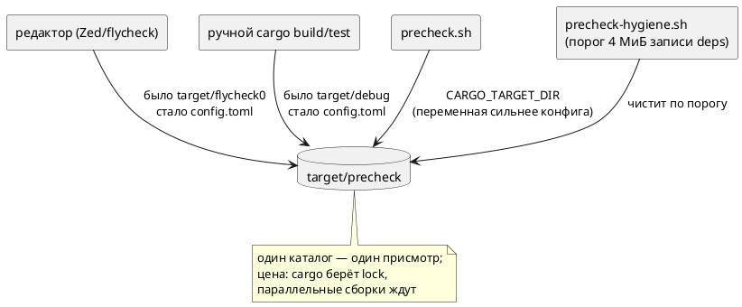

# ADR 0251: Все потребители cargo пишут в каталог, за которым есть присмотр

- **Status:** Accepted
- **Date:** 2026-08-18
- **Authors:** Архитектор + аналитик (решение — заказчик, 2026-08-18)
- **Related issues:** [Фича 0251](../features/0251-cargo-target-dir.md);
  каталог гейта и его самоочистка — [ADR 0234](0234-precheck-time-profile.md);
  профиль предкоммита и «замер верен только на устоявшейся ФС» —
  [ADR 0242](0242-grammar-crate-split.md);
  пути гейта берутся из каталога гейта — [ADR 0241](0241-precheck-speedup.md)

## Context

Фича 0234 ввела для предкоммита **свой** каталог сборки `target/precheck` и
самоочистку по порогу: у cargo нет сборки мусора, каталог растёт монотонно, и
однажды его обход становится дороже самой компиляции (замер 0234: 83 ГБ /
599 435 файлов, один листинг `deps` — 66.7 с при здоровых 0.13 с).

Скрипт `precheck-hygiene.sh` чистит **только** каталог гейта: путь обязан
оканчиваться на `/target/precheck`, иначе отказ. Это осознанный инвариант —
рабочий `target` есть чужие данные.

Оборотная сторона обнаружилась 2026-08-18. Пишут в рабочий каталог **все
остальные**: редактор (Zed кладёт свой кэш в `target/flycheck0`) и ручные
`cargo build`/`cargo test` без `CARGO_TARGET_DIR`. За ними не следит никто.

### Замер 2026-08-18

| Что | Значение |
|---|---|
| Удалено `cargo clean` | **47.7 ГиБ, 198 621 файл** |
| Запись `target/precheck/debug/deps` в тот же момент | 119 936 байт — **3 %** порога 4 МиБ |
| Полный предкоммит **после** очистки | **152 с** (норматив 0234 — 233 с), отказов 0 |
| Профиль здорового прогона | `cargo test` 58 с · `verilator` 36 с · `clippy` 20 с · сборка бинарников 17 с · прочие ~21 с |

То есть гейт работал верно, порог не превышался, а прогон всё равно был долгим:
метрика смотрела не туда, куда рос каталог. Формально дефекта нет ни в одном
месте — и именно поэтому он мог жить сколько угодно.

### Цена любого объединения — блокировка (замер там же)

Два `cargo` в одном каталоге сборки не работают параллельно. Проба: `cargo
build` в `target/precheck` и через 3 с `cargo check` туда же —

```text
    Blocking waiting for file lock on build directory
```

Это свойство cargo (`.cargo-lock` на каталог), а не настройки. Значит на время
предкоммита (152 с) диагностика редактора замрёт, а предкоммит подождёт
секунды, если редактор проверяет файл в этот момент.

Целевой поток (правило 18 — схема нужна: меняется адресат записи у трёх
потребителей):



## Decision Drivers

1. **Каталог сборки не должен расти незамеченным.** Замер показал сценарий, при
   котором все проверки зелены, а работа деградирует.
2. **Гейт не удаляет чужое.** Инвариант 0234 сохраняется: удаляется только
   каталог, чей путь оканчивается на `/target/precheck`.
3. **Цену называют заранее.** Блокировка параллельных сборок — не сюрприз в
   работе, а строка в документации.
4. **Настройка не должна ломать сторонний сценарий сборки.** Файл в репозитории
   действует на всех, кто его склонирует, включая CI.
5. **Одно знание.** Каталог гейта уже задан в `precheck.sh`; второй источник
   истины о том же пути обязан быть согласован либо отсутствовать.

## Considered Options

### Option A. Ничего не менять, полагаться на дисциплину

**Pros:**
- Ноль изменений; параллельные сборки не конкурируют.

**Cons:**
- Уже проверено практикой: 47.7 ГиБ накопились именно так.
- Дисциплина не масштабируется на редактор — он собирает сам, без спроса.

### Option B. Предупреждение гейта о распухшем рабочем каталоге

Мерить `target/debug/deps` той же дешёвой метрикой и печатать совет.

**Pros:**
- Инвариант «не трогать чужое» соблюдён буквально; ничего не ломается.
- Стоимость 0.021 с.

**Cons:**
- Предупреждение приходит **в конце** прогона, который уже был медленным.
- Совет можно игнорировать сколько угодно: механизм не меняет причину.

### Option C. `.cargo/config.toml` с `[build] target-dir` (принято)

**Pros:**
- Причина устраняется: расти незамеченным каталогу больше негде — всё пишется
  туда, где стоит присмотр.
- Ноль дисциплины: настройка действует на редактор, на скрипты и на человека.
- `precheck.sh` не трогается: он экспортирует `CARGO_TARGET_DIR`, а **переменная
  окружения сильнее конфига** — гейт продолжает управлять каталогом сам.

**Cons:**
- **Блокировка** (замер выше): редактор и предкоммит ждут друг друга.
- Файл действует на всех, кто клонирует репозиторий, — включая CI и сторонние
  сборки; путь относительный, но каталог общий.
- Самоочистка теперь сносит и кэш редактора. Не потеря (пересоберётся), но
  честнее назвать: после чистки первая проверка в редакторе будет долгой.

### Option D. Общий каталог, но не тот, где работает гейт

Например `target/shared` для редактора и ручных сборок.

**Pros:**
- Блокировок нет: у гейта свой каталог.

**Cons:**
- **Не решает задачу:** за `target/shared` по-прежнему не следит никто, и
  инвариант 0234 запрещает гейту его чистить. Мы получили бы ту же проблему под
  новым именем.

## Decision

Принимается **Option C** (решение заказчика 2026-08-18): в репозиторий кладётся

```toml
# .cargo/config.toml
[build]
target-dir = "target/precheck"
```

- **Гейт не меняется.** `precheck.sh` экспортирует `CARGO_TARGET_DIR`, и
  переменная окружения имеет приоритет над `config.toml`. Значение при этом то
  же самое, так что фактический каталог один и тот же.
- **Инвариант 0234 сохраняется дословно:** удаляется по-прежнему только путь,
  оканчивающийся на `/target/precheck`. Изменилось не правило, а состав
  пишущих: теперь под присмотром оказываются все.
- **Блокировка принимается как цена** и документируется в `README.md` и живом
  контексте: параллельные `cargo` ждут друг друга; во время предкоммита
  диагностика редактора замирает.
- **Option B не отменяется, а становится ненужной** в своём исходном виде:
  предупреждать не о чем, пока все пишут в наблюдаемый каталог. Если появится
  потребитель, задающий каталог явно (как это делает Zed флагом), кандидат
  вернётся — и уже с известной метрикой.

## Consequences

### Положительные

- Каталог сборки один, и за ним есть присмотр: сценарий «47.7 ГиБ незаметно»
  больше не воспроизводится.
- Сборки редактора и человека переиспользуют артефакты гейта — первая ручная
  команда после предкоммита не пересобирает всё заново.
- Диск: вместо трёх-четырёх параллельных кэшей (`debug`, `release`,
  `flycheck0`, `precheck`) остаётся один.

### Отрицательные / Action items

- **Параллельные сборки ждут друг друга** — назвать в `README.md` и `CLAUDE.md`,
  вместе с обходом (`CARGO_TARGET_DIR=target/scratch cargo …` для того, кому
  нужна независимая сборка прямо сейчас).
- Самоочистка сносит и кэш редактора: после срабатывания порога первая
  проверка в редакторе будет долгой.
- Проверить, что настройка не ломает: предкоммит целиком, сборку из чистого
  клона, `cargo` из подкаталога крейта (`takt-lang/`) — относительный
  `target-dir` разрешается от каталога с `config.toml`.
- ⚠️ Потребитель, задающий каталог **явно**, конфигу не подчиняется. В проекте
  такой один и он намеренный: `scripts/install.sh` собирает в `target/install`,
  чтобы установка не конкурировала с гейтом за блокировку (сторож
  `test-install.sh`, проверка A8). Каталог редко создаётся и незаметно не
  растёт. Если же **редактор** окажется таким потребителем (прежде существовал
  `target/flycheck0`), часть кэша снова уйдёт мимо присмотра — проверяется
  наблюдением, а не предположением: см. границу в анализе.

### Acceptance criteria

1. `.cargo/config.toml` задаёт `target-dir = "target/precheck"`; файл
   отслеживается git.
2. Обычный `cargo build` без переменных окружения кладёт артефакты в
   `target/precheck`, а `target/debug` не появляется.
3. `cargo` из подкаталога крейта пишет туда же (относительный путь разрешается
   от корня репозитория).
4. `precheck.sh` работает как прежде: каталог тот же, гейты зелены, время в
   пределах норматива.
5. Инвариант гигиены не ослаблен: `precheck-hygiene.sh` по-прежнему отказывает
   на пути, не оканчивающемся на `/target/precheck` (сторож
   `test-precheck-hygiene.sh` зелёный).
6. `README.md` и `CLAUDE.md` называют настройку, её цену (блокировка) и обход.
