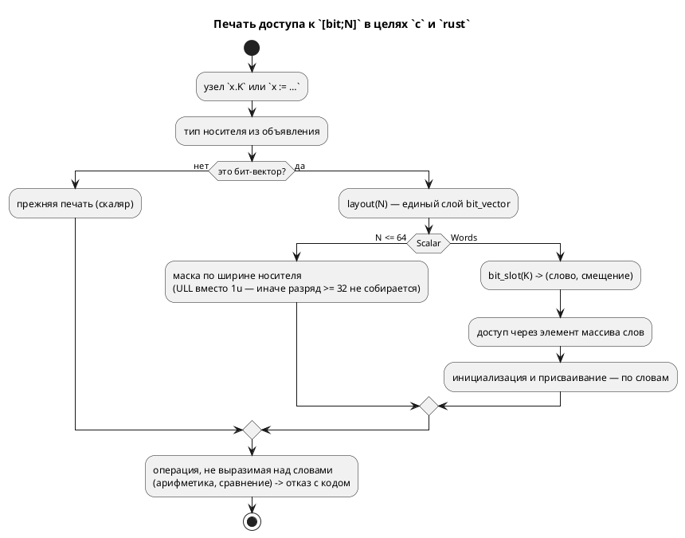

# ADR 0262: Широкий бит-вектор в целях `c` и `rust`

- **Status:** Accepted
- **Date:** 2026-08-19
- **Authors:** Архитектор + аналитик + разработчик (объём выбран заказчиком 2026-08-19)
- **Related issues:** [Фича 0262](../features/0262-wide-bit-vector-c-rust.md); смежные — [0078](../features/0078-bit-array-semantics.md) (слой упаковки), [0250](../features/0250-bit-write-in-targets.md) (где замер снят), [0045](../features/0045-sv-backend.md) (цель `sv` тот же вход умеет)

## Context

`[bit;N]` — упакованный вектор (0078): при `N ≤ 64` — скаляр, при `N > 64` —
массив из `⌈N/64⌉` слов. Правило живёт в едином слое `semantic::bit_vector`, и
цели `c`/`rust` зовут его **при печати типа** — но не при печати операций.
Поэтому объявление выходит верным (`uint64_t w[2]`, `[u64; 2]`), а всё
остальное печатается так, будто перед нами скаляр.

**Замер 2026-08-19** (`scripts/probe.sh`, проба признана годной; отказы сняты
прогоном `cc -std=c11 -Wall -Wextra -Werror`, `rustc --edition 2021`,
`verilator`, `iec2c`):

| Вход | Эталон | `c` | `rust` | `st` | `sv` |
|---|---|---|---|---|---|
| `var w: [bit;96] := 0;` + `w.70 := 1;` + `if w.70 {…}` | исполняет (`w=[0,64]`) | **4 ошибки `cc`** | **4 ошибки `rustc`** | `ST-011` | верно (`logic [95:0]`) |
| `w := x;` (оба `[bit;96]`) | исполняет | `model->w = model->x;` — не собирается | то же | `ST-011` | верно |
| `seen := w + 1;` | **`SIM-005` в такте** | печатает `model->w + 1` (арифметика указателя) | печатает | `ST-011` | — |
| **контроль** `var v: u64 := 0; v.35 := 1;` | исполняет | **`shift count >= width of type`** | собирается | — | — |

Ошибки `cc` на первом входе: `array type 'uint64_t[2]' is not assignable`
(инициализация), `invalid operands` (чтение и запись разряда),
`shift count >= width of type`. Ошибки `rustc`: `E0308` ×2 (инициализация
`[u64;2]` числом `0`), `E0368` (`|=` над массивом), `E0369` (`>>` над массивом).

Три вывода, каждый снят прогоном:

1. **Ломается не форма языка, а её представление в двух целях.** Эталон и цель
   `sv` тот же вход исполняют верно, цель `st` честно отказывает `ST-011`.
2. **Контрольный вход вскрыл второй, более широкий дефект.** Маска разряда в
   цели `c` печатается литералом `1u` — это `unsigned int` (32 бита), поэтому
   запись разряда **≥ 32 не собирается и у обычного `u64`**, где представление
   скалярное и никакого «широкого вектора» нет. Класс шире того, что назвал
   кандидат, и живёт в том же печатнике.
3. **Арифметика над широким вектором не поддержана и эталоном** (`SIM-005` в
   такте): цели обязаны отказывать с причиной, а не печатать выражение, смысл
   которого в C — арифметика указателя.

⚠️ **Корпус класс не покрывает:** векторов шире 64 бит в `examples/` нет ни
одного, записи разряда — тоже (замер 0250). Оба гейта (`cc` через `cmake`,
`clippy` по порождённым `.rs`) молчали и молчали бы дальше.

## Decision Drivers

1. **Молчаливый невалидный вывод — худший исход.** `taktc` возвращает ноль, а
   файл не собирается: об этом узнаёт не автор модели, а сборка прошивки.
2. **Правило представления уже есть и одно** (`semantic::bit_vector`): цели
   обязаны его звать, а не заводить своё знание о словах.
3. **Объём ограничен формами, которые поддерживает эталон.** Там, где эталон
   отвечает `SIM-005`, цель обязана отказывать, а не выдумывать семантику.
4. **Скалярный случай нельзя сломать.** `[bit;N ≤ 64]` — рабочая, покрытая
   корпусом форма; правка обязана оставить её вывод прежним, кроме самой маски.

## Considered Options

### Option A. Оставить как есть

**Pros:** ноль правок.

**Cons:** две цели из шести дают невалидный вывод при рапорте об успехе; вход
законен, эталон и `sv` его исполняют. Контрольный дефект (`1u`) бьёт и по
обычному `u64`.

### Option B. Честный отказ обеих целей на `N > 64`

**Pros:** дёшево; поведение становится честным (как `ST-011`).

**Cons:** форма остаётся непереводимой двумя основными целями, хотя эталон и
`sv` её исполняют; язык фактически сужается там, где сужать нечего.

### Option C. Многословное представление во всём выводе `c` и `rust`

**Pros:**
- законная форма языка переводится всеми целями, кроме честно отказывающей `st`;
- знание о словах берётся у существующего слоя, второго не заводится;
- попутно чинится маска разряда, ломающая и скалярный случай.

**Cons:** правка в четырёх местах каждой цели (объявление уже верно):
инициализация, присваивание, чтение и запись разряда. Плюс отказ на операциях,
не выразимых над словами.

## Decision

Принимается **Option C** (объём выбран заказчиком 2026-08-19).

1. **Формы, которые переводятся** — ровно те, что исполняет эталон:
   инициализация (`w := 0`), присваивание вектора вектору (`w := x`), чтение
   разряда (`w.K`), запись разряда (`w.K := v`).
2. **Формы, которые отвергаются кодом с причиной** — арифметика и сравнение над
   `Words`: их не умеет и эталон (`SIM-005`), а печать выражения означала бы в C
   арифметику указателя, то есть тихо неверный код.
3. **Маска разряда в цели `c` строится по ширине носителя**, а не литералом
   `1u`: иначе разряд ≥ 32 не собирается и в скалярном представлении.
4. **Позиция разряда берётся у `bit_vector::bit_slot`** — того же носителя,
   которым пользуются эталон (`eval/access.rs`, `eval/place.rs`) и цель `st`.
   Своего деления на слова цели не заводят.

## Consequences

### Положительные

- `[bit; N > 64]` переводится целями `c` и `rust`; вывод принимается `cc` и
  `rustc` под строгими флагами гейтов.
- Запись разряда ≥ 32 чинится **и для скаляров** — класс, которого кандидат не
  называл.
- Отказ на невыразимых операциях приходит от **своей** цели с причиной, а не от
  чужого компилятора на порождённом файле.

### Отрицательные / Action items

- Вывод цели `c` для записи разряда меняется (маска). Корпус его не содержит,
  но снимки `examples/generated/` проверяются гейтом.
- ⚠️ Тип носителя берётся из ячейки `ExpressionNode::Variable` — снимка,
  снятого при разрешении имени (засада 0204). Для **объявленного** типа он
  верен; при `Inference` печать остаётся прежней (скалярной), то есть правка
  деградирует в текущее поведение, а не в отказ.
- ⚠️ Корпус класс по-прежнему не покрывает: сторожа — только фикстурные и
  потактовая сверка.

### Acceptance criteria

1. `var w: [bit;96] := 0;` с записью и чтением разряда: вывод цели `c`
   принимается `cc -Wall -Wextra -Werror`, вывод цели `rust` — `clippy -D warnings` (A1).
2. Присваивание `w := x` над `[bit;96]` переводится обеими целями (A2).
3. Потактовая сверка эталон ≡ C на разрядах в разных словах (A3).
4. `var v: u64 := 0; v.35 := 1;` собирается `cc` (контрольный дефект) (A4).
5. Арифметика над `[bit;96]` отвергается обеими целями кодом с причиной (A5).
6. Скалярный случай (`[bit;64]` и уже) не изменился; снимки
   `examples/generated/` и `./scripts/precheck.sh` зелены (A6).
