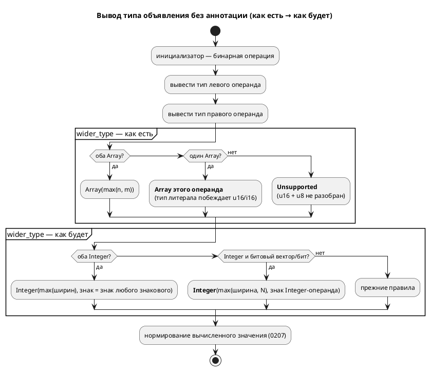

# ADR 0287: Расширение типов не знает именованных целых

- **Status:** Accepted
- **Date:** 2026-08-19
- **Authors:** Архитектор + аналитик + разработчик
- **Related issues:** [Фича 0287](../features/0287-wider-type-array-literal.md); смежные — [0204](../features/0204-const-ref-type-inference.md) (вывод через ссылку, там кандидат и вынесен), [0285](../features/0285-inferred-width-from-result.md) (ширина по результату), [0207](../features/0207-bitwise-not-unsigned-literal.md) (нормирование вычисленного), [0192](../features/0192-const-init-fold.md) (свёртка инициализатора)

## Context

Тип объявления без аннотации выводится из инициализатора, и у бинарной операции
он берётся у «более широкого» операнда — функция `wider_type`
(`semantic/type_inference.rs`). Её таблица знает `Bit`, `Bool`, `Rational`,
`Duration`, `Fixed`, `Enum` и `Array(n, T)`, но **не знает `Integer { bits,
signed }`** — представления именованных целых (`u8`…`i64`,
`type_node::builtin_type_by_name`). Целочисленный литерал при этом получает
`Array(n, Bit)` (`infer_int_type`), поэтому пара «именованное целое + литерал»
попадает в ветвь `(_, Array(n, t)) => Array(n, t)`: **тип литерала побеждает
объявленный тип источника**, а пара «именованное целое + именованное целое»
проваливается в `_ => Unsupported`.

**Замер 2026-08-19** (`scripts/probe.sh`, все пробы признаны годными; рядом с
каждой стоит контрольный вход — та же запись с **явной** аннотацией типа):

| Проба | Эталон | `c` | `rust` | `st` | `sv` | Выведенный тип |
|---|---|---|---|---|---|---|
| `const A: u16 := 300; const B := A - 100;` затем `seen := B + 100;` | 300 | 300 ✓ | **E0308** от `rustc` | **отказ `iec2c`** | **отказ `verilator`** | `[bit;8]` вместо `u16` |
| `const A: u16 := 300; const C: u8 := 5; const D := A + C;` | 305 | 305 ✓ | **`RS-014`** | **`ST-002`** | **`SV-002`** | `Unsupported` (`?`) |
| `const A: i16 := -300; const D := A + 1;` | **213** | 213 | 213 | 213 | 213 | `[bit;8]` вместо `i16` |
| контроль: те же три записи с `const B: u16 := …` / `const D: i16 := …` | верно | верно | верно | верно | верно | тип автора |

Три разных исхода одной причины:

1. **Невалидный вывод при рапорте об успехе.** `taktc` возвращает ноль, а
   порождённый файл отвергают **чужие** инструменты: `rustc` — `E0308`
   (`u8` в поле `u16`), `iec2c` — «Incompatible data types for `:=`»,
   `verilator` — `WIDTHEXPAND`. Цель `c` при этом права: `#define` не несёт
   типа, и арифметика идёт в `int`.
2. **Честный отказ там, где всё вычислимо.** `u16 + u8` даёт `Unsupported`, и
   четыре цели отвечают «тип не представим» на записи, которую эталон считает
   без затруднений.
3. **Молча неверное значение при согласии всех девяти.** `i16 + 1` теряет
   **знак**: тип берётся у беззнакового литерала, и нормирование (0207)
   заворачивает `−299` в `213 = −299 mod 2⁸`. Ни одна диагностика не выдаётся.

⚠️ **Формулировка кандидата устарела наполовину.** Он говорил о **ложной
`SE-089`** на `const A: u16 := 300; const B := A + 1;`; этот вход после
[0285](../features/0285-inferred-width-from-result.md) отвечает верно (`301`,
тип расширен по результату). Но 0285 расширяет тип **только при превышении
верхней границы** — то есть лечит следствие в одной точке, а корень (тип берётся
у литерала) остался и виден на первой и третьей пробах, где результат в восемь
бит **влезает**.

⚠️ **Замер снят заново, а не унаследован** (правило 30): исходный замер
кандидата датирован 2026-08-16 и к моменту взятия в работу перестал
воспроизводиться.

## Decision Drivers

1. **Тип объявления сильнее типа литерала.** `u16` в источнике написан автором;
   ширина литерала выбрана компилятором. Побеждать обязано написанное.
2. **Молчаливая потеря знака — худший из трёх исходов.** Отказ виден, невалидный
   вывод ловит чужой инструмент, а `−299 → 213` не заметит никто.
3. **Правка обязана быть узкой.** Соседние правила `wider_type` (перечисления,
   `Rational`, `Fixed`, `Duration`) верны и держатся своими сторожами
   (`SE-059`, `SE-065`, `SE-103`) — их трогать нельзя.
4. **Представление литерала менять дорого.** `[bit;N]` — упакованный вектор
   (0078) с собственным слоем `semantic::bit_vector` и печатью у пяти целей.

## Considered Options

### Option A. Оставить как есть

**Pros:** ноль правок.

**Cons:** три исхода выше остаются; один из них — молча неверное значение.
Кандидат при этом закрыть нельзя: 0285 сняла лишь его буквальную формулировку.

### Option B. Целочисленный литерал получает `Integer`, а не `Array(n, Bit)`

**Pros:** причина исчезает целиком — представление у именованного целого и у
литерала становится одним.

**Cons:** `infer_int_type` — носитель, к которому обращаются вывод типов,
свёртка (0192) и переопределение ширины (0285); смена его результата меняет тип
**каждого** выведенного объявления в корпусе, а с ним печать пяти целей и
снимки `examples/generated/`. Объём несоразмерен и ломает 0078.

### Option C. `wider_type` учит пары с `Integer`

**Pros:**
- лечит все три исхода одной таблицей;
- ничего не добавляется в язык: меняется выбор типа там, где его никто не
  выбирал явно;
- представление литерала и слой `bit_vector` не затронуты.

**Cons:** требует решения о знаке и ширине результата для смешанных пар, то
есть правило пишется сразу для всех сочетаний.

### Option D. Диагностика вместо вывода

**Pros:** громко.

**Cons:** отвергает записи с очевидным смыслом (`u16 + u8`), которые эталон уже
считает верно. Отказ на месте вычислимого — шаг назад от 0204 и 0285.

## Decision

Принимается **Option C**. Таблица `wider_type` дополняется тремя правилами:

| Пара | Результат |
|---|---|
| `Integer{ba, sa}` + `Integer{bb, sb}` | `Integer{max(ba, bb), sa ∨ sb}` |
| `Integer{b, s}` + `Array(n, Bit)` (и симметрично) | `Integer{max(b, n), s}` |
| `Integer{b, s}` + `Bit` / `Bool` (и симметрично) | `Integer{b, s}` |

1. **Знак берётся у знакового операнда.** Беззнаковый вектор литерала знака не
   несёт, поэтому `i16 + 1` остаётся `i16`; из двух именованных знаковым
   результат становится, если знаков хотя бы один.
2. **Ширина — наибольшая из двух.** Случай, когда результат в неё не влезает
   (`i8 + u8` со значением 200), лечит **уже существующее** правило 0285:
   превышение верхней границы расширяет тип по результату. Второго знания о
   границах здесь не заводится.
3. **`Array(n, T)` с `T ≠ Bit` не затрагивается**: массив данных с числом
   смешивать нечем, прежняя ветвь остаётся.
4. **Пара `Integer` + `Bit`/`Bool` добавлена по замеру:** `var g := F + flag;`
   (`F: u8`, `flag: bit`) сегодня даёт `SIM-007` у эталона и `RS-014` у цели —
   честный отказ на вычислимом. Правило симметрично уже имеющемуся
   `(Bool, Bit) → Bit`.

## Consequences

### Положительные

- Объявленный тип источника доезжает до выведенного типа: знак и ширина не
  теряются.
- Четыре цели перестают отказывать на `u16 + u8`; три — порождать невалидный
  вывод.
- Правило симметрично: порядок операндов на результат не влияет.

### Отрицательные / Action items

- **Наблюдаемое поведение меняется**: `const A: i16 := -300; const D := A + 1;`
  было `213`, стало `−299`. Прежнее значение было дефектом, а не контрактом.
- Тип выведенного объявления в корпусе может смениться с `[bit;N]` на `uN`/`iN`
  — печать целей обязана остаться прежней там, где ширина совпадает; проверяется
  снимками `examples/generated/` и гейтами целей.
- ⚠️ Таблица `wider_type` остаётся **данными**, а не исчерпывающим разбором:
  новый вид типа по-прежнему провалится в `_ => Unsupported` молча. Граница
  названа в коде.

### Acceptance criteria

1. `const A: u16 := 300; const B := A - 100;` даёт `B: u16`; порождённые Rust,
   ST и SV принимаются `rustc`, `iec2c` и `verilator` (A1).
2. `const A: u16 := 300; const C: u8 := 5; const D := A + C;` переводится всеми
   восемью целями, значение `305` (A2).
3. `const A: i16 := -300; const D := A + 1;` даёт `−299` у эталона и у всех
   целей (A3).
4. `var g := F + flag;` (`u8` + `bit`) исполняется эталоном и переводится целью
   `rust` (A4).
5. Контроль: записи с **явной** аннотацией типа не изменились (A5).
6. Снимки `examples/generated/` и `./scripts/precheck.sh` зелены (A6).
