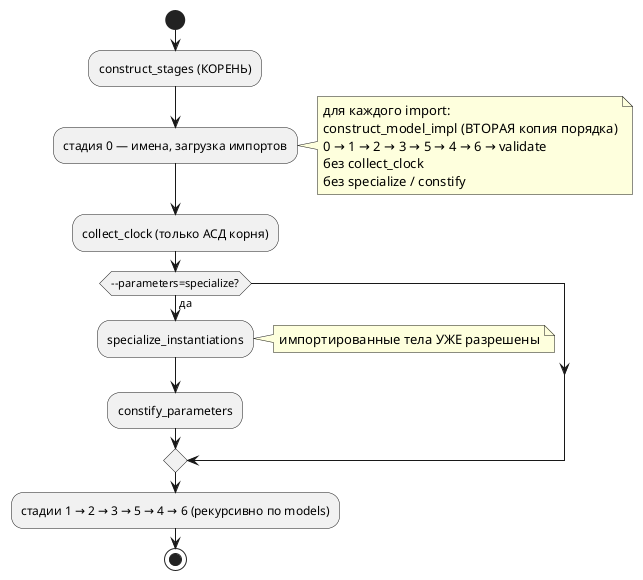
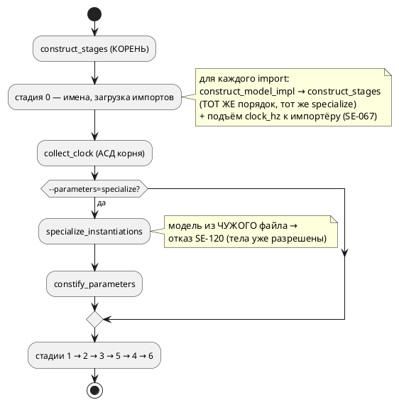

# ADR 0296: Порядок стадий построения — один носитель

- **Status:** Accepted
- **Date:** 2026-08-19
- **Authors:** Архитектор + аналитик + разработчик
- **Related issues:** [Фича 0296](../features/0296-semantic-stages-single-source.md); порядок стадий и накопление диагностик — [ADR 0130](0130-diagnostics-batch.md), [0152](0152-semantic-recovery-element-boundary.md); специализация параметров — [ADR 0185](0185-model-parameters.md); усыновление импорта — [фича 0184](../features/0184-imported-shared-variables.md); класс «два списка одного набора» — [0084](../features/0084-address-map-qualified-key.md), [0193](../features/0193-shared-const-qualified.md), [0195](../features/0195-target-name-collisions.md)

## Context

Порядок стадий построения семантического дерева объявлен единым знанием:
`semantic/stages/mod.rs::construct_stages` прямо пишет в шапке — «Порядок стадий
описан здесь **один раз**». Это утверждение неверно. Вторую копию
последовательности `0 → 1 → 2 → 3 → 5 → 4 → 6` вместе со своим `validate_model`
несёт `semantic/tree.rs::construct_model_impl` — **путь импорта**, которым
строится каждый подключённый файл (все три формы `import` зовут именно его).

Кандидат называл риск в будущем времени: «расхождение копий даст импортированным
файлам иной порядок разбора». Замер показал, что расхождение **уже
состоялось** — копия не просто дублирует, она отстала на три прохода.

### Замер 2026-08-19: чего нет в копии

`construct_stages` делает три вещи, которых нет в `construct_model_impl`:

1. `time_ast::collect_clock` — сбор частоты `clock` и запрет `after` вне ребра;
2. `specialize::specialize_instantiations` — режим `--parameters=specialize`;
3. `parameter_const::constify_parameters` — параметр становится константой копии.

Все три отсутствуют у **подключаемого** файла. Наблюдаемые следствия (проба —
`taktc compile -t c`, контрольные входы приведены рядом; хосты: `taktc` из
рабочего дерева, `cc` Apple clang):

| № | Вход | Одиночный файл (контроль) | Он же через `import` |
|---|---|---|---|
| 1 | `cond Timeout = after 5s;` | `SE-068` — отказ | **молчание**, вывод порождён, код 0 |
| 2 | `clock 1kHz;` + сборка целью `c` | `SE-069` — «передайте `--tick-hz=1000`» | **молчание**, профиль «часы», код 0 |
| 3 | `clock 1kHz` и `clock 8MHz` в разных моделях | `SE-067` — конфликт частот | **молчание**, код 0 |
| 4 | `start Main = Tuner;`, `--parameters=specialize` | валидный C | код 0, но `cc`: `no member named 'limit' in 'struct Uses5Tuner'` |
| 5 | `start Main = Tuner(limit := 30) \| Tuner(limit := 60);`, `--parameters=specialize` | `#define …_P1_LIMIT 30` | код 0, но `cc`: `no member named 'tuner' in 'struct Uses4TunerP1'` |

Записи 1–3 — класс «инструмент недоговаривает»: правило языка объявлено
(`SE-067`…`SE-069` описаны и работают), но через границу импорта **не
действует**, то есть контракт `clock` («сборка целью `c` обязана передать
совпадающую частоту») у библиотеки не сторожит никто. Записи 4 и 5 — класс
дороже: `taktc` возвращает **ноль** и кладёт на диск файл, который отвергает
**чужой** компилятор. По шкале `FEATURES.md` это `Tier 2`, а не проставленный
записи `Tier 3`.

Причина записей 4 и 5 названа самим `specialize.rs`: «копировать модель **после**
разрешения тел нельзя — `clone` разделяет `Rc`, тела копии ссылались бы на
переменные исходной модели». Импортированное дерево к моменту специализации
корня прошло **все** стадии, включая 2–6, — потому что путь импорта доводит его
до конца внутри стадии 0 импортёра.

### Как есть

Отдельно видно и вторую цену копии: стадии 2–6 рекурсивны по `models`, поэтому
усыновлённое дерево проходит их **дважды** — один раз в пути импорта, второй в
составе корня.

## Decision Drivers

1. **Утверждение «описано один раз» обязано быть истинным.** Пока копий две,
   любой новый проход конвейера заводится в одной из них — как завелись три
   имеющихся, и молча.
2. **Правило языка не должно зависеть от того, чей это файл.** `SE-067`,
   `SE-068`, контракт `clock` объявлены свойствами языка, а не корневого файла.
3. **Молчаливый невалидный вывод дороже отказа.** Записи 4 и 5 дают нулевой код
   возврата при выводе, который не собирается; проект уже платил за этот класс
   (0184, 0210, 0250, 0262).
4. **Риск перестройки соразмеряется с ценой.** Стадия 0 импортёра опирается на
   **построенное** дерево библиотеки: усыновление (0184) переносит её переменные,
   типы и функции, а выборочный импорт выбирает из готовых карт. Перенос поздних
   стадий к корню трогает этот контракт целиком.

## Considered Options

### Option A. Ничего не делать

**Pros:**
- ноль правок.

**Cons:**
- шапка `construct_stages` продолжает утверждать неправду;
- пять измеренных следствий остаются, два из них — невалидный вывод при коде 0;
- четвёртый проход конвейера заведётся в одной копии так же незаметно.

### Option B. Одна воронка: путь импорта зовёт `construct_stages`

`construct_model_impl` перестаёт перечислять стадии и становится тонким
адаптером над `construct_stages`: пробрасывает `specialize`, получает
`Vec<Diagnostic>` и берёт первую после `normalize` (контракт стадии 0
импортёра — одна диагностика, ADR 0152). Частота, найденная в подключённом
файле, поднимается к импортёру при усыновлении — с проверкой `SE-067` на
конфликт, то есть тем же правилом, что внутри файла.

**Pros:**
- копия исчезает **по построению**: перечисления стадий в проекте остаётся одно;
- записи 1–4 замера чинятся: `collect_clock` работает на АСД библиотеки,
  `constify_parameters` успевает до разрешения её тел;
- `clock` библиотеки становится наблюдаемым — контракт частоты действует через
  границу импорта;
- правка локальна: один вызов и один подъём поля, без смены контрактов стадии 0.

**Cons:**
- запись 5 (корень инстанцирует **импортированную** модель с аргументами) не
  чинится: копия по-прежнему снимается с разрешённых тел. Требует отдельного
  решения — отказа с кодом либо переноса стадий (Option C);
- диагностики, прежде молчавшие, начинают срабатывать: вход, законный вчера,
  сегодня отвергается. Это исполнение объявленного правила, но наблюдаемое
  поведение меняется (правило 22 — версия языка).

### Option C. Импорт строит только стадии 0–1, поздние стадии делает корень

**Pros:**
- чинит и запись 5: к моменту специализации тела импортированного дерева ещё
  сырые, копия разрешает их на свои переменные;
- снимает двойной проход стадий 2–6 по усыновлённому дереву.

**Cons:**
- ломает контракт стадии 0 импортёра: усыновление (0184) и выборочный импорт
  читают **готовые** карты переменных, типов, функций и условий подключённого
  файла — их наполняют стадии 2 и 5;
- диагностика подключённого файла перестаёт быть «его» диагностикой: сегодня
  ошибка библиотеки приходит из её конвейера и получает сноску «подключено
  здесь» (`note_imported_here`); при переносе она придёт из конвейера корня;
- объём и риск несоразмерны предмету фичи: это перестройка модели импорта, а не
  снятие копии.

## Decision

Принимается **Option B**.

Копия порядка снимается там, где она есть, и **немедленно** — это предмет фичи.
Оставшийся случай (запись 5) отделяется от неё честно: он лечится не порядком
вызова, а **местом снятия копии модели**, то есть решением Option C, у которого
своя цена и свой объём. Пока он не сделан, специализация модели, пришедшей из
другого файла, обязана отвечать **отказом с кодом**, а не нулевым кодом возврата
и невалидным C: у `specialize_one` уже есть образец такого отказа — `SE-087`
(«специализация модели с вложенными моделями не поддерживается»), заведённый по
той же причине (`Rc` разделяется, владелец разъезжается).

### Целевой поток

## Consequences

### Положительные

- перечисление стадий в проекте одно; четвёртый проход конвейера попадёт в него
  автоматически для всех файлов;
- `SE-067`, `SE-068` и контракт `clock` действуют одинаково в корневом и
  подключённом файле;
- `--parameters=specialize` перестаёт порождать невалидный C: случай без
  аргументов чинится, случай с аргументами получает громкий отказ.

### Отрицательные / Action items

- **Меняется наблюдаемое поведение** — версия языка поднимается (правило 22),
  раздел `book/` об импорте и приложение «Ошибки» дополняются новым кодом
  (правило 24, 25);
- **новый код диагностики** `SE-120` заводится в реестре
  (`docs/diagnostics/`), гейт `check-diagnostic-codes.sh` его проверит;
- **запись 5 остаётся неисправленной по существу** — она выносится кандидатом
  «специализация импортированной модели: снимать копию до разрешения тел»
  (правило 28 обязывает закрывающую фичу пройти по кандидатам, поэтому запись
  заводится этой же фичей);
- корпус и фикстуры проверяются на новые отказы: вход с `after` в именованном
  условии подключаемого файла до сих пор принимался.

### Acceptance criteria

1. В `takt-lang/src` есть **одно** перечисление стадий построения; сторож падает
   списком мест при появлении второго.
2. Записи 1–3 замера: тот же файл, поданный корнем и подключённый через
   `import`, даёт **одинаковый** вердикт (`SE-068`, `SE-069`, `SE-067`).
3. Запись 4: `--parameters=specialize` на импортированной модели без аргументов
   даёт C, который принимает `cc -Wall -Wextra -Werror`.
4. Запись 5: тот же вход с аргументами даёт **ненулевой** код возврата и
   диагностику с кодом и позицией, а не файл на диске.
5. `./scripts/precheck.sh` зелёный.
