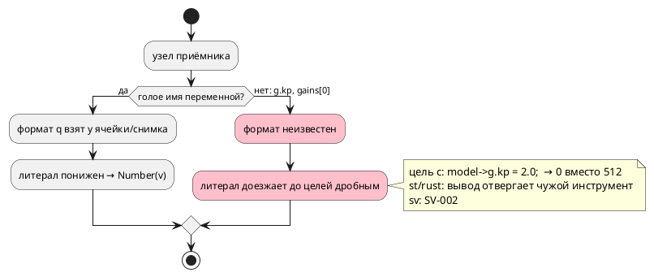
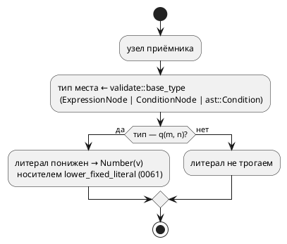

# ADR 0382: Понижение q-литерала в поле структуры и элементе массива

- **Status:** Accepted
- **Date:** 2026-08-22
- **Authors:** Архитектор + Аналитик
- **Related issues:** [Фича 0382](../features/0382-fixed-literal-in-place.md);
  продолжает [ADR 0381](0381-fixed-literal-in-body.md), опирается на носитель
  типа базы [ADR 0358](0358-postfix-index-on-expression.md) и на вывод типа поля
  [ADR 0371](0371-fixed-cast-from-field.md)

## Context

Фича [0061](../features/0061-fixed-point-type.md) задала правило: дробный
литерал, попавший в приёмник типа `q(m, n)`, **понижается** в целочисленное
представление (масштаб 2ⁿ) ещё в семантике — за её границей дробной формы не
существует, и потребителям не по чему расходиться. Фича
[0381](../features/0381-fixed-literal-in-body.md) распространила правило с
объявления на тела и условия.

Приёмником 0381 считает **именованное значение**: формат q берётся у ячейки
ссылки (`ExpressionNode::Variable`) либо у имени в снимке переменных модели.
Поле структуры и элемент массива под этот признак не подпадают, хотя их тип
объявлен рядом и выводится существующим носителем
`semantic::validate::base_type` (0358).

Замер 2026-08-22 (`scripts/probe.sh`; `struct Gains { kp: q(8, 8), … }`,
`var g: Gains := {0.5, 0.25};`):

| Запись | эталон | `c` | `st`, `st-at` | `rust` | `sv`, `sv-mmio` |
|---|---|---|---|---|---|
| `g.kp := 2.0;`, затем `set_v := g.kp as u8;` | `set_v = 2` | `model->g.kp = 2.0;` → **0** | `iec2c` ОТВЕРГ | `rustc` E0308 | `SV-002` |
| `gains[0] := 2.0;` | верно | то же | `iec2c` ОТВЕРГ | E0308 | `SV-002` |
| `if g.kp > 1.0 { … }` | **`SIM-005` в такте** | принимает и считает | `iec2c` ОТВЕРГ | E0308 | `SV-002` |
| `ref Done: g.kp > 0.25;` | **`SIM-005` в такте** | принимает и считает | `iec2c` ОТВЕРГ | E0308 | `SV-002` |
| **контроль:** `kp := 2.0;` над переменной | `2` | `2` | принято | принято | принято |

Прогон харнесса цели `c` дал `0 0 0` там, где эталон даёт `2 2 2`: значение
`2.0` кладётся в поле `int16_t` **как есть** (усечение до 2), а масштаб 2⁸
теряется. Это молчаливое расхождение при нулевом коде возврата `taktc`.

Контрольный вход отделяет предмет: та же запись над **переменной** согласована
у всех девяти потребителей — ломается именно **место записи**.

Поток «как есть» (стадия понижения после стадии 6):

## Decision Drivers

1. **Молчаливое расхождение значений дороже отказа.** Цель `c` печатает
   валидный C, `cc` его принимает, а автомат считает другое — этот класс видит
   только потактовая сверка (правило проекта, ради которого сверки заведены).
2. **Правило языка уже принято** (0061/0381): фича закрывает пробел
   реализации, а не вводит новое поведение — значит и решение обязано быть
   минимальным.
3. **Второе знание о типе места запрещено.** Тип цепочки
   `переменная(.поле | [индекс])*` уже выводит `validate::base_type` (0358);
   своя копия разошлась бы с ним (класс 0084/0193/0195), а сегодня расхождение
   ровно такого рода и наблюдается — кандидат «вывод типа операнда живёт
   четырьмя носителями» о том же.
4. **Представлений приёмника три, и они не сводятся друг к другу**:
   `ExpressionNode` (тело), `ConditionNode` (`cond`, формулы) и сырой
   `ast::Condition` (ребро `ref` — инвариант проекта). Правка одного пути чинит
   треть входов (урок 0359).

## Considered Options

### Option A. Расширить каждый из трёх предикатов своим разбором

В `fixed_body.rs` живут `fixed_of_expr`, `cond_fixed_of`, `ast_fixed_of`.
Дописать в каждый ветви «поле структуры» и «элемент массива».

**Pros:**
- правка локальна, чужие модули не трогаются;
- заимствования прохода не меняются.

**Cons:**
- **три копии одного знания** о спуске по типу (структура → поле, массив →
  элемент) — ровно тот класс, который в проекте правился уже шесть раз;
- разъедутся молча: компилятор о расхождении копий не скажет;
- четвёртая копия при следующем представлении заведётся по образцу.

### Option B. Один носитель типа места + три тонких адаптера

Знание о спуске остаётся у `validate::base_type` (0358). Для условий носитель
дополняется двумя входами того же вида — `cond_base_type` (уже существует
приватно в `validate::member_access`, переезжает к соседу) и
`ast_base_type` (сырой АСД ребра). Проход понижения спрашивает **тип места** и
берёт из него формат `q`.

**Pros:**
- знание о структуре и массиве — в одном месте на проект;
- приватный `cond_base_type` перестаёт быть четвёртой копией: он и есть тот же
  носитель, только в другом представлении;
- новое представление приёмника получает адаптер, а не правило.

**Cons:**
- проход обязан **отпустить `borrow_mut`** модели: носитель читает `ModelNode`
  (структуры), а сегодня обход держит модель изменяемо заимствованной;
- носитель растёт третьим входом.

### Option C. Звать `extract_type` (0371) из прохода понижения

У вывода типов есть полноценный `extract_type`, знающий и поле, и элемент.

**Pros:**
- носитель уже полон и покрывает больше форм (вызов, приведение, арифметика).

**Cons:**
- **работает только для `ExpressionNode`**: для `ConditionNode` и сырого АСД
  входа нет вовсе, то есть два пути из трёх остаются непокрытыми;
- требует `Rc<RefCell<ModelNode>>` и рекурсивно берёт `borrow()`, тогда как
  проход держит `borrow_mut` — заимствования всё равно придётся перестраивать;
- избыточен: понижению нужен тип **места**, а не любого выражения;
  консервативность `base_type` («`None` — тип надёжно не выводится») здесь
  ровно то, что нужно.

## Decision

Принимается **Option B**.

Знание «какой тип у места `переменная(.поле | [индекс])*`» остаётся **одним**
и живёт в `semantic::validate::base_type`. Носитель получает три входа по числу
представлений места:

| Вход | Представление | Кто пользуется |
|---|---|---|
| `base_type` | `ExpressionNode` | `SE-061`, `SE-028`/`SE-030`, срез (0355), понижение q |
| `cond_base_type` | `ConditionNode` | `SE-061` в условии, понижение q |
| `ast_base_type` | `ast::Condition` | понижение q на ребре `ref` |

Проход `type_node::fixed_body` (0381) спрашивает у носителя тип места и берёт
у него формат `q(m, n)`; своего разбора структуры и массива он не заводит.

Обход прохода перестраивается так, чтобы **не держать `borrow_mut`** во время
опроса носителя: тела (функции, именованные блоки, условия, состояния)
изымаются из модели (`std::mem::take`), обрабатываются при разделяемом
заимствовании и возвращаются на место. Тела и структуры — непересекающиеся
части `ModelNode`, поэтому изъятие наблюдаемо только внутри прохода.

Целевой поток:

⚠️ **Арифметика в объём не входит** — граница унаследована от 0381:
`g.kp + 1.5` отвергает `SE-059` (смешение `q` и `float`), и понижение там лишь
ухудшило бы сообщение, назвав тип, которого автор не писал.

⚠️ **Разряд (`x.3`, `Member::Number`) не затрагивается**: его тип — вопрос
правила 0356, и `base_type` его намеренно не выводит.

## Consequences

### Положительные

- Молчаливое расхождение значений у цели `c` снято; `st`, `rust` и `sv`
  получают вход, который переводится, вместо отказа чужого инструмента.
- Знание о типе места сведено к одному носителю: приватный `cond_base_type`
  перестаёт быть отдельной копией, а кандидат «вывод типа операнда живёт
  четырьмя носителями» уменьшается на одну запись.
- Правило языка не меняется: версия языка остаётся прежней.

### Отрицательные / Action items

- Проход понижения меняет способ заимствования модели — риск паники
  `BorrowMutError` при неаккуратной правке; сторожат тесты (любое двойное
  заимствование падает немедленно на всём корпусе).
- Носитель `base_type` консервативен по контракту: место, чей тип не выводится
  (например, поле структуры, пришедшей из невыводимого выражения), понижения не
  получает — прежнее поведение сохраняется, отказа не добавляется.

### Acceptance criteria

1. Потактовая сверка эталона с целью `c` на фикстуре, где приёмник — **поле
   структуры** и **элемент массива**, даёт совпадающие трассы; мутация «вернуть
   прежний признак» её роняет.
2. Тот же вход принимают инструменты целей: `iec2c` + сборка порождённого C,
   `rustc` + `clippy -D warnings`, `verilator` + `yosys`.
3. Условие ребра `ref` с полем структуры (`g.kp > 0.25`) исполняется эталоном
   и даёт у цели `c` тот же переход.
4. Контрольный вход (та же запись над переменной) остаётся согласованным —
   правка не читается как «понижать всё подряд».
5. Вывод корпуса `examples/generated/` не изменился.
6. `./scripts/precheck.sh` зелёный.
