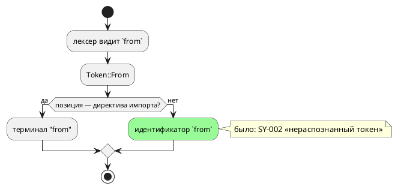

# ADR 0385: Слово `from` — контекстное ключевое

- **Status:** Accepted
- **Date:** 2026-08-22
- **Authors:** Архитектор + Аналитик
- **Related issues:** [Фича 0385](../features/0385-contextual-from.md);
  опирается на [ADR 0201](0201-dead-lexemes.md) (лексема без правила) и
  [0298](0298-book-lexicon-lists-sync.md) (сверка раздела «Лексика» с языком)

## Context

`from` объявлено ключевым словом лексера и встречается в грамматике **ровно
один раз** — в директиве импорта:

```
import { Point, twice } from "lib.takt";
import * as Lib        from "lib.takt";
```

Вне этой формы слово не значит ничего, но именем быть не может. Замер
2026-08-22 (`taktc`): `struct Line { from: u8, to: u8 }` даёт `SY-002`
«нераспознанный токен 'from'» — прямо на объявлении поля; `var from: u8 := 1;`
— то же.

Прогон по **всему** списку лексера (47 слов, вход `var <слово>: u8 := 1;`)
показал: контекстными были только семь слов LTL (`X`, `F`, `G`, `U`, `R`,
`LTL`, `Guard`), прочие 39 — жёсткие. То есть приём «слово ключевое **в
позиции**» в языке уже есть, и `from` под него подходит лучше всех остальных:
его позиция единственна и синтаксически однозначна.



## Decision Drivers

1. **Правило языка не должно быть свойством лексера.** Урок 0172: запрет,
   выраженный квантификатором грамматики, меняется молча. Здесь то же:
   `from` жёсткое не потому, что так решено, а потому, что так завели токен.
2. **Обратная совместимость.** Расширение множества допустимых имён не меняет
   смысла ни одной существующей программы: там, где `from` стоял в директиве
   импорта, он остаётся терминалом.
3. **Приём в языке уже применён** — семь слов LTL живут в правиле `Identifier`
   отдельными продукциями; восьмая продукция стоит ровно столько же.
4. **Опасность конфликта LR(1)** — единственный настоящий риск: грамматика
   строится LALRPOP, и конфликт означал бы, что язык не собирается вовсе.

## Considered Options

### Option A. Оставить как есть

**Pros:** нулевой риск.
**Cons:** имя, естественное для отрезка, маршрута и перехода, остаётся
запрещённым без причины; ограничение не описано как решение — оно следствие
устройства лексера.

### Option B. Изъять `from` из лексера, разбирать директиву импорта по тексту

**Pros:** слово перестаёт быть особенным вовсе.
**Cons:** директива импорта потеряла бы терминал, а с ним — диагностику: урок
0201 прямо говорит, что изымать надо **терминал**, а не лексему, иначе
сообщения об ошибке вырождаются в каскад.

### Option C. Сделать `from` контекстным: продукция в правиле `Identifier`

**Pros:**
- ровно тот приём, которым уже живут слова LTL, — одна строка грамматики;
- директива импорта сохраняет терминал и диагностику;
- обратная совместимость полная.

**Cons:**
- требует проверки на конфликт LR(1) (снимается сборкой);
- документ и гейт лексики обязаны узнать о новом контекстном слове, иначе
  раздел «Лексика» станет обещанием, которого язык не исполняет (класс 0298).

## Decision

Принимается **Option C**.

`from` остаётся ключевым словом **лексера** и терминалом директивы импорта, но
получает продукцию в правиле `Identifier` — как `X`, `F`, `G`, `U`, `R`, `LTL`,
`Guard`. Множество контекстных слов гейта `check-book-keywords.py`
переименовывается из `LTL_CONTEXTUAL` в `CONTEXTUAL` и пополняется `from`;
раздел «Лексика» переносит слово из таблицы ключевых во врезку о контекстных.

⚠️ **Подсветка `from` сохраняется:** гейт исключает контекстные слова из
**обязательных** к выделению, но не запрещает их выделять (`from` остаётся в
`keywords_code`, поэтому класс H2 не срабатывает). В директиве импорта слово
по-прежнему читается как ключевое, и подсвечивать его правильно.

⚠️ **Прочие 39 слов остаются жёсткими.** Замер их перечисляет; расширение —
отдельное решение по каждому, и у большинства позиция не единственна.

## Consequences

### Положительные

- `struct Line { from: u8, to: u8 }`, `var from: u8;`, `state from` и
  `fn from(...)` становятся законными.
- Ограничение языка перестаёт быть побочным свойством лексера.

### Отрицательные / Action items

- **Версия языка поднимается** `0.11.0` → `0.12.0` (правило 22): множество
  допустимых программ расширено. Коммит подъёма помечается тегом `v0.12.0`.
- Раздел «Лексика» и гейт лексики правятся вместе с грамматикой — иначе
  документ обещает запрет, которого нет.

### Acceptance criteria

1. `from` принимается как имя поля структуры, переменной, состояния и функции.
2. Директива импорта работает в обеих формах, включая крайний случай
   `import { from } from "lib.takt";`.
3. Грамматика строится без конфликтов; все тесты зелены.
4. Раздел «Лексика» согласован с языком (гейт `check-book-keywords.py`).
5. Версия языка поднята до `0.12.0` в трёх источниках (константа, README,
   живой контекст), коммит помечен тегом.
6. `./scripts/precheck.sh` зелёный.
