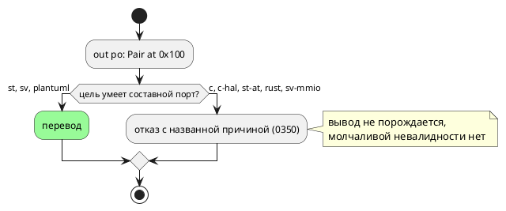

# ADR 0390: Порт составного типа — политика языка

- **Status:** Proposed — **решение о правиле языка принимает заказчик**
- **Date:** 2026-08-22
- **Authors:** Архитектор + Аналитик
- **Related issues:** [Фича 0390](../features/0390-port-composite-type-policy.md);
  замер вырос из [0350](0350-port-composite-type.md)

## Context

`out po: Pair at 0x100;` при `struct Pair { lo: u8, hi: u8 }`. Замер
**переснят 2026-08-22** (прежний — 0350, 2026-08-20):

| Потребитель | Ответ |
|---|---|
| эталон | исполняет (`po = Pair{lo=1,hi=1}`) |
| `st` | переводит; `iec2c` принял, `cc` собрал |
| `sv` | переводит; `verilator` принял, `yosys` синтезировал |
| `plantuml` | принимает |
| `c`, `c-hal` | `CC-015` — тип не представим в HAL-колбэке |
| `st-at` | `ST-004` — размещённая переменная составного типа |
| `rust` | `RS-016` |
| `sv-mmio` | `SV-002` — распакованный порт в шапке модуля |

То есть **три перевода из восьми**. Фича 0350 привела цели к согласию «либо
перевод, либо отказ с причиной» (молчаливо невалидного вывода нет), но сам
язык остался с записью, поведение которой существует у меньшинства целей.

## Decision Drivers

1. **Язык не должен обещать больше, чем исполняет большинство целей** — иначе
   переносимость модели зависит от того, какую цель автор выберет позже.
2. **Обратное соображение:** регистровый файл `sv-mmio` — естественное место
   для составного порта (массив мог бы лечь в несколько регистров), и запрет
   закрыл бы этот путь навсегда.
3. **Отказы уже объясняющие** (0350): автор не остаётся без причины, то есть
   цена статус-кво — недоинформированность, а не молчаливая порча.
4. **Ломающее изменение** требует подъёма версии языка и ломает модели, где
   составной порт работает (цели `st`/`sv`).

## Considered Options

### Option A. Оставить как есть (статус-кво)

**Pros:** ничего не ломается; путь к регистровому файлу открыт; отказы целей
объясняют причину и называют обход.
**Cons:** запись переносима не полностью — модель, написанная под `st`, не
собирается для `c`; язык описывает возможность, которой у большинства целей
нет.

### Option B. Сузить язык: `SE-…` на нескалярный тип порта

**Pros:** обещание языка совпадает с исполнением; ошибка приходит **до**
выбора цели, то есть автор узнаёт о границе сразу.
**Cons:** ломающее изменение (подъём минорной версии); закрывает путь
`sv-mmio`; отнимает работающие сегодня модели у `st` и `sv`.

### Option C. Достроить недостающие цели

Составной порт у `c`/`c-hal` — через развёртку в несколько колбэков; у
`rust` — через методы HAL по полям; у `sv-mmio` — регистровый файл по полям.

**Pros:** язык исполняется всеми; путь к регистровому файлу не закрывается, а
открывается.
**Cons:** самая дорогая: протокол HAL меняется у двух целей (ломающее для
пользовательского кода, который его реализует), у `sv-mmio` — раскладка
регистров; отказ `st-at` (размещённая переменная) упирается в IEC.

## Decision

**Решение за заказчиком.** Аналитик предлагает **Option A** (оставить) с
оговоркой: перед сужением языка стоит дождаться запроса на регистровый файл со
составными портами — сегодня Option B закрыла бы путь, о котором известно, что
он осмыслен, ради устранения недоинформированности, уже смягчённой отказами
0350.

⚠️ Если заказчик выберет **B**, объём мал (одна проверка в семантике), но это
подъём версии языка и ломающее изменение. Если **C** — работа крупная и
меняет протокол HAL, то есть затрагивает пользовательский код.

## Consequences

### При Option A

- Ничего не меняется; фича закрывается как `ОТМЕНА` с обоснованием (правило 17).

### При Option B

- Одна проверка (`SE-…`) в `validate`; подъём версии языка; документ обязан
  назвать правило; отказы целей 0350 становятся недостижимыми — их придётся
  пометить защитными либо снять.

### При Option C

- Протокол HAL целей `c`/`rust` расширяется (ломающее для пользователей);
  раскладка регистров `sv-mmio` — новая работа; `st-at` останется отказывать
  (ограничение IEC).

### Acceptance criteria

- **B:** составной порт отвергается семантикой с координатой и причиной;
  контроль — скалярный порт принимается; версия языка поднята; отказы 0350
  либо сняты, либо помечены защитными.
- **C:** потактовая сверка эталона с каждой достроенной целью; инструменты
  принимают вывод; протокол HAL описан в README и `book/`.
