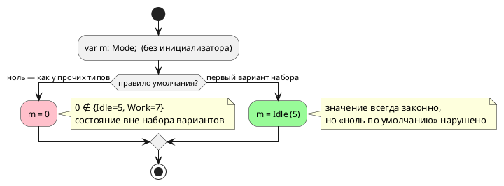

# ADR 0391: Умолчание переменной перечислимого типа

- **Status:** Proposed — **решение о правиле языка принимает заказчик**
- **Date:** 2026-08-22
- **Authors:** Архитектор + Аналитик
- **Related issues:** [Фича 0391](../features/0391-enum-default-value.md);
  замер вырос из [0353](0353-c-default-init.md) (умолчание у цели `c`),
  соседняя механика — [0379](0379-sv-enum-reset.md) (сброс перечислимого
  регистра у `sv`)

## Context

`var m: Mode;` без инициализатора при `enum Mode { Idle = 5, Work = 7 }`.
Замер **переснят 2026-08-22** (прежний — 0353, 2026-08-21):

| Потребитель | Умолчание | Наблюдаемое `o := m as u8` |
|---|---|---|
| эталон | `0` | `0` |
| `c`, `c-hal` | `model->m = 0;` | `0` |
| `st`, `st-at` | `m : USINT;` (ноль по IEC) | `0` |
| `sv`, `sv-mmio` | `p0391_m <= mode_e'(0);` (форма 0379) | `0` |
| **`rust`** | **`m: Mode::Idle`** | **`5`** |

⚠️ Расхождение **молчаливое**: `taktc` возвращает ноль, все восемь целей
переводят, инструменты (`cc`, `iec2c` + `cc`, `rustc` + `clippy`, `verilator` +
`yosys`) вывод принимают. `probe.sh` его не показывает — коды возврата
совпадают, различаются **значения**.

⚠️ Оба ответа по-своему обоснованы, и это суть вопроса:

- **ноль** — умолчание «как у всех остальных типов» (правило 0353: переменная
  без инициализатора получает ноль), но при `Idle = 5, Work = 7` ноль **не
  принадлежит набору вариантов**: автомат стартует со значения, которого в
  языке нет;
- **первый вариант** — значение, всегда принадлежащее набору; комментарий цели
  `rust` объясняет выбор прямо: `0 as Mode` было бы невалидным значением, а не
  умолчанием (в Rust это UB-подобный трансмут, а `#[derive(Default)]` у enum
  без `#[default]` не выводится вовсе).

## Decision Drivers

1. **Молчаливое расхождение значений — самый дорогой класс** (ради него
   заведены потактовые сверки): один вход даёт `0` у восьми потребителей и `5`
   у девятого.
2. **Умолчание обязано быть законным значением типа.** Ноль вне набора
   вариантов — это состояние, о котором `match` не знает: ветвь `_` (если она
   есть) поймает его молча, а если её нет — поведение целей разъедется снова.
3. **Правило «ноль по умолчанию» уже записано** (0353) и действует для всех
   прочих типов; исключение для перечисления придётся назвать словами.
4. **Цена правки зависит от выбора** и несимметрична (см. Options).

## Considered Options

### Option A. Ноль — правильный ответ; править цель `rust`

Цель `rust` печатает `m: Mode::Idle` → обязана печатать значение `0`.

**Pros:**
- правило 0353 остаётся без исключений: «переменная без инициализатора — ноль»;
- правится **один** потребитель.

**Cons:**
- в Rust нельзя записать `0` в поле типа `Mode`, не введя вариант со значением
  `0`: `Mode::from(0)` не существует, `unsafe { transmute }` в порождаемом коде
  запрещён (решение 0050 — вывод без `unsafe`);
- обходной путь — печатать поле не перечислением, а целым (`m: u8`) и
  восстанавливать вариант при каждом сравнении: это откат к представлению,
  которое 0281/0338 разбирали как источник дефектов;
- автомат стартует со значения вне набора вариантов у **всех** потребителей —
  правило сохраняется ценой смысла.

### Option B. Первый вариант — правильный ответ; править эталон и три цели

`c`, `st`, `sv` и эталон печатают/подставляют вариант с наименьшим значением.

**Pros:**
- умолчание всегда принадлежит набору вариантов; `match` полон по построению;
- цель `rust` уже такова — правка идёт в сторону существующего образца.

**Cons:**
- правятся **четыре** потребителя (эталон + три цели), включая ветвь сброса
  `sv` (0379) и умолчание `c` (0353);
- правило 0353 получает исключение, и его надо записать в документ (`book/`,
  раздел «Типы» — блок про перечисления);
- «первый» надо определить: **вариант с наименьшим значением** или **первый по
  тексту**? При `enum E { B = 2, A = 1 }` это разные ответы. Порядок объявления
  в языке значим (0034), поэтому предлагается **первый по тексту** — но это
  тоже решение.

### Option C. Требовать инициализатор у переменной перечислимого типа

Новая диагностика: `var m: Mode;` без `:=` — ошибка.

**Pros:**
- расхождение исчезает вместе с умолчанием; автор называет значение сам;
- никакого «умного» правила помнить не нужно.

**Cons:**
- **ломающее изменение языка** (подъём минорной версии): существующие модели с
  таким объявлением перестанут компилироваться;
- расходится с правилом 0353 для прочих типов, где умолчание законно;
- в корпусе таких объявлений нет, но у пользователей они могут быть.

## Decision

**Решение за заказчиком.** Аналитик предлагает **Option B** (первый вариант по
тексту) со следующим доводом: умолчание, не принадлежащее набору вариантов, —
это состояние, которого в языке нет, и любая полнота `match` относительно него
ложна; цена (четыре потребителя) выше, но платится один раз, тогда как Option A
сохраняет ноль ценой либо `unsafe`, либо отката представления перечисления у
цели `rust`.

⚠️ Выбор **обязан** быть записан в документ (`book/`, раздел «Типы»): умолчание
переменной — наблюдаемое поведение языка, и сегодня документ о нём молчит.

## Consequences

### Положительные (при любом выборе)

- Молчаливое расхождение снимается; потактовая сверка на перечислении
  становится возможной.

### Отрицательные / Action items

- **Option B:** правка эталона и трёх целей; исключение из правила 0353 в
  документе; определение «первого» (предложено — по тексту).
- **Option A:** правка цели `rust` без `unsafe` требует смены представления
  перечисления в поле — риск возврата дефектов 0281/0338.
- **Option C:** подъём версии языка и ломающее изменение.

### Acceptance criteria

1. Потактовая сверка эталона со **всеми** целями на модели с `enum`,
   объявленным без инициализатора, даёт одну трассу.
2. Значение умолчания принадлежит набору вариантов (при Option B/C).
3. Раздел `book/` о перечислениях называет правило умолчания.
4. Мутация «вернуть прежнее умолчание у любого потребителя» роняет сверку.
5. `./scripts/precheck.sh` зелёный; вывод корпуса не изменился (в `examples/`
   переменных перечислимого типа без инициализатора нет).
